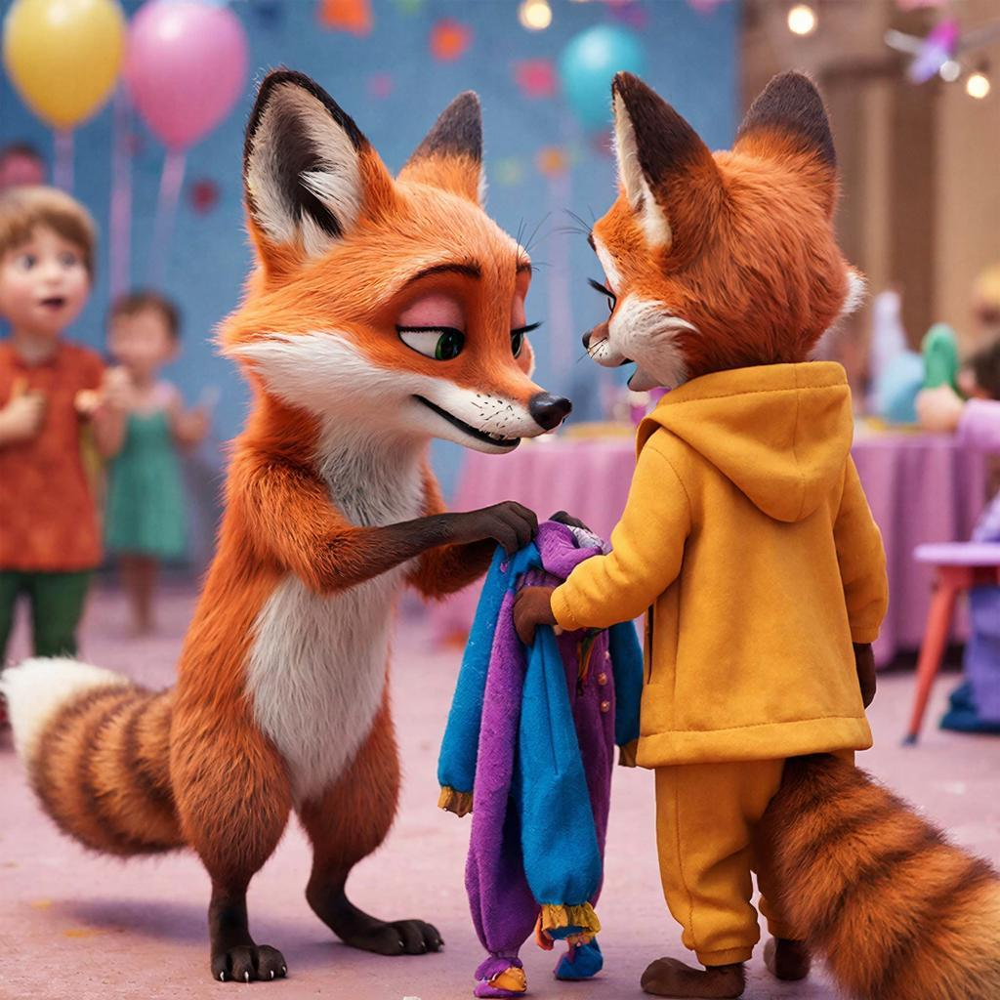

# Копипаст — это зло? Как правильно цитировать, делать рефераты и не стать плагиатором
## Содержание
- [Почему нельзя просто копировать?](#почему-нельзя-просто-копировать)
- [Как правильно цитировать: три золотых правила](#как-правильно-цитировать-три-золотых-правила)
- [Примеры из жизни](#примеры-из-жизни)
- [Интересные факты](#интересные-факты)
- [Главный секрет](#главный-секрет)
- [Что почитать дальше](#что-почитать-дальше)

Представь, что ты пришёл на костюмированную вечеринку. Можно придумать свой крутой [костюм](../../../7.2 Media, leisure and hobbies/Computer games/articles/game_culture/cosplay.md), а можно взять [чужой](../../../3.2 healthy lifestyle/how to act in a dangerous situation/articles/stranger-safety.md), надеть его и выдать за свой. Второй вариант проще, но если хозяин костюма увидит тебя — будет очень неловко, правда? В мире знаний и текстов то же самое. **Копипаст** (от англ. *copy* — копировать и *paste* — вставить) — это когда ты берёшь чужой [текст](../../../4.1_rules_of_study/how_to_learn_effectively/articles/reading_skills.md) и выдаёшь его за свой. Это как украсть чужой костюм. Но есть и хорошая [новость](../../../5.1_technology_and_digital_literacy/information and media literacy/информационная_диета.md): пользоваться чужими мыслями можно и нужно, только делать это надо честно. И в этой статье мы научимся, как именно.

---

## Почему [нельзя](../../../3.1_healthy_lifestyle/pervaya_pomoshch/ushibi_porezy_ozhogi/07_ushib_chego_nelzya.md) просто копировать?

Когда ты копируешь текст из интернета в свой реферат, ты обманываешь учителя. Но главное — ты обманываешь самого себя. Ведь смысл школы не в [том](../../../7.1_art/musical_instruments/articles/drums.md), чтобы просто сдать бумажку, а в том, чтобы в твоей голове появились новые знания и [умения](../../../8.2_future/choosing_a_career_path/articles/skills.md).

**Плагиат** (так по-научному называется воровство чужих текстов) — это нарушение правил. В школе за это поставят двойку, в университете могут отчислить, а взрослого человека, который украл чужую статью или книгу, могут даже оштрафовать. Но как же тогда писать рефераты, если всего этого делать нельзя?

Секрет прост: существует **[цитирование](../../../5.1_technology_and_digital_literacy/information%20and%20media%20literacy/articles/как_правильно_оформлять_ссылки_и_источники.md)**. Это как в разговоре: ты же говоришь другу «Мама вчера сказала, что...», а не выдаёшь мамины слова за свои. В тексте работает то же [правило](../../../1.2_natural_sciences/why_science_help_understand_world/patterns.md): если ты берёшь чужую мысль — обязательно укажи автора.

---

## Как правильно цитировать: три золотых [правила](../../../2.1_society/cause_and_effect_relationships/articles/why_rules_work.md)

Представь, что чужие слова — это игрушки из чужой песочницы. Играть с ними можно, но только с разрешения и не забывая вернуть на место.

1.  Бери в [кавычки](../../../../4.2/how_to_search_information/articles/search_operations.md). Если ты переписываешь чужое предложение слово в слово, обязательно поставь его в кавычки. Это знак: «[Внимание](../../../1.2_natural_sciences/neurobiology_for_teens/articles/16_love_chemistry.md)! Эти слова принадлежат не мне!».
2.  Указывай автора. Сразу после цитаты или в самом конце [работы](../../../8.2_future/choosing_a_career_path/articles/interview.md) (в списке литературы) обязательно напиши, откуда ты это взял. Например: *Как писал Александр Сергеевич Пушкин, «мороз и [солнце](../../../1.2_natural_sciences/physics_in_everyday_life/Q11388.md); день чудесный!»*. Всё честно — и Пушкин доволен, и учитель.
3.  Не цитируй слишком много. Твоя [работа](../../../1.2_natural_sciences/physics_in_everyday_life/Q11382.md) должна быть твоей. Можно вставить 2–3 цитаты учёных или писателей, чтобы подтвердить свои мысли, но не надо собирать реферат из одних чужих кусков. Это будет похоже на лоскутное одеяло, а не на цельный текст.

---

## Примеры из жизни

Как эти правила работают в реальности? Смотри:

1.  Реферат про динозавров. Ты нашёл крутую статью, где написано: *«Тираннозавр мог развивать [скорость](../../../1.2_natural_sciences/physics_in_everyday_life/Q11402.md) до 25 км/ч»*. Можно сделать так:
    - Плохо (плагиат): просто переписать фразу в реферат.
    - Хорошо (цитирование): написать «В одной статье я прочитал, что *«Тираннозавр мог развивать скорость до 25 км/ч»* (Автор: Иванов И.И., «Мир динозавров», 2020).»

2.  Доклад по истории. Тебе нужно рассказать про [древний Египет](../../../7.1_art/musical_instruments/articles/harp.md). Ты прочитал три [книги](../../../7.2 Media, leisure and hobbies /useful_and_interesting_leisure/articles/reading_and_self_education.md) и теперь своими словами объясняешь, как строили пирамиды. Это называется [пересказ](../../../5.1_technology_and_digital_literacy/information%20and%20media%20literacy/articles/первоисточник_и_пересказ.md) своими словами. Если ты не копируешь, а думаешь сам и пишешь по-своему (даже используя чужие [факты](../../../1.2_natural_sciences/physics_in_everyday_life/Q17737.md)) — это не плагиат. Это и есть твоя работа!

3.  Постер для конкурса. Ты делаешь стенгазету про [космос](../../../1.2_natural_sciences/physics_in_everyday_life/Q41273.md) и хочешь вставить знаменитую фразу Гагарина «Поехали!». Просто написать её — ок. Но будет суперчестно и круто подписать мелко внизу: *Ю.А. Гагарин*. Все увидят, что ты знаешь историю, а не просто написал что-то от себя.

---

## Интересные факты

- В Древней Греции и Риме не было **плагиата** в нашем понимании. Ученики должны были копировать учителей и великих мыслителей — считалось, что так они учатся мудрости. Всё изменилось, когда люди поняли ценность авторства и оригинальности.

- Самый известный случай плагиата в музыке: группе *The Beatles* пришлось заплатить огромную сумму [денег](../../../8.2_future/choosing_a_career_path/articles/salary.md), потому что их песня *"My Sweet Lord"* оказалась очень похожа на песню другой группы. Иногда это происходит случайно, но отвечать всё равно приходится!

- Учёные и писатели серьёзно относятся к плагиату. Если поймают студента или профессора на воровстве текстов, его могут навсегда выгнать из университета и лишить учёной [степени](../../../3.1_healthy_lifestyle/pervaya_pomoshch/ushibi_porezy_ozhogi/13_ozhogi_vidy_stepeni.md). Да-да, взрослые тоже попадаются!

---

## Главный секрет

Копипаст — это как съесть конфету, но не почувствовать вкуса. Ты вроде бы что-то получил (оценку, готовый текст), но [навыки](../../../7.2 Media, leisure and hobbies /useful_and_interesting_leisure/articles/computer_games_with_benefit.md) и знания прошли мимо тебя. Цитирование и честное использование чужих мыслей — это не запрет, а инструмент. Это способ показать, что ты умный, начитанный и уважаешь чужой труд. Иначе твой домашний хомяк мог бы тоже «написать реферат»: натаскал бы в щёки чужие абзацы, а объяснить, что в них важно, так и не смог бы.

Запомни простую формулу честной работы:
Чужие мысли + Твоя голова + Ссылка на автора = Отлично и правильно!

## Что почитать дальше

- [Цифровой этикет и авторское право](copyright.md)
- [Первоисточник](original_source.md)
- [Википедия](wikipedia.md)
- [Внешняя память](second_mind.md)

---
Автор: Ерофеева Александра;  
[Ресурсы](../../../2.1_society/cause_and_effect_relationships/articles/ecological_footprint.md): [LLM](../../../7.1_art/modern_technological_art/README.md) - DeepSeek
