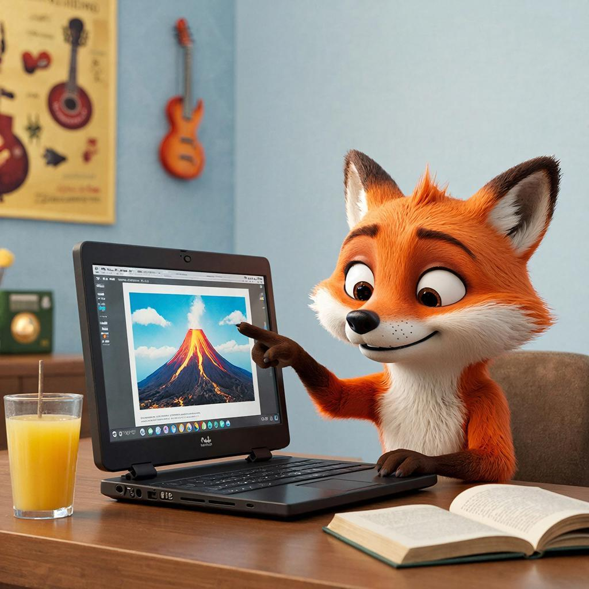

# [Цифровой](../../../7.1_art/musical_instruments/articles/synthesizer.md) [этикет](../../../7.2 Media, leisure and hobbies/Computer games/articles/useful_tips/toxic_players.md) и авторское [право](../../../5.1_technology_and_digital_literacy/information and media literacy/авторское_право_и_честное_использование.md): кому принадлежат картинки из интернета и как легально использовать [чужой](../../../3.2 healthy lifestyle/how to act in a dangerous situation/articles/stranger-safety.md) [контент](../../../5.1_technology_and_digital_literacy/information and media literacy/информационная_диета.md)

## Содержание
- [Почему кажется, что в интернете все общее?](#почему-кажется-что-в-интернете-все-общее)
- [Что такое авторское право и почему оно появляется почти само?](#что-такое-авторское-право-и-почему-оно-появляется-почти-само)
- [Почему “нашел в поиске” не равно “получил разрешение”?](#почему-нашел-в-поиске-не-равно-получил-разрешение)
- [Когда “для себя” превращается в “публично”?](#когда-для-себя-превращается-в-публично)
- [Как быстро понять, можно ли использовать картинку?](#как-быстро-понять-можно-ли-использовать-картинку)
- [Как читать лицензию Creative Commons, не становясь юристом?](#как-читать-лицензию-creative-commons-не-становясь-юристом)
- [Где брать легальный контент и как его подписывать, чтобы было красиво?](#где-брать-легальный-контент-и-как-его-подписывать-чтобы-было-красиво)
- [Что почитать дальше](#что-почитать-дальше)

Представь ситуацию: тебе задали презентацию по истории или биологии, а времени осталось два вечера. Ты открываешь [поиск](../../../3.2 healthy lifestyle/how to act in a dangerous situation/articles/lost-in-city.md), вводишь “красивый [вулкан](../../../1.2_natural_sciences/why_science_help_understand_world/earth_sciences.md)” или “скелет динозавра”, копируешь первую же картинку, вставляешь в [слайд](../../../7.1_art/musical_instruments/articles/trombone.md)… и идешь дальше. Иногда еще добавляешь музыку на фон для [видео](../../../5.1_technology_and_digital_literacy/information and media literacy/оценка_качества_изображений_и_видео.md), берешь пару абзацев из статьи и кажется, что все нормально: ведь это же [интернет](../../../1.2_natural_sciences/physics_in_everyday_life/Q26540.md), там все лежит и никому не жалко.



Проблема в [том](../../../7.1_art/musical_instruments/articles/drums.md), что интернет отлично умеет создавать ощущение “все общее”. Но право на картинку, [текст](../../../4.1_rules_of_study/how_to_learn_effectively/articles/reading_skills.md) или музыку не исчезает от того, что [файл](../../../5.1_technology_and_digital_literacy/operating system/articles/file_system.md) можно скачать. И вот тут появляется тема цифрового этикета: это не только “будь вежливым в комментариях”, а еще и “не присваивай чужую [работу](../../../8.2_future/choosing_a_career_path/articles/interview.md) и не ставь человека в неловкое положение, даже случайно”.

## Почему кажется, что в интернете все общее?

Интернет устроен так, будто он специально тренирует в нас привычку “брать и тащить”. Поиск показывает картинку отдельно от автора и сайта, [соцсети](../../../2.1_society/how_and_where_find_friends/articles/tcifrovaya_druzhba.md) переносят посты в репосты, а скриншоты вообще отрезают все подписи. Через пару “перезаливов” [источник](../../../5.1_technology_and_digital_literacy/information%20and%20media%20literacy/articles/как_правильно_оформлять_ссылки_и_источники.md) превращается в туман: ты видишь [изображение](../../../5.1_technology_and_digital_literacy/information and media literacy/оценка_качества_изображений_и_видео.md), но уже не понимаешь, кто его сделал и на каких условиях выложил. Отсюда рождается ощущение, что это что-то вроде наклеек: раз можно вставить, значит можно использовать.

Цифровой этикет здесь работает как здравый смысл: когда ты не уверен, ты не притворяешься, что “так и было”, а пытаешься найти автора или хотя бы честно указать [источник](../../../5.1_technology_and_digital_literacy/information and media literacy/дезинформация_и_фейки.md). Это похоже на обычную ситуацию в жизни: если ты взял чей-то велосипед “на минутку”, это не становится нормальным только потому, что велосипед стоял во дворе. В интернете просто меньше видимых границ, поэтому [правила](../../../2.1_society/cause_and_effect_relationships/articles/why_rules_work.md) приходится держать в голове, а не видеть глазами.

## Что такое [авторское право](../../../5.1_technology_and_digital_literacy/information%20and%20media%20literacy/articles/авторское_право_и_честное_использование.md) и почему оно появляется почти само?

Авторское право, если по-человечески, это идея “у каждой творческой вещи есть хозяин”. Фотография, рисунок, мем-иллюстрация, [музыка](../../../1.2_natural_sciences/neurobiology_for_teens/articles/18_music_chills.md), текст, видео, даже схема или презентация - все это обычно считается “произведением”, у которого есть [автор](copypaste.md) и набор прав.

Важный момент: в большинстве случаев права появляются автоматически, без регистрации и печатей. Как только автор создал работу и “зафиксировал” ее (снял [фото](../../../5.1_technology_and_digital_literacy/information and media literacy/проверка_фото_на_манипуляции.md), сохранил файл, опубликовал текст), она уже защищена, и другие не получают “[разрешение](../../../7.2 Media, leisure and hobbies/Computer games/articles/technologies_inside/screen_magic.md) по умолчанию” просто потому, что увидели ее в сети.

И еще одно, иногда неожиданное: авторское право защищает не “идею”, а конкретное выражение [идеи](../../../7.2 Media, leisure and hobbies /useful_and_interesting_leisure/articles/free_leisure_activities.md). Идея “нарисовать собаку с мячом” общая, а вот конкретный рисунок конкретного художника - уже его [работа](../../../1.2_natural_sciences/physics_in_everyday_life/Q11382.md). Поэтому “я же не украл идею, я просто взял готовую картинку” обычно не спасает: ты взял именно выражение.

## Почему “нашел в поиске” не равно “получил разрешение”?

Самый частый миф звучит так: “если картинка в открытом доступе, значит ее можно брать”. Но “в открытом доступе” означает только одно: ты можешь посмотреть. А вот копирование, вставка в презентацию, [публикация](../../../5.1_technology_and_digital_literacy/information and media literacy/цифровая_репутация.md) в канале, использование на обложке видео - это уже [действия](../../../3.1_healthy_lifestyle/pervaya_pomoshch/ushibi_porezy_ozhogi/03_obschie_pravila_algorithm.md), которые обычно входят в права автора.

Из-за этого возникает странная ловушка. В школе многие нарушают правила случайно: учитель говорит “добавьте картинки”, никто не обсуждает лицензии, и кажется, что так делают все. Но “так делают все” не превращается в “так можно”. Просто обычно автор не узнает или ему [лень](../../../1.2_natural_sciences/neurobiology_for_teens/articles/12_lazy_brain.md) разбираться, особенно если речь про классный [проект](../../../1.2_natural_sciences/why_science_help_understand_world/research_work.md).

Здесь полезно различать две вещи: авторское право и [плагиат](copypaste.md). Плагиат - это когда ты выдаешь чужую работу за свою (этическая проблема). Нарушение авторского права - когда используешь без разрешения там, где оно нужно (юридическая проблема). Иногда это совпадает, иногда нет: можно честно указать автора и все равно нарушить условия лицензии, а можно формально ничего не нарушить, но выглядеть нечестно, если ты “намекнул”, что сделал сам.

## Когда “для себя” превращается в “публично”?

Если ты скачал картинку и поставил ее на обои телефона, это чаще всего остается “внутри твоей жизни”. Но как только ты показываешь работу другим людям, особенно если выкладываешь в интернет, ситуация меняется: твой файл начинает распространяться. Презентация для класса уже ближе к публичному использованию, потому что ты демонстрируешь чужой контент группе людей, а если ты выложил ее в общий [чат](../../../7.2 Media, leisure and hobbies/Computer games/articles/useful_tips/toxic_players.md), на школьный сайт или в [портфолио](../../../8.2_future/choosing_a_career_path/articles/resume.md), это уже совсем явно “для всех”.

Самый понятный пример - видео. Ты добавил популярную музыку на фон ролика (даже если ролик про школьный проект), загрузил на платформу, и вдруг приходит уведомление: “контент совпал”. На YouTube это часто происходит через систему Content ID: видео могут заблокировать, на него могут повесить рекламу не в твою пользу или просто начать отслеживать статистику по требованию правообладателя. И это уже не “страшилки”, а обычные автоматические механизмы площадки.

Есть и важная взрослая [причина](../../../2.1_society/cause_and_effect_relationships/articles/causality_base.md), которая касается тебя лично. Сегодня ты делаешь школьный проект, а завтра - конкурсную работу, портфолио, подкаст или канал. [Привычка](../../../7.2 Media, leisure and hobbies /useful_and_interesting_leisure/articles/how_not_to_quit_hobby.md) “тащить без проверки” потом очень мешает: твои [работы](../../../8.2_future/choosing_a_career_path/articles/interview.md) могут просить убрать, перезалить, переделать, а иногда просто перестают воспринимать серьезно. Цифровой этикет в этом смысле выгоден тебе: он делает твою работу надежной, как будто ты всегда можешь показать [чек](../../../6.1_Independent_living_and_daily_living_skills/reasonable_spending/articles/receipt.md).

## Как быстро понять, можно ли использовать картинку?

Самое практичное [правило](../../../1.2_natural_sciences/why_science_help_understand_world/patterns.md) звучит так: “смотри не на картинку, а на условия рядом с ней”. Если ты видишь изображение в поиске, это только витрина. Тебе нужно попасть на страницу, где оно размещено, и найти информацию о лицензии или правилах использования. Иногда это слово “License”, иногда “Terms”, иногда “Правила”, иногда значок Creative Commons. Если ничего нет, это не значит “можно”, это значит “непонятно” - а в непонятной ситуации лучше выбрать другой источник, где условия написаны явно.

Помогают фильтры поиска, но с ними надо аккуратно. Например, Google предлагает [фильтр](../../../3.1_healthy lifestyle/vrednye_privychki/articles/Social_media.md) “Usage rights” (права использования) и даже показывает ссылку “License details”, но сам предупреждает: лицензия подтягивается из данных сайта, и ее нужно перепроверять на странице владельца. То есть фильтр экономит [время](../../../1.2_natural_sciences/physics_in_everyday_life/Q20702.md), но не снимает [ответственность](../../../2.1_society/cause_and_effect_relationships/articles/responsibility.md).

Есть удобный [путь](../../../1.2_natural_sciences/physics_in_everyday_life/Q11476.md) для школьных задач: искать сразу среди открытого контента. Openverse - это [поисковик](../../../5.1_technology_and_digital_literacy/information and media literacy/роль_поисковых_систем.md) по материалам с открытыми лицензиями и контенту из public domain, он задуман именно для повторного использования. Похожую роль играет поисковый [портал](../../../7.2 Media, leisure and hobbies/Computer games/articles/useful_tips/educational_games.md) Creative Commons, который собирает [источники](three_whales.md), где можно искать работы по условиям “можно изменять” и “можно коммерчески” (это пригодится, если проект внезапно станет публичным).

## Как читать лицензию Creative Commons, не становясь юристом?

Creative Commons можно представить как “конструктор разрешений”. Автор не просто говорит “запрещаю” или “разрешаю все”, а выбирает понятные условия: например, “можно брать, но укажи меня” или “можно брать, но не изменяй”. Это по-человечески: автору приятно, когда его не стирают с картинки, а пользователю удобно, потому что правила заранее написаны.

У “конструктора” есть несколько деталей, которые часто встречаются в обозначениях. BY означает, что нужно указать автора; SA означает, что если ты переделал работу, то свою версию нужно распространять на тех же условиях; NC означает “не для коммерческой выгоды” (и тут важно [помнить](../../../4.1_rules_of_study/how_to_memorize/articles/pamyat.md) слово “в основном”, потому что границы бывают спорные); ND означает “без производных”, то есть распространять измененную версию [нельзя](../../../3.1_healthy_lifestyle/pervaya_pomoshch/ushibi_porezy_ozhogi/07_ushib_chego_nelzya.md). Обычно ты видишь комбинацию вроде CC BY или CC BY-SA, а дальше просто читаешь, что обязан сделать.

Отдельная полезная штука - public domain [инструменты](../../../1.2_natural_sciences/physics_in_everyday_life/Q36253.md). CC0 позволяет правообладателю максимально “отпустить” права и сделать работу максимально свободной для использования, а Public Domain Mark помогает отмечать [материал](../../../1.2_natural_sciences/physics_in_everyday_life/Q25358.md), который уже не ограничен авторским правом. Это прям подарок для школ: меньше условий, меньше шансов ошибиться.

И еще важное: Creative Commons не делает магию и не отменяет другие правила. Даже если лицензия разрешает использование, могут существовать права на изображенного человека ([приватность](digital_footprint.md)), ограничения на логотипы и товарные знаки, или другие “соседние” права. Сами лицензии предупреждают об этом: они дают условия по авторскому праву, но не обещают, что больше никаких ограничений нет.

## Где брать легальный контент и как его подписывать, чтобы было красиво?

Самый надежный способ не превращать проект в минное [поле](../../../5.2_cybersecurity/cpp_fundamentals/13_struct.md) - брать картинки там, где лицензия указана явно и рядом с файлом. Wikimedia Commons прямо создан как огромный склад свободных [медиа](../../../5.1_technology_and_digital_literacy/information and media literacy/как_устроена_современная_информационная_среда.md): у каждого файла есть страница с автором и лицензией, и это как раз тот случай, когда “можно, но с условиями” написано черным по белому. Если ты берешь материал оттуда, привычка “прочитать [блок](../../../5.2_cybersecurity/cpp_fundamentals/2_syntax.md) License” становится почти автоматической.

Для фотографий с лицензиями часто используют Flickr, где есть отдельный раздел и поиск по Creative Commons. Для исторических и музейных материалов полезна Europeana: у объектов указываются rights statements, которые поясняют [статус](../../../5.1_technology_and_digital_literacy/how_internet_works/articles/http_https/http_https.md) и условия повторного использования, а некоторые [материалы](../../../1.2_natural_sciences/physics_in_everyday_life/Q487005.md) помечены как допустимые для образовательного применения. Это удобно, потому что ты видишь не “угадай сам”, а четкую подпись про права.

Есть и большие коллекции, которые прямо говорят: “берите”. Например, Library of Congress делает подборки “Free to Use and Reuse”, а Smithsonian Institution развивает Open Access, где можно скачивать и переиспользовать миллионы изображений без отдельного запроса. Для космоса и науки часто выручает [NASA](../../../7.1_art/modern_technological_art/articles/5.3_refik_anadol.md): у них есть подробные правила использования медиа, и отдельно отмечается, что иногда на сайте встречаются материалы третьих лиц, которые нельзя забирать “по инерции”.

Иногда ты встретишь “бесплатные стоки” - они реально полезны, но важно помнить одну вещь: бесплатный не всегда значит Creative Commons. У Unsplash, Pexels и Pixabay обычно свои лицензии и свои ограничения: например, запреты на продажу “как есть”, на создание конкурирующих баз изображений, или на использование, которое выглядит как “этот [человек](../../../1.2_natural_sciences/physics_in_everyday_life/Q45003.md) точно поддерживает мой продукт”. Так что правило простое: даже на стоке быстро пробеги глазами страницу “License” или “Terms”, как ты смотришь [срок годности](../../../6.1_Independent_living_and_daily_living_skills/Simple_and_safe_cooking/articles/safe_product_storage.md) на йогурте.

А теперь самое прикладное: как подписывать так, чтобы это выглядело нормально, а не “[ссылка](copypaste.md) где-то внизу мелким шрифтом”. В Creative Commons часто рекомендуют принцип TASL: Title, Author, Source, License, то есть “название, автор, источник, лицензия”. В реальной школьной презентации достаточно хотя бы автора, источника и лицензии, а лучше добавить и название, если оно есть. И почти всегда хорошая [практика](../../../1.2_natural_sciences/physics_in_everyday_life/Q124003.md) - ставить подпись прямо под картинкой или рядом с ней, чтобы [зритель](../../../7.1_art/modern_technological_art/articles/1.3_participatory_art.md) не играл в [квест](../../../7.2 Media, leisure and hobbies/Computer games/articles/dream_team/screenwriter.md) “найди источник на последнем слайде”. Если хочется отдельный разбор, посмотри статью про [оформление ссылок и источников](../../../5.1_technology_and_digital_literacy/information%20and%20media%20literacy/articles/как_правильно_оформлять_ссылки_и_источники.md).

Пример подписи можно держать как [шаблон](../../../5.1_technology_and_digital_literacy/information and media literacy/шаблон_урока_по_медиаграмотности.md) и просто подставлять [данные](../../../2.1_society/cause_and_effect_relationships/articles/ai_causality.md), когда собираешь проект:

```text
"Название работы" - Автор (Источник: страница с оригиналом), лицензия: CC BY 4.0, изменения: обрезал/подписал
"Название фото" - Автор (Источник: страница), лицензия: CC BY-SA 4.0
Фото: Автор, источник: страница, лицензия: CC0 (если названия нет)
```

Последняя мысль про “почему это важно” без морализаторства. Для автора это [уважение](../../../5.1_technology_and_digital_literacy/information and media literacy/этика_общения_в_сети.md) и шанс, что его работу не украдут молча: указание имени иногда буквально помогает человеку найти клиентов или просто получить заслуженное признание. Для тебя это страховка и [репутация](../../../2.1_society/cause_and_effect_relationships/articles/trust_predictability.md): ты можешь спокойно выкладывать проект куда угодно, не боясь жалоб, блокировок и неловких вопросов. А еще это делает твою работу взрослее: когда у проекта есть аккуратные источники, ему верят сильнее, даже если он школьный. Проще говоря, не тащи чужую картинку в проект с видом собаки, которая «случайно» унесла со стола бутерброд: лучше сразу проверь условия и честно подпиши автора.

## Что почитать дальше

- [Копипаст — это зло?](copypaste.md)
- [Коллективная работа в сети](cooperative_work.md)
- [Википедия](wikipedia.md)
- [Первоисточник](original_source.md)

---

Автор: Книга Тимофей

[Ресурсы](../../../2.1_society/cause_and_effect_relationships/articles/ecological_footprint.md): [LLM](../../../7.1_art/modern_technological_art/README.md) - [ChatGPT](../../../7.1_art/modern_technological_art/articles/6.1_prompt_art.md) 5.3 + Deep Research
