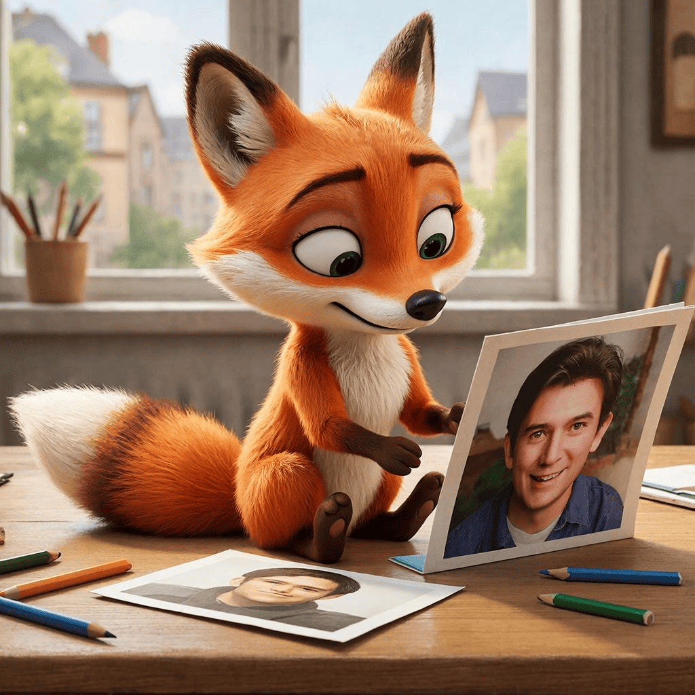
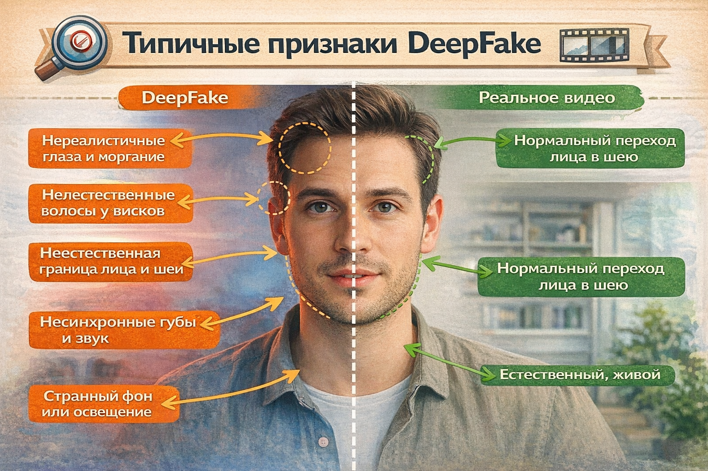

# Как отличить [реальность](../../../1.2_natural_sciences/physics_in_everyday_life/Q140028.md) от DeepFake 👀

## Содержание
- [Как отличить правду от фейка? DeepFake и твои глаза](#как-отличить-правду-от-фейка-deepfake-и-твои-глаза)
- [Как это работает: магия (или кошмар) алгоритмов ❓](#как-это-работает-магия-или-кошмар-алгоритмов-)
- [Где мы с тобой это встречаем? Повсюду!](#где-мы-с-тобой-это-встречаем-повсюду)
- [Чем это может быть опасно? И есть ли плюсы? 🚨](#чем-это-может-быть-опасно-и-есть-ли-плюсы-)
- [Практический совет: как не попасться на удочку? 🎣](#практический-совет-как-не-попасться-на-удочку-)
- [Заключение 🐱](#заключение-)
- [Что почитать дальше](#что-почитать-дальше)

## Как отличить правду от фейка? DeepFake и твои [глаза](../../../7.2 Media, leisure and hobbies/Computer games/articles/useful_tips/eyes_and_back.md)

Задумывался ли ты, когда листаешь TikTok или Instagram, что то [видео](../../../5.1_technology_and_digital_literacy/information and media literacy/оценка_качества_изображений_и_видео.md) с твоим любимым блогером, где он вдруг запел на отличном английском или высказался о чём-то очень странном, может быть не настоящим? А то, что [кадр](../../../../8.1_entertainment/articles/director.md), где одноклассник на школьной линейке «признаётся» в чём-то смешном, на самом деле сделан искусственным интеллектом? Мир вокруг нас наполнен контентом, и не весь из него — то, чем кажется. Эта статья — твой гид по одной из самых коварных и интересных современных технологий: **DeepFake**. Мы разберёмся, что это, почему это опасно, и главное — как не попасться на удочку и сохранить свой критический [ум](../../../7.2 Media, leisure and hobbies/Computer games/articles/useful_tips/educational_games.md) в порядке.

**DeepFake** (читается как «дипфейк») — это [метод](../../../5.1_technology_and_digital_literacy/how_internet_works/articles/http_https/http_https.md) создания очень реалистичных, но поддельных [изображений](../../../5.1_technology_and_digital_literacy/information%20and%20media%20literacy/articles/оценка_качества_изображений_и_видео.md), [видео](../../../5.1_technology_and_digital_literacy/information%20and%20media%20literacy/articles/оценка_качества_изображений_и_видео.md) или аудиозаписей с помощью искусственного интеллекта (ИИ). Название происходит от слов «глубокое [обучение](../../../3.1. healthy lifestyle/Sleep, nutrition, and adolescent energy/articles/sleep_and_memory_grades.md)» (*deep learning*) — одного из направлений машинного обучения, на котором и основана эта технология. Проще говоря, ИИ «заучивает» тысячи кадров и голоса одного человека (например, знаменитости или твоего друга), а затем накладывает его черты, мимику и голос на другое видео или создаёт новое с нуля. [Результат](../../../1.2_natural_sciences/why_science_help_understand_world/experimental_science.md) часто настолько правдоподобен, что отличить [фейк](../../../2.1_society/cause_and_effect_relationships/articles/false_connections.md) от реальности может быть невероятно сложно даже для взрослых. С этим явлением напрямую работают многие разоблачители и журналисты-технологи и даже блогеры, которые в своих материалах часто разбирают подобные случаи и учат аудитории медиаграмотности. В сети напрммер вирусится тренд, где инфлюенсеры пытаются отличить реальное [фото](../../../5.1_technology_and_digital_literacy/information and media literacy/проверка_фото_на_манипуляции.md) от ии.

## Как это работает: магия (или кошмар) алгоритмов ❓

Представь, что ты учишь рисовать кого-то. Сначала ты смотришь на его фото со всех ракурсов, замечаешь, как двигаются его брови, как складываются губы при улыбке, как [свет](../../../1.2_natural_sciences/physics_in_everyday_life/Q1.md) падает на лицо. Ты делаешь это так долго, что начинаешь понимать суть его внешности. ИИ делает нечто похожее, но в миллионы раз быстрее и детальнее. Он анализирует огромные массивы данных (видео, фото) лица одного человека (исходного) и лица другого (целевого). Затем, с помощью сложных нейросетей (особенно типа **[GAN](../../../7.1_art/modern_technological_art/articles/3.3_deepfake_art.md) — генеративно-состязательных сетей**), он учится «переносить» черты исходного лица на движения и мимику целевого в видео.

**Простой пример:** Возьмём видео, где политик говорит что-то. ИИ берёт лицо актёра и «вживляет» его в этот кадр, синхронизируя движения губ, [моргание](../../../7.2 Media, leisure and hobbies/Computer games/articles/useful_tips/eyes_and_back.md), даже небольшие движения головы с оригинальным звуком. Получается, что актёр, казалось бы, произносит слова политика. Или наоборот: голос твоего друга «встраивается» в видео с котиком, и он «говорит» смешные фразы. Это и есть суть **морфинга** (сглаживания перехода) и синтеза, который вы видите на примере изображений, где лицо папы римского, например, накладывается на другую одежду или обстановку (как на знаменитом фейке с папой Франциском в пуховике).

## Где мы с тобой это встречаем? Повсюду!

Ты можешь подумать: «Да это же про звёзд и политиков, мне-то что?». И вот здесь — главная ловушка. **DeepFake уже давно не только про Голливуд и Вашингтон.**

1.  **[Соцсети](../../../2.1_society/how_and_where_find_friends/articles/tcifrovaya_druzhba.md) и мессенджеры:** Самый частый [контакт](../../../1.2_natural_sciences/neurobiology_for_teens/articles/17_hugs_oxytocin.md). Это вирусные ролики, где «твоя подруга» в дурацкой ситуации, «известный стример» хвалит твой любимый бренд, или «учитель» даёт неожиданный совет. Часто это шутки, но шутки, которые могут испортить репутацию.
2.  **Школьная [среда](../../../1.2_natural_sciences/physics_in_everyday_life/Q124003.md) и сплетни:** Представь, кто-то создаёт видеоролик, где ты (или твой [образ](../../../7.2 Media, leisure and hobbies/Computer games/articles/game_culture/cosplay.md)) говоришь обидные слова или делаешь неловкий жест. Так можно устроить настоящий [кибербуллинг](../../../3.2 healthy lifestyle/how to act in a dangerous situation/articles/cyberbullying.md) или подставить одноклассника в конфликте с администрацией.
3.  **Реклама и мошенничество:** «Блогер-миллионник» рекомендует сомнительный финансовый продукт или игрушку. На самом деле его лицо и голос украдены, чтобы выманить [деньги](../../../2.1_society/cause_and_effect_relationships/articles/economic_chains.md) у доверчивых подписщиков.
4.  **«[Доказательства](../../critical_thinking/articles/fact_and_opinion_differences.md)» в спорах:** «Смотри, он сам это сказал!» — и вставляют фейковое видео. Это мощнейшее оружие для манипуляции общественным мнением в мелких бытовых или крупных политических спорах.

**Реальные примеры (придуманные, но очень похожие на правду):** 🧐
*   **Пример 1 (школьный):** В класном чате летит видео, где «Саша» (твой одноклассник) на перемене громко и ясно говорит, что он, [цитата](../../../5.1_technology_and_digital_literacy/information and media literacy/как_правильно_оформлять_ссылки_и_источники.md), «ненавидит всех в этом классе, кроме Маши». На деле Саша даже не знал, что такое видео существует, пока не началась [травля](../../../3.2 healthy lifestyle/how to act in a dangerous situation/articles/cyberbullying.md). Это был **DeepFake**, созданный из его старых видео с дневника.
*   **Пример 2 (блогерский):** В твоей ленте появляется видео твоего любимого гейм-стримера, где он советует небезопасный [источник дохода](../../../6.1_Independent_living_and_daily_living_skills/reasonable_spending/articles/income.md). Но через час стример выходит в прямой эфир и говорит: «Ребята, это не я! Это фейк, кто-то использовал мой голос из прошлых стримов!» Такой инцидент был у многих известных личностей.
*   **Пример 3 (политический/социальный):** Видео, где известный политик или активист говорит что-то радикальное или несуразное, быстро плодится в пабликах. [Цель](../../../1.2_natural_sciences/why_science_help_understand_world/research_work.md) — вызвать [гнев](../../critical_thinking/articles/influence_of_emotions.md) или насмешку и заставить людей поверить в несуществующую «правду».

## Чем это может быть опасно? И есть ли плюсы? 🚨

**[Опасности](../../../1.2_natural_sciences/physics_in_everyday_life/Q845744.md) (их гораздо больше):**
*   **[Кризис](../../../2.1_society/cause_and_effect_relationships/articles/economic_chains.md) доверия:** Мы перестаём верить своим глазам и ушам. «Это мог быть фейк» — [фраза](../../../7.2 Media, leisure and hobbies/Computer games/articles/game_culture/game_memes.md), которая разрушает возможность общественного диалога. Например: среди художников растёт недоверие по поводу подлинности работ, не только со стороны друг друга, но и со стороны вне арт комъюнити.
*   **Кибербуллинг и компрометация:** Легко унизить человека, подставив его словами или действиями.
*   **Мошенничество:** От «помогите, это я, ваш сын, у меня сломался телефон» (голос «сына» из фейка) до финансовых пирамид с лицами звёзд.
*   **[Манипуляция](../../../2.1_society/cause_and_effect_relationships/articles/false_connections.md) и [дезинформация](../../critical_thinking/articles/information_verification.md):** Фейки могут влиять на выборы, общественные протесты, нашу оценку событий.
*   **Психологический [вред](../../../3.1. healthy lifestyle/Sleep, nutrition, and adolescent energy/articles/the_energy_trap.md):** Осознание, что твоё цифровое «я» может быть украдено и использовано против тебя, — это страшно и травматично.

**Плюсы (они есть, но редки и контролируемы):**
*   **Образование и [история](../../../1.2_natural_sciences/physics_in_everyday_life/Q11469.md):** «Оживление» исторических фотографий, создание реалистичных реконструкций событий для уроков.
*   **Кинематограф и игры:** Безопасная «молодильня» актёров, создание фантастических персонажей.
*   **Инклюзия:** Создание аватаров для людей с ограниченными возможностями, озвучивание фильмов на языках оригинала с сохранением интонации актёра.
*   **Юмор и [творчество](../../../2.1_society/how_and_where_find_friends/articles/sam_sebe_interesnyi.md):** Безобидные мемы и пародии, если они явно помечены как таковые.

**Важно:** Плюсы работают только при этичном использовании, полном согласии и чётком маркировании. Всё остальное — в зоне риска.

## Практический совет: как не попасться на удочку? 🎣

Теперь самое важное: что делать, когда ты видишь что-то подозрительное? Твоё главное оружие — **[критическое мышление](../../../5.1_technology_and_digital_literacy/information%20and%20media%20literacy/articles/критическое_мышление_в_онлайн_среде.md)** и **[медиаграмотность](../../critical_thinking/articles/manipulation_recognition.md)**. Вот твой [пошаговый план](../../../6.1_Independent_living_and_daily_living_skills/reasonable_spending/articles/financial_goal.md).

**Сначала: распознай [признаки](../../../3.1_healthy_lifestyle/pervaya_pomoshch/ushibi_porezy_ozhogi/04_ushib_chto_eto_priznaki.md) фейка (что проверять в первую очередь).**

1.  **Взгляд и мимика:** Посмотри в глаза человека на видео. **Глаза — «[зеркало](../../../1.2_natural_sciences/physics_in_everyday_life/Q35197.md) души» и часто «слабейшее звено» фейка.** ИИ до сих пор иногда плохо справляется с естественным морганием, взглядом в сторону, сложной мимикой вокруг [глаз](../../../1.2_natural_sciences/physics_in_everyday_life/Q467980.md) (морщинки смеха). Может быть неестественно «стабильный» взгляд или, наоборот, слишком частое моргание.
2.  **[Поверхность](../../../1.2_natural_sciences/physics_in_everyday_life/Q35197.md) кожи и волосы:** Обрати [внимание](../../../1.2_natural_sciences/neurobiology_for_teens/articles/16_love_chemistry.md) на границу лица и шеи, волосы у висков. Часто там видны артефакты — размытость, «смазанные» участки, неестественные переходы. Волосы, особенно на переднем плане, могут вести себя странно (например, не реагировать на ветер, который есть в кадре).
3.  **[Звук](../../../1.2_natural_sciences/physics_in_everyday_life/Q124003.md) и синхронность:** **Синхронность губ и звука — ключевой момент.** Включи видео без звука — смотри на артикуляцию. Затем послушай звук без картинки. Часто фейк «слетает» именно здесь: звук может быть чуть опережать или отставать от движения губ, или [качество](../../../6.1_Independent_living_and_daily_living_skills/reasonable_spending/articles/quality.md) звука (фон, [эхо](../../../1.2_natural_sciences/physics_in_everyday_life/Q83301.md)) не соответствует качеству видео.
4.  **Несоответствия:** Голова слишком большая/маленькая для тела? Фон «плавает» или имеет разное качество? [Одежда](../../../1.2_natural_sciences/physics_in_everyday_life/Q487005.md) странно деформируется? [Человек](../../../1.2_natural_sciences/physics_in_everyday_life/Q45003.md) на видео выглядит неестественно молодо или, наоборот, старым? Это может быть признаком.
5.  **[Источник](../../../5.1_technology_and_digital_literacy/information and media literacy/дезинформация_и_фейки.md) и эмоциональный крючок:** **Откуда это видео?** От проверенного [медиа](../../../5.1_technology_and_digital_literacy/information and media literacy/как_устроена_современная_информационная_среда.md) или из неизвестного паблика с кричащим заголовком? Зачем тебе это показывают? Если [контент](../../../5.1_technology_and_digital_literacy/information and media literacy/информационная_диета.md) вызывает сильные [эмоции](../../../3.1. healthy lifestyle/Sleep, nutrition, and adolescent energy/articles/stress_and_food.md) — гнев, смех, шок, [жалость](../../../1.2_natural_sciences/neurobiology_for_teens/articles/15_empathy.md) — и призывает к быстрому действию («Поделись, чтобы все узнали!»), это **красный флаг**. [Мошенники](../../../3.2 healthy lifestyle/how to act in a dangerous situation/articles/phishing-links.md) и провокаторы всегда играют на эмоциях.

**Теперь: как защититься? Твой [алгоритм действий](../../../1.2_natural_sciences/physics_in_everyday_life/Q161635.md).**

**До того, как увидел подозрительное видео:**
*   **Формируй здоровое скептицизм.** Не верь всему на первый взгляд, даже если это от друга. Друг мог и сам быть обманут.
*   **Подписывайся на проверенные [источники](three_whales.md)** и разоблачителей фейков (каналы типа «Объясняем.Ростов», «Проверь.Медиа»). Они учат [замечать](../../../4.1_rules_of_study/how_to_memorize/articles/vnimanie.md) детали.
*   **Повышай общую медиаграмотность.** Умей определять, кто [автор](copypaste.md) контента, какая у него может быть цель.

**Во [время](../../../1.2_natural_sciences/physics_in_everyday_life/Q20702.md) [столкновения](../../../1.2_natural_sciences/physics_in_everyday_life/Q25358.md) с сомнительным контентом:**
1.  **Остановись.** Не репостни, не комментируй эмоционально. Да себе 10 секунд на раздумье.
2.  **Включи «радар деталей».** Пройдись по пунктам выше: глаза, кожа, звук, фон.
3.  **Используй [фактчекинг](../../../5.1_technology_and_digital_literacy/information%20and%20media%20literacy/articles/фактчекинг_пошагово.md).** Скопируй ключевую фразу из описания или вопрос из видео и вбей в [поисковик](../../../5.1_technology_and_digital_literacy/information and media literacy/роль_поисковых_систем.md) (+ слово «фейк» или «[проверка](../../../1.2_natural_sciences/why_science_help_understand_world/scientific_method.md)»). Скорее всего, кто-то уже разобрал это видео. Иди на сайты-фактчекеры (например, «Проверь.Медиа», «Болота»).
4.  **Обратись к [первоисточнику](../../../5.1_technology_and_digital_literacy/information%20and%20media%20literacy/articles/первоисточник_и_пересказ.md).** Если видео «от» какого-то блогера или политика, зайди на его **официальный** [аккаунт](../../../5.1_technology_and_digital_literacy/information and media literacy/информационная_безопасность_для_детей.md) (галочка верификации, известный [URL](../../../5.1_technology_and_digital_literacy/how_internet_works/articles/web_basics/what_happens.md)). Есть ли там это видео? Часто фейки не появляются на основных каналах.

**После того, как ты убедился в фейке (или так и не понял):**
*   **Если ты уже поделился — удали репост и объясни.** Напиши в комментариях: «Ребята, кажется, это фейк, вот разбор [[ссылка](copypaste.md) на фактчек]. Давайте не распространяем».
*   **Предупреди отправителя.** Напиши другу в личку: «Эй, кажется, это DeepFake, вот почему [кратко причины]. Может, удалишь?»
*   **Сохраняй [спокойствие](../../../7.2 Media, leisure and hobbies/Computer games/articles/useful_tips/toxic_players.md).** Не вступай в агрессивные споры с теми, кто уже поверил в фейк. Предложи [факты](../../../1.2_natural_sciences/physics_in_everyday_life/Q17737.md), а не эмоции. Иногда лучше просто промолчать.

## [Заключение](../../../1.2_natural_sciences/physics_in_everyday_life/Q2225.md) 🐱

DeepFake — это не магия, а сложный, но все более доступный инструмент. Он уже здесь, и он будет только улучшаться. Твоя задача — не становиться жертвой, а становиться осознанным потребителем информации. Главный [вывод](../../../1.2_natural_sciences/why_science_help_understand_world/scientific_method.md): **ничто в цифровом мире не принимается на веру без проверки.** Твои глаза могут обманывать, а эмоции — играть против тебя. Твоя суперсила — это **пауза, вопрос «почему?» и умение искать ответы.**

И запомни: теперь, когда увидишь видео, где твой кот вдруг говорит человеческим голосом, первым делом проверь, не DeepFake ли это. А если это правда... тогда беги снимать это на камеру, это же исторический момент! Ваш кот, возможно, следующий интернет-феномен. Но шутки в сторону — будь бдителен, думай своей головой и не дай алгоритмам думать за тебя. Твой [цифровой след](digital_footprint.md) должен быть под твоим контролем.

## Что почитать дальше

- [Фейковые новости](fake_news.md)
- [Эффект авторитета](authority.md)
- [Первоисточник](original_source.md)
- [Три кита надёжности](three_whales.md)

---
Авторы: Исмаилова Камила (308 группа)
GitHub: @[https](../../../5.1_technology_and_digital_literacy/how_internet_works/articles/http_https/http_https.md)://github.com/Kamusheck
*Использованы: OpenRouter (stepfun/step-3.5-flash:free), OpenRouter (openfree), Wikidata*
