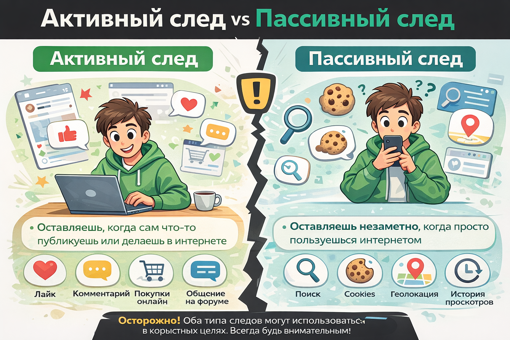

# [Цифровой](../../../7.1_art/musical_instruments/articles/synthesizer.md) [след](../../../5.1_technology_and_digital_literacy/information and media literacy/приватность_и_цифровой_след.md) 👣

- [Цифровой след: твой невидимый автопортрет в интернете 👣](#цифровой-след-твой-невидимый-автопортрет-в-интернете-)
- [Что такое цифровой след и как он работает? 🧩](#что-такое-цифровой-след-и-как-он-работает-)
- [Где мы сталкиваемся с этим каждый день? Примеры из жизни подростка 📱](#где-мы-сталкиваемся-с-этим-каждый-день-примеры-из-жизни-подростка-)
- [Чем это может быть полезно? Твой суперскилл 💪](#чем-это-может-быть-полезно-твой-суперскилл-)
- [Практический совет: как освоить навык управления следом и поиска 🛠️](#практический-совет-как-освоить-навык-управления-следом-и-поиска-️)
- [Заключение 🎯](#заключение-)
- [Что почитать дальше 📚](#что-почитать-дальше-)

---

## Цифровой след: твой невидимый автопортрет в интернете 👣

Задумывался ли ты, что каждое твое [действие](../../../2.1_society/cause_and_effect_relationships/articles/personal_choice.md) в интернете оставляет след, похожий на отпечаток пальца? Представь, что ты вышел из дома в новом, только что купленном худи. Ты идешь в школу, садишься на скамейку, берешь бутерброд, а потом бежишь на автобус. На твоей одежде, на скамейке, на бутерброде остались микроскопические частички — волокна, пыль, клетки кожи. Если бы у кого-то был специальный [микроскоп](../../../1.2_natural_sciences/physics_in_everyday_life/Q467980.md) и огромное терпение, он мог бы по этим крошечным следам частично восстановить твой маршрут. Так же и в цифровом мире. Каждый [лайк](../../../3.1_healthy lifestyle/vrednye_privychki/articles/Social_media.md), поисковый [запрос](../../../5.1_technology_and_digital_literacy/how_internet_works/articles/http_https/http_https.md), комментарий, просмотр [видео](../../../5.1_technology_and_digital_literacy/information and media literacy/оценка_качества_изображений_и_видео.md), даже просто [подключение](../../../1.2_natural_sciences/physics_in_everyday_life/Q25250.md) к [Wi-Fi](../../../5.1_technology_and_digital_literacy/how_internet_works/articles/history/internet_at_home.md) в кафе — это твой **цифровой след**. Он невидим, но он есть. И он говорит о тебе больше, чем ты можешь себе представить. Отсутствие навыков [работы](../../../8.2_future/choosing_a_career_path/articles/interview.md) с этим следом сегодня — это как ходить по городу с вывернутыми карманами, не замечая, что тебе кто-то тихо подсовывает бумажки, а потом использует их против тебя. Эта статья — твой гид по тому, как не стать жертвой своей же цифровой невнимательности, а наоборот, научиться использовать этот след в своих интересах.

## Что такое цифровой след и как он работает? 🧩

Цифровой след (digital footprint) — это [сумма](../../../6.1_Independent_living_and_daily_living_skills/reasonable_spending/articles/receipt.md) всех данных, которые ты оставляешь в интернете, сознательно или нет. Это не просто «что-то про [приватность](../../../5.1_technology_and_digital_literacy/information%20and%20media%20literacy/articles/приватность_и_цифровой_след.md)», это твоя **цифровая биография в реальном времени**. Её можно разделить на две большие части:

1.  **Активный след (Active Footprint):** Это то, что ты делаешь намеренно. Создаешь [аккаунт](../../../5.1_technology_and_digital_literacy/information and media literacy/информационная_безопасность_для_детей.md) в [соцсети](../../../2.1_society/how_and_where_find_friends/articles/tcifrovaya_druzhba.md), публикуешь [фото](../../../5.1_technology_and_digital_literacy/information and media literacy/проверка_фото_на_манипуляции.md), пиши [комментарии](cooperative_work.md), скачиваешь приложение, оставляешь отзыв на сайте. Ты сам «оставляешь подпись».
2.  **Пассивный след (Passive Footprint):** Это [данные](../../../2.1_society/cause_and_effect_relationships/articles/ai_causality.md), которые собираются о тебе без твоего прямого участия. Когда ты заходишь на сайт, он может [записывать](../../../4.1_rules_of_study/how_to_memorize/articles/konspektirovanie.md) твой [IP-адрес](../../../5.1_technology_and_digital_literacy/how_internet_works/articles/ip_mac/ip_and_mac.md) (уникальный «номер» твоего [устройства](../../../5.1_technology_and_digital_literacy/operating system/articles/HAL.md) в сети), [тип](../../../5.2_cybersecurity/cpp_fundamentals/13_struct.md) браузера, [время](../../../1.2_natural_sciences/physics_in_everyday_life/Q20702.md) просмотра [страницы](../../../5.1_technology_and_digital_literacy/operating system/articles/memory_management.md), клики мышкой. Специальные скрипты (куки-файлы, или [cookies](../../../5.1_technology_and_digital_literacy/how_internet_works/articles/http_https/cookies.md)) работают в фоне, запоминая твои [предпочтения](../../../7.2 Media, leisure and hobbies /what_you_can_read_and_watch_to_develop_your_taste/articles/psychology_of_taste.md). Даже простое подключение к общественной сети Wi-Fi в школе или торговом центре фиксирует, какое [устройство](../../../1.2_natural_sciences/physics_in_everyday_life/Q178032.md) было в сети и когда.

**Как это работает на техническом уровне (простыми словами)?** Представь, что каждый твой гаджет (телефон, ноутбук) имеет уникальный «цифровой отпечаток» — набор характеристик (версия ОС, [разрешение](../../../7.2 Media, leisure and hobbies/Computer games/articles/technologies_inside/screen_magic.md) экрана, установленные шрифты, часовой пояс). Когда ты заходишь на сайт, он может прочитать часть этих характеристик. Это похоже на то, как сторож в школе, видя твою походку и рюкзак, может понять, кто ты, даже не видя лица. Плюс к этому все твои [действия](../../../3.1_healthy_lifestyle/pervaya_pomoshch/ushibi_porezy_ozhogi/03_obschie_pravila_algorithm.md) ([поиск](../../../3.2 healthy lifestyle/how to act in a dangerous situation/articles/lost-in-city.md), клики) логируются на серверах компаний. Вся эта [информация](../../../5.1_technology_and_digital_literacy/information and media literacy/как_устроена_современная_информационная_среда.md) связывается с твоим профилем (если ты авторизован) или с уникальным идентификатором твоего устройства. Со временем из этих «крошек» строится довольно точный [портрет](../../../7.1_art/modern_technological_art/articles/5.4_mario_klingemann.md): что тебе нравится, где ты бываешь, во сколько ложишься [спать](../../../4.1_rules_of_study/how_to_memorize/articles/son.md) (по активности в соцсетях), даже примерное финансовое положение (по маркам одежды на фото). Государство, о котором говорится в кратком описании, защищает тебя от **несанкционированного** использования этих данных. Но первая линия обороны — это **ты сам** и твое [понимание](../../../2.1_society/cause_and_effect_relationships/articles/empathy_causality.md) того, как этот механизм устроен.

## Где мы сталкиваемся с этим каждый день? Примеры из жизни подростка 📱

Цифровой след повсюду в твоей повседневности:

- **Соцсети (ВКонтакте, Telegram, TikTok, Instagram):** Это главный «корабль-призрак» твоего следа. Каждое твое фото, [статус](../../../5.1_technology_and_digital_literacy/how_internet_works/articles/http_https/http_https.md), даже удаленный пост, может быть где-то сохранен. [Алгоритмы](buble_filter.md) этих платформ анализируют, что ты лайкаешь, сколько времени смотришь определенные видео, с кем переписываешься, чтобы показывать тебе **точечную рекламу** и [контент](../../../5.1_technology_and_digital_literacy/information and media literacy/информационная_диета.md). Ты замечал, что после разговора с другом о кемпинге в ленке внезапно появляются рекламы палаток и туристических туров? Это не случайность. Это твой след в действии.
- **Поисковики ([Яндекс](../../../7.1_art/modern_technological_art/articles/5.5_yandex_neural.md), Google):** Каждый твой запрос, от «как решить задачу по алгебре» до «мемы про школу», записывается и анализируется. Это создает твой **поисковый [профиль](../../../5.1_technology_and_digital_literacy/information and media literacy/цифровая_репутация.md)**. На основе него [поисковик](../../../5.1_technology_and_digital_literacy/information and media literacy/роль_поисковых_систем.md) пытается угадать, что ты хочешь найти, и показывает персональные [результаты](../../../1.2_natural_sciences/why_science_help_understand_world/research_work.md). Но это же значит, что если кто-то зайдет на твой компьютер (или аккаунт) и посмотрит историю поиска, он узнает о твоих интересах, сомнениях, проблемах. Это мощный инструмент для **саморазоблачения**.
- **Игры и [приложения](../../../4.1_rules_of_study/how_to_learn_effectively/articles/digital_tools.md):** Большинство бесплатных игр и приложений монетизируются через рекламу или продажу данных. Разрешая доступ к контактам, галерее, местоположению, ты «платишь» за бесплатное пользование своими данными. Приложение для трекинга бега может собирать данные о твоих маршрутах, что может быть опасно, если эти данные попадут не в те руки.
- **Онлайн-покупки и карты лояльности:** Каждая покупка, даже в обычном магазине по карте, может быть привязана к твоей личности и стать частью потребительского профиля. Он показывает твои [привычки](../../../1.2_natural_sciences/neurobiology_for_teens/articles/11_reward_system.md), финансовые возможности и вкусы.

**Конкретный пример из жизни:**
Аня, 14 лет, любит смотреть видео про [аниме](../../../2.1_society/how_and_where_find_friends/articles/fandom.md) и [косплей](../../../2.1_society/how_and_where_find_friends/articles/fandom.md). Она лайкает такие ролики в YouTube, подписывается на паблики ВКонтакте, ищет в Яндексе «как сшить [костюм](../../../7.2 Media, leisure and hobbies/Computer games/articles/game_culture/cosplay.md) Наруто». Ее цифровой след наполняется связанными с этим данными. В итоге ее [лента](../../../5.1_technology_and_digital_literacy/information and media literacy/алгоритмы_и_пузырь_фильтров.md) в соцсетях и реклама по всему интернету превращаются в сплошную «аниме-ленту». Это удобно? Да. Но это и **[пузырь фильтров](buble_filter.md)**, которая ограничивает [кругозор](../../../7.2 Media, leisure and hobbies /useful_and_interesting_leisure/articles/reading_and_self_education.md). А что, если она захочет поступить в медицинский? Ее след сейчас мягко «нацеливает» ее на творческие специальности, а не на технические. Если же Аня не знает об этом механизме, она может не заметить, как [алгоритм](../../../2.1_society/cause_and_effect_relationships/articles/ai_causality.md) незаметно сужает ее горизонты.

## Чем это может быть полезно? Твой суперскилл 💪

Понимание цифрового следа — это не только про [опасности](../../../1.2_natural_sciences/physics_in_everyday_life/Q845744.md). Это про **силу и контроль**. Вот что ты можешь сделать, овладев этим навыком:

1.  **Управление [репутацией](../../../5.1_technology_and_digital_literacy/information%20and%20media%20literacy/articles/цифровая_репутация.md).** Ты сам создаешь свой цифровой [образ](../../../7.2 Media, leisure and hobbies/Computer games/articles/game_culture/cosplay.md). Осознанная [публикация](../../../5.1_technology_and_digital_literacy/information and media literacy/цифровая_репутация.md) полезного контента (например, твои рисунки, статьи в школьный журнал, видео с научным экспериментом) формирует **положительный след**. В будущем его могут увидеть будущие работодатели или преподаватели вуза. Это твой цифровой [портфолио](../../../8.2_future/choosing_a_career_path/articles/resume.md).
2.  **[Безопасность](../../../1.2_natural_sciences/neurobiology_for_teens/articles/17_hugs_oxytocin.md) и [защита](../../../5.1_technology_and_digital_literacy/how_internet_works/articles/dns/cdn.md) от мошенничества.** Понимая, какие данные ты оставляешь, ты можешь закрывать «дыры». Не публиковать геометки в реальном времени, не указывать полный [возраст](../../../5.1_technology_and_digital_literacy/information and media literacy/карта_компетенций_по_возрастам.md) и [адрес](../../../5.1_technology_and_digital_literacy/how_internet_works/articles/ip_mac/ip_and_mac.md) в открытых профилях, использовать сложные пароли. Ты перестаешь быть легкой мишенью для фишинга (когда тебе приходит письмо «от банка» с просьбой ввести [пароль](../../../3.2 healthy lifestyle/how to act in a dangerous situation/articles/internet-safety.md)) и для кредошифферов (людей, которые собирают информацию для шантажа).
3.  **[Поиск информации](../../../1.2_natural_sciences/neurobiology_for_teens/articles/19_curiosity.md) — суперусиленный.** Вот мы подошли к главному практическому навыку. Зная, как устроен цифровой след и как работают поисковики, ты можешь **искать наоборот**. Не только «что такое [фотосинтез](../../../1.2_natural_sciences/physics_in_everyday_life/Q1997.md)», но и:
    - **Найти старую публикацию:** Используя [операторы поиска](../../../../4.2/how_to_search_information/articles/search_operations.md) (например, `site:vk.com "твое имя" "год"`), можно найти все свои старые посты.
    - **Оценить [источник](../../../5.1_technology_and_digital_literacy/information and media literacy/дезинформация_и_фейки.md):** Увидев странную [новость](../../../5.1_technology_and_digital_literacy/information and media literacy/информационная_диета.md), ты не просто веришь ей. Ты ищешь [домен](../../../5.1_technology_and_digital_literacy/how_internet_works/articles/dns/domains.md) сайта, проверяешь, кто его владелец (через [сервисы](../../../4.1_rules_of_study/how_to_learn_effectively/articles/digital_tools.md) like `whois`), ищешь упоминания этого сайта на других, более известных ресурсах. Ты проверяешь **цифровой след самого источника**.
    - **Найти информацию по изображению:** Загрузив картинку в Google Картинки или Яндекс.Картинки (поиск по изображению), ты можешь найти, где еще она встречается, и понять, откуда она взялась. Это помогает отличить [мем](../../../7.2 Media, leisure and hobbies/Computer games/articles/game_culture/game_memes.md) от реальной новости.
    - **Фильтровать шум:** Используя [кавычки](../../../../4.2/how_to_search_information/articles/search_operations.md) для точной фразы (`"космический корабль прилетел"`), знак минус для исключения слов (`корабль -игрушка`), ты учишь поисковик слушать тебя точнее.
4.  **[Личностный рост](../../../8.1_colf-underctandina/HouToFindVourStrenaths/articles/use_strengths_in_life.md) и [самопознание](../../../7.2 Media, leisure and hobbies /useful_and_interesting_leisure/articles/how_to_understand_your_interests.md).** Иногда полезно посмотреть на свой цифровой след со стороны. Какие темы тебя больше всего волнуют? С кем ты чаще общаешься? Что ты потребляешь в основном? Это [зеркало](../../../1.2_natural_sciences/physics_in_everyday_life/Q35197.md). Может, ты не замечал, что последние три месяца все твои запросы связаны с тревогой? Это [сигнал](../../../5.1_technology_and_digital_literacy/how_internet_works/articles/wifi/router.md). Или, наоборот, что твой след полон творческих идей — отлично, это твоя сильная сторона!

## Практический совет: как освоить [навык](../../../5.1_technology_and_digital_literacy/information and media literacy/карта_компетенций_по_возрастам.md) управления следом и поиска 🛠️

Не пугайся, это не про [программирование](../../../5.2_cybersecurity/cpp_fundamentals/1_introduction.md). Это про привычки и несколько простых инструментов.

**Аудит собственного следа (Раскопки у себя под окном).**

- **[Поиск себя](../../../7.2 Media, leisure and hobbies /useful_and_interesting_leisure/articles/how_to_understand_your_interests.md):** Открой поисковик и введи свое имя, фамилию, никнеймы в кавычках. Посмотри на первую 5-10 страниц. Что там? Твои профили? Фото? Упоминания на чужих страницах? Запиши, что нашлось.
- **Проверь настройки приватности:** Зайди в настройки своих аккаунтов (ВК, Instagram, TikTok). Что видно незнакомцам? Фото? [Друзья](../../../4.1_rules_of_study/how_to_learn_effectively/articles/peer_learning.md)? [Город](../../../3.2 healthy lifestyle/how to act in a dangerous situation/articles/lost-in-city.md)? Дата рождения? **Сузь круг видимости** до «только друзья» или даже «только я» для старых постов.
- **Очисти cookies и историю:** Раз в месяц делай «генеральную уборку» в браузере. Удаляй историю просмотров, cookies, кэш. Это как вытряхнуть пыль из карманов после [прогулки](../../../7.2 Media, leisure and hobbies /useful_and_interesting_leisure/articles/active_recreation_and_sport.md).
- **Используй приватные [окна](../../../5.1_technology_and_digital_literacy/operating system/articles/window_manager.md) ([Режим](../../../4.1_rules_of_study/how_to_learn_effectively/articles/breaks_and_rest.md) инкогнито):** Для поиска чего-то, что не хочешь, чтобы алгоритм привязал к твоему основному профилю (например, подарок для друга), используй это окно. Оно не сохраняет историю и cookies после закрытия.
- **[VPN](vpn_dns_proxy_anonymity_and_security.md), [DNS](vpn_dns_proxy_anonymity_and_security.md):** Изучи данные [технологии](../../../2.2_history/world_economy_on_fingers/articles/globalizatsiya.md), чтобы выгодно выстраивать след и дополнять его.

## [Заключение](../../../1.2_natural_sciences/physics_in_everyday_life/Q2225.md) 🎯

Твой цифровой след — это не приговор и не тайна за семью печатями. Это инструмент. Ты можешь позволить другим использовать его, чтобы манипулировать тобой, сужать твой мир и навязывать чужие [цели](../../../3.1_healthy_lifestyle/pervaya_pomoshch/ushibi_porezy_ozhogi/02_celi_pervoy_pomoshchi.md). А можешь взять управление в свои руки. Научись видеть свой след, управлять им и использовать его как мощный источник информации и возможностей. Помни: [интернет](../../../1.2_natural_sciences/physics_in_everyday_life/Q26540.md) помнит всё, но именно ты решаешь, что именно он запомнит о тебе. Используй свои цифровые отпечатки так, чтобы даже твой цифровой попугай, если вдруг научится пользоваться поисковиком, нашел только крутые твои фотки с медалями, интересные посты и ни грамма того, что тебе пришлось бы краснеть объяснять! 🦜

## Что почитать дальше 📚

- [Социальные сети и интернет](social_networks.md)
- [VPN, DNS, Proxy: Анонимность и безопасность](vpn_dns_proxy_anonymity_and_security.md)
- [Информационная гигиена](information_hygiene.md)
- [Пузырь фильтров](buble_filter.md)

---

Авторы: Кулешов Дмитрий (308 группа)
GitHub: @[https](../../../5.1_technology_and_digital_literacy/how_internet_works/articles/http_https/http_https.md)://github.com/dmitriikuleshov
_Использованы: OpenRouter (stepfun/step-3.5-flash:free), Wikidata, DeepSeek_
