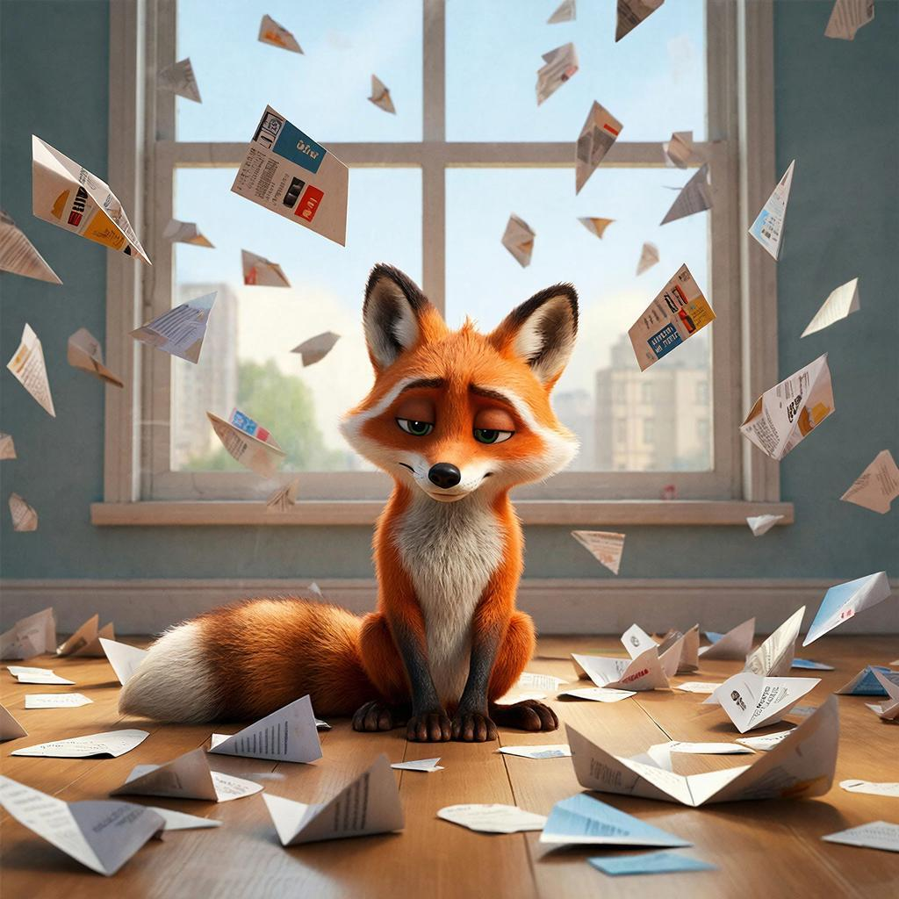

# [Информационная гигиена](social_networks.md): Как не сойти с ума от бесконечного потока новостей и уведомлений

## Содержание
- [Почему мозгу нужен фильтр](#почему-мозгу-нужен-фильтр)
- [Как чистить свою информационную среду](#как-чистить-свою-информационную-среду)
- [Примеры из жизни](#примеры-из-жизни)
- [Интересные факты](#интересные-факты)
- [Главный секрет](#главный-секрет)
- [Что почитать дальше](#что-почитать-дальше)

Представь, что каждое утро ты просыпаешься, а тебе в открытое окно залетают сотни бумажных самолётиков. В каждом — какая-то [новость](../../../5.1_technology_and_digital_literacy/information and media literacy/информационная_диета.md), [сообщение](../../../3.2 healthy lifestyle/how to act in a dangerous situation/articles/phishing-links.md), реклама или чьё-то [мнение](../../critical_thinking/articles/fact_and_opinion_differences.md). К вечеру комната завалена так, что не пройти. Примерно то же самое происходит с твоим мозгом каждый день, только вместо самолётиков — уведомления из телефона, ленты соцсетей, новостные сайты и [сообщения](../../../5.1_technology_and_digital_literacy/operating system/articles/IPC.md) от друзей. **Информационная гигиена** — это [правила](../../../2.1_society/cause_and_effect_relationships/articles/why_rules_work.md), которые помогают не утонуть в этом потоке и сохранить голову ясной, а [нервы](../../../1.2_natural_sciences/neurobiology_for_teens/articles/03_nervous_system_map.md) — крепкими.

---

## Почему мозгу нужен [фильтр](../../../3.1_healthy lifestyle/vrednye_privychki/articles/Social_media.md)

Твой [мозг](../../../3.1. healthy lifestyle/Sleep, nutrition, and adolescent energy/articles/breakfast_for_the_brain.md) — не бездонное ведро. Когда информации слишком много, он устаёт, начинает тормозить, и ты чувствуешь себя разбитым, даже если целый день пролежал на диване с телефоном. Учёные даже придумали термин — информационная [перегрузка](../../../5.1_technology_and_digital_literacy/information and media literacy/информационная_диета.md).

Хуже того, создатели новостей и соцсетей специально делают [контент](../../../5.1_technology_and_digital_literacy/information and media literacy/информационная_диета.md) таким, чтобы он вызывал у тебя сильные [эмоции](../../../3.1. healthy lifestyle/Sleep, nutrition, and adolescent energy/articles/stress_and_food.md): [страх](../../../1.2_natural_sciences/neurobiology_for_teens/articles/14_amygdala_fear.md), злость, [зависть](../../../../8.1_self_understanding/articles/social_comparison.md) или восторг. Потому что эмоциональный пост хочется лайкнуть, закомментировать и переслать другу. А тебе потом снится кошмар про страшную аварию или злит [фото](../../../5.1_technology_and_digital_literacy/information and media literacy/проверка_фото_на_манипуляции.md) одноклассника с курорта. Зачем тебе это? Правильно: незачем.

Информационная гигиена учит ставить фильтры. Как в телефоне: ты же не отвечаешь на звонки с незнакомых номеров? Вот и с информацией надо так же. В этом она похожа на [информационную диету](../../../5.1_technology_and_digital_literacy/information%20and%20media%20literacy/articles/информационная_диета.md).

---

## Как чистить свою информационную среду

### Устраивай [цифровой детокс](../../../3.1_healthy lifestyle/vrednye_privychki/articles/Social_media.md)
Это модное слово означает просто «день без гаджетов». Попробуй провести воскресенье без телефона. Сначала будет странно, а потом ты заметишь, как много времени оказывается свободным. Можно почитать книгу, погулять, пообщаться с семьёй или просто помечтать. Мозг скажет тебе огромное спасибо.

### Отключай уведомления
Серьёзно, зачем тебе знать, что какой-то блогер выложил новое [видео](../../../5.1_technology_and_digital_literacy/information and media literacy/оценка_качества_изображений_и_видео.md) прямо сейчас? Или что друг лайкнул чужую фотку? Уведомления — это как те самые самолётики, которые долбят тебя в лоб каждые 5 минут. Зайди в настройки телефона и отключи уведомления для всех приложений, кроме самых важных (звонки и сообщения от родителей, например). Ты почувствуешь, как стало тихо и спокойно.

### Проверяй новости дозированно
Новости не исчезнут, если ты не почитаешь их 3 часа. Выдели специальное [время](../../../1.2_natural_sciences/physics_in_everyday_life/Q20702.md), например, 15 минут утром и 15 минут вечером. Зашел, быстро просмотрел главное, вышел. Всё остальное время занимайся своими делами и не дёргайся.

---

## Примеры из жизни

Вот как информационная гигиена работает в реальной жизни:

1.  Вечерняя [тревога](../../../1.2_natural_sciences/neurobiology_for_teens/articles/07_stress.md). Ты перед сном залип в телефоне, увидел кучу страшных новостей или чей-то злой комментарий, и теперь не можешь уснуть, крутишь это в голове. [Решение](../../../2.1_society/cause_and_effect_relationships/articles/personal_choice.md): за час до сна убирай телефон подальше. Лучше почитай книгу, послушай музыку или просто полежи в тишине. [Сон](../../../3.1. healthy lifestyle/Sleep, nutrition, and adolescent energy/articles/evening_rituals_sleep_fast.md) будет сладким, а не тревожным.

2.  Синдром упущенной выгоды. Ты видишь в соцсетях, как твои знакомые тусуются, путешествуют, едят вкусняшки, и тебе кажется, что твоя [жизнь](../../../1.2_natural_sciences/physics_in_everyday_life/Q1751973.md) серая и скучная. Решение: помни, что в соцсетях люди показывают только лучшее, как в рекламе. Никто не выкладывает фото скучного вечера за уроками или разбитой коленки. Не сравнивай свою обычную жизнь с [чужой](../../../3.2 healthy lifestyle/how to act in a dangerous situation/articles/stranger-safety.md) праздничной лентой.

3.  [Спор](../../critical_thinking/articles/logical_errors_and_sophisms.md) в комментариях. Ты написал что-то в комментариях, а тебе начали грубить. Ты злишься, хочется ответить, доказать, затевается перепалка. Решение: просто выйди. Не отвечай. Потому что спорить с незнакомцами в интернете — это как играть в [шахматы](../../../../8.1_entertainment/articles/board-games.md) с голубем: он раскидает фигуры, нагадит на доску и улетит гордый. Твои нервы дороже.

---

## Интересные [факты](../../../1.2_natural_sciences/physics_in_everyday_life/Q17737.md)

- Средний [человек](../../../1.2_natural_sciences/physics_in_everyday_life/Q45003.md) проверяет телефон 150 раз в день! Это примерно каждые 6–7 минут бодрствования. Мы даже не замечаем, как тянемся к экрану на автомате.

- [Соцсети](../../../2.1_society/how_and_where_find_friends/articles/tcifrovaya_druzhba.md) и [приложения](../../../4.1_rules_of_study/how_to_learn_effectively/articles/digital_tools.md) созданы так, чтобы вызывать [зависимость](../../../3.1. healthy lifestyle/Sleep, nutrition, and adolescent energy/articles/the_energy_trap.md). Приём называется «бесконечная [лента](../../../5.1_technology_and_digital_literacy/information and media literacy/алгоритмы_и_пузырь_фильтров.md)» — ты листаешь, а контент всё подгружается и подгружается, и тебе сложно остановиться, потому что мозг ждёт награды (интересного поста). Это как [игровой автомат](../../../3.1_healthy lifestyle/vrednye_privychki/articles/ludomania.md): никогда не знаешь, когда выпадет джекпот.

- Учёные выяснили, что постоянное переключение между уведомлениями и задачами снижает IQ сильнее, чем [курение](../../../1.2_natural_sciences/neurobiology_for_teens/articles/13_nicotine.md) марихуаны. Когда ты делаешь уроки и каждые 5 минут отвлекаешься на телефон, ты делаешь уроки в 2–3 раза дольше и хуже.

---

## Главный секрет

Ты — не раб своего телефона. Ты — его хозяин. Информационная гигиена — это не скучные правила, а способ сделать свою жизнь спокойнее, счастливее и свободнее. Ты сам решаешь, что смотреть, когда смотреть и смотреть ли вообще.

Попробуй сегодня маленький [эксперимент](../../../1.2_natural_sciences/physics_in_everyday_life/Q1293220.md): когда вернёшься из школы, убери телефон в ящик стола на 1 час и займись чем-то другим. Ты удивишься, как много можно успеть и как хорошо становится на душе, когда никто не дёргает. Чистая голова — это круто! Пусть хотя бы твой воображаемый хомяк крутится в колесе без остановки, а не твоё [внимание](../../../1.2_natural_sciences/neurobiology_for_teens/articles/16_love_chemistry.md).

## Что почитать дальше

- [Пузырь фильтров](buble_filter.md)
- [Социальные сети и интернет](social_networks.md)
- [Цифровой след](digital_footprint.md)
- [Внешняя память](second_mind.md)

---
[Автор](copypaste.md): Ерофеева Александра;  
[Ресурсы](../../../2.1_society/cause_and_effect_relationships/articles/ecological_footprint.md): [LLM](../../../7.1_art/modern_technological_art/README.md) - DeepSeek
