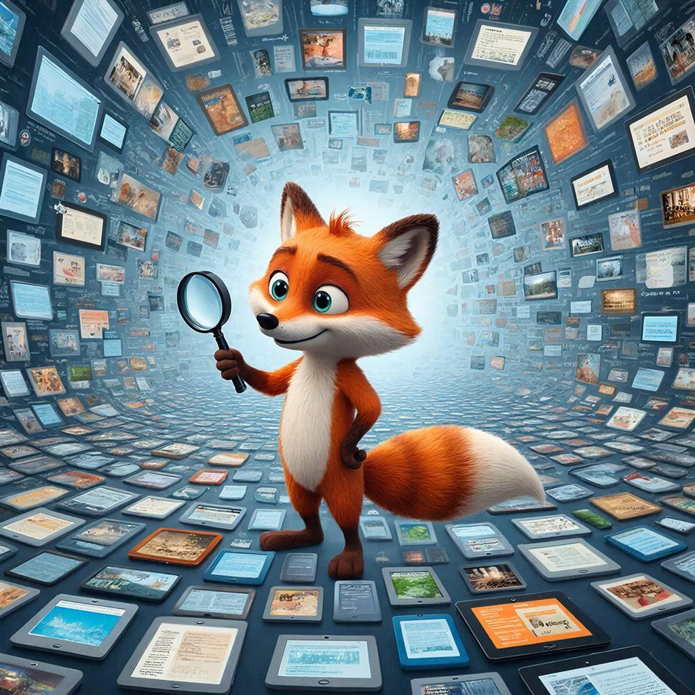

# [Поиск информации](../../../1.2_natural_sciences/neurobiology_for_teens/articles/19_curiosity.md)

> **Главная мысль:** Поиск информации — это умение находить именно то, что тебе нужно, среди огромного количества текстов, картинок и сайтов.

## Содержание
- [Что такое поиск информации?](#что-такое-поиск-информации)
- [Зачем нужен поиск информации?](#зачем-нужен-поиск-информации)
- [Как искать информацию?](#как-искать-информацию)
- [Пример из жизни](#пример-из-жизни)
- [Типичные ошибки](#типичные-ошибки)
- [Как искать лучше?](#как-искать-лучше)
- [Вывод](#вывод)
- [Что почитать дальше](#что-почитать-дальше)

Поиск информации помогает учиться, узнавать новое, делать проекты и находить ответы на важные [вопросы](../../../4.1_rules_of_study/how_to_learn_effectively/articles/curiosity.md). Это очень полезный [навык](../../../5.1_technology_and_digital_literacy/information and media literacy/карта_компетенций_по_возрастам.md), потому что в интернете есть не только правильные сведения, но и [ошибки](../../../3.1_healthy_lifestyle/pervaya_pomoshch/ushibi_porezy_ozhogi/07_ushib_chego_nelzya.md), реклама и выдумки.

---

## Что такое поиск информации?

**Поиск информации** — это когда [человек](../../../1.2_natural_sciences/physics_in_everyday_life/Q45003.md) старается найти [ответ](../../../5.1_technology_and_digital_literacy/how_internet_works/articles/http_https/http_https.md) на свой вопрос в книгах, энциклопедиях, на сайтах или в поисковых системах.

Но хороший [поиск](../../../3.2 healthy lifestyle/how to act in a dangerous situation/articles/lost-in-city.md) — это не просто нажать на первую ссылку. Нужно:
- понять, что именно ты хочешь узнать;
- подобрать правильные слова для поиска;
- открыть подходящие [источники](three_whales.md);
- сравнить ответы;
- проверить, где написана правда.

Иначе можно быстро найти что-то красивое, но неверное.

---

## Зачем нужен поиск информации?

Этот навык нужен очень часто. Например, когда ты:
- готовишь [сообщение](../../../3.2 healthy lifestyle/how to act in a dangerous situation/articles/phishing-links.md) или доклад;
- ищешь [правило](../../../1.2_natural_sciences/why_science_help_understand_world/patterns.md) по русскому языку или математике;
- хочешь узнать что-то о животных, космосе или истории;
- ищешь инструкцию, как что-то сделать своими руками;
- проверяешь, правда ли то, что прочитал в интернете.

Если человек умеет [искать информацию](../../../../4.2/how_to_search_information/articles/information_search.md), он:
- быстрее находит ответы;
- лучше понимает тему;
- реже попадается на обман;
- учится думать [внимательно](../../../4.1_rules_of_study/how_to_memorize/articles/vnimanie.md) и самостоятельно.

---

## Как искать информацию?

Чтобы поиск был полезным, удобно действовать по шагам.

### 1. Понять свой вопрос
Сначала нужно ясно решить, что именно ты ищешь.  
Например, не просто **«пингвины»**, а **«чем питаются императорские пингвины»**.

### 2. Подобрать хорошие слова
Слова, которые ты вводишь в поиск, называются **поисковым запросом**.  
Чем точнее [запрос](../../../5.1_technology_and_digital_literacy/how_internet_works/articles/http_https/http_https.md), тем лучше [результат](../../../1.2_natural_sciences/why_science_help_understand_world/experimental_science.md).

Например:
- не очень точно: **пингвины**
- точнее: **императорские пингвины где живут**
- ещё точнее: **чем питаются императорские пингвины в Антарктиде**

### 3. Выбрать подходящий [источник](../../../5.1_technology_and_digital_literacy/information and media literacy/дезинформация_и_фейки.md)
Искать можно в разных местах:
- в поисковой системе;
- в электронной энциклопедии;
- на сайте музея, библиотеки, университета или зоопарка;
- в учебной книге.

Обычно надёжнее те источники, которые созданы специалистами.

### 4. Сравнить несколько ответов
Не стоит сразу верить первой найденной странице. Лучше посмотреть 2–3 источника.  
Если они говорят примерно одно и то же, информации можно доверять больше.

### 5. Проверить, можно ли верить источнику
Полезно спросить себя:
- Кто написал этот [текст](../../../4.1_rules_of_study/how_to_learn_effectively/articles/reading_skills.md)?
- Это сайт специалистов или просто чьё-то [мнение](../../critical_thinking/articles/fact_and_opinion_differences.md)?
- Есть ли там точные [факты](../../../1.2_natural_sciences/physics_in_everyday_life/Q17737.md), даты, названия?
- Не выглядит ли страница как реклама или ловушка для кликов?

---

## Пример из жизни

Представь, что тебе нужно подготовить небольшой рассказ про императорских пингвинов.

Если написать в поиске просто **«пингвины»**, можно получить слишком много лишнего: картинки, смешные [видео](../../../5.1_technology_and_digital_literacy/information and media literacy/оценка_качества_изображений_и_видео.md) или даже [страницы](../../../5.1_technology_and_digital_literacy/operating system/articles/memory_management.md) не о животных.

А если написать точнее — **«императорские пингвины где живут и чем питаются»** — найти ответ будет намного легче.

Потом можно открыть, например, сайт зоопарка, энциклопедию и ещё один надёжный источник. Если сведения совпадают, значит ты движешься правильно.

---

## [Типичные ошибки](../../../6.1_Independent_living_and_daily_living_skills/Simple_and_safe_cooking/articles/safe_use_of_kitchen_appliances.md)

Вот ошибки, которые мешают хорошо искать информацию:

- **Верить первой ссылке.** Первый результат не всегда самый полезный и самый правдивый.
- **Считать красивый сайт правильным.** Красивое [оформление](../../../8.2_future/choosing_a_career_path/articles/designer.md) ещё не означает, что текст верный.
- **Искать слишком широко.** Если запрос слишком короткий и общий, ответов будет слишком много.
- **Не проверять информацию.** Один источник может ошибаться.
- **Путать [факт](../../../1.2_natural_sciences/why_science_help_understand_world/science.md) и мнение.** Иногда человек пишет не точные сведения, а только своё впечатление.

---

## Как искать лучше?

Вот несколько простых правил:

- Формулируй вопрос как можно точнее.
- Используй важные ключевые слова.
- Смотри не один, а несколько источников.
- Больше доверяй энциклопедиям, учебным материалам, сайтам музеев, библиотек и научных организаций.
- Если что-то кажется странным, проверь ещё раз.

---

## [Вывод](../../../1.2_natural_sciences/why_science_help_understand_world/scientific_method.md)

**Поиск информации** — это важное умение, которое помогает находить знания, понимать мир и отличать правду от ошибки.

Чем лучше человек умеет искать информацию, тем легче ему учиться, делать проекты и принимать разумные решения. Можно сказать, что хороший поиск — это настоящая суперсила современного человека. С таким навыком ты идёшь по интернету не как растерянная черепаха в лабиринте ссылок, а как спокойный [исследователь](../../../1.2_natural_sciences/why_science_help_understand_world/experiment.md), который знает, куда и зачем движется.

## Что почитать дальше

- [Поисковые операторы](search_operations.md)
- [Три кита надёжности](three_whales.md)
- [Первоисточник](original_source.md)
- [Научный подход](science.md)

---

[Автор](copypaste.md): Владислав Резник

[Ресурсы](../../../2.1_society/cause_and_effect_relationships/articles/ecological_footprint.md): [LLM](../../../7.1_art/modern_technological_art/README.md) - [ChatGPT](../../../7.1_art/modern_technological_art/articles/6.1_prompt_art.md) 5.4
