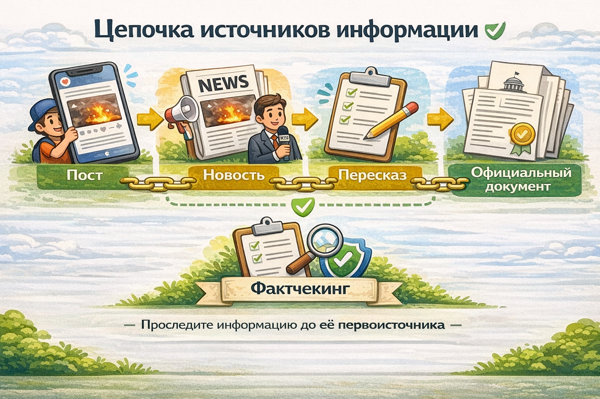

# [Первоисточник](../../../../4.2/how_to_search_information/articles/original_source.md)

> **Главная мысль:** Первоисточник — это самое первое место, где появилась [информация](../../../5.1_technology_and_digital_literacy/information and media literacy/как_устроена_современная_информационная_среда.md): [новость](../../../5.1_technology_and_digital_literacy/information and media literacy/информационная_диета.md), фотография, [видео](../../../5.1_technology_and_digital_literacy/information and media literacy/оценка_качества_изображений_и_видео.md), документ или рассказ очевидца.

Если хочешь понять, что произошло на самом деле, полезно искать именно первоисточник. Тогда ты видишь не [чужой](../../../3.2 healthy lifestyle/how to act in a dangerous situation/articles/stranger-safety.md) [пересказ](../../../5.1_technology_and_digital_literacy/information%20and%20media%20literacy/articles/первоисточник_и_пересказ.md), а самую первую версию информации.

---

## Содержание
- [Что такое первоисточник?](#что-такое-первоисточник)
- [Зачем нужен первоисточник?](#зачем-нужен-первоисточник)
- [Как искать первоисточник?](#как-искать-первоисточник)
- [Пример из жизни](#пример-из-жизни)
- [Типичные ошибки](#типичные-ошибки)
- [Как искать лучше?](#как-искать-лучше)
- [Вывод](#вывод)
- [Что почитать дальше](#что-почитать-дальше)

## Что такое первоисточник?

**Первоисточник — это самый первый [источник](../../../5.1_technology_and_digital_literacy/information and media literacy/дезинформация_и_фейки.md) сведений.**

Им может быть:
- официальный документ;
- [научная статья](science.md);
- [сообщение](../../../3.2 healthy lifestyle/how to act in a dangerous situation/articles/phishing-links.md) на сайте организации;
- фотография или видео, снятые очевидцем;
- рассказ человека, который сам видел [событие](../../../2.1_society/cause_and_effect_relationships/articles/causality_base.md).

Например, если сайт пишет: «Учёные сделали новое [открытие](../../../1.2_natural_sciences/physics_in_everyday_life/Q560.md)», то [первоисточником](../../../../4.2/how_to_search_information/articles/original_source.md) будет не этот сайт, а сама научная статья, сообщение лаборатории или официальный сайт исследовательского центра.

---

## Зачем нужен первоисточник?

Когда информацию много раз пересказывают, она может измениться.  
Кто-то случайно ошибётся, кто-то что-то сократит, а кто-то добавит лишнее ради интереса.

Поэтому [поиск](../../../3.2 healthy lifestyle/how to act in a dangerous situation/articles/lost-in-city.md) [первоисточника](../../../../4.2/how_to_search_information/articles/original_source.md) помогает:
- узнать, что было сказано сначала;
- проверить, не исказили ли новость;
- отличить [факт](../../../1.2_natural_sciences/why_science_help_understand_world/science.md) от слуха;
- лучше понять тему.

Это особенно важно, когда речь идёт о новостях, открытиях, правилах, законах или важных событиях.

---

## Как искать первоисточник?

Искать первоисточник можно по шагам.

### 1. Найди, откуда взялась новость
Если статья или видео рассказывают о каком-то событии, попробуй понять, на что они ссылаются.

Часто можно увидеть такие слова:
- **по данным...**
- **как сообщает...**
- **источник...**
- **согласно исследованию...**

Такие подсказки помогают выйти на исходный [материал](../../../1.2_natural_sciences/physics_in_everyday_life/Q25358.md).

### 2. Перейди по ссылкам
Во многих статьях есть [ссылка](copypaste.md) на документ, [исследование](../../../1.2_natural_sciences/neurobiology_for_teens/articles/19_curiosity.md), официальный сайт или заявление.  
Лучше перейти туда, чем читать только [пересказ](../../../1.2_natural_sciences/neurobiology_for_teens/articles/28_false_memories.md).

### 3. Проверь дату
Полезно посмотреть, где информация появилась раньше.  
Иногда старый материал и есть первоисточник, а всё остальное — более поздние копии или пересказы.

### 4. Ищи официальный источник
Если речь идёт о школе, законе, космосе, погоде или медицине, особенно важно найти официальный источник:
- сайт школы;
- сайт министерства;
- сайт музея;
- сайт научной организации;
- официальный документ.

### 5. Сравни первоисточник и пересказ
Иногда пересказ сильно упрощает [текст](../../../4.1_rules_of_study/how_to_learn_effectively/articles/reading_skills.md).  
Если сравнить его с оригиналом, можно заметить, что часть смысла потерялась или изменилась.

---

## Пример из жизни

Представь, что кто-то говорит:

**«Со следующего года в школах отменят домашние задания!»**

Ты можешь увидеть такую новость в ролике, посте или короткой заметке. Но это ещё не значит, что всё правда.

Чтобы проверить информацию, нужно найти первоисточник:
- официальный сайт Министерства образования;
- текст нового документа;
- заявление ответственных людей.

Очень может быть, что в настоящем документе сказано совсем не то, что в коротком ролике.

---

## [Типичные ошибки](../../../6.1_Independent_living_and_daily_living_skills/Simple_and_safe_cooking/articles/safe_use_of_kitchen_appliances.md)

Вот [ошибки](../../../3.1_healthy_lifestyle/pervaya_pomoshch/ushibi_porezy_ozhogi/07_ushib_chego_nelzya.md), которые часто мешают правильно искать первоисточник:

- **Верить пересказу.** Даже популярный блогер может пересказать новость неточно.
- **Считать копии доказательством.** Если одну и ту же ошибку перепечатали многие сайты, она не становится правдой.
- **Не смотреть на источник.** Иногда люди читают текст, но не замечают, откуда взялась информация.
- **Не проверять дату.** Более поздняя статья может быть только пересказом старого материала.
- **Путать [мнение](../../critical_thinking/articles/fact_and_opinion_differences.md) и факт.** [Человек](../../../1.2_natural_sciences/physics_in_everyday_life/Q45003.md) может не сообщать новость, а просто высказывать своё отношение к ней.

---

## Как искать лучше?

Чтобы легче находить первоисточник, полезно [помнить](../../../4.1_rules_of_study/how_to_memorize/articles/pamyat.md) простые [правила](../../../2.1_society/cause_and_effect_relationships/articles/why_rules_work.md):

- Ищи, кто сообщил информацию первым.
- Переходи по ссылкам в статье.
- Смотри на дату публикации.
- Больше доверяй официальным сайтам, документам и научным материалам.
- Если новость кажется слишком громкой или странной, проверь её особенно [внимательно](../../../4.1_rules_of_study/how_to_memorize/articles/vnimanie.md).

---

## [Вывод](../../../1.2_natural_sciences/why_science_help_understand_world/scientific_method.md)

**Первоисточник** — это самое первое место, где появилась информация.

Если ты умеешь находить первоисточник, то можешь лучше понимать, что правда, а что только пересказ, слух или [ошибка](../../../5.1_technology_and_digital_literacy/how_internet_works/articles/http_https/http_https.md). Это помогает думать внимательнее, не верить всему подряд и находить действительно надёжные сведения. Иначе будешь ходить кругами, как черепаха вокруг одного и того же куста, читая пересказы пересказов и так и не добираясь до сути.

## Что почитать дальше

- [Википедия](wikipedia.md)
- [Фейковые новости](fake_news.md)
- [Три кита надёжности](three_whales.md)
- [Научный подход](science.md)

---

[Автор](copypaste.md): Владислав Резник

[Ресурсы](../../../2.1_society/cause_and_effect_relationships/articles/ecological_footprint.md): [LLM](../../../7.1_art/modern_technological_art/README.md) - [ChatGPT](../../../7.1_art/modern_technological_art/articles/6.1_prompt_art.md) 5.4
