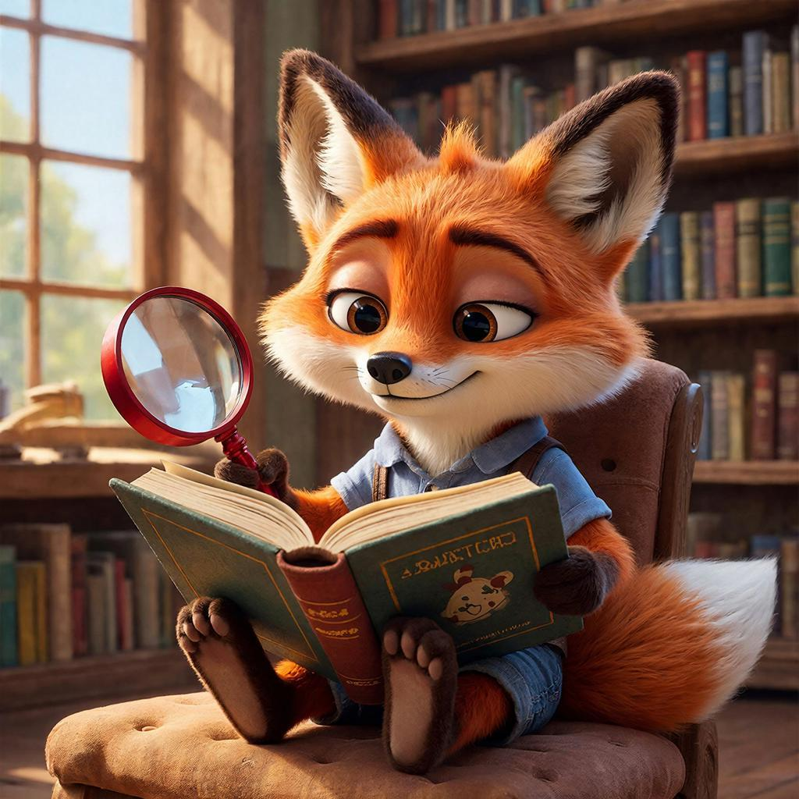

# Как читать длинные тексты и не засыпать: [Техники](../../../8.2_future_and_path_choice/articles/03_stress_management.md) сканирования и углубленного чтения

## Содержание
- [Как это работает в реальном мире](#как-это-работает-в-реальном-мире)
- [Примеры из жизни](#примеры-из-жизни)
- [Интересные факты](#интересные-факты)
- [Главный секрет](#главный-секрет)
- [Что почитать дальше](#что-почитать-дальше)

Представь, что ты — [исследователь](../../../1.2_natural_sciences/why_science_help_understand_world/experiment.md) джунглей. Перед тобой густой [лес](../../../1.2_natural_sciences/why_science_help_understand_world/nature.md) из букв, слов и предложений. Можно прорубаться через каждую лиану (это будет долго и утомительно), а можно научиться двумя разными способами: либо быстро скользить взглядом по верхушкам деревьев, чтобы понять, где спрятаны сокровища, либо уже [внимательно](../../../4.1_rules_of_study/how_to_memorize/articles/vnimanie.md) изучить самую интересную поляну. В мире чтения эти два способа называются **сканирование (skim-чтение)** и **углублённое [чтение](../../../4.1_rules_of_study/how_to_learn_effectively/articles/reading_skills.md)**. Первый помогает быстро найти нужное, второй — понять сложное и [запомнить](../../../4.1_rules_of_study/how_to_memorize/articles/zapominanie.md) важное.

---

## Как это работает в реальном мире

Твой [мозг](../../../3.1. healthy lifestyle/Sleep, nutrition, and adolescent energy/articles/breakfast_for_the_brain.md) — удивительный [орган](../../../7.1_art/musical_instruments/articles/organ.md). Он умеет работать как беспилотник (быстрый обзор местности) и как [лупа](../../../1.2_natural_sciences/physics_in_everyday_life/Q467980.md) (детальное [изучение](../../../1.2_natural_sciences/why_science_help_understand_world/science.md)). Когда ты используешь **ски́мминг** (от англ. *to skim* — «скользить по поверхности»), ты не читаешь каждое слово. Ты пробегаешь глазами по заголовкам, выделенным словам, первым предложениям абзацев и картинкам. Это как листать ленту в соцсетях, но с пользой: ты ищешь только ключевые точки.

А **углублённое чтение** — это [режим](../../../4.1_rules_of_study/how_to_learn_effectively/articles/breaks_and_rest.md) «детектива». Ты читаешь медленно, вдумчиво, можешь перечитывать сложные места, представлять картинки и даже спорить с автором. Именно так мы читаем любимые [книги](../../../7.2 Media, leisure and hobbies /useful_and_interesting_leisure/articles/reading_and_self_education.md) или параграфы перед важной контрольной.

---

## Примеры из жизни

Вот как эти техники работают в твоей обычной жизни:

1.  **[Поиск](../../../3.2 healthy lifestyle/how to act in a dangerous situation/articles/lost-in-city.md) ответа на вопрос.** Учитель спросил: «В каком году родился Александр Пушкин?». Тебе не нужно читать всю главу про поэта. Ты используешь **ски́мминг**: быстро водишь глазами по тексту в поиске цифр «1799» или слов «родился». Нашёл — миссия выполнена!

2.  Подготовка к докладу. Тебе нужно сделать доклад про Титаник. Сначала ты сканируешь три разные статьи, чтобы найти самые крутые [факты](../../../1.2_natural_sciences/physics_in_everyday_life/Q17737.md) (размеры, почему затонул, сколько было пассажиров). А потом, когда нашел лучший [текст](../../../4.1_rules_of_study/how_to_learn_effectively/articles/reading_skills.md), ты переключаешься на углублённое чтение, чтобы ничего не перепутать в датах и событиях и рассказать всё интересно.

3.  Скучный, но важный параграф по истории. [Глаза](../../../7.2 Media, leisure and hobbies/Computer games/articles/useful_tips/eyes_and_back.md) слипаются, а текст всё не кончается? Разбей его на части. Первые 10 минут читай вдумчиво (прямо как детектив, ищи причины войн и следствия побед). Почувствовал, что [устал](../../../4.1_rules_of_study/how_to_memorize/articles/ustalost.md)? Сделай паузу. Потом просто просканируй то, что уже прочел, водя пальцем по строчкам, чтобы освежить [память](../../../how_to_memorize/articles/pamyat.md).

---

## Интересные факты

- Рекордсмены скорочтения используют улучшенную версию ски́мминга и могут «проглатывать» до 1000 слов в минуту! Это как съесть пиццу целиком за один укус. (Обычно мы читаем со скоростью [200](../../../5.1_technology_and_digital_literacy/how_internet_works/articles/http_https/http_https.md)–300 слов в минуту).

- Твои глаза на самом деле двигаются по строке не плавно, а рывками. Они делают паузу (фиксацию), чтобы «сфотографировать» кусочек текста, а потом прыгают дальше. Тренируясь в ски́мминге, ты учишься делать эти «фотографии» крупнее и быстрее.

- Углублённое чтение полезно не только для учёбы. Когда ты вдумчиво читаешь художественную книгу, твой мозг проживает события вместе с героями. Это развивает **эмпатию** — умение понимать [чувства других людей](../../../1.2_natural_sciences/neurobiology_for_teens/articles/15_empathy.md).

---

## Главный секрет

Никто не читает учебник по математике так же, как детектив, а [список](../../../5.2_cybersecurity/cpp_fundamentals/10_arrays.md) продуктов в магазине — как стихи. Умение переключаться между режимами **ски́мминг** и **углублённое чтение** — вот что делает чтение лёгким и полезным.

Попробуй уже сегодня: возьми любую статью, сначала быстро пролети по ней глазами (30 секунд), а потом перечитай самый интересный кусочек медленно и со вкусом. Ты удивишься, как много можно узнать и как легко при этом не заснуть. Хороший читатель не мечется по странице, как хомяк, который потерял семечко, а понимает, когда надо быстро осмотреться, а когда спокойно вчитаться.

## Что почитать дальше

- [Википедия](wikipedia.md)
- [Внешняя память](second_mind.md)
- [Поиск информации](information_search.md)
- [Научный подход](science.md)

---

[Автор](copypaste.md): Ерофеева Александра;  
[Ресурсы](../../../2.1_society/cause_and_effect_relationships/articles/ecological_footprint.md): [LLM](../../../7.1_art/modern_technological_art/README.md) - DeepSeek
