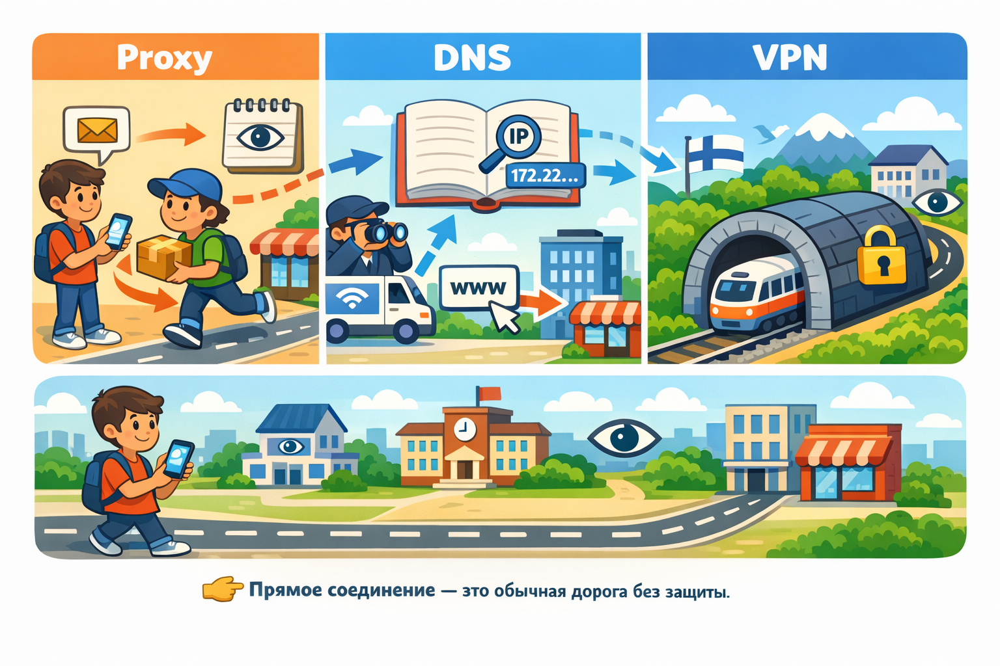

# VPN, DNS, Proxy: Анонимность и [безопасность](../../../1.2_natural_sciences/neurobiology_for_teens/articles/17_hugs_oxytocin.md) 🔒

- [VPN, DNS, Proxy: Твой секретный проход в интернет 🔒](#vpn-dns-proxy-твой-секретный-проход-в-интернет-)
- [Как это работает: простыми словами про сложные технологии 🧠](#как-это-работает-простыми-словами-про-сложные-технологии-)
- [Где и когда мы сталкиваемся с этим в жизни? Реальные примеры 🌍](#где-и-когда-мы-сталкиваемся-с-этим-в-жизни-реальные-примеры-)
- [Чем это может быть полезно? Твои выгоды 🎁](#чем-это-может-быть-полезно-твои-выгоды-)
- [Практический совет: как освоить эту технологию и выбрать инструмент 🛠️](#практический-совет-как-освоить-эту-технологию-и-выбрать-инструмент-️)
- [Заключение 🎯](#заключение-)
- [Что почитать дальше 📚](#что-почитать-дальше-)

---

## VPN, DNS, Proxy: Твой секретный проход в [интернет](../../../1.2_natural_sciences/physics_in_everyday_life/Q26540.md) 🔒

Задумывался ли ты, [что происходит](../../../5.1_technology_and_digital_literacy/how_internet_works/articles/web_basics/what_happens.md), когда ты вводишь [адрес сайта](../../../5.1_technology_and_digital_literacy/how_internet_works/articles/web_basics/what_happens.md) в браузере? Кажется, всё просто: нажал Enter — и ты на нужной странице. Но между твоим телефоном и сайтом стоит целый невидимый коридор, через который проходит каждый твой клик, каждый [запрос](../../../5.1_technology_and_digital_literacy/how_internet_works/articles/http_https/http_https.md), каждое [сообщение](../../../3.2 healthy lifestyle/how to act in a dangerous situation/articles/phishing-links.md). И этот коридор не всегда защищён. Знаешь ли ты, что твоя [школа](../../../3.1. healthy lifestyle/Sleep, nutrition, and adolescent energy/articles/healthy_school_snacks.md), интернет-провайдер или даже хитрый рекламный сетевой бот могут подглядывать в этот коридор, записывая, что ты смотришь, что ищешь и с кем общаешься? Это не просто паранойя. Отсутствие навыков [приватного](../../../5.1_technology_and_digital_literacy/information%20and%20media%20literacy/articles/приватность_и_цифровой_след.md) и безопасного поиска в современном мире — это как ходить по городу с прозрачным рюкзаком, где все видят твои ноутбук, учебники и личные [записи](../../../4.1_rules_of_study/how_to_learn_effectively/articles/note_taking.md). Эта статья — твой путеводитель по тёмным коридорам интернета. Мы разберём, что такое VPN, DNS и Proxy, как они работают, и главное — как использовать их, чтобы [искать информацию](../../../../4.2/how_to_search_information/articles/information_search.md) выгодно, безопасно. Это не для хакеров. Это — твой базовый [навык](../../../5.1_technology_and_digital_literacy/information and media literacy/карта_компетенций_по_возрастам.md) цифрового выживания.

## Как это работает: простыми словами про сложные [технологии](../../../2.2_history/world_economy_on_fingers/articles/globalizatsiya.md) 🧠

Представь интернет как гигантскую, постоянно меняющуюся карту города. Ты — пешеход (твой телефон или компьютер), а сайты — это дома и магазины, куда ты хочешь попасть. Прямой [путь](../../../1.2_natural_sciences/physics_in_everyday_life/Q11476.md), по которому идёт твой [трафик](../../../5.1_technology_and_digital_literacy/how_internet_works/articles/dns/cdn.md) (запросы), называется **прямым соединением**. Его видят все: интернет-провайдер, который выдает тебе [сеть](../../../5.1_technology_and_digital_literacy/how_internet_works/articles/history/internet_history.md), администрация школы или кафе, где ты сидишь, и даже правительство некоторых стран. Они видят не только _куда_ ты пошёл, но и _что_ ты там делал.

**Proxy (Прокси-сервер)** — это как попросить своего друга, который живёт в другом районе, сходить за тобой в магазин. Ты говоришь другу: «Купи мне шоколадку из магазина на Главной». Друг (прокси) бежит в тот магазин, покупает шоколадку и приносит тебе. Магазин видит только друга, а не тебя. Ты остаёшься в тени. Но друг может записать, что он купил для тебя, и рассказать об этом кому-то ещё. Прокси скрывает твой _IP-адрес_ ([цифровой](../../../7.1_art/musical_instruments/articles/synthesizer.md) «[адрес](../../../5.1_technology_and_digital_literacy/how_internet_works/articles/ip_mac/ip_and_mac.md) дома» в интернете), но не шифрует твой трафик. Это быстрый, но не самый надёжный способ обхода блокировок, например, для доступа к заблокированному в школе [видео](../../../5.1_technology_and_digital_literacy/information and media literacy/оценка_качества_изображений_и_видео.md).

**DNS ([Система доменных имён](../../../5.1_technology_and_digital_literacy/how_internet_works/articles/dns/dns.md))** — это «телефонная книга» интернета. Вместо того чтобы [запоминать](../../../4.1_rules_of_study/how_to_memorize/articles/zapominanie.md) цифровые IP-адреса вроде `172.217.16.206` для Google, мы вводим простые `google.com`. DNS-сервер (который обычно предоставляет твой [провайдер](../../../5.1_technology_and_digital_literacy/how_internet_works/articles/history/internet_at_home.md)) преобразует это «имя» в «номер». Провайдер видит, _какие_ имена ты запрашиваешь. Если ты заходишь на `vk.com` или `tiktok.com`, он это знает. **Безопасный DNS** (например, от [Cloudflare](../../../5.1_technology_and_digital_literacy/how_internet_works/articles/dns/cdn.md) или Google) — это как пользоваться общественной, независимой телефонной книгой, которая не записывает, какие номера ты спрашивал, и не продаёт эту информацию рекламным сетям.

**VPN ([Виртуальная частная сеть](../../../5.2_cybersecurity/passwords_cyber_safety/articles/vpn.md))** — это самый мощный инструмент. Представь, что ты создаёшь **зашифрованный, невидимый туннель** между твоим телефоном и сервером VPN-провайдера где-то в другой стране (скажем, в Финляндии или Японии). Весь твой трафик (все запросы, [сообщения](../../../5.1_technology_and_digital_literacy/operating system/articles/IPC.md), видео) упаковывается в непроницаемый «[контейнер](../../../5.2_cybersecurity/cpp_fundamentals/15_stl.md)» и летит через этот туннель. Никакой провайдер, ни администрация школы, ни [мошенники](../../../3.2 healthy lifestyle/how to act in a dangerous situation/articles/phishing-links.md) не могут заглянуть внутрь и увидеть, что там. Для внешнего мира (для сайтов, которые ты посещаешь) кажется, что запросы идут именно с сервера VPN в Финляндии. Ты не просто скрываешь [IP](../../../5.1_technology_and_digital_literacy/how_internet_works/articles/ip_mac/ip_and_mac.md), ты скрываешь _всю свою активность_. Это как сесть в поезд в твоём городе, который сразу въезжает в тёмный, закрытый тоннель и выезжает на [свет](../../../1.2_natural_sciences/physics_in_everyday_life/Q1.md) уже в другой стране. Поезд (твой трафик) защищён от всех на пути.

## Где и когда мы сталкиваемся с этим в жизни? Реальные примеры 🌍

1.  **Школа и публичный [Wi-Fi](../../../5.1_technology_and_digital_literacy/how_internet_works/articles/history/internet_at_home.md).** Заблокировали в школьной сети TikTok или форумы с мемами? Это делается через блокировку по DNS или IP. Прокси или VPN помогут обойти эту блокировку, но помни: в школе могут отслеживать использование таких сервисов. Более того, [открытый Wi-Fi](../../../5.1_technology_and_digital_literacy/how_internet_works/articles/wifi/security.md) в кафе или на остановке — золотая жила для злоумышленников. Они могут перехватить твои [данные](../../../2.1_society/cause_and_effect_relationships/articles/ai_causality.md) (логины, пароли), если [соединение](../../../5.1_technology_and_digital_literacy/how_internet_works/articles/tcp_udp/tcp_udp.md) не защищено. VPN в такой ситуации — как бронежилет для твоего ноутбука.
2.  **Реклама, которая преследует тебя.** Ты искал про новые кроссовки, а потом везде в соцсетях и на сайтах тебе показывают именно их? Это потому, что твой провайдер или сайты (через DNS-запросы) передают эту информацию рекламным сетям. Безопасный DNS и VPN разрывают эту цепочку «[поиск](../../../3.2 healthy lifestyle/how to act in a dangerous situation/articles/lost-in-city.md) → [профиль](../../../5.1_technology_and_digital_literacy/information and media literacy/цифровая_репутация.md) → реклама». Ты снова можешь искать про скетч-буки или [косплей](../../../2.1_society/how_and_where_find_friends/articles/fandom.md), не получая навязчивые предложения купить кроссовки.
3.  **Доступ к иностранному контенту.** Некоторые YouTube-видео, стримы на Twitch или [музыка](../../../1.2_natural_sciences/neurobiology_for_teens/articles/18_music_chills.md) в Spotify доступны только в определённых странах. VPN позволяет «притвориться», что ты находишься в этой стране, и получить доступ. Это легально для многих сервисов, но проверяй [правила](../../../2.1_society/cause_and_effect_relationships/articles/why_rules_work.md) использования.
4.  **Безопасность в путешествии.** Ты в другом городе или стране и подключился к гостевому Wi-Fi в отеле. Ты не знаешь, кто управляет этой сетью. VPN здесь обязателен, чтобы защитить переписку в мессенджерах, банковские [приложения](../../../4.1_rules_of_study/how_to_learn_effectively/articles/digital_tools.md) и пароли от потенциальных «прослушивателей».
5.  **Обход цензуры.** В некоторых странах блокируют целые платформы: Instagram, Telegram, определённые новостные сайты. Для жителей этих стран VPN — это не [удобство](../../../6.1_Independent_living_and_daily_living_skills/reasonable_spending/articles/quality.md), а [необходимость](../../../6.1_Independent_living_and_daily_living_skills/reasonable_spending/articles/need.md) для связи с миром и получения несцензурированной информации.

## Чем это может быть полезно? Твои выгоды 🎁

- **[Конфиденциальность](../../../5.1_technology_and_digital_literacy/information and media literacy/приватность_и_цифровой_след.md).** Твои поисковые запросы, посещаемые сайты, активность в играх — это твоя цифровая биография. Эти [инструменты](../../../1.2_natural_sciences/physics_in_everyday_life/Q36253.md) помогают не отдавать её на растерзание кому попало.
- **Безопасность.** [Защита](../../../5.1_technology_and_digital_literacy/how_internet_works/articles/dns/cdn.md) от кражи данных на публичных сетях и от слежки.
- **Свобода доступа.** [Кругозор](../../../7.2 Media, leisure and hobbies /useful_and_interesting_leisure/articles/reading_and_self_education.md) шире. Ты можешь изучать иностранные учебники, смотреть документальные [фильмы](../../../7.2 Media, leisure and hobbies /what_you_can_read_and_watch_to_develop_your_taste/articles/z1.md), недоступные в твоём регионе, слушать музыку со всего мира.
- **Анти-трекинг.** Рекламные сети и [соцсети](../../../2.1_society/how_and_where_find_friends/articles/tcifrovaya_druzhba.md) гораздо сложнее построить твой подробный профиль, если твой трафик зашифрован и идёт с удалённого сервера. Меньше навязчивой рекламы, больше спокойствия.
- **Спец.поиск по нишевым темам.** Иногда для глубокого исследования (например, по узкоспециальному [хобби](../../../2.1_society/how_and_where_find_friends/articles/neochevidnye_mesta_dlya_znakomstva.md) или научной теме) полезно искать с «иностранным» IP, чтобы увидеть [результаты](../../../1.2_natural_sciences/why_science_help_understand_world/research_work.md), которые показываются только пользователям из других стран. Это твой [профессиональный рост](../../../../8.1_self_understanding/articles/professional_growth.md) в будущем.

## Практический совет: как освоить эту технологию и выбрать инструмент 🛠️

Не нужно быть IT-гиком. [Алгоритм действий](../../../1.2_natural_sciences/physics_in_everyday_life/Q161635.md) прост:

1.  **Осознай [цель](../../../1.2_natural_sciences/why_science_help_understand_world/research_work.md).** Зачем тебе это? Обойти школьную блокировку? Защититься в кафе? Смотреть иностранный [стрим](../../../../8.1_entertainment/articles/esports.md)? От [цели](../../../3.1_healthy_lifestyle/pervaya_pomoshch/ushibi_porezy_ozhogi/02_celi_pervoy_pomoshchi.md) зависит [выбор](../../../2.1_society/cause_and_effect_relationships/articles/personal_choice.md) инструмента. Для максимальной безопасности — VPN. Для быстрого обхода одной блокировки — может хватить прокси или смены DNS. Но помни, цель не должна противоречить закону.
2.  **Выбирай проверенных провайдеров.**
    - **Для VPN:** Избегай бесплатных VPN-сервисов! Часто они сами продают твой трафик, показывают свою рекламу или имеют сомнительную политику. Лучшие [варианты](../../../6.1_Independent_living_and_daily_living_skills/reasonable_spending/articles/comparison.md) для подростков — это платные, но недорогие [сервисы](../../../4.1_rules_of_study/how_to_learn_effectively/articles/digital_tools.md) с чёткой политикой «no logs» (не хранят журналы твоей активности). Ищи отзывы на независимых сайтах. Популярные и уважаемые имена: Mullvad, ProtonVPN, IVPN. У них простые приложения для телефона и компьютера.
    - **Для DNS:** Просто зайди в настройки своей Wi-Fi-сети на телефоне или компьютере и вручную укажи адреса безопасных DNS, например: `1.1.1.1` (Cloudflare) или `8.8.8.8` (Google). Это бесплатно и не требует установки программ.
    - **Для прокси:** Используй с осторожностью. Публичные прокси-списки часто небезопасны. Для разовых задач можно использовать встроенные в браузеры расширения от проверенных компаний, но они редко шифруют трафик.
3.  **Установи и протестируй.** Скачай приложение выбранного VPN. Зарегистрируйся (часто требуется только email). Подключись к серверу в ближайшей стране для скорости. Проверь, что твой [IP-адрес](../../../5.1_technology_and_digital_literacy/how_internet_works/articles/ip_mac/ip_and_mac.md) изменился (вбей в поиск «мой ip»). Попробуй зайти на сайт, который раньше был заблокирован.
4.  **Помни о «слабых звеньях».**
    - **VPN не анонимизирует всё.** Если ты входишь в свой [аккаунт](../../../5.1_technology_and_digital_literacy/information and media literacy/информационная_безопасность_для_детей.md) ВКонтакте или Google, эти сервисы всё равно знают, что это ты. Анонимность не равна анонимности твоих аккаунтов.
    - **Не забывай про [браузер](../../../5.1_technology_and_digital_literacy/how_internet_works/articles/http_https/http_https.md).** Используй [режим](../../../4.1_rules_of_study/how_to_learn_effectively/articles/breaks_and_rest.md) инкогнито для локальной истории на устройстве, но он не скрывает твой трафик от провайдера. Для настоящей приватности нужен приватный браузер (вроде Brave) или хотя бы расширения для блокировки трекеров (uBlock [Origin](../../../5.1_technology_and_digital_literacy/how_internet_works/articles/dns/cdn.md), Privacy Badger).
    - **Мобильные приложения.** Многие приложения обходят системные настройки VPN или DNS. Проверяй, защищён ли трафик конкретного приложения (игры, мессенджеры). Некоторые VPN имеют функцию «килл-свитч» (kill [switch](../../../5.2_cybersecurity/cpp_fundamentals/6_control_flow.md)), которая полностью блокирует интернет, если VPN-соединение рвётся, чтобы случайно не отправить незашифрованный запрос.

## [Заключение](../../../1.2_natural_sciences/physics_in_everyday_life/Q2225.md) 🎯

[Понимание](../../../2.1_society/cause_and_effect_relationships/articles/empathy_causality.md) VPN, DNS и Proxy — это не про [взлом](../../../5.1_technology_and_digital_literacy/how_internet_works/articles/wifi/security.md) и уход от закона. Это про осознанное управление своей цифровой тенью. Это базовый навык, аналогичный умению проверять [источники](three_whales.md) информации или настраивать конфиденциальность в соцсетях. Ты не должен быть экспертом, но ты должен знать, что такие инструменты существуют, как они работают и когда их применять. Они дают тебе **выбор**: быть видимым или невидимым, когда это нужно для твоей безопасности, исследований или просто для спокойствия. Используй этот навык, чтобы твой цифровой попугай — тот, что повторяет за тобой все твои [шаги](../../../7.2 Media, leisure and hobbies/Computer games/articles/dream_team/composer.md) в интернете, создавая твой профиль, — говорил только то, что ты сам разрешил ему говорить, и чтобы ты всегда мог найти ту информацию, которая действительно важна для тебя, а не ту, которую тебе навязывают! 🦜

## Что почитать дальше 📚

- [Цифровой след](digital_footprint.md)
- [Социальные сети и интернет](social_networks.md)
- [Пузырь фильтров](buble_filter.md)
- [Поиск информации](information_search.md)

---

Авторы: Кулешов Дмитрий
GitHub: @[https](../../../5.1_technology_and_digital_literacy/how_internet_works/articles/http_https/http_https.md)://github.com/dmitriikuleshov
_Использованы: OpenRouter (stepfun/step-3.5-flash:free), Wikidata, DeepSeek_
