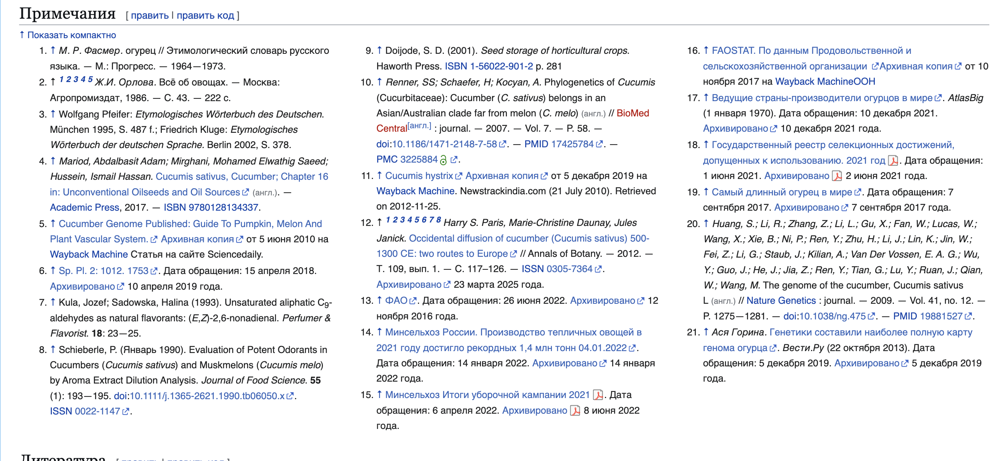

# Википедия: доверять или проверять? Как правильно пользоваться свободной энциклопедией и зачем смотреть в раздел «[Источники](three_whales.md)»

## Содержание
- [Почему Википедия одновременно полезна и опасна?](#почему-википедия-одновременно-полезна-и-опасна)
- [Как правильно использовать Википедию?](#как-правильно-использовать-википедию)
- [Самое важное место в статье — это не текст](#самое-важное-место-в-статье--это-не-текст)
- [Как быстро понять, можно ли доверять статье?](#как-быстро-понять-можно-ли-доверять-статье)
- [Почему важно проверять, а не просто читать?](#почему-важно-проверять-а-не-просто-читать)
- [Какие ошибки делают почти все?](#какие-ошибки-делают-почти-все)
- [Как использовать Википедию правильно (идеальная схема)](#как-использовать-википедию-правильно-идеальная-схема)
- [Итог: доверять или проверять?](#итог-доверять-или-проверять)
- [Что почитать дальше](#что-почитать-дальше)

Представь знакомую ситуацию: тебе задали доклад, ты открываешь [браузер](../../../5.1_technology_and_digital_literacy/how_internet_works/articles/http_https/http_https.md), вводишь тему — и первой ссылкой почти всегда оказывается Википедия. Ты переходишь, быстро находишь нужный раздел, копируешь пару абзацев… и кажется, что задача почти решена.

Но вот вопрос: можно ли этому тексту доверять? Или Википедия — это просто “кто-то что-то написал”?

[Ответ](../../../5.1_technology_and_digital_literacy/how_internet_works/articles/http_https/http_https.md) не такой простой, как кажется. Википедия — это мощный инструмент, но только если ты умеешь пользоваться им правильно. И сейчас разберёмся, как это делать.

---

## Почему Википедия одновременно полезна и опасна?

Есть популярный миф: “Википедия ненадёжна, потому что её может редактировать любой”. Это правда — но только наполовину.

Да, статьи действительно могут редактировать пользователи со всего мира. Но за этим стоит целая система:
- правки проверяются другими участниками,
- есть модераторы,
- спорные места обсуждаются,
- источники требуют подтверждения.

Поэтому Википедия — это не [хаос](../../../1.2_natural_sciences/physics_in_everyday_life/Q45003.md), а скорее огромная [коллективная работа](cooperative_work.md).

Но есть нюанс.

Проблема в [том](../../../7.1_art/musical_instruments/articles/drums.md), что:
- статьи могут обновляться с разной скоростью,
- [ошибки](../../../3.1_healthy_lifestyle/pervaya_pomoshch/ushibi_porezy_ozhogi/07_ushib_chego_nelzya.md) иногда остаются незамеченными,
- авторы могут интерпретировать [факты](../../../1.2_natural_sciences/physics_in_everyday_life/Q17737.md) по-разному.

В итоге Википедия — это не “истина в последней инстанции”, а **удобная отправная точка**.

---

## Как правильно использовать Википедию?

Самая частая [ошибка](../../../5.1_technology_and_digital_literacy/how_internet_works/articles/http_https/http_https.md) — воспринимать статью как готовый ответ.

Правильный подход другой:
Википедия — это не конечная точка, а [карта](../../../5.1_technology_and_digital_literacy/information and media literacy/карта_компетенций_по_возрастам.md), которая показывает, куда идти дальше.

Когда ты открываешь статью, используй её для:
- быстрого понимания темы,
- [знакомства](../../../2.1_society/how_and_where_find_friends/articles/druzhba_i_hobby.md) с основными терминами,
- поиска направлений для дальнейшего изучения.

Например, если ты читаешь про Французскую революцию, ты:
1. Понимаешь, что это за [событие](../../../2.1_society/cause_and_effect_relationships/articles/causality_base.md).
2. Видишь ключевые даты и фигуры.
3. Замечаешь термины, которые можно изучить глубже.

Но сам [текст](../../../4.1_rules_of_study/how_to_learn_effectively/articles/reading_skills.md) — это только первый слой.

---

## Самое важное место в статье — это не текст

Многие читают только основной текст и закрывают страницу. И зря.

Самая ценная часть статьи — это раздел **[«Источники»](../../../5.1_technology_and_digital_literacy/information%20and%20media%20literacy/articles/как_правильно_оформлять_ссылки_и_источники.md)** (или «Ссылки», «Примечания», «Литература»).

Почему?

Потому что именно там:
- указано, **откуда взята [информация](../../../5.1_technology_and_digital_literacy/information and media literacy/как_устроена_современная_информационная_среда.md)**,
- можно проверить, **насколько [источник](../../../5.1_technology_and_digital_literacy/information and media literacy/дезинформация_и_фейки.md) надёжный**,
- можно найти **более подробные [материалы](../../../1.2_natural_sciences/physics_in_everyday_life/Q487005.md)**.

Проще говоря:
> текст — это [пересказ](../../../5.1_technology_and_digital_literacy/information%20and%20media%20literacy/articles/первоисточник_и_пересказ.md),  
> источники — это [доказательства](../../critical_thinking/articles/fact_and_opinion_differences.md).

Если в статье нет источников — это тревожный [сигнал](../../../5.1_technology_and_digital_literacy/how_internet_works/articles/wifi/router.md).

---

## Как быстро понять, можно ли доверять статье?

Есть простой чек-лист, который работает почти всегда:

### 1. Посмотри на источники
- Есть ли ссылки вообще?
- Это [книги](../../../7.2 Media, leisure and hobbies /useful_and_interesting_leisure/articles/reading_and_self_education.md), научные статьи, официальные сайты — или непонятные блоги?

### 2. Обрати [внимание](../../../1.2_natural_sciences/neurobiology_for_teens/articles/16_love_chemistry.md) на пометки
Иногда в Википедии прямо пишут:
- “нужен источник”
- “информация может быть неточной”

Это значит, что даже сама Википедия сомневается в этом месте.

### 3. Проверь дату
Некоторые статьи обновляются редко.  
Если тема связана с современностью — это критично.

### 4. Сравни с другими источниками
Открой ещё 1–2 сайта:
- совпадают ли факты?
- нет ли противоречий?

Если информация совпадает — [доверие](../../../1.2_natural_sciences/neurobiology_for_teens/articles/17_hugs_oxytocin.md) выше.

---

## Почему важно проверять, а не просто читать?

Есть важный момент, который отличает сильного ученика от обычного.

Обычный ученик:
> нашёл — скопировал — сдал

Сильный ученик:
> нашёл — проверил — понял — объяснил своими словами

Когда ты проверяешь информацию:
- ты лучше понимаешь тему,
- замечаешь ошибки,
- учишься мыслить критически.

Это называется **[медиаграмотность](../../../5.1_technology_and_digital_literacy/information%20and%20media%20literacy/articles/что_такое_информационная_и_медиаграмотность.md)** — умение работать с информацией, а не просто потреблять её.

И это [навык](../../../5.1_technology_and_digital_literacy/information and media literacy/карта_компетенций_по_возрастам.md), который нужен не только в школе.

---

## Какие ошибки делают почти все?

### Ошибка 1: копировать текст из Википедии
Это видно сразу:
- [стиль](../../../7.1_art/modern_technological_art/articles/5.5_yandex_neural.md) слишком “энциклопедический”,
- сложные формулировки,
- нет понимания темы.

### Ошибка 2: не смотреть источники
В итоге ты доверяешь пересказу, а не фактам.

### Ошибка 3: использовать одну статью как единственный источник
Это как слушать только одного свидетеля.

### Ошибка 4: игнорировать спорные темы
В темах вроде истории или политики могут быть разные точки зрения.

---

## Как использовать Википедию правильно (идеальная схема)

Вот простой [алгоритм](../../../2.1_society/cause_and_effect_relationships/articles/ai_causality.md), который реально работает:

1. Открой статью и быстро прочитай её.
2. Выпиши ключевые факты и понятия.
3. Пролистай вниз к разделу «Источники».
4. Открой 1–2 ссылки оттуда.
5. Сравни информацию.
6. Напиши текст своими словами.

Это занимает чуть больше времени,  
но [результат](../../../1.2_natural_sciences/why_science_help_understand_world/experimental_science.md) будет в разы лучше.

---

## Итог: доверять или проверять?

Правильный ответ — **и то, и другое**.

Википедии можно доверять:
- чтобы быстро разобраться в теме,
- чтобы найти структуру и основные [идеи](../../../7.2 Media, leisure and hobbies /useful_and_interesting_leisure/articles/free_leisure_activities.md).

Но её обязательно нужно проверять:
- через источники,
- через другие сайты,
- через здравый смысл.

Если коротко:
> Википедия — это не учебник,
> а [проводник](../../../1.2_natural_sciences/physics_in_everyday_life/Q11408.md) в мире информации.

Используй её как любопытного кролика-разведчика: он первым ныряет в нору, но окончательное [решение](../../../2.1_society/cause_and_effect_relationships/articles/personal_choice.md) всё равно принимаешь ты, когда проверяешь источники.

## Что почитать дальше

- [Первоисточник](original_source.md)
- [Три кита надёжности](three_whales.md)
- [Копипаст — это зло?](copypaste.md)
- [Научный подход](science.md)

---

**[Автор](copypaste.md): Бурдинский Владислав**  
**[Ресурсы](../../../2.1_society/cause_and_effect_relationships/articles/ecological_footprint.md): [LLM](../../../7.1_art/modern_technological_art/README.md) - [ChatGPT](../../../7.1_art/modern_technological_art/articles/6.1_prompt_art.md) 5.3 + Deep Research**
