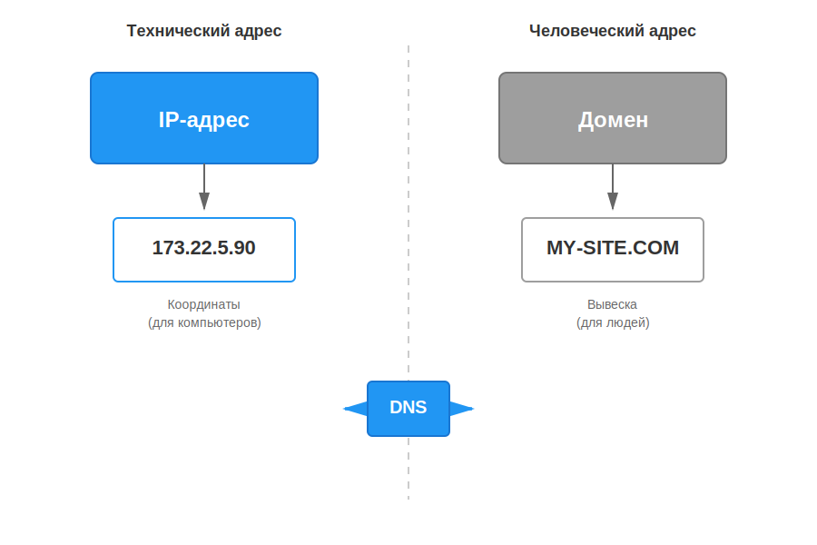

# Домены: как занять своё место в интернете

В прошлой статье мы узнали, что [**DNS**](dns.md) — это телефонная книга, которая связывает имена сайтов с их IP-адресами. Но как эти имена появляются? Кто решает,  что `google.com` принадлежит Google, и можно ли тебе завести себе [адрес](../ip_mac/ip_and_mac.md) вроде `super-vanya.pro`?

**Домен** (или [доменное имя](dns.md)) — это уникальный «адрес» твоего сайта в интернете. Купить домен — значит арендовать это имя у глобальной системы, чтобы никто другой не мог его использовать.

Представь, что [интернет](../../../../1.2_natural_sciences/physics_in_everyday_life/Q26540.md) — это огромный [город](../../../../3.2 healthy lifestyle/how to act in a dangerous situation/articles/lost-in-city.md). [**IP-адрес**](../ip_mac/ip_and_mac.md) — это [координаты](../../../../1.2_natural_sciences/physics_in_everyday_life/Q847073.md) дома на карте, а **домен** — это красивая табличка на дверях с твоим именем.

---

## Из чего состоит домен?

Как мы уже знаем, домены строятся по иерархии (как матрёшка). Давай посмотрим на них с точки зрения владельца.

| [Уровень](../../../../../8.1_entertainment/articles/gamification.md) | Как называется | Кто распоряжается |
|---------|----------------|-------------------|
| **.ru / .com** | Первый уровень (TLD) | Государства или крупные организации ([ICANN](dns.md)) |
| **mysite**.ru | Второй уровень | **Ты!** Именно это имя ты придумываешь и покупаешь |
| **blog**.mysite.ru | Третий уровень | **Тоже ты!** Купив второй уровень, ты можешь создавать сколько угодно поддоменов бесплатно |

### Какие бывают зоны (TLD)?
Зоны (окончания доменов) делятся на две большие группы:
1.  **Географические:** указывают на страну. `.ru` (Россия), `.us` (США), `.kz` ([Казахстан](../../../../2.2_society/history/articles/history_of_Central_Asia.md)), `.me` (Черногория).
2.  **Тематические:** указывают на [тип](../../../../5.2_cybersecurity/cpp_fundamentals/13_struct.md) сайта. `.com` (коммерция), `.org` (организации), `.edu` (образование), `.info` ([информация](../../../information and media literacy/как_устроена_современная_информационная_среда.md)).
3.  **Новые ([New](../../../../5.2_cybersecurity/cpp_fundamentals/14_dynamic_memory.md) gTLD):** для красоты и оригинальности. `.pizza`, `.ninja`, `.shoppping`, `.agency`.

---

## Как купить домен: [пошаговая](../../../../7.2 Media, leisure and hobbies/Computer games/articles/genres_and_worlds/strategy.md) инструкция

На самом деле домен [нельзя](../../../../3.1_healthy_lifestyle/pervaya_pomoshch/ushibi_porezy_ozhogi/07_ushib_chego_nelzya.md) купить «навсегда» — его можно только **арендовать**. Обычно аренда оплачивается на 1 год, после чего её нужно продлевать.

### [Шаг](../../../../1.2_natural_sciences/physics_in_everyday_life/Q36253.md) 1: [Выбор](../../../../2.1_society/cause_and_effect_relationships/articles/personal_choice.md) Регистратора
**Регистратор** — это магазин-посредник, у которого есть [лицензия](../../../../4.2_thinking_and_working_information/how_to_search_information/articles/copyright.md) на продажу имен в определенных зонах. Популярные в России: Reg.ru, Nic.ru (Ru-Center), Beget.

### Шаг 2: [Проверка](../../../../1.2_natural_sciences/why_science_help_understand_world/scientific_method.md) на занятость
Ты вводишь желаемое имя в строку поиска на сайте регистратора. Если имя `vanya.ru` уже занято кем-то другим, купить его не получится (разве что перекупить у владельца за огромные [деньги](../../../../2.1_society/cause_and_effect_relationships/articles/economic_chains.md)).

### Шаг 3: [Оплата](../../../../6.1_Independent_living_and_daily_living_skills/reasonable_spending/articles/expense.md) и [данные](../../../../2.1_society/cause_and_effect_relationships/articles/ai_causality.md)
Для регистрации домена в зоне `.ru` по закону нужны паспортные данные. Это делается для того, чтобы было понятно, кто несет [ответственность](../../../../2.1_society/cause_and_effect_relationships/articles/responsibility.md) за содержание сайта. 

### Шаг 4: Настройка (связка с хостингом)
После покупки домен нужно «направить» на [сервер](../http_https/http_https.md), где лежат файлы твоего сайта. Это делается через **NS-записи** (Name Server) в личном кабинете регистратора. Ты просто говоришь домену: «Твой [IP-адрес](../ip_mac/ip_and_mac.md) нужно спрашивать вот у этого сервера».

---

## Сколько это стоит?

[Цена](../../../../6.1_Independent_living_and_daily_living_skills/reasonable_spending/articles/price.md) зависит от «престижности» зоны и жадности регистратора.

* **.ru / .рф**: от [200](../http_https/http_https.md) до 1000 рублей в год.
* **.com / .net**: обычно дороже, от $10 до $20 (в рублях — около 1000–2000 руб.).
* **Красивые зоны (.art, .pro)**: могут стоить как [500](../http_https/http_https.md) рублей, так и несколько тысяч.

> **Важно:** Часто регистраторы предлагают первый год за 100 рублей, но продление на второй год будет стоить уже 1000. Всегда читай мелкий шрифт!

---

## Как выбрать крутое имя? (Чек-лист)

Выбор домена — это как выбор названия для группы или бренда. Вот пара советов:

1.  **Коротко — это круто.** `ya.ru` лучше, чем `moy-samy-luchshiy-poiskovik.ru`.
2.  **Легко написать на слух.** Если ты диктуешь адрес другу по телефону, он не должен переспрашивать «S как [доллар](../../../../2.2_history/world_economy_on_fingers/articles/dollar_ssha.md) или [C](../../../../2.1_society/how_and_where_find_friends/articles/sora_drug.md) как русская С?».
3.  **Избегай тире и цифр**, если в них нет смысла. Они только путают людей.
4.  **Соответствуй зоне.** Если твой [проект](../../../../1.2_natural_sciences/why_science_help_understand_world/research_work.md) для русскоязычных ребят — бери `.ru`. Если делаешь международный стартап — `.com`.

---

## Что такое WHOIS?

**WHOIS** — это публичный [протокол](../http_https/http_https.md), который позволяет узнать, кому принадлежит домен. Если ты вобьешь любой адрес в сервис WHOIS, ты увидишь:
* Кто регистратор.
* Когда домен был куплен и когда он «протухнет» (освободится).
* Иногда — контакты владельца (хотя сейчас их часто скрывают ради приватности).

---

## Интересные [факты](../../../../1.2_natural_sciences/physics_in_everyday_life/Q17737.md)

- **Самый дорогой домен в истории** — `business.com`. В 2007 году его перепродали за **345 миллионов долларов**.
- **Первый зарегистрированный домен** — `symbolics.com`. Это случилось 15 марта 1985 года. Он работает до сих пор!
- **Домены из трех букв** в популярных зонах (`.com`, `.ru`) давно закончились. Все комбинации типа `abc.com` или `xyz.ru` уже кем-то заняты.
- **Опечатки приносят деньги.** Существует «тайпсквоттинг» — люди регистрируют домены с ошибками, например `gogle.com`, чтобы ловить [трафик](cdn.md) тех, кто промахнулся по клавишам.

---

## Читай также

- [Что такое DNS и как работают сервера имен](dns.md) — как именно [браузер](../http_https/http_https.md) находит сайт по этому имени
- [Что такое хостинг](../hosting/README.md) — где живут файлы сайта, к которым привязан домен
- [IP-адреса: IPv4 и IPv6](../ip_mac/ip_and_mac.md) — цифровые координаты интернета
- [Как работает CDN](cdn.md) — как сделать так, чтобы сайт открывался быстро из любой точки мира

---

Авторы: Сетраков Фёдор
*[Ресурсы](../../../../2.1_society/cause_and_effect_relationships/articles/ecological_footprint.md): [LLM](../../../../7.1_art/modern_technological_art/README.md) — Claude Sonnet 4.5*
