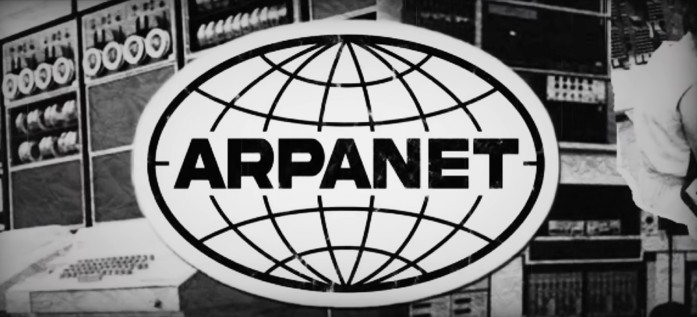
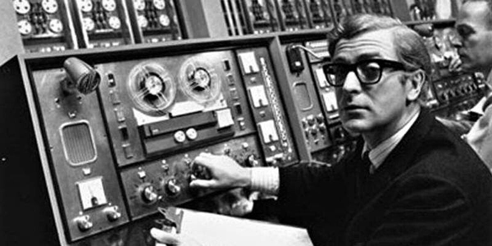
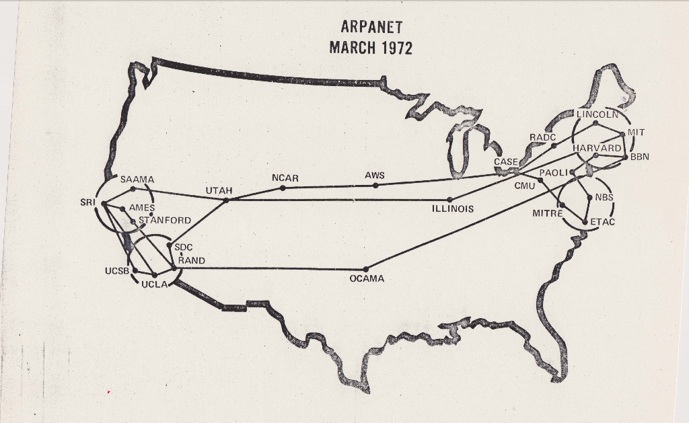

# [ARPANET](internet_history.md): первая [сеть](internet_history.md)

В **1969 году** в США родилась сеть, которая изменила мир. Её назвали **ARPANET** — по имени организации ARPA (Advanced Research Projects Agency, Управление перспективных исследовательских проектов), которая финансировала передовые исследования для министерства обороны США.

> 🕸️ **Первая в истории сеть**, где компьютеры в разных городах могли обмениваться данными по проводам в реальном времени.

---

## Зачем нужна была такая сеть?

В 1960-е годы шла **[холодная война](../../../../2.2_history/world_economy_on_fingers/articles/plan_marshalla.md)** между США и [СССР](../../../../2.2_society/history/articles/USSR.md). Военные думали: что будет, если противник уничтожит центр связи? Обычная телефонная сеть имела «главный узел» — выведи его из строя, и [связь](../../../../1.2_natural_sciences/physics_in_everyday_life/Q12969754.md) оборвётся. Нужна была сеть **без единого центра**: как паутина, где каждая нить связана с несколькими другими.

Компьютеры не «разговаривали» друг с другом — нужна была сеть для обмена данными. Учёные возили [данные](../../../../2.1_society/cause_and_effect_relationships/articles/ai_causality.md) на магнитных лентах — хотелось передавать по проводам, быстрее и удобнее. Военные хотели сеть, которая не сломается — без центра, чтобы уничтожь один узел, остальные работали. Дорогие компьютеры стояли каждый в своём углу — хотелось общего доступа: один компьютер может «одолжить» [мощность](../../../../1.2_natural_sciences/physics_in_everyday_life/Q25236.md) другому.

> 💡 **[Аналогия](../../../../1.2_natural_sciences/physics_in_everyday_life/Q46344.md):** представь паутину. Если порвать одну нить, остальные всё равно держатся. ARPANET строилась по такому же принципу — **распределённая сеть**.

Идею «межгалактической компьютерной сети» высказал в 1962 году **Джозеф Ликлайдер** — [психолог](../../../../../8.1_self_understanding/articles/when_to_seek_help.md) и [учёный](../../../../1.2_natural_sciences/why_science_help_understand_world/science.md), который верил, что компьютеры должны помогать людям думать вместе. Его ученики и [коллеги](../../../../../8.1_self_understanding/articles/social_comparison.md) воплотили эту мечту в [жизнь](../../../../1.2_natural_sciences/physics_in_everyday_life/Q1751973.md).

---

## Кто создавал ARPANET

- **Джозеф Ликлайдер** — выдвинул идею «межгалактической сети» в 1962 году
- **Лоуренс Робертс** — главный архитектор ARPANET, спроектировал структуру сети
- **Боб Тейлор** — руководитель проекта в ARPA, инициировал создание сети
- **Винт Серф и Боб Кан** — создали [протокол](../http_https/http_https.md) [TCP/IP](internet_history.md) ([1970-е](../../../../7.1_art/modern_technological_art/articles/1.3_participatory_art.md)) — основу современного интернета
- **Чарли Клайн, Билл Дюваль** — студенты, которые провели первый сеанс связи

---

## Первые четыре узла

**29 октября 1969 года**, 22:30 по местному времени — историческое [событие](../../../../2.1_society/cause_and_effect_relationships/articles/causality_base.md). [Студент](../../../../8.2_future/choosing_a_career_path/articles/university.md) **Чарли Клайн** в UCLA ([Лос-Анджелес](../../../../7.1_art/modern_technological_art/articles/1.1_hole_in_space.md)) сел за терминал и попытался отправить слово **LOGIN** на компьютер в Стэнфордском исследовательском институте (SRI), за [500](../http_https/http_https.md) километров. На другом конце его ждал [программист](../../../../8.2_future/choosing_a_career_path/articles/programmer.md) **Билл Дюваль**.

Связь оборвалась после двух букв — **LO**. Система «упала» при вводе буквы G. Через час попробовали снова — и на этот раз **LOGIN** прошло полностью. Компьютеры «поздоровались»! 🎉

**Четыре узла ARPANET:**
1. Лос-Анджелес — UCLA (сентябрь 1969)
2. Менло-Парк, около Сан-Франциско — SRI (октябрь 1969)
3. Санта-Барбара — UCSB (ноябрь 1969)
4. Солт-Лейк-Сити — [Университет](../../../../8.2_future/choosing_a_career_path/articles/university.md) Юты (декабрь 1969)

Между узлами стояли специальные машины — **IMP** (Interface Message Processor). Это были мини-компьютеры размером с [холодильник](../../../../6.1_Independent_living_and_daily_living_skills/Simple_and_safe_cooking/articles/safe_product_storage.md), которые принимали [пакеты данных](../../../operating system/articles/file_system.md) и пересылали их дальше. По сути, IMP — это **первые в мире маршрутизаторы**. Каждый весил около 400 кг и стоил 80 000 долларов.

---

## Пакетная передача: главная идея

До ARPANET данные передавали **целиком** по одному каналу: занял линию — и веди передачу до конца. Если линия оборвётся — всё потеряно. Учёные **Пол Бэран** и **Дональд Дэвис** независимо придумали другую схему: **пакетную передачу**.

[Сообщение](../../../../3.2 healthy lifestyle/how to act in a dangerous situation/articles/phishing-links.md) разбивают на маленькие «пакеты». Каждый [пакет](../tcp_udp/tcp_udp.md) может идти своим путём. [Потерялся](../../../../3.2 healthy lifestyle/how to act in a dangerous situation/articles/lost-in-city.md) пакет — можно запросить повторно. Несколько «разговоров» идут одновременно по одной сети. Если один канал занят — пакеты пойдут в обход по другим маршрутам.

> 📮 **Аналогия:** как отправить длинное письмо, разрезав на открытки. Каждая открытка — пакет. Даже если одна потеряется, остальные дойдут.

Размер пакета в ARPANET был около **1 КБ** (1024 бита) — совсем немного по сегодняшним меркам, но тогда этого хватало для текстовых сообщений.

---

## Что умела ARPANET в первые годы

- **1969** — удалённый вход на другой компьютер (Telnet)
- **1971** — передача файлов (FTP)
- **1971** — электронная почта (email), придумал Рэй Томлинсон
- **1971** — символ @ в адресе email, Томлинсон выбрал @ как разделитель

**Email** стал главным «убийственным приложением» ARPANET. К 1973 году три четверти трафика сети составляла именно почта. Люди полюбили писать друг другу [сообщения](../../../operating system/articles/IPC.md) — и это изменило способ общения учёных навсегда.

---

## [Рост](../../../../3.1. healthy lifestyle/Sleep, nutrition, and adolescent energy/articles/micronutrients_and_teenagers.md) сети и [появление](../../../../1.2_natural_sciences/physics_in_everyday_life/Q5339.md) интернета

- **1969** — 4 узла. Рождение ARPANET.
- **1971** — 15 узлов. Подключились MIT, Гарвард, RAND и др.
- **[1972](../../../../7.2 Media, leisure and hobbies/Computer games/articles/how_it_all_started/tennis_on_tv.md)** — 23 узла. Первая публичная демонстрация ARPANET на конференции.
- **1973** — 35+ узлов. Подключились Великобритания (University College London) и Норвегия (NORSAR) — ARPANET стала международной.
- **1974** — слово «[интернет](../../../../1.2_natural_sciences/physics_in_everyday_life/Q26540.md)» (inter + net = «между сетями») — для соединения разных сетей.
- **1981** — 213 узлов. Переход на протокол [TCP/IP](../tcp_udp/tcp_udp.md) — «[правила](../../../../2.1_society/cause_and_effect_relationships/articles/why_rules_work.md) дорожного движения», которые используются до сих пор.
- **1983** — ARPANET полностью перешла на TCP/IP. 1 января — «день рождения» интернета в современном смысле.
- **1990** — ARPANET официально «выключили» — её заменила гораздо большая сеть.

К концу 1980-х появились другие сети (NSFNET, коммерческие сети). Они объединились в единую «сеть сетей» — то, что мы называем интернетом. ARPANET выполнила свою миссию и уступила место новому миру.

---

## Интересные [факты](../../../../1.2_natural_sciences/physics_in_everyday_life/Q17737.md)

📧 **Первый [спам](../../../../5.2_cybersecurity/passwords_cyber_safety/articles/spam.md)** — 1978 год. Гэри Тюрк разослал рекламу нового компьютера DEC по 400 адресам в ARPANET. Возмущение было огромным!

**@ ([собака](../../../../3.2 healthy lifestyle/how to act in a dangerous situation/articles/dog-bite-first-aid.md))** — Рэй Томлинсон выбрал @ в 1971 году. Этот символ редко встречался в именах и не путал компьютер.

**Первое сообщение** — «LO». Можно считать, что компьютер хотел сказать «Привет!» (от LOGIN).

**Слово «интернет»** появилось в 1974 году в документе Винта Серфа и Боба Кана о протоколе [TCP](../tcp_udp/tcp_udp.md).

---

## Читай также

- [История интернета](internet_history.md) — обзор всего пути
- [Как интернет пришёл в каждый дом](internet_at_home.md) — что было после ARPANET
- [IP и MAC-адреса](../ip_mac/ip_and_mac.md) — система адресов в сети
- [TCP и UDP](../tcp_udp/tcp_udp.md) — протоколы, рождённые в эпоху ARPANET

---

[Автор](../../../../4.2_thinking_and_working_information/how_to_search_information/articles/copypaste.md): Гула Дмитрий  
*[Ресурсы](../../../../2.1_society/cause_and_effect_relationships/articles/ecological_footprint.md): [LLM](../../../../7.1_art/modern_technological_art/README.md) — Claude Sonnet 4.6*
