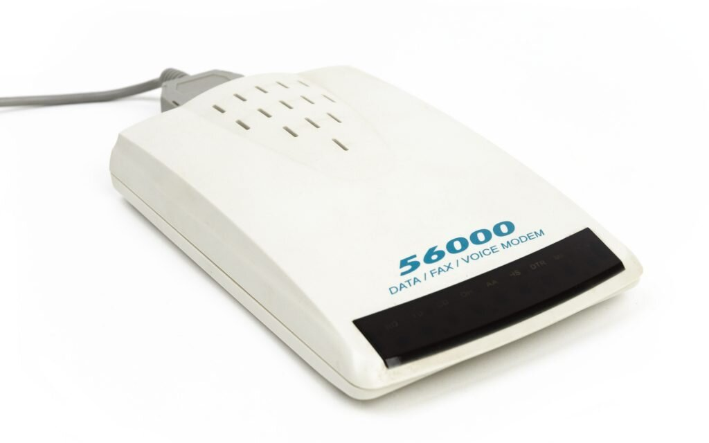

# Как [интернет](../../../../1.2_natural_sciences/physics_in_everyday_life/Q26540.md) пришёл в каждый дом

Тогда, в 1969 году, интернет был только у учёных в лабораториях. Теперь — миллионы людей дома, в гостиных, кафе, в кармане. Текстовый терминал сменился картинками, [видео](../../../information and media literacy/оценка_качества_изображений_и_видео.md), голосом, играми. Как же интернет «переехал» из лабораторий в наши дома и карманы? Рассказываем по шагам.

---

## Модемы: первый [мост](../../../operating system/articles/HAL.md) в дом

**Модем** (модулятор-демодулятор) — [устройство](../../../../1.2_natural_sciences/physics_in_everyday_life/Q178032.md), которое превращало цифровые сигналы компьютера в звуки (тоны), которые можно передать по обычному телефонному кабелю. И наоборот: принимал звуки и превращал их обратно в цифры.

Ты набирал номер провайдера. Телефон звонил, модем «отвечал» — раздавался писк, шипение, треск. 10–30 секунд характерных звуков — каждый знал эту «песню». [Связь](../../../../1.2_natural_sciences/physics_in_everyday_life/Q12969754.md) установлена — ты в сети. Но телефон занят! Позвонить домой [нельзя](../../../../3.1_healthy_lifestyle/pervaya_pomoshch/ushibi_porezy_ozhogi/07_ushib_chego_nelzya.md). Загружаешь страницу — одна картинка загружалась минутами.

> 📞 **Помнишь?** Пока ты в интернете, телефон был занят. [Родители](../../../../../8.1_self_understanding/articles/family_influence.md) не могли позвонить домой. Многие семьи заводили вторую линию — одну для телефона, одну для интернета.

**Скорости модемов:** в 1960-е — 300 [бит](../../../../7.2 Media, leisure and hobbies/Computer games/articles/technologies_inside/smart_processor.md)/с, только [текст](../../../../4.1_rules_of_study/how_to_learn_effectively/articles/reading_skills.md). В 1980-е — 1200–2400 бит/с, текст и простые BBS. В начале 1990-х — 14,4 Кбит/с, первые веб-страницы, но долго. В конце 1990-х — 56 Кбит/с, картинки загружаются, но всё ещё медленно. Сегодня домашний интернет — 100–1000 Мбит/с. В тысячи раз быстрее!

---

## BBS и первые онлайн-сообщества

До Всемирной паутины были **BBS** (Bulletin Board System — доска объявлений). Компьютер с модемом, на который можно было позвонить и оставить [сообщения](../../../operating system/articles/IPC.md), скачать файлы, пообщаться в чате.

Ты звонил по телефону на номер BBS. Один BBS — один модем. Если кто-то уже на линии — занято, жди. Только текст, файлы, простые игры. Никаких картинок — только символы. Владелец платил за телефон, но часто доступ был бесплатный. Правда, по вечерам — очередь.

BBS были популярны в 1980–1990-х. Тысячи таких «досок» по всему миру — прообраз форумов и соцсетей.

---

## Провайдеры: «продавцы» интернета

**Провайдер** (Internet Service Provider, ISP) — компания, которая даёт тебе доступ в интернет. Она владеет каналами связи, серверами и «входом» в мировую [сеть](internet_history.md). Ты набираешь номер (или подключаешь кабель), платишь абонентскую плату — и получаешь доступ.

В начале 1990-х провайдеров было мало, в основном в США. Дорого, почасовая [оплата](../../../../6.1_Independent_living_and_daily_living_skills/reasonable_spending/articles/expense.md). В середине 1990-х появились в России и других странах — помесячно, но всё ещё дорого. В 2000-х — много провайдеров, конкуренция, цены упали, безлимит стал нормой.

> 📈 Сначала интернет был роскошью. Постепенно провайдеров стало больше, появился безлимитный доступ — и интернет превратился в обычную коммунальную услугу, как [электричество](../../../../1.2_natural_sciences/physics_in_everyday_life/Q11408.md).

---

## CompuServe, AOL и первые «порталы»

До того как все вышли в «настоящий» интернет, были **коммерческие онлайн-сервисы**: CompuServe (с 1969 года!), Prodigy, America Online (AOL). Они предлагали свою «вселенную»: почта, чаты, новости, файлы — но в закрытой среде.

**CompuServe** — один из старейших, форумы, техническая [поддержка](../../../../1.2_natural_sciences/neurobiology_for_teens/articles/17_hugs_oxytocin.md). **AOL** — «диски с интернетом» в журналах и почтовых ящиках, знаменитое «You've got mail!». **Prodigy** — упор на новости и покупки.

AOL в 1990-х раздавал бесплатные диски с программой — так миллионы людей впервые попали «в интернет». Правда, многие годами оставались внутри экосистемы AOL и не знали, что за её пределами — целый мир.

---

## Браузеры: окно в мир

Долгое [время](../../../../1.2_natural_sciences/physics_in_everyday_life/Q20702.md) интернет был **текстовым**. Чтобы открыть страницу, нужно было вводить команды. Всё изменилось в **[1993](../../../../7.1_art/modern_technological_art/articles/2.6_cac.md) году**, когда появился [браузер](../http_https/http_https.md) **Mosaic**.

До Mosaic — только текст, сложные команды (FTP, Gopher), только специалисты, серые [страницы](../../../operating system/articles/memory_management.md). После Mosaic — картинки и текст на одной странице, кликаешь по ссылкам мышкой, любой мог разобраться, [цвет](../../../../1.2_natural_sciences/physics_in_everyday_life/Q1075.md) и [удобство](../../../../6.1_Independent_living_and_daily_living_skills/reasonable_spending/articles/quality.md).

**[Эволюция](../../../../1.2_natural_sciences/neurobiology_for_teens/articles/10_sweet_tooth.md) браузеров:**
- **Mosaic** (1993) — картинки на странице, кликабельные ссылки
- **Netscape Navigator** (1994) — популярнейший браузер 1990-х
- **Internet Explorer** ([1995](../../../../7.1_art/modern_technological_art/articles/2.5_siberian_deal.md)) — встроен в [Windows](../../../operating system/articles/operating_system.md), «война браузеров» с Netscape
- **[Firefox](../web_basics/browser.md)** (2004) — открытый [код](../../../../5.2_cybersecurity/cpp_fundamentals/1_introduction.md), альтернатива IE
- **Chrome** (2008) — [скорость](../../../../1.2_natural_sciences/physics_in_everyday_life/Q11402.md), простота, сегодня самый популярный

> 🌐 Браузеры превратили интернет из инструмента учёных в место для всех: новости, магазины, [общение](../../../../2.1_society/how_and_where_find_friends/articles/guide_dlya_introvertov.md), [развлечения](../../../../6.1_Independent_living_and_daily_living_skills/reasonable_spending/articles/want.md).

---

## От кабеля к Wi-Fi и мобильному интернету

Сначала — телефонная линия, модем, дозвон, 14–56 Кбит/с. Потом — выделенная линия, DSL, сотни Кбит/с и несколько Мбит/с. Дальше — кабель провайдера, витая пара, оптоволокно, десятки и сотни Мбит/с. Затем — [**Wi-Fi**](../wifi/wifi.md), [беспроводной](../../../../7.2 Media, leisure and hobbies/Computer games/articles/technologies_inside/management_history.md) [роутер](../wifi/router.md) дома, та же скорость без проводов. И наконец — [мобильный интернет](../wifi/wifi_vs_mobile_net.md), 3G, [4G](../wifi/wifi_vs_mobile_net.md), [5G](../wifi/wifi_vs_mobile_net.md), интернет в кармане везде.

> 📱 Сегодня: компьютер, телефон, планшет, умные [часы](../../../../1.2_natural_sciences/physics_in_everyday_life/Q20702.md), телевизор — все в одной домашней сети. В кафе, метро, парке — везде есть Wi-Fi или мобильный интернет. Мы привыкли, что интернет «просто есть».

---

## [Соцсети](../../../../2.1_society/how_and_where_find_friends/articles/tcifrovaya_druzhba.md) и «веб 2.0»

В 2000-х интернет перестал быть только «каталогом страниц». Появились сайты, где пользователи сами создают [контент](../../../information and media literacy/информационная_диета.md):

- **2003** — MySpace, первая массовая соцсеть
- **2004** — Facebook (сначала только для студентов)
- **2005** — YouTube, видео от пользователей
- **2006** — Twitter, короткие сообщения
- **2010** — Instagram, [фото](../../../information and media literacy/проверка_фото_на_манипуляции.md) и видео

Интернет стал не только читать, но и **писать**: посты, [комментарии](../../../../4.2_thinking_and_working_information/how_to_search_information/articles/cooperative_work.md), лайки, перепосты.

---

## Хронология: ключевые даты

- **1969** — Рождение [ARPANET](arpanet.md), первая сеть
- **1971** — Первое email-письмо
- **1989** — Тим Бернерс-Ли придумал Всемирную паутину ([WWW](internet_history.md))
- **1991** — Первый в мире сайт (info.cern.ch)
- **1993** — Браузер Mosaic, картинки и ссылки
- **1995** — Windows 95 с Internet Explorer, Amazon, eBay
- **1998** — Google, [поиск](../../../../3.2 healthy lifestyle/how to act in a dangerous situation/articles/lost-in-city.md) по всему интернету
- **2000-е** — Wi-Fi, широкополосный интернет, соцсети, YouTube
- **2007** — iPhone, [смартфон](../../../../1.2_natural_sciences/physics_in_everyday_life/Q3198.md) с полноценным интернетом
- **2010-е** — 4G, 5G, интернет в кармане, [стриминг](../tcp_udp/tcp_udp.md), облака

---

## Интересные [факты](../../../../1.2_natural_sciences/physics_in_everyday_life/Q17737.md)

😊 **Первый смайлик** :-) — 1982 год, Скотт Фалман в университетской сети.

**Скорость: тогда и сейчас** — 14–56 Кбит/с против 100–1000 Мбит/с. В тысячи раз быстрее!

**Пользователей интернета сегодня** — около 5 миллиардов [человек](../../../../1.2_natural_sciences/physics_in_everyday_life/Q45003.md), больше половины человечества.

**«You've got mail!»** — [фраза](../../../../7.2 Media, leisure and hobbies/Computer games/articles/game_culture/game_memes.md) из AOL, многие слышали её впервые в жизни.

**Война браузеров** — Netscape vs IE в 1990-х, конкуренция двигала [прогресс](../../../../2.1_society/cause_and_effect_relationships/articles/lessons_of_history.md).

**Модемная «песня»** — [звук](../../../../1.2_natural_sciences/physics_in_everyday_life/Q124003.md) дозвона, комбинация тонов. Сегодня его можно найти в интернете как ностальгию.

---

## Читай также

- [История интернета](internet_history.md) — полная картина
- [ARPANET: первая сеть](arpanet.md) — как всё начиналось
- [Wi-Fi и локальная сеть](../wifi/wifi.md) — беспроводное [подключение](../../../../1.2_natural_sciences/physics_in_everyday_life/Q25250.md)
- [HTTP и HTTPS](../http_https/http_https.md) — [язык](../../../../5.2_cybersecurity/cpp_fundamentals/1_introduction.md) браузера и сайтов
- [DNS](../dns/dns.md) — как браузер находит сайты по имени

---

[Автор](../../../../4.2_thinking_and_working_information/how_to_search_information/articles/copypaste.md): Гула Дмитрий  
*[Ресурсы](../../../../2.1_society/cause_and_effect_relationships/articles/ecological_footprint.md): [LLM](../../../../7.1_art/modern_technological_art/README.md) — Claude Sonnet 4.6*
