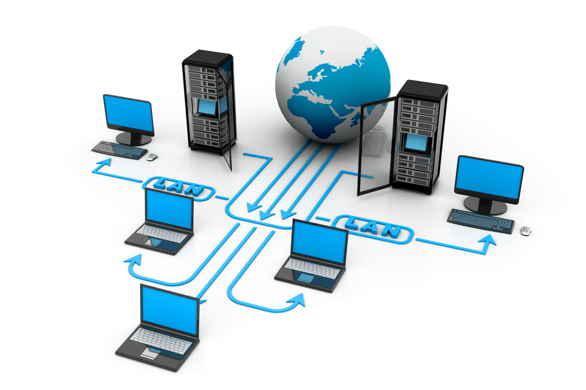
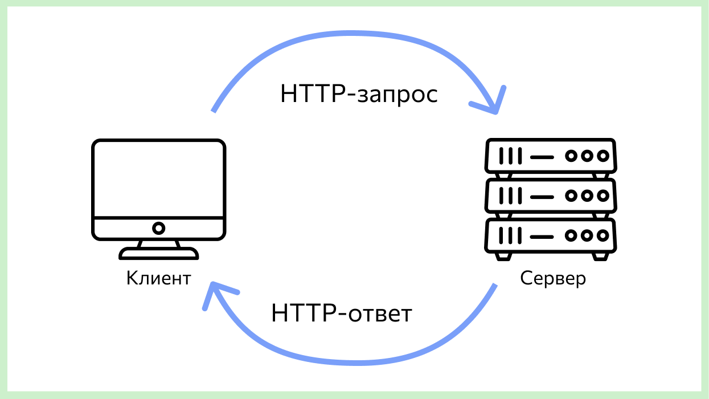

# [История](../../../../1.2_natural_sciences/physics_in_everyday_life/Q11469.md) интернета

[Интернет](../../../../1.2_natural_sciences/physics_in_everyday_life/Q26540.md) — это огромная сеть компьютеров по всему миру. Но так было не всегда. Когда-то компьютеры не умели «разговаривать» друг с другом, а сегодня мы можем за секунды отправить [сообщение](../../../../3.2 healthy lifestyle/how to act in a dangerous situation/articles/phishing-links.md) на другой конец Земли, посмотреть [видео](../../../information and media literacy/оценка_качества_изображений_и_видео.md) с другом из другой страны или поиграть в онлайн-игру с людьми со всей [планеты](../../../../1.2_natural_sciences/physics_in_everyday_life/Q1.md). Как же это произошло?

> 🌐 **Представь:** интернет — это [город](../../../../3.2 healthy lifestyle/how to act in a dangerous situation/articles/lost-in-city.md), который строился по кусочкам. Сначала появилась одна маленькая улица, потом к ней присоединились другие, и постепенно вырос целый мегаполис. В этой статье мы пройдём по главным вехам этого пути.

---

## Что такое «сеть» и зачем она нужна

**Сеть** — это когда несколько компьютеров соединены между собой и могут обмениваться данными. Сегодня это кажется очевидным, но ещё 60 лет назад каждый компьютер работал сам по себе. Чтобы передать информацию с одной машины на другую, приходилось [записывать](../../../../4.1_rules_of_study/how_to_memorize/articles/konspektirovanie.md) её на магнитную ленту или перфокарты и везти физически.

Учёные мечтали: а что если компьютеры смогут «разговаривать» по проводам? Тогда не нужно будет ездить с лентами — [данные](../../../../2.1_society/cause_and_effect_relationships/articles/ai_causality.md) полетят сами. А военные думали о другом: что если создать сеть без единого центра? Тогда даже если часть сети выйдет из строя (например, после атаки), остальные узлы продолжат работать. Эти две [идеи](../../../../7.2 Media, leisure and hobbies /useful_and_interesting_leisure/articles/free_leisure_activities.md) и привели к рождению интернета.

---

## От военных лабораторий до всемирной паутины

История интернета началась в **1969 году** в США. [Организация](../../../../4.1_rules_of_study/how_to_learn_effectively/articles/learning_environment.md) [ARPA](arpanet.md) (Advanced Research Projects Agency) финансировала передовые исследования для министерства обороны. Одна из её задач — создать надёжную сеть связи. Так появилась [**ARPANET: первая сеть**](arpanet.md) — прабабушка современного интернета.

Сначала в сети было всего **четыре компьютера** в четырёх университетах США. Они могли обмениваться простыми текстовыми сообщениями. Никаких картинок, видео или сайтов — только буквы и цифры. Но это уже было чудо: впервые машины в разных городах «поговорили» друг с другом без участия человека-посредника.

**Тогда и сейчас:** в 1969 году — 4 компьютера, только [текст](../../../../4.1_rules_of_study/how_to_learn_effectively/articles/reading_skills.md), только учёные, [скорость](../../../../1.2_natural_sciences/physics_in_everyday_life/Q11402.md) несколько килобит в секунду. Сегодня — миллиарды устройств, текст и картинки и видео и игры, почти всё человечество, гигабиты в секунду. Один [тип](../../../../5.2_cybersecurity/cpp_fundamentals/13_struct.md) сети превратился в множество сетей, объединённых в одну.

---

## Как компьютеры находят друг друга

Чтобы компьютеры могли общаться, каждому нужен свой «[адрес](../ip_mac/ip_and_mac.md)» — как у дома на улице. В интернете используется система [**IP и MAC-адреса**](../ip_mac/ip_and_mac.md): [IP-адрес](../ip_mac/ip_and_mac.md) — это «почтовый адрес» [устройства](../../../operating system/articles/HAL.md) в сети (например, `192.168.1.1`), а [MAC-адрес](../ip_mac/ip_and_mac.md) — уникальный «отпечаток» сетевой карты, который не меняется. *[Подробнее — в статье «[IP](../ip_mac/ip_and_mac.md) и MAC-адреса»]*

Но [запоминать](../../../../4.1_rules_of_study/how_to_memorize/articles/zapominanie.md) длинные числа вроде `142.250.185.46` неудобно. Поэтому придумали [**DNS**](../dns/dns.md) — систему, которая переводит понятные имена вроде `google.com` в числовые IP-адреса. Ты вводишь название сайта в браузере, [браузер](../http_https/http_https.md) спрашивает [DNS](../../../../4.2_thinking_and_working_information/how_to_search_information/articles/vpn_dns_proxy_anonymity_and_security.md): «Какой адрес у google.com?», DNS отвечает — и [запрос](../http_https/http_https.md) уходит по правильному пути. *[Подробнее — в статье «DNS»]*

---

## [Язык](../../../../5.2_cybersecurity/cpp_fundamentals/1_introduction.md), на котором говорят сайты

Когда ты открываешь страницу в браузере, твой компьютер и [сервер](../http_https/http_https.md) обмениваются данными по строгим правилам — **протоколам**. Главный [протокол](../http_https/http_https.md) для веб-страниц — [**HTTP и HTTPS**](../http_https/http_https.md).

**[HTTP](../http_https/http_https.md)** (HyperText Transfer Protocol) — «язык», на котором браузер просит страницу («Дай мне главную страницу!»), а сервер её отдаёт («Вот, держи!»). **[HTTPS](../http_https/http_https.md)** — тот же язык, но с шифрованием. Данные «запечатываются» так, что прочитать их может только получатель. Это важно для паролей, банковских карт и личных сообщений. *[Подробнее — в статье «HTTP и HTTPS»]*

Без HTTP/HTTPS не было бы ни одного сайта в привычном нам виде.

---

## Интернет без проводов

Сначала интернет шёл только по кабелю. Компьютер подключался к сети через провод — к телефонной линии ([модем](internet_at_home.md)) или к специальному кабелю провайдера. Один компьютер — один кабель.

Сегодня всё иначе. [**Wi-Fi и локальная сеть**](../wifi/wifi.md) позволяют подключаться без проводов. Один [роутер](../wifi/router.md) в квартире раздаёт [сигнал](../wifi/router.md) — и к нему подключаются телефон, планшет, компьютер, умные [часы](../../../../1.2_natural_sciences/physics_in_everyday_life/Q20702.md), телевизор. Все они в одной домашней сети и выходят в интернет через один канал. *[Подробнее — в статье «[Wi-Fi](internet_at_home.md) и [локальная сеть](../wifi/wifi.md)»]*

Раньше — только кабель, один компьютер на провод, сидеть у розетки. Сегодня — Wi-Fi и [мобильный интернет](../wifi/wifi_vs_mobile_net.md) ([4G](../wifi/wifi_vs_mobile_net.md), [5G](../wifi/wifi_vs_mobile_net.md)), десятки устройств через один роутер, интернет в кармане везде.

---

## Два важных шага: от учёных к каждому дому

История интернета делится на несколько эпох. Две из них особенно важны:

- **[ARPANET: первая сеть](arpanet.md)** — как всё начиналось: первые четыре узла, [пакетная передача](arpanet.md) данных, идея «сети без центра», протоколы [TCP](../tcp_udp/tcp_udp.md)/IP
- **[Как интернет пришёл в каждый дом](internet_at_home.md)** — модемы, провайдеры, браузеры, Wi-Fi — [путь](../../../../1.2_natural_sciences/physics_in_everyday_life/Q11476.md) из лабораторий в гостиные и карманы

---

## Хронология: главные вехи

- **1969** — Рождение ARPANET, [первая сеть](arpanet.md)
- **1971** — Первое email-письмо, символ @
- **1974** — Слово «интернет» (inter + net = «между сетями»)
- **1983** — Переход на протокол TCP/IP — «рождение» интернета в современном смысле
- **1989** — Тим Бернерс-Ли придумал Всемирную паутину (WWW)
- **1991** — Первый в мире сайт
- **[1993](../../../../7.1_art/modern_technological_art/articles/2.6_cac.md)** — Браузер [Mosaic](internet_at_home.md) — картинки и ссылки на одной странице
- **1998** — Google — [поиск](../../../../3.2 healthy lifestyle/how to act in a dangerous situation/articles/lost-in-city.md) по всему интернету
- **2000-е** — Wi-Fi, широкополосный интернет, [соцсети](../../../../2.1_society/how_and_where_find_friends/articles/tcifrovaya_druzhba.md)
- **2010-е** — [Смартфоны](../../../../1.2_natural_sciences/physics_in_everyday_life/Q170475.md) — интернет в кармане

---

## Интересные [факты](../../../../1.2_natural_sciences/physics_in_everyday_life/Q17737.md)

🔤 **Первый символ по ARPANET** — буква «L». [Связь](../../../../1.2_natural_sciences/physics_in_everyday_life/Q12969754.md) оборвалась до того, как удалось отправить слово «LOGIN».

📝 **Слово «интернет»** раньше писали с большой буквы — как имя собственное. Теперь чаще с маленькой.

🌍 **Тим Бернерс-Ли** придумал WWW в 1989 году. Первый сайт в мире — его, до сих пор доступен по адресу info.cern.ch.

📧 **Первый [спам](../../../../5.2_cybersecurity/passwords_cyber_safety/articles/spam.md)** — 1978 год. Рекламу нового компьютера разослали по 400 адресам в ARPANET.

😊 **Первый смайлик** :-) отправили в 1982 году в университетской сети.

📱 **Половина человечества** — сегодня интернетом пользуются около 5 миллиардов [человек](../../../../1.2_natural_sciences/physics_in_everyday_life/Q45003.md).

---

## Читай также

- [IP и MAC-адреса](../ip_mac/ip_and_mac.md) — как компьютеры находят друг друга в сети
- [DNS](../dns/dns.md) — как имена сайтов превращаются в адреса
- [HTTP и HTTPS](../http_https/http_https.md) — язык общения браузера и сервера
- [Wi-Fi и локальная сеть](../wifi/wifi.md) — как подключиться без проводов
- [ARPANET: первая сеть](arpanet.md) — с чего всё началось
- [Как интернет пришёл в каждый дом](internet_at_home.md) — путь от лабораторий к домашним компьютерам

---

[Автор](../../../../4.2_thinking_and_working_information/how_to_search_information/articles/copypaste.md): Гула Дмитрий  
*[Ресурсы](../../../../2.1_society/cause_and_effect_relationships/articles/ecological_footprint.md): [LLM](../../../../7.1_art/modern_technological_art/README.md) — Claude Sonnet 4.6*
