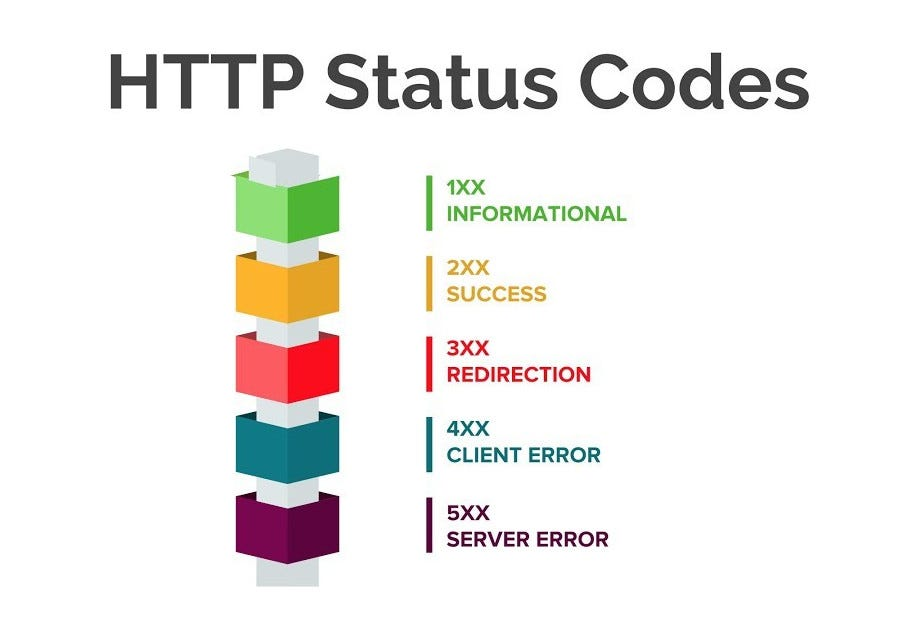
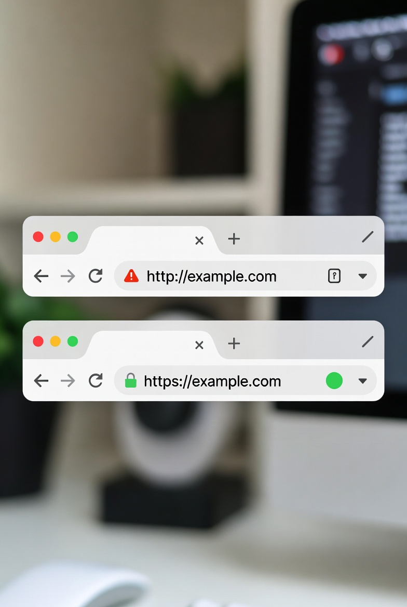

# HTTP и HTTPS: как браузер разговаривает с сервером

Когда ты вводишь [адрес сайта](../web_basics/what_happens.md) и нажимаешь Enter, между твоим браузером и сервером начинается **[разговор](../../../../2.1_society/how_and_where_find_friends/articles/izi_temy_dlya_razgovora.md)**. У этого разговора есть свои [правила](../../../../2.1_society/cause_and_effect_relationships/articles/why_rules_work.md) — [язык](../../../../5.2_cybersecurity/cpp_fundamentals/1_introduction.md), на котором они общаются. Этот язык называется **HTTP** (HyperText Transfer Protocol, [протокол передачи](../../../../5.2_cybersecurity/passwords_cyber_safety/articles/https.md) гипертекста).

Представь, что браузер — это покупатель в магазине, а сервер — продавец. Покупатель говорит: «Дайте мне, пожалуйста, страницу /cats.[html](../../../../7.1_art/modern_technological_art/articles/2.1_jodi.md)». Продавец отвечает: «Вот, держи!» — и передаёт содержимое [страницы](../../../operating system/articles/memory_management.md). HTTP описывает именно этот [диалог](../../../../../8.1_entertainment/articles/script.md): как правильно попросить и как правильно ответить.



---

## Запрос и ответ

### Запрос (Request)

Каждый раз, когда ты открываешь ссылку, браузер отправляет **запрос**. Изнутри он выглядит примерно так:

```
GET /cats.html HTTP/1.1
Host: www.example.com
User-Agent: Mozilla/5.0
Accept: text/html
```

Разберём по частям:

| Часть | Что означает |
|-------|-------------|
| `GET` | **Метод**: что хотим сделать (получить страницу) |
| `/cats.html` | **[Путь](../../../../1.2_natural_sciences/physics_in_everyday_life/Q11476.md)**: какой [файл](../../../operating system/articles/file_system.md) хотим |
| `HTTP/1.1` | Версия протокола |
| `Host` | [Адрес](../ip_mac/ip_and_mac.md) сервера |
| `User-Agent` | Кто спрашивает (какой браузер) |

### Ответ (Response)

Сервер получает запрос и отвечает:

```
HTTP/1.1 200 OK
Content-Type: text/html
Content-Length: 1234

<html>
  <h1>Мои котики</h1>
  ...
</html>
```

Ответ состоит из трёх частей:
- **Статусная строка** — всё ли прошло хорошо (`200 OK`)
- **Заголовки** — служебная [информация](../../../information and media literacy/как_устроена_современная_информационная_среда.md) о содержимом; именно здесь сервер может установить [**cookies**](cookies.md) — небольшие файлы, которые браузер сохранит и будет автоматически отправлять при следующих запросах
- **[Тело](../../../../1.2_natural_sciences/why_science_help_understand_world/organism.md)** — сама страница, картинка, или другие [данные](../../../../2.1_society/cause_and_effect_relationships/articles/ai_causality.md)

---

## [Методы](../../../../4.1_rules_of_study/how_to_learn_effectively/articles/note_taking.md) HTTP

HTTP знает несколько «глаголов» — **методов**. Они говорят серверу, что именно хочет браузер:

| Метод | Что делает | Пример из жизни |
|-------|-----------|-----------------|
| **GET** | Получить данные | Открыть страницу |
| **POST** | Отправить данные | Отправить форму входа |
| **PUT** | Заменить данные | Обновить [аватар](../../../../7.2 Media, leisure and hobbies/Computer games/articles/heroes_and_villains/create_your_hero.md) профиля |
| **[DELETE](../../../../5.2_cybersecurity/cpp_fundamentals/14_dynamic_memory.md)** | Удалить данные | Удалить пост |

Большинство сайтов, которые ты просматриваешь, используют **GET**. Когда ты входишь в [аккаунт](../../../information and media literacy/информационная_безопасность_для_детей.md) или пишешь комментарий — используется **POST**.

---

## Коды статусов

Когда сервер отвечает, он всегда сообщает, как всё прошло — с помощью **кода статуса**. Это трёхзначное число в начале ответа.



| [Код](../../../../5.2_cybersecurity/cpp_fundamentals/1_introduction.md) | Название | Что означает |
|-----|----------|-------------|
| **200** | OK | Всё хорошо, вот твоя страница |
| **301** | Moved Permanently | Страница переехала на новый адрес |
| **403** | Forbidden | Тебе сюда [нельзя](../../../../3.1_healthy_lifestyle/pervaya_pomoshch/ushibi_porezy_ozhogi/07_ushib_chego_nelzya.md) |
| **404** | Not Found | Страница не существует |
| **500** | Internal Server Error | Сервер сломался |

Первая цифра показывает категорию:
- **2xx** — [успех](../../../../4.2_thinking_and_working_information/critical_thinking/articles/main_cognitive_distortions.md)
- **3xx** — перенаправление
- **4xx** — ты что-то сделал не так
- **5xx** — сервер что-то сделал не так

> **Знаешь ли ты?** Ошибку 404 видели практически все пользователи интернета. В честь неё существуют целые «художественные» страницы 404 — компании соревнуются, кто придумает самое смешное или красивое [сообщение](../../../../3.2 healthy lifestyle/how to act in a dangerous situation/articles/phishing-links.md) об ошибке.

---

## HTTPS: HTTP с замочком

Обычный HTTP передаёт данные **открытым текстом**. Это как отправлять открытку по почте: почтальон может прочитать всё, что на ней написано. Если кто-то «прослушивает» [сеть](../history/internet_history.md) — он видит твои пароли, [сообщения](../../../operating system/articles/IPC.md), данные банковской карты.

**HTTPS** (HTTP Secure) — это HTTP + **шифрование**. Перед адресом сайта ты видишь значок замочка 🔒 — это значит, что [соединение](../tcp_udp/tcp_udp.md) защищено.



Разница — как между открыткой и письмом в запечатанном конверте. HTTPS «запечатывает» данные так, что прочитать их может только получатель.

---

## Как работает шифрование в HTTPS

Шифрование в HTTPS обеспечивает протокол [**TLS**](tls.md) (Transport Layer Security, раньше он назывался SSL).

### Простая [аналогия](../../../../1.2_natural_sciences/physics_in_everyday_life/Q46344.md)

Представь, что ты хочешь передать другу секрет. Вы договорились: каждую букву заменять на следующую по алфавиту (А→Б, Б→В, Я→А). Теперь «ПРИВЕТ» превращается в «ССКЖЁУ». Никто посторонний не знает вашего правила и не может прочитать сообщение.

TLS делает то же самое, только [правило](../../../../1.2_natural_sciences/why_science_help_understand_world/patterns.md) ([ключ](tls.md)) генерируется каждый раз **новое** и математически настолько сложное, что взломать его невозможно за разумное [время](../../../../1.2_natural_sciences/physics_in_everyday_life/Q20702.md).

### TLS-рукопожатие ([Handshake](tls.md))

Прежде чем начать разговор, браузер и сервер «договариваются» — это называется **[рукопожатие](tls.md)**:



1. **Браузер → Сервер**: «Привет! Я умею такие шифры: [[список](../../../../5.2_cybersecurity/cpp_fundamentals/10_arrays.md)]»
2. **Сервер → Браузер**: «Привет! Предлагаю этот шифр. Вот мой сертификат.»
3. **Браузер** проверяет сертификат (настоящий ли сервер?)
4. Оба вычисляют общий **секретный ключ**
5. Теперь весь обмен данными зашифрован

Весь этот [процесс](../../../operating system/articles/process.md) занимает миллисекунды.

---

## Сертификат сайта

Как браузер знает, что сервер — тот, за кого себя выдаёт? Для этого существуют **цифровые сертификаты**.

Сертификат — это как паспорт сайта. Его выдают специальные **удостоверяющие центры** (CA — Certificate Authority). Браузер доверяет этим центрам и, получив сертификат, проверяет: настоящий ли он, не истёк ли [срок](../../../../6.1_Independent_living_and_daily_living_skills/reasonable_spending/articles/financial_goal.md), совпадает ли адрес сайта.

Если что-то не так — браузер покажет красное предупреждение: «Это соединение небезопасно». Это не значит, что сайт плохой — возможно, просто забыли обновить сертификат. Но вводить пароли на таких сайтах точно не стоит.

---

## HTTP/1.1, HTTP/2, HTTP/3

Протокол не стоит на месте — он развивался вместе с интернетом:

| Версия | Год | Главное [улучшение](../../../../4.1_rules_of_study/how_to_learn_effectively/articles/learning_from_mistakes.md) |
|--------|-----|-------------------|
| **HTTP/1.1** | 1997 | Стандарт на долгие годы. Каждый запрос — отдельное соединение |
| **HTTP/2** | 2015 | Несколько запросов по одному соединению. Заметно быстрее |
| **HTTP/3** | 2022 | Работает поверх [UDP](../tcp_udp/tcp_udp.md) вместо [TCP](../tcp_udp/tcp_udp.md). Меньше задержки |

Сегодня большинство сайтов поддерживают HTTP/2, а HTTP/3 всё активнее набирает популярность.

---

## HTTP vs HTTPS: итоговое [сравнение](../../../../5.2_cybersecurity/cpp_fundamentals/5_operators.md)

| | HTTP | HTTPS |
|--|------|-------|
| Шифрование | ❌ Нет | ✅ Да (TLS) |
| [Безопасность](../../../../1.2_natural_sciences/neurobiology_for_teens/articles/17_hugs_oxytocin.md) данных | Низкая | Высокая |
| [Замочек в браузере](../../../../5.2_cybersecurity/passwords_cyber_safety/articles/https.md) | ❌ Нет | ✅ Есть |
| Подходит для паролей и оплаты | ❌ Никогда | ✅ Да |
| Используется сегодня | Редко | Почти везде (>95% сайтов) |

---

## Интересные [факты](../../../../1.2_natural_sciences/physics_in_everyday_life/Q17737.md)

- **HTTP придумал Тим Бернерс-Ли** в 1989–1991 годах — он же изобрёл Всемирную паутину и создал первый в мире сайт.
- **HTTPS появился** благодаря компании [Netscape](../history/internet_at_home.md) в 1994 году — изначально для онлайн-покупок.
- **Сегодня** более 95% сайтов используют HTTPS. Браузеры Google [Chrome](../history/internet_at_home.md) и [Firefox](../web_basics/browser.md) специально помечают обычные HTTP-сайты как «небезопасные».
- **HTTP/3** использует протокол [UDP](../tcp_udp/tcp_udp.md) вместо [TCP](../tcp_udp/tcp_udp.md) — это позволяет быстрее восстанавливаться при потере пакетов.

---

## Читай также

- [Что такое TLS и как работает шифрование](tls.md) — подробно об алгоритмах, видах ключей и цифровых сертификатах
- [Что такое cookies и зачем они нужны](cookies.md) — как сайты «запоминают» тебя между запросами
- [TCP и UDP](../tcp_udp/tcp_udp.md) — HTTP работает поверх TCP; HTTP/3 — поверх [UDP](../tcp_udp/tcp_udp.md)
- [DNS](../dns/dns.md) — прежде чем отправить HTTP-запрос, браузер узнаёт [IP-адрес](../ip_mac/ip_and_mac.md) сервера через [DNS](../../../../4.2_thinking_and_working_information/how_to_search_information/articles/vpn_dns_proxy_anonymity_and_security.md)
- [Что происходит, когда я открываю сайт?](../what_happens/README.md) — HTTP/HTTPS — завершающий [шаг](../../../../1.2_natural_sciences/physics_in_everyday_life/Q36253.md) всего путешествия

---

Авторы: Коростин Никита
*[Ресурсы](../../../../2.1_society/cause_and_effect_relationships/articles/ecological_footprint.md): [LLM](../../../../7.1_art/modern_technological_art/README.md) — Claude Sonnet 4.6, WikiData*
