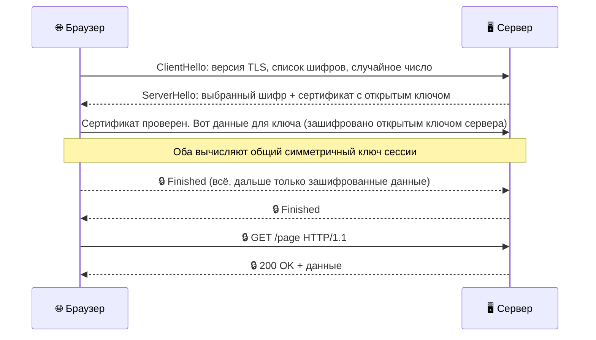

# Что такое [TLS](http_https.md) и как работает [шифрование](http_https.md)

Когда ты видишь [замочек](http_https.md) 🔒 в адресной строке браузера, за этим значком прячется целый механизм защиты. Называется он **TLS** (Transport Layer Security — [безопасность](../../../../1.2_natural_sciences/neurobiology_for_teens/articles/17_hugs_oxytocin.md) транспортного уровня). Именно TLS превращает обычный [HTTP](http_https.md) в защищённый [HTTPS](http_https.md).

---

## [История](../../../../1.2_natural_sciences/physics_in_everyday_life/Q11469.md): от [SSL](http_https.md) к TLS

Всё началось в 1994 году, когда компания [Netscape](../history/internet_at_home.md) придумала [протокол](http_https.md) **SSL** (Secure Sockets Layer) для защиты онлайн-покупок. SSL несколько раз обновлялся, но в каждой версии находились уязвимости.

В 1999 году на смену SSL пришёл **TLS** — более надёжный и стандартизированный протокол. Сегодня используются TLS 1.2 и TLS 1.3. Старые версии отключены в современных браузерах как небезопасные.

| Версия | Год | [Статус](http_https.md) |
|--------|-----|--------|
| SSL 2.0 | [1995](../../../../7.1_art/modern_technological_art/articles/2.5_siberian_deal.md) | Запрещён |
| SSL 3.0 | 1996 | Запрещён |
| TLS 1.0 | 1999 | Устарел, отключён |
| TLS 1.1 | 2006 | Устарел, отключён |
| TLS 1.2 | 2008 | Используется |
| TLS 1.3 | 2018 | Рекомендуется ✅ |

> **Почему говорят «[SSL-сертификат](http_https.md)»?** Историческая [привычка](../../../../7.2 Media, leisure and hobbies /useful_and_interesting_leisure/articles/how_not_to_quit_hobby.md) — сертификаты называли так с 1990-х. На самом деле сегодня везде используется TLS, но старое название прижилось.

---

## Два вида шифрования

Чтобы понять TLS, нужно разобраться с двумя способами шифрования данных.

### Симметричное шифрование

Один и тот же ключ используется и для шифрования, и для расшифровки.

**[Аналогия](../../../../1.2_natural_sciences/physics_in_everyday_life/Q46344.md):** у тебя и у друга одинаковые ключи от одного замка. Ты кладёшь письмо в ящик и запираешь — друг открывает тем же ключом.

**Проблема:** как передать другу этот ключ, чтобы никто не перехватил?

### Асимметричное шифрование

Здесь два ключа: **открытый** (публичный) и **закрытый** (приватный). Открытый ключ можно раздавать кому угодно, закрытый — только у тебя.

**Аналогия:** представь почтовый ящик с щелью. Любой прохожий может опустить туда письмо (использовать открытый ключ), но достать содержимое — только ты своим ключом (закрытый ключ).

Зашифровать [данные](../../../../2.1_society/cause_and_effect_relationships/articles/ai_causality.md) можно открытым ключом, а расшифровать — только закрытым.

<!--
  ИЗОБРАЖЕНИЕ: Схема симметричного и асимметричного шифрования.
  Два блока рядом:
  Слева — один ключ, стрелка в обе стороны (симметричное).
  Справа — замок с щелью (открытый ключ) и отдельный ключ (закрытый).
  Файл: ../../images/encryption_types.png
-->

---

## TLS-рукопожатие: как договариваются [браузер](http_https.md) и [сервер](http_https.md)

TLS умно использует оба вида шифрования:
- **Асимметричное** — чтобы безопасно передать ключ в начале
- **Симметричное** — для всей дальнейшей передачи данных (оно намного быстрее)

Вот как выглядит рукопожатие TLS 1.3:

Весь этот [процесс](../../../operating system/articles/process.md) занимает **миллисекунды** — ты его даже не замечаешь.

> **Знаешь ли ты?** TLS 1.3 вдвое быстрее TLS 1.2, потому что рукопожатие теперь занимает один «туда-обратно» вместо двух. При повторном подключении к знакомому серверу можно отправить данные ещё быстрее — с «нулевым» рукопожатием (0-RTT).

---

## Цифровые сертификаты

Асимметричное шифрование решает проблему передачи ключей. Но остаётся другой вопрос: **а вдруг мошенник прикинется нужным сервером** и пришлёт свой открытый ключ?

Именно для этого существуют **цифровые сертификаты**.

### Что содержит [сертификат](http_https.md)

- [Доменное имя](../dns/dns.md) сайта (`example.com`)
- Открытый ключ сервера
- [Срок](../../../../6.1_Independent_living_and_daily_living_skills/reasonable_spending/articles/financial_goal.md) [действия](../../../../3.1_healthy_lifestyle/pervaya_pomoshch/ushibi_porezy_ozhogi/03_obschie_pravila_algorithm.md) (обычно 1 год)
- Цифровая подпись удостоверяющего центра

### [Удостоверяющий центр](http_https.md) ([CA](http_https.md))

**CA (Certificate Authority)** — это [организация](../../../../4.1_rules_of_study/how_to_learn_effectively/articles/learning_environment.md), которой все доверяют. CA проверяет, что владелец сертификата действительно контролирует [домен](../dns/domains.md), и ставит свою цифровую подпись.

В каждый браузер встроен [список](../../../../5.2_cybersecurity/cpp_fundamentals/10_arrays.md) доверенных CA (их около 150). Получив сертификат, браузер проверяет подпись — если она от доверенного CA, значит сервер настоящий.

Если что-то не так (сертификат истёк, подпись не та, домен не совпадает) — браузер показывает красное предупреждение.

> **Знаешь ли ты?** Крупнейший бесплатный CA — **Let's Encrypt** — выдал уже более 3 миллиардов сертификатов. Именно благодаря ему большинство сайтов перешло на HTTPS — раньше сертификат стоил [денег](../../../../8.2_future/choosing_a_career_path/articles/salary.md).

---

## Что TLS защищает — и от чего не защищает

**TLS защищает:**
- Данные от перехвата в сети — пароли, [сообщения](../../../operating system/articles/IPC.md), банковские данные
- От подмены сервера («[атака](../dns/cdn.md) человека посередине»)

**TLS не защищает:**
- От вирусов и вредоносных программ на твоём компьютере
- От мошеннических сайтов — замочек означает только шифрование, а не честность сайта
- От утечек данных на самом сервере

> **Важно:** мошеннические сайты тоже могут иметь HTTPS и замочек. Перед вводом паролей проверяй не только замочек, но и [адрес сайта](../web_basics/what_happens.md) целиком.

---

## Интересные [факты](../../../../1.2_natural_sciences/physics_in_everyday_life/Q17737.md)

- **Название «рукопожатие»** (handshake) — отсылка к деловому приветствию: стороны «пожимают руки» перед началом разговора.
- **Квантовые компьютеры** теоретически смогут взломать нынешнее асимметричное шифрование за обозримое [время](../../../../1.2_natural_sciences/physics_in_everyday_life/Q20702.md). Поэтому уже разрабатываются **постквантовые [алгоритмы](../../../../4.2_thinking_and_working_information/how_to_search_information/articles/buble_filter.md)** шифрования.
- **HTTPS в [Chrome](../history/internet_at_home.md)** — с 2018 года Chrome помечает все HTTP-сайты как «Небезопасные». Это резко ускорило переход интернета на HTTPS.

---

Авторы: Коростин Никита
*[Ресурсы](../../../../2.1_society/cause_and_effect_relationships/articles/ecological_footprint.md): [LLM](../../../../7.1_art/modern_technological_art/README.md) — Claude Sonnet 4.6*
