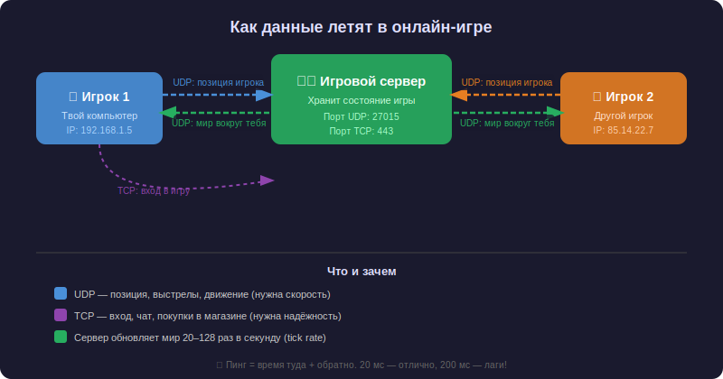

# Как работает [онлайн-игра](../../../../3.1_healthy lifestyle/vrednye_privychki/articles/computer_games.md) изнутри

Ты нажимаешь кнопку «Выстрел» — и через долю секунды твой противник на другом конце города (или страны!) видит, что в него попали. Как это вообще возможно? Давай разберёмся, [что происходит](../web_basics/what_happens.md) внутри, пока ты играешь.

> 🎮 Онлайн-игра — это [многопользовательская игра](https://www.wikidata.org/wiki/Q6895044), в которой [игроки](../../../../7.2 Media, leisure and hobbies/Computer games/articles/useful_tips/toxic_players.md) соединены через [интернет](../../../../1.2_natural_sciences/physics_in_everyday_life/Q26540.md) и видят один и тот же игровой мир в реальном времени.

---

## Игровой [сервер](../http_https/http_https.md) — [сердце](../../../../3.1. healthy lifestyle/Sleep, nutrition, and adolescent energy/articles/the_energy_trap.md) [онлайн-игры](tcp_udp.md)

Представь, что онлайн-игра — это большая [настольная игра](../../../../../8.1_entertainment/articles/board-games.md), в которую вы играете с друзьями. Кто-то должен следить за правилами, считать [очки](../../../../1.2_natural_sciences/physics_in_everyday_life/Q14620.md) и говорить, чья очередь. В онлайн-игре эту роль выполняет **игровой сервер**.

**Игровой сервер** — это мощный компьютер, который:
- хранит текущее состояние игрового мира (где стоит каждый игрок, сколько у кого здоровья, что происходит на карте)
- получает [действия](../../../../3.1_healthy_lifestyle/pervaya_pomoshch/ushibi_porezy_ozhogi/03_obschie_pravila_algorithm.md) от всех игроков
- рассчитывает [результат](../../../../1.2_natural_sciences/why_science_help_understand_world/experimental_science.md) (попал ли выстрел, столкнулись ли [персонажи](../../../../7.2 Media, leisure and hobbies/Computer games/articles/dream_team/screenwriter.md))
- рассылает обновлённое состояние всем участникам



Без сервера игроки не могут «видеть» друг друга — каждый был бы в своём отдельном мире.

---

## Tick rate — пульс игры

Сервер не работает непрерывно — он обновляет игровой мир **порциями**, как кадры в [кино](../../../../7.2 Media, leisure and hobbies /what_you_can_read_and_watch_to_develop_your_taste/articles/z1.md). Количество таких обновлений в секунду называется **tick rate** (тик-рейт).

| [Игра](../../../../4.1_rules_of_study/how_to_learn_effectively/articles/gamification.md) | Tick rate |
|------|-----------|
| Minecraft | 20 тиков/сек |
| CS2 (обычный [режим](../../../../4.1_rules_of_study/how_to_learn_effectively/articles/breaks_and_rest.md)) | 64 тика/сек |
| CS2 (соревновательный) | 128 тиков/сек |
| Valorant | 128 тиков/сек |

Чем выше tick rate — тем точнее игра реагирует на твои действия. При 64 тиках сервер «видит» тебя каждые ~15 мс, при 128 — каждые ~8 мс. Именно поэтому профессиональные игроки требуют высокий tick rate: на нём попасть в голову сложнее, зато честнее.

---

## Какой [протокол](../http_https/http_https.md) и для чего

Каждый тик сервер должен разослать обновления всем игрокам и принять их действия — десятки раз в секунду. Для этого игры используют два протокола из статьи [TCP и UDP](./tcp_udp.md):

**[UDP](./tcp_udp.md#udp----быстрая-доставка-)** — для всего, что нужно прямо сейчас:
- 📍 [Позиции](../../../../7.1_art/musical_instruments/articles/trombone.md) игроков (обновляются каждый тик)
- 🔫 Выстрелы, удары, [движение](../../../../1.2_natural_sciences/physics_in_everyday_life/Q11023.md)
- 🔊 Голосовой [чат](../../../../7.2 Media, leisure and hobbies/Computer games/articles/useful_tips/toxic_players.md) (через [RTP](https://www.wikidata.org/wiki/Q321213) поверх [UDP](./tcp_udp.md))

Если [пакет](tcp_udp.md) с позицией [потерялся](../../../../3.2 healthy lifestyle/how to act in a dangerous situation/articles/lost-in-city.md) — не страшно: через 8–15 мс придёт новый, актуальный.

**[TCP](./tcp_udp.md#tcp----надёжная-доставка-)** — для того, что [нельзя](../../../../3.1_healthy_lifestyle/pervaya_pomoshch/ushibi_porezy_ozhogi/07_ushib_chego_nelzya.md) потерять:
- 🔐 Вход в [аккаунт](../../../information and media literacy/информационная_безопасность_для_детей.md)
- 💬 Текстовый чат
- 🛒 Покупки в магазине
- 🗺️ [Загрузка](../../../../7.2 Media, leisure and hobbies/Computer games/articles/how_it_all_started/cartridge_versus_disc.md) карты
- 🏆 Запись результатов

Представь: ты купил [скин](../../../../7.2 Media, leisure and hobbies/Computer games/articles/heroes_and_villains/create_your_hero.md) за реальные [деньги](../../../../2.1_society/cause_and_effect_relationships/articles/economic_chains.md), а пакет потерялся. Без [TCP](./tcp_udp.md) это была бы катастрофа!

---

## WebSocket — постоянный канал связи

Обычный [HTTP](../http_https/http_https.md) работает по схеме «спросил — ответил — забыл». Для игры это не подходит: нужен **постоянный открытый канал**, чтобы сервер мог в любой момент прислать [обновление](../../../../5.2_cybersecurity/passwords_cyber_safety/articles/update.md).

Для этого используют **[WebSocket](https://www.wikidata.org/wiki/Q859938)** — протокол, который работает поверх [TCP](./tcp_udp.md#tcp----надёжная-доставка-) и держит [соединение](tcp_udp.md) открытым всё [время](../../../../1.2_natural_sciences/physics_in_everyday_life/Q20702.md) игры. Через него идут чат, [уведомления](../../../../4.2_thinking_and_working_information/how_to_search_information/articles/information_hygiene.md), обновления интерфейса.

```
Обычный HTTP:        WebSocket:
Клиент → Сервер      Клиент ←→ Сервер
Сервер → Клиент      (постоянное соединение)
[соединение закрыто] [открыто всё время]
```

---

## Пинг — твой главный [враг](../../../../7.2 Media, leisure and hobbies/Computer games/articles/heroes_and_villains/main_villains.md)

**Пинг** (или **латентность**) — это время, за которое пакет летит от тебя до сервера и обратно. Измеряется в миллисекундах (мс).

| Пинг | Ощущение |
|------|----------|
| < 20 мс | 🟢 Идеально — не чувствуется совсем |
| 20–50 мс | 🟢 Отлично — комфортная игра |
| 50–100 мс | 🟡 Нормально — иногда заметно |
| 100–200 мс | 🟠 Плохо — заметные задержки |
| > [200](../http_https/http_https.md) мс | 🔴 [Лаги](tcp_udp.md) — играть очень сложно |

Пинг зависит от расстояния до сервера, качества интернета и загруженности сети. Именно поэтому в играх выбирают ближайший регион сервера.

### Почему лаги выглядят как телепортация?

Когда несколько [UDP](./tcp_udp.md)-пакетов с позицией игрока теряются подряд, а потом приходит новый — игра резко «перемещает» персонажа в актуальную позицию. Это и есть телепортация от лагов. Игровые движки используют **[предсказание](../../../../1.2_natural_sciences/neurobiology_for_teens/articles/18_music_chills.md) движения** (client-side prediction), чтобы сгладить этот эффект: твой компьютер сам предсказывает, куда движется игрок, не дожидаясь сервера.

---

## MMO — когда игроков тысячи

Обычная онлайн-игра держит 10–100 игроков на сервере. Но **[MMO](https://www.wikidata.org/wiki/Q862490)** (Massively Multiplayer Online) — это игры, где одновременно играют тысячи людей: World of Warcraft, EVE Online, Final Fantasy XIV.

Как это работает?

- Мир делится на **зоны** — каждую обслуживает отдельный сервер
- Используется **балансировщик нагрузки** — он распределяет игроков по серверам
- Критически важные [данные](../../../../2.1_society/cause_and_effect_relationships/articles/ai_causality.md) ([инвентарь](../../../../6.1_Independent_living_and_daily_living_skills/Simple_and_safe_cooking/articles/how_to_read_recipe.md), [прогресс](../../../../2.1_society/cause_and_effect_relationships/articles/lessons_of_history.md)) хранятся в базе данных и передаются по [TCP](./tcp_udp.md)
- Позиции и бои — по [UDP](./tcp_udp.md)

В MMO особенно важна надёжность [TCP](./tcp_udp.md): потерять прогресс персонажа за [500](../http_https/http_https.md) часов игры было бы ужасно.

---

## [QUIC](tcp_udp.md) — протокол будущего

**[QUIC](https://www.wikidata.org/wiki/Q7265601)** — новый протокол от Google, который объединяет [скорость](../../../../1.2_natural_sciences/physics_in_everyday_life/Q11402.md) [UDP](./tcp_udp.md) и надёжность [TCP](./tcp_udp.md), плюс встроенное [шифрование](../http_https/http_https.md). Некоторые современные игры уже используют его вместо классической пары [TCP](./tcp_udp.md)/[UDP](./tcp_udp.md). Подробнее — в статье [TCP и UDP](./tcp_udp.md).

---

## [Путь](../../../../1.2_natural_sciences/physics_in_everyday_life/Q11476.md) одного выстрела

Вот что происходит за ~50 мс, пока ты нажимаешь кнопку «Выстрел»:

```
1. Ты нажимаешь кнопку
   └── Твой компьютер отправляет UDP-пакет на сервер:
       «Игрок X выстрелил в направлении Y»

2. Пакет летит до сервера (~10–25 мс)
   └── Через IP-адреса и маршрутизаторы интернета

3. Сервер получает пакет
   └── Проверяет: попал ли выстрел? (по позициям всех игроков)
   └── Если попал — уменьшает здоровье противника

4. Сервер рассылает обновление всем игрокам (~10–25 мс обратно)
   └── UDP-пакет: «Игрок Z получил урон, здоровье: 75»

5. Твой экран обновляется
   └── Ты видишь попадание!
```

Всё это — за время, пока ты моргаешь.

---

## Читай также

- [TCP и UDP](./tcp_udp.md) — как работают протоколы доставки данных
- [IP и MAC-адреса](../ip_mac/ip_and_mac.md) — как пакеты находят дорогу через интернет
- [DNS](../dns/dns.md) — как игра находит [адрес](../ip_mac/ip_and_mac.md) сервера по имени
- [HTTP и HTTPS](../http_https/http_https.md) — протокол, на котором работают игровые сайты и магазины
- [Что происходит, когда я открываю сайт?](../what_happens/README.md) — полное путешествие данных по интернету

---

Авторы: Александр Горячев

*Данные: WikiData ([Q116634](https://www.wikidata.org/wiki/Q116634), [Q862490](https://www.wikidata.org/wiki/Q862490), [Q6895044](https://www.wikidata.org/wiki/Q6895044), [Q11163](https://www.wikidata.org/wiki/Q11163), [Q8803](https://www.wikidata.org/wiki/Q8803), [Q859938](https://www.wikidata.org/wiki/Q859938), [Q321213](https://www.wikidata.org/wiki/Q321213), [Q7265601](https://www.wikidata.org/wiki/Q7265601))*

*[Ресурсы](../../../../2.1_society/cause_and_effect_relationships/articles/ecological_footprint.md): [LLM](../../../../7.1_art/modern_technological_art/README.md) — Claude 4.5 Opus*
