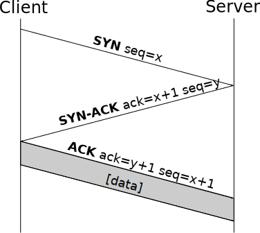

# TCP и UDP: два способа доставить [данные](../../../../2.1_society/cause_and_effect_relationships/articles/ai_causality.md) через [интернет](../../../../1.2_natural_sciences/physics_in_everyday_life/Q26540.md)

Когда ты смотришь [видео](../../../information and media literacy/оценка_качества_изображений_и_видео.md), играешь в онлайн-игру или открываешь сайт — твой компьютер постоянно отправляет и получает данные. Но данные не летят одним куском: они разбиваются на маленькие кусочки — **[пакеты](./packet.md)**. И вот тут возникает вопрос: *как именно их доставлять?* Надёжно, но медленно? Или быстро, но без гарантий? Именно для этого существуют два протокола транспортного уровня [модели](../../../../1.2_natural_sciences/physics_in_everyday_life/Q172280.md) OSI — **TCP** и **UDP**.

> 📦 Если [IP и MAC-адреса](../ip_mac/ip_and_mac.md) отвечают на вопрос *«куда везти?»*, то TCP и UDP отвечают на вопрос *«как везти?»*

---

## Что такое [протокол](../http_https/http_https.md)?

Представь, что ты договариваешься с другом как передавать записки на уроке. Вы заранее решаете: складывать ли записку вчетверо, ждать ли ответа, что делать если записка потерялась. **Протокол** — это именно такая договорённость между компьютерами: набор правил, по которым они общаются.

TCP и UDP — два разных набора таких правил. Оба живут на **транспортном уровне** — это четвёртый [уровень](../../../../../8.1_entertainment/articles/gamification.md) из семи в модели OSI. Их задача — взять данные от программы и передать их через [сеть](../history/internet_history.md), используя [IP-адреса](../ip_mac/ip_and_mac.md) для доставки.

---

## TCP — надёжная доставка 📬

**TCP** расшифровывается как *Transmission Control Protocol* — «протокол управления передачей». Он описан в документе **RFC 793**, опубликованном в 1981 году, а актуальная версия — **RFC 9293**.

### [Аналогия](../../../../1.2_natural_sciences/physics_in_everyday_life/Q46344.md): заказное письмо

Представь, что отправляешь другу важные документы по почте. Ты идёшь на почту, платишь за **заказное отправление** с уведомлением о вручении. Когда друг получает письмо — он расписывается, и тебе приходит подтверждение. Если письмо потерялось — почта отправит его снова.

Именно так работает TCP.

### Как TCP устанавливает соединение: 3-way [handshake](../http_https/tls.md)

Прежде чем отправить хоть один [байт](../../../../7.2 Media, leisure and hobbies/Computer games/articles/technologies_inside/smart_processor.md) данных, TCP «здоровается» с получателем. Это называется **трёхстороннее [рукопожатие](../http_https/tls.md)**:



После этого рукопожатия данные передаются пакетами, каждый из которых **пронумерован**. Получатель подтверждает каждый пакет: *«Получил №1, жду №2»*. Если пакет [потерялся](../../../../3.2 healthy lifestyle/how to act in a dangerous situation/articles/lost-in-city.md) — отправитель пришлёт его снова.

### Где используется TCP

| Приложение | Почему TCP |
|-----------|------------|
| 🌐 Сайты — [HTTP и HTTPS](../http_https/http_https.md) | Страница должна загрузиться полностью |
| 📧 Электронная почта | Письмо [нельзя](../../../../3.1_healthy_lifestyle/pervaya_pomoshch/ushibi_porezy_ozhogi/07_ushib_chego_nelzya.md) потерять |
| 📁 Скачивание файлов | [Файл](../../../operating system/articles/file_system.md) должен быть целым |
| 💬 Мессенджеры ([текст](../../../../4.1_rules_of_study/how_to_learn_effectively/articles/reading_skills.md)) | [Сообщения](../../../operating system/articles/IPC.md) должны приходить по порядку |
| 🌐 [DNS over TCP](../dns/dns.md) | Большие DNS-ответы |

---

## UDP — быстрая доставка 🚀

**UDP** расшифровывается как *User Datagram Protocol* — «протокол пользовательских датаграмм». Описан в **RFC 768**, опубликованном **1 января 1980 года** — чуть раньше TCP!

### Аналогия: листовки в почтовые ящики

Представь рекламщика, который разбрасывает листовки по почтовым ящикам. Он не проверяет, получил ли ты листовку. Может, получил — хорошо. Может, она упала на пол — ну и ладно. Зато рекламщик работает **очень быстро**: не ждёт подтверждений и не возвращается.

Именно так работает UDP:


- ❌ Нет установки соединения — данные сразу летят
- ❌ Нет подтверждений — отправитель не знает, дошло ли
- ❌ Нет гарантии порядка — пакеты могут прийти вперемешку
- ✅ Зато очень быстро!

### Где используется UDP

| Приложение | Почему UDP |
|-----------|------------|
| 🎮 [Онлайн-игры](./online_games.md) | Важна [скорость](../../../../1.2_natural_sciences/physics_in_everyday_life/Q11402.md) — устаревший [кадр](../../../../../8.1_entertainment/articles/director.md) лучше пропустить |
| 📹 Видеозвонки, стриминг | Лучше чуть «попикселить», чем застыть |
| 🔊 Интернет-радио, VoIP | Живой [звук](../../../../1.2_natural_sciences/physics_in_everyday_life/Q124003.md), небольшие потери некритичны |
| 🌐 [DNS](../dns/dns.md) | Маленький быстрый [запрос](../http_https/http_https.md) — [потеря](../../../../1.2_natural_sciences/neurobiology_for_teens/articles/20_sadness.md) означает просто [повтор](../../../../7.2 Media, leisure and hobbies /what_you_can_read_and_watch_to_develop_your_taste/articles/Repeat-listening.md) |
| 🖥️ [DHCP](../ip_mac/ip_and_mac.md) | Автоматическое получение [IP-адреса](../ip_mac/ip_and_mac.md) при подключении к сети |

---

## [Сравнение](../../../../5.2_cybersecurity/cpp_fundamentals/5_operators.md) TCP и UDP

| Характеристика | TCP 📬 | UDP 🚀 |
|----------------|--------|--------|
| Установка соединения | ✅ Да (3-way handshake) | ❌ Нет |
| Гарантия доставки | ✅ Да | ❌ Нет |
| [Порядок](../../../../1.2_natural_sciences/physics_in_everyday_life/Q45003.md) пакетов | ✅ Гарантирован | ❌ Не гарантирован |
| Повтор при потере | ✅ Да | ❌ Нет |
| Скорость | 🐢 Медленнее | 🐇 Быстрее |
| Размер заголовка | 20–60 байт | 8 байт |
| Стандарт | RFC 793 / RFC 9293 | RFC 768 |
| Год | 1981 | 1980 |

---

## Порты — «номера квартир» 🏠

И TCP, и UDP используют понятие **порт** — число от 0 до 65535. Если [IP-адрес](../ip_mac/ip_and_mac.md) — это [адрес](../ip_mac/ip_and_mac.md) дома, то **порт** — это номер квартиры. Один компьютер одновременно может принимать и веб-страницы, и почту, и игровые данные — потому что каждый сервис «живёт» на своём порту.

[IP-адрес](../ip_mac/ip_and_mac.md) + порт вместе образуют **сокет** — полный адрес доставки.

| Порт | Протокол | Сервис |
|------|----------|--------|
| 80 | TCP | [HTTP](../http_https/http_https.md) — обычные сайты |
| 443 | TCP | [HTTPS](../http_https/http_https.md) — защищённые сайты |
| 53 | UDP/TCP | [DNS](../dns/dns.md) — [поиск](../../../../3.2 healthy lifestyle/how to act in a dangerous situation/articles/lost-in-city.md) адресов |
| 67/68 | UDP | DHCP — получение [IP](../ip_mac/ip_and_mac.md) |
| 25 | TCP | Электронная почта |

---

## Как всё связано: [путь](../../../../1.2_natural_sciences/physics_in_everyday_life/Q11476.md) одного запроса

Когда ты открываешь сайт — происходит вот что:

```
Браузер
  │
  ├──[UDP]──> DNS: «Какой IP у сайта?»
  │            └── подробнее: статья про DNS
  │
  ├──[TCP]──> 3-way handshake с сервером
  │
  ├──[TCP]──> HTTP-запрос: «Дай мне страницу!»
  │            └── подробнее: статья про HTTP и HTTPS
  │
  └──[TCP]──> Получаем страницу пакет за пакетом
```

Полное путешествие запроса описано в статье [«Что происходит, когда я открываю сайт?»](../what_happens/README.md)

---

## Интересные [факты](../../../../1.2_natural_sciences/physics_in_everyday_life/Q17737.md)

- **UDP старше TCP** — RFC 768 вышел в 1980 году, а RFC 793 в 1981-м. Но TCP известнее, потому что весь веб работает на нём.

- **QUIC — протокол будущего** — Google придумал новый протокол QUIC, который объединяет скорость UDP и надёжность TCP. Именно он используется в YouTube и Google [Chrome](../history/internet_at_home.md) с 2020 года.

- **Лаги в играх — это UDP** — когда твой [персонаж](../../../../7.2 Media, leisure and hobbies/Computer games/articles/game_culture/cosplay.md) в игре вдруг «телепортируется» — это значит несколько UDP-пакетов с его позицией потерялись, а потом пришёл новый.

- **[Заголовок](../http_https/http_https.md) UDP — 8 байт** — это меньше одного SMS! Именно поэтому UDP такой быстрый: он почти не тратит место на служебную информацию. У TCP заголовок [минимум](../../../../1.2_natural_sciences/physics_in_everyday_life/Q136980.md) 20 байт.

---

## Читай также

- [Что такое пакет и как данные делятся на части](./packet.md) — из чего состоит пакет, [инкапсуляция](packet.md), [MTU](packet.md) и [фрагментация](packet.md)
- [Как работает онлайн-игра изнутри](./online_games.md) — почему игры выбирают UDP, а не TCP
- [IP и MAC-адреса](../ip_mac/ip_and_mac.md) — по чему едут пакеты TCP и UDP; что такое IP-адрес и порт
- [DNS](../dns/dns.md) — DNS-запросы летят по UDP; большие ответы — по TCP
- [HTTP и HTTPS](../http_https/http_https.md) — [HTTP](../http_https/http_https.md) работает поверх TCP; HTTP/3 — поверх UDP
- [Что происходит, когда я открываю сайт?](../what_happens/README.md) — TCP и UDP в действии на каждом шаге

---

Авторы: Александр Горячев

*Данные: WikiData (Q8803, Q11163), RFC 793, RFC 768, RFC 9293*

*[Ресурсы](../../../../2.1_society/cause_and_effect_relationships/articles/ecological_footprint.md): [LLM](../../../../7.1_art/modern_technological_art/README.md) — Claude 4.5 Opus*
