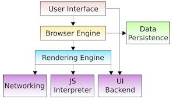
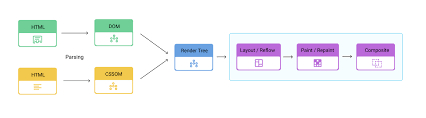

# Что такое [браузер](../http_https/http_https.md) и как он устроен

Каждый день ты открываешь браузер, не задумываясь — просто вводишь [адрес](../ip_mac/ip_and_mac.md) и видишь страницу. Но браузер — это не просто «окошко в [интернет](../../../../1.2_natural_sciences/physics_in_everyday_life/Q26540.md)». Внутри него спрятана одна из самых сложных программ, которую люди когда-либо создавали. Современный браузер умеет исполнять [код](../../../../5.2_cybersecurity/cpp_fundamentals/1_introduction.md), строить трёхмерную графику, воспроизводить [видео](../../../information and media literacy/оценка_качества_изображений_и_видео.md) и работать почти как [операционная система](../../../operating system/articles/kernel.md).

Давай заглянем внутрь.



---

## Что такое браузер

**Браузер** (от английского *browser* — «тот, кто просматривает») — это [программа](../../../operating system/articles/process.md), которая:
1. Знает, как **запросить** страницу по сети (по протоколу [HTTP/HTTPS](../http_https/http_https.md))
2. Умеет **разобрать** полученный [HTML](../../../../7.1_art/modern_technological_art/articles/2.1_jodi.md), CSS и JavaScript
3. **Нарисует** страницу на экране так, как её задумал разработчик
4. Реагирует на **[действия](../../../../3.1_healthy_lifestyle/pervaya_pomoshch/ushibi_porezy_ozhogi/03_obschie_pravila_algorithm.md) пользователя** — клики, ввод, прокрутку

Браузер — это посредник между тобой и сервером. Без него HTML-файл выглядел бы как груда непонятного текста.

---

## Из чего состоит браузер

Внутри браузер состоит из нескольких крупных модулей, каждый из которых отвечает за свою задачу.

### 1. Пользовательский интерфейс (UI)

Это всё, что ты видишь: адресная строка, [кнопки](../../../../7.1_art/musical_instruments/articles/accordion.md) «Назад» и «Вперёд», вкладки, [закладки](../../../../4.2_thinking_and_working_information/how_to_search_information/articles/second_mind.md), меню. Именно через интерфейс ты управляешь браузером.

### 2. Движок браузера

Дирижёр всего оркестра. Движок браузера координирует остальные компоненты: получает команды от UI и передаёт их движку рендеринга. Он отвечает за то, чтобы все части работали вместе.

### 3. Движок рендеринга — «[сердце](../../../../3.1. healthy lifestyle/Sleep, nutrition, and adolescent energy/articles/the_energy_trap.md)» браузера

Это самый сложный и важный компонент. Именно он превращает HTML и CSS в картинку на экране.



[Работа](../../../../1.2_natural_sciences/physics_in_everyday_life/Q11382.md) движка рендеринга:

```
HTML-код                CSS-код
   │                       │
   ▼                       ▼
  DOM                    CSSOM
(дерево              (таблица стилей)
 элементов)
   │                       │
   └──────────┬────────────┘
              ▼
        Render Tree
    (что рисовать и как)
              │
              ▼
           Layout
    (где именно на экране)
              │
              ▼
            Paint
        (рисуем пиксели)
              │
              ▼
          Composite
    (слои → финальный экран)
```

**DOM** (Document Object Model) — это [дерево](../../../../1.2_natural_sciences/physics_in_everyday_life/Q487005.md) всех элементов [страницы](../../../operating system/articles/memory_management.md). Например, для такого HTML:
```html
<html>
  <body>
    <h1>Привет!</h1>
    <p>Это абзац.</p>
  </body>
</html>
```

DOM будет выглядеть как дерево:
```
html
 └── body
      ├── h1 ("Привет!")
      └── p ("Это абзац.")
```

**CSSOM** — то же самое, но для стилей. Браузер знает: «[заголовок](../http_https/http_https.md) h1 — красный, размер 24px, жирный».

Объединив DOM и CSSOM, браузер строит **Render Tree** — [список](../../../../5.2_cybersecurity/cpp_fundamentals/10_arrays.md) того, что нужно нарисовать. Потом рассчитывает точные [координаты](../../../../1.2_natural_sciences/physics_in_everyday_life/Q847073.md) каждого элемента (Layout), рисует [пиксели](../../../operating system/articles/window_manager.md) (Paint) и собирает всё в финальную картинку (Composite).

> **Знаешь ли ты?** Этот [процесс](../../../operating system/articles/process.md) — от получения HTML до картинки на экране — называется **Critical Rendering Path** (критический [путь](../../../../1.2_natural_sciences/physics_in_everyday_life/Q11476.md) рендеринга). Разработчики сайтов тратят много сил, чтобы ускорить его: каждая лишняя миллисекунда делает сайт медленнее и раздражает пользователей.

### 4. JavaScript-движок

HTML и CSS — статичные языки: они описывают, как страница выглядит. **JavaScript** делает страницу живой — кнопки реагируют на нажатия, [данные](../../../../2.1_society/cause_and_effect_relationships/articles/ai_causality.md) обновляются без перезагрузки, появляются анимации.

JavaScript-движок — это встроенный интерпретатор кода. Он читает JS-файл и исполняет команды: «добавь [элемент](../../../../1.2_natural_sciences/why_science_help_understand_world/chemistry.md)», «измени [цвет](../../../../1.2_natural_sciences/physics_in_everyday_life/Q1075.md)», «отправь [запрос](../http_https/http_https.md) на [сервер](../http_https/http_https.md)».

Самый известный JS-движок — **V8**, созданный компанией Google. Он используется в [Chrome](../history/internet_at_home.md) и в Node.js (для запуска JavaScript на сервере). Движок V8 компилирует JavaScript прямо в машинный код — это делает его невероятно быстрым.

| Браузер | JavaScript-движок |
|---------|------------------|
| Chrome, Edge | V8 (Google) |
| Firefox | SpiderMonkey (Mozilla) |
| Safari | JavaScriptCore (Apple) |

### 5. Сетевой [модуль](../../../../1.2_natural_sciences/physics_in_everyday_life/Q11402.md)

Именно этот компонент отправляет [HTTP-запросы](../http_https/http_https.md) на сервер и получает ответы. Он умеет:
- Работать с разными протоколами ([HTTP](../http_https/http_https.md)/1.1, HTTP/2, HTTP/3)
- Устанавливать [TLS-соединения](../http_https/tls.md) для [HTTPS](../http_https/http_https.md)
- Кэшировать загруженные файлы, чтобы не скачивать их повторно
- Выполнять несколько запросов одновременно

Когда браузер загружает страницу, сетевой модуль может параллельно тянуть десятки файлов — HTML, CSS, картинки, шрифты.

### 6. Хранилище данных

Браузер хранит разные данные на твоём компьютере:

| [Тип](../../../../5.2_cybersecurity/cpp_fundamentals/13_struct.md) хранилища | Что там хранится | Когда удаляется |
|---------------|-----------------|----------------|
| **[Cookies](../http_https/cookies.md)** | Сессии, настройки, [корзина](../http_https/cookies.md) | По сроку или вручную |
| **Cache** | Файлы сайтов (CSS, картинки) | Автоматически или вручную |
| **LocalStorage** | Данные приложений | Только вручную |
| **IndexedDB** | Большие структурированные данные | Только вручную |

Благодаря кэшу при повторном посещении сайта браузер не скачивает заново файлы, которые уже есть — страница открывается значительно быстрее.

---

## Как браузер обрабатывает страницу [шаг](../../../../1.2_natural_sciences/physics_in_everyday_life/Q36253.md) за шагом

Давай проследим полный цикл — от [URL](what_happens.md) до картинки:

1. **Ввод URL** → сетевой модуль получает задачу загрузить страницу
2. **DNS-запрос** → [IP-адрес](../ip_mac/ip_and_mac.md) сервера (или берётся из кэша)
3. **[TCP](../tcp_udp/tcp_udp.md) + [TLS](../http_https/http_https.md)** → установка соединения с сервером
4. **HTTP [GET](../http_https/http_https.md)** → запрос HTML-страницы
5. Сервер отвечает, браузер получает **HTML**
6. Движок рендеринга **читает HTML** и строит DOM
7. Находит ссылки на CSS и JS → сетевой модуль **скачивает их параллельно**
8. Строит **CSSOM** из CSS
9. Объединяет DOM и CSSOM → **Render Tree**
10. **Layout** — вычисляет размеры и [позиции](../../../../7.1_art/musical_instruments/articles/trombone.md)
11. **Paint** — рисует пиксели
12. **Composite** — финальная картинка на экране
13. JS-движок **исполняет скрипты** — страница становится интерактивной

Всё это происходит за сотни миллисекунд.

---

## Популярные браузеры

Сегодня в мире несколько основных браузеров. Все они делают одно и то же, но по-разному:

| Браузер | Разработчик | Движок рендеринга | Доля рынка |
|---------|------------|------------------|------------|
| **Chrome** | Google | Blink | ~65% |
| **Safari** | Apple | WebKit | ~19% |
| **Firefox** | Mozilla | Gecko | ~3% |
| **Edge** | Microsoft | Blink | ~5% |
| **Opera** | Opera Software | Blink | ~2% |

> **Знаешь ли ты?** Большинство браузеров сегодня используют движок **Blink** — это форк (ответвление) WebKit, который Google создал в 2013 году, когда решил отделиться от Apple. Так что Chrome, Edge и Opera в каком-то смысле «родственники».

### Что такое движок рендеринга

Движок рендеринга — это отдельный [проект](../../../../1.2_natural_sciences/why_science_help_understand_world/research_work.md), который браузер использует внутри себя. Разные браузеры могут использовать один и тот же движок. Три главных движка рендеринга:

- **Blink** — используют Chrome, Edge, Opera, Brave и многие другие
- **WebKit** — Safari (и все браузеры на iPhone из-за ограничений Apple)
- **Gecko** — только Firefox

Именно поэтому иногда сайт хорошо выглядит в Chrome, но криво — в Safari: движки по-разному интерпретируют некоторые CSS-правила.

---

## Расширения браузера

Браузер можно расширять с помощью **расширений** (extensions, add-ons) — небольших программ, которые добавляют новые возможности. Блокировщики рекламы, менеджеры паролей, переводчики, тёмные темы — всё это расширения.

Расширения работают внутри браузера и имеют доступ к содержимому страниц, что делает их потенциально опасными. Устанавливай расширения только из официальных магазинов и только от известных разработчиков.

---

## [Инструменты](../../../../1.2_natural_sciences/physics_in_everyday_life/Q36253.md) разработчика

В каждом браузере есть скрытая суперсила — **инструменты разработчика** (DevTools). Нажми `F12` или `Ctrl+Shift+I` — и ты увидишь настоящую «внутренность» любой страницы:

- **Elements** — дерево DOM: можно увидеть и изменить HTML и CSS прямо в браузере
- **Console** — [консоль](../../../../../8.1_entertainment/articles/history-of-games.md) JavaScript: можно запускать код
- **Network** — все сетевые запросы: что, откуда и за сколько загрузилось
- **Performance** — [анализ](../../../../1.2_natural_sciences/why_science_help_understand_world/research.md) скорости [работы](../../../../8.2_future/choosing_a_career_path/articles/interview.md) страницы

Профессиональные разработчики проводят в DevTools [часы](../../../../1.2_natural_sciences/physics_in_everyday_life/Q20702.md) каждый день. Попробуй сам — нажми F12 на любом сайте!

> **Знаешь ли ты?** Впервые инструменты разработчика появились в Firefox в виде расширения Firebug в 2006 году. Это была [революция](../../../../2.1_society/cause_and_effect_relationships/articles/lessons_of_history.md): разработчики впервые смогли «подсматривать» за тем, [что происходит](what_happens.md) внутри страницы в реальном времени.

---

## Интересные [факты](../../../../1.2_natural_sciences/physics_in_everyday_life/Q17737.md)

- **Первый браузер** — WorldWideWeb (позже переименован в Nexus) — был создан Тимом Бернерс-Ли в 1990 году. Он же написал первый [веб-сервер](server.md) и первую веб-страницу.
- **[Netscape](../history/internet_at_home.md) Navigator** (1994) стал первым массовым браузером. Его создатели потом основали Mozilla.
- **[Internet Explorer](../history/internet_at_home.md)** от Microsoft в своё [время](../../../../1.2_natural_sciences/physics_in_everyday_life/Q20702.md) занимал более 95% рынка. Сейчас он официально мёртв — Microsoft прекратила его поддержку в 2022 году.
- **Chrome** вышел в 2008 году и менее чем за 10 лет захватил больше половины рынка.
- Браузер **Safari** на iPhone — самый популярный мобильный браузер в мире, несмотря на то что доля iPhone меньше 30% рынка смартфонов.
- Код движка **V8** открыт — любой желающий может прочитать его на GitHub.

---

## Читай также

- [Что происходит, когда я открываю сайт?](what_happens.md) — полная картина: [DNS](../../../../4.2_thinking_and_working_information/how_to_search_information/articles/vpn_dns_proxy_anonymity_and_security.md), TCP, HTTP, рендеринг
- [HTTP и HTTPS](../http_https/http_https.md) — как браузер разговаривает с сервером
- [Что такое cookies и зачем они нужны](../http_https/cookies.md) — что браузер сохраняет на твоём компьютере
- [Что такое TLS и как работает шифрование](../http_https/tls.md) — как браузер защищает твои данные
- [Что такое сервер и где он находится](server.md) — с кем браузер разговаривает

---

Авторы: Арсений Григорян
*[Ресурсы](../../../../2.1_society/cause_and_effect_relationships/articles/ecological_footprint.md): [LLM](../../../../7.1_art/modern_technological_art/README.md) — Claude Sonnet 4.6, WikiData*