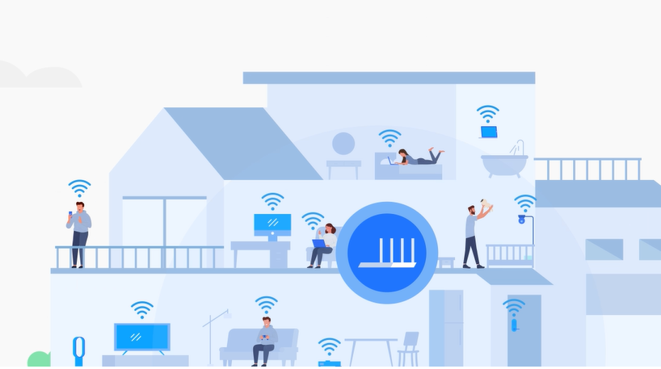
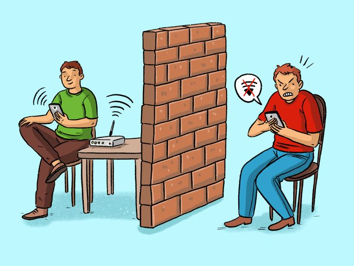
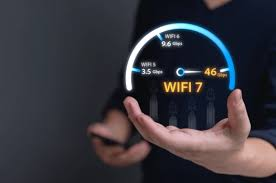

# [Wi-Fi](../history/internet_at_home.md) и [локальная](../../../../5.2_cybersecurity/cpp_fundamentals/9_scopes.md) [сеть](../history/internet_history.md): Тайные невидимые нити твоего дома

Привет, юный инженер! Если ты читаешь этот [текст](../../../../4.1_rules_of_study/how_to_learn_effectively/articles/reading_skills.md), значит, твой гаджет уже успешно проделал сложнейшую [работу](../../../../8.2_future/choosing_a_career_path/articles/interview.md): поймал из воздуха невидимые сигналы, расшифровал их и превратил в буквы на экране. Давай разберемся, как устроена эта «магия прямо под капотом» твоего смартфона.

---

## Глава 1. Рождение [идеи](../../../../7.2 Media, leisure and hobbies /useful_and_interesting_leisure/articles/free_leisure_activities.md): Как актриса придумала Wi-Fi
Мало кто знает, но в основе Wi-Fi лежит [история](../../../../1.2_natural_sciences/physics_in_everyday_life/Q11469.md), достойная [кино](../../../../7.2 Media, leisure and hobbies /what_you_can_read_and_watch_to_develop_your_taste/articles/z1.md). В 1940-х годах знаменитая голливудская актриса **Хеди Ламарр** вместе с композитором Джорджем Антейлом придумала систему «прыгающих частот». 

Зачем это было нужно? Во [время](../../../../1.2_natural_sciences/physics_in_everyday_life/Q20702.md) войны радиоуправляемые торпеды было легко сбить с курса, если заглушить их [сигнал](router.md) на одной частоте. Хеди придумала: а что, если передатчик и приемник будут постоянно и синхронно менять частоту? Тогда [враг](../../../../7.2 Media, leisure and hobbies/Computer games/articles/heroes_and_villains/main_villains.md) не сможет поймать сигнал! 

Спустя десятилетия эта идея легла в основу Wi-Fi. Теперь твой [роутер](router.md) и телефон тоже «прыгают» по разным каналам, чтобы не мешать другим устройствам. Так что каждый раз, когда ты заходишь в соцсетях, скажи «спасибо» голливудской звезде!

---

## Глава 2. Локальная сеть (LAN) — Твое личное цифровое государство

Представь, что [интернет](../../../../1.2_natural_sciences/physics_in_everyday_life/Q26540.md) — это огромная [планета](../../../../1.2_natural_sciences/physics_in_everyday_life/Q11423.md). Но твой дом — это отдельный [город](../../../../3.2 healthy lifestyle/how to act in a dangerous situation/articles/lost-in-city.md). Чтобы жители города могли общаться, им не обязательно выезжать за границу.

**Локальная сеть (Local Area Network, LAN)** — это объединение всех устройств в твоем доме. 
В нее входят:
1.  **[Смартфоны](../../../../1.2_natural_sciences/physics_in_everyday_life/Q170475.md) и планшеты.**
2.  **Ноутбуки и компьютеры.**
3.  **Умные вещи:** лампочки, пылесосы, чайники.
4.  **Сетевые хранилища:** диски, где лежат семейные [фото](../../../information and media literacy/проверка_фото_на_манипуляции.md).

**Зачем нужна локалка?**
*   **Обмен файлами:** Перекинуть [видео](../../../information and media literacy/оценка_качества_изображений_и_видео.md) с телефона на комп без интернета.
*   **Общие [ресурсы](../../../../2.1_society/cause_and_effect_relationships/articles/ecological_footprint.md):** Один принтер на всю семью.
*   **Умный дом:** Когда ты со смартфона выключаешь [свет](../../../../1.2_natural_sciences/physics_in_everyday_life/Q1.md) в коридоре, [команда](../../../../4.1_rules_of_study/how_to_learn_effectively/articles/peer_learning.md) не летит в Америку и обратно — она идет напрямую через роутер в локальной сети.

---
## Глава 3. Роутер — Великий Координатор

Если локальная сеть — это город, то **Роутер ([Маршрутизатор](../history/arpanet.md))** — это мэр, почтальон и пограничник в одном лице.

У роутера есть два «лица» (интерфейса):
1.  **LAN-порт:** Смотрит внутрь твоего дома. К нему подключаются твои [устройства](../../../operating system/articles/HAL.md) по Wi-Fi или кабелем.
2.  **WAN-порт:** В него воткнут провод от провайдера (компании, которой [родители](../../../../../8.1_self_understanding/articles/family_influence.md) платят за интернет). Этот [порт](../tcp_udp/tcp_udp.md) смотрит в большой мир.

**Как работает роутер?**
Когда ты отправляешь [сообщение](../../../../3.2 healthy lifestyle/how to act in a dangerous situation/articles/phishing-links.md) другу, роутер смотрит на его [адрес](../ip_mac/ip_and_mac.md). Если адрес «домашний» (например, папин ноутбук), роутер мгновенно передает его внутри. Если адрес «внешний» ([сервер](../http_https/http_https.md) игры Roblox), роутер упаковывает [данные](../../../../2.1_society/cause_and_effect_relationships/articles/ai_causality.md) и отправляет их в WAN-порт.

---

## Глава 4. [Физика](../../../../1.2_natural_sciences/physics_in_everyday_life/Q11023.md) Wi-Fi: Как данные превращаются в [волны](../../../../1.2_natural_sciences/physics_in_everyday_life/Q136980.md)

Wi-Fi работает на радиоволнах. Представь, что роутер — это очень быстрый фонарик, который мигает миллионы раз в секунду. Только мигает он не светом, а невидимым радиоизлучением.

### Частоты: 2.4 [ГГц](radio.md) и 5 ГГц
Это как две разные дороги для данных:
*   **2.4 ГГц:** Это «старая сельская дорога». Она длинная, сигнал проходит через стены хорошо, но на ней много пробок. По ней ездят старые телефоны, микроволновки и даже радионяни. [Скорость](../../../../1.2_natural_sciences/physics_in_everyday_life/Q11402.md) тут небольшая.
*   **5 ГГц:** Это «современный автобан». Скорость огромная, пробок нет, но стены для этой частоты — большая преграда. Сигнал быстро затухает.

**Интересный [факт](../../../../1.2_natural_sciences/why_science_help_understand_world/science.md):** Почему [микроволновка](../../../../6.1_Independent_living_and_daily_living_skills/Simple_and_safe_cooking/articles/safe_use_of_kitchen_appliances.md) мешает Wi-Fi? Потому что она греет еду именно на частоте 2.4 ГГц! [Молекулы](../../../../1.2_natural_sciences/physics_in_everyday_life/Q11435.md) воды начинают дрожать от этих волн и нагреваться. Твой роутер работает на той же частоте, но его [мощность](../../../../1.2_natural_sciences/physics_in_everyday_life/Q25236.md) в тысячи раз меньше, поэтому он не поджарит твой [завтрак](../../../../3.1. healthy lifestyle/Sleep, nutrition, and adolescent energy/articles/breakfast_for_the_brain.md), но его сигнал может «утонуть» в шуме работающей печки.

---

## Глава 5. [Точка доступа](router.md) и репитеры: Расширяем границы

Бывает так: роутер стоит в одной комнате, а в дальней спальне интернет «не ловит». Что делать?
1.  **Точка доступа ([Access Point](router.md)):** Это [устройство](../../../../1.2_natural_sciences/physics_in_everyday_life/Q178032.md), которое проводом соединяется с роутером и «раздает» качественный Wi-Fi в новом месте.
2.  **[Репитер](router.md) ([Повторитель](router.md)):** Это как [эхо](../../../../1.2_natural_sciences/physics_in_everyday_life/Q83301.md). Он ловит слабый сигнал Wi-Fi и переизлучает его дальше. Минус в [том](../../../../7.1_art/musical_instruments/articles/drums.md), что скорость при этом падает в два раза, так как устройству нужно тратить время и на прием, и на передачу.
3.  **Mesh-системы:** Самое современное [решение](../../../../2.1_society/cause_and_effect_relationships/articles/personal_choice.md). Это группа одинаковых роутеров, которые расставлены по дому и создают одну огромную «сеть-паутину». Ты можешь ходить по дому, а твой телефон будет незаметно переключаться между ними без обрыва связи.

---

## Глава 6. [Провода](../../../../1.2_natural_sciences/physics_in_everyday_life/Q124291.md) против [Радио](../../../../7.2 Media, leisure and hobbies/Computer games/articles/how_it_all_started/tennis_on_tv.md): Вечная битва

Почему Wi-Fi иногда бесит? Потому что [радиоволны](../../../../1.2_natural_sciences/physics_in_everyday_life/Q12969754.md) нестабильны.
*   **Провод (Ethernet):** Это как ехать на поезде по рельсам. Ты всегда приедешь вовремя, никто тебе не перегородит [путь](../../../../1.2_natural_sciences/physics_in_everyday_life/Q11476.md). Скорость стабильная, задержек нет.
*   **Wi-Fi:** Это как лететь на вертолете. Удобно, нет привязки к земле, но сильный ветер (соседский роутер) или [гроза](../../../../3.2 healthy lifestyle/how to act in a dangerous situation/articles/thunderstorm-safety.md) (толстая стена) могут всё испортить.

**[Задержка](../dns/cdn.md) (Ping):** Для геймеров это критично. В Wi-Fi [пакеты данных](../../../operating system/articles/file_system.md) иногда теряются в воздухе, и их приходится переотправлять. Это создает «[лаги](../tcp_udp/tcp_udp.md)». Поэтому для серьезных киберспортивных побед лучше использовать старый добрый кабель.

---

## Глава 7. [Безопасность](../../../../1.2_natural_sciences/neurobiology_for_teens/articles/17_hugs_oxytocin.md): Как воришки могут украсть твой интернет?

Поскольку Wi-Fi летает в воздухе, его может поймать кто угодно — даже [человек](../../../../1.2_natural_sciences/physics_in_everyday_life/Q45003.md), сидящий в машине под твоими окнами.
Для защиты придумали [шифрование](../http_https/http_https.md):
1.  **[WPA2](security.md) / [WPA3](security.md):** Это современные стандарты защиты. Когда ты вводишь [пароль](../../../../3.2 healthy lifestyle/how to act in a dangerous situation/articles/internet-safety.md), роутер и телефон договариваются о «секретном языке». Даже если сосед перехватит твой сигнал, он увидит там просто кашу из символов.
2.  **Открытые сети (в кафе):** Это опасно! Там нет шифрования. [Хакер](security.md) может сидеть за соседним столиком и видеть, на какие сайты ты заходишь. Никогда не вводи пароли от важных сервисов в открытых сетях!

---

## Глава 8. [Связь](../../../../1.2_natural_sciences/physics_in_everyday_life/Q12969754.md) с другими уровнями интернета

Wi-Fi — это только фундамент [здания](../../../../1.2_natural_sciences/physics_in_everyday_life/Q83301.md). 
*   **[MAC-адрес](../ip_mac/ip_and_mac.md):** Каждое устройство в Wi-Fi сети имеет свой уникальный физический номер. Это позволяет роутеру понять: «О, этот [пакет](../tcp_udp/tcp_udp.md) данных предназначен для iPhone Коли, а не для ноутбука его сестры». Подробнее об этом в статье [IP и MAC-адреса](../ip_mac/ip_and_mac.md).
*   **[TCP](../tcp_udp/tcp_udp.md)/[UDP](../tcp_udp/tcp_udp.md):** Когда Wi-Fi обеспечил «трубу» для данных, по ней потекли пакеты. Одни требуют строгой проверки (TCP), другие летят напролом ([UDP](../tcp_udp/tcp_udp.md)). Но им плевать, летят они по проводу или по воздуху — Wi-Fi для них просто [транспорт](../../../../1.2_natural_sciences/physics_in_everyday_life/Q1751973.md).
*   **[DNS](../../../../4.2_thinking_and_working_information/how_to_search_information/articles/vpn_dns_proxy_anonymity_and_security.md):** Когда ты вводишь `google.com`, твой [запрос](../http_https/http_https.md) сначала летит по Wi-Fi к роутеру, а тот перенаправляет его в «телефонную книгу» интернета. [DNS](../dns/dns.md)

---

## Глава 9. Интернет вещей (IoT): [Будущее](../../../../1.2_natural_sciences/physics_in_everyday_life/Q11469.md) Wi-Fi

Мы привыкли, что Wi-Fi нужен для YouTube. Но скоро всё изменится. 
**IoT — Internet of Things.** Твой чайник будет писать в [чат](../../../../7.2 Media, leisure and hobbies/Computer games/articles/useful_tips/toxic_players.md): «[Вода](../../../../3.1. healthy lifestyle/Sleep, nutrition, and adolescent energy/articles/drinking_regime.md) закипела!», а кроссовки будут жаловаться роутеру, что ты сегодня мало прошел. 
Для этого придумали специальные версии Wi-Fi, которые потребляют очень мало энергии. Батарейка в датчике протечки воды может работать 5 лет, постоянно находясь в сети.

---

## Глава 10. [Заключение](../../../../1.2_natural_sciences/physics_in_everyday_life/Q2225.md)

Wi-Fi и локальная сеть — это начало начал. Как только ты нажимаешь кнопку на экране, твой запрос превращается в радиоволну, пролетает по комнате, попадает в роутер и начинает свое долгое путешествие к серверам в далеких странах. 
Без этого «нижнего уровня» весь остальной интернет (сайты, видео, игры) был бы просто недосягаем. Помни: хороший роутер и правильное расположение — залог того, что твои пакеты данных всегда долетят до [цели](../../../../3.1_healthy_lifestyle/pervaya_pomoshch/ushibi_porezy_ozhogi/02_celi_pervoy_pomoshchi.md) быстро и без потерь!

---

*Хочешь узнать, как пакеты данных находят дорогу в глобальной сети? Читай статью **«[IP](../ip_mac/ip_and_mac.md) и MAC-адреса»**!*
*Если интересно чем WiFi отличается от мобильный данных, тогда читай [WiFi vs Мобильный интернет](./wifi_vs_mobile_net.md)*
*Если интересно, как устроен роутер, то читай [Устройство роутера](./router.md)*
[Автор](../../../../4.2_thinking_and_working_information/how_to_search_information/articles/copypaste.md): Koval Mete
Данные: WikiData (Q11348, Q11661, Q82470, Q165234), RFC 1034, RFC 1035, RFC 1918, RFC 2637, IEEE 802.11-2020.
Ресурсы: [LLM](../../../../7.1_art/modern_technological_art/README.md) — Gemini 3 Flash
