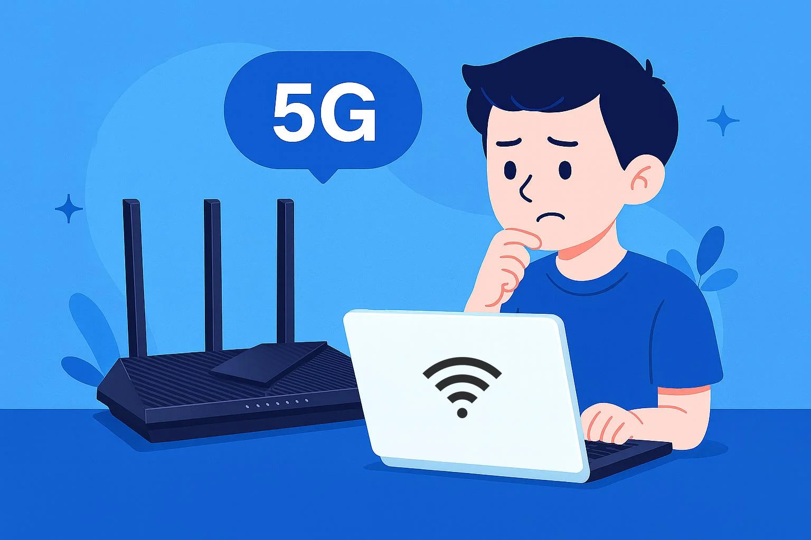

### «Битва Титанов: [Wi-Fi](../history/internet_at_home.md) против мобильного интернета (4G/5G)»

В современном мире мы привыкли, что [интернет](../../../../1.2_natural_sciences/physics_in_everyday_life/Q26540.md) есть везде: в кармане через сим-карту и дома через [роутер](router.md). На первый взгляд кажется, что это одно и то же — ведь и там, и там нет проводов. Однако это две принципиально разные [технологии](../../../../2.2_history/world_economy_on_fingers/articles/globalizatsiya.md), которые работают на разных физических принципах и решают разные [задачи](../../../../1.2_natural_sciences/why_science_help_understand_world/research_work.md). Если Wi-Fi — это твой личный «домашний лифт», то мобильная [сеть](../history/internet_history.md) (LTE/5G) — это огромный «городской метрополитен».

Давай проведем детальное [сравнение](../../../../5.2_cybersecurity/cpp_fundamentals/5_operators.md) и поймем, почему одно не может полностью заменить другое.

#### 1. Радиус [действия](../../../../3.1_healthy_lifestyle/pervaya_pomoshch/ushibi_porezy_ozhogi/03_obschie_pravila_algorithm.md) и архитектура сети
Самое заметное различие — это масштаб вещания.
*   **Wi-Fi (WLAN):** Это технология малого радиуса. [Сигнал](router.md) от твоего роутера затухает уже через 20–50 метров, особенно если на пути есть бетонные стены. Wi-Fi создает локальный «[пузырь](../../../information and media literacy/алгоритмы_и_пузырь_фильтров.md)» интернета вокруг одной точки.
*   **Мобильная сеть (WWAN):** Здесь работают базовые станции — огромные мачты с мощными передатчиками. Один такой «столб» покрывает территорию в несколько километров. Твой телефон постоянно сканирует эфир и переключается от одной вышки к другой, пока ты едешь в автобусе. Этот [процесс](../../../operating system/articles/process.md) называется **хендовер** (handover) — сеть «передает» тебя из рук в руки, чтобы [связь](../../../../1.2_natural_sciences/physics_in_everyday_life/Q12969754.md) не прерывалась.

#### 2. Кто «сосед» по эфиру? (Проблема перегрузок)
Представь радиоэфир как шоссе. 
*   В **Wi-Fi** на этом шоссе только твои домашние [устройства](../../../operating system/articles/HAL.md). Если у тебя быстрый тариф, ты единоличный владелец полосы движения. Проблемы начинаются только если [соседи](../../../../2.1_society/how_and_where_find_friends/articles/druzhba_s_sosedyami.md) за стеной используют те же частоты (каналы), создавая [помехи](radio.md).
*   В **4G/5G** на одной «полосе» с тобой сидят сотни и тысячи людей. Базовая станция делит свою общую [скорость](../../../../1.2_natural_sciences/physics_in_everyday_life/Q11402.md) на всех. Именно поэтому днем в центре города мобильный интернет может «тормозить», а поздно ночью — «летать». На стадионах или концертах мобильные сети часто отказывают именно потому, что вышка не может обработать запросы от 10-20 тысяч смартфонов одновременно.

#### 3. [Задержка](../dns/cdn.md) (Ping) и [гейминг](../../../../7.2 Media, leisure and hobbies /useful_and_interesting_leisure/articles/computer_games_with_benefit.md)
Для обычного чтения новостей задержка не важна, но для онлайн-игр она критична.
*   **Wi-Fi:** [Пакет](../tcp_udp/tcp_udp.md) данных летит от телефона до роутера за 1–2 миллисекунды. Дальше он сразу уходит в оптоволоконный кабель провайдера. Это обеспечивает минимальный «[пинг](../tcp_udp/online_games.md)».
*   **Мобильная сеть:** Прежде чем попасть в интернет, твой сигнал должен пройти сложную систему проверки у оператора, преодолеть большое [расстояние](../../../../1.2_natural_sciences/physics_in_everyday_life/Q11412.md) до вышки и подстроиться под постоянно меняющиеся условия приема. Даже в сетях 5G, которые позиционируются как сверхбыстрые, задержка часто выше, чем у домашнего Wi-Fi. Если ты профи-игрок в Counter-Strike или PUBG, Wi-Fi (а еще лучше — провод) — твой единственный [выбор](../../../../2.1_society/cause_and_effect_relationships/articles/personal_choice.md).

#### 4. Энергоэффективность: Бережем аккумулятор
Это малоизвестный [факт](../../../../1.2_natural_sciences/why_science_help_understand_world/science.md), но [тип](../../../../5.2_cybersecurity/cpp_fundamentals/13_struct.md) подключения напрямую влияет на то, как часто ты заряжаешь телефон.
*   **Мобильные [данные](../../../../2.1_society/cause_and_effect_relationships/articles/ai_causality.md):** Чтобы отправить сигнал на вышку за 1–2 километра, усилителю в смартфоне требуется серьезная [мощность](../../../../1.2_natural_sciences/physics_in_everyday_life/Q25236.md). Если сигнал слабый (одна «палочка»), телефон выкручивает мощность антенны на [максимум](../../../../1.2_natural_sciences/physics_in_everyday_life/Q136980.md), и батарейка «тает» на глазах.
*   **Wi-Fi:** Роутер находится всего в нескольких метрах. Смартфону достаточно работать на минимальной мощности передатчика. Использование Wi-Fi вместо 4G может сэкономить до 20–30% заряда батареи при активном веб-серфинге.

#### 5. [Стоимость](../../../../6.1_Independent_living_and_daily_living_skills/reasonable_spending/articles/price.md) и ограничения (Экономика)
*   **Домашний интернет (через Wi-Fi):** Обычно это безлимитные тарифы. Ты платишь фиксированную сумму в месяц и можешь качать хоть терабайты данных, подключая 10 компьютеров и 5 телевизоров.
*   **Мобильный интернет:** Операторы часто ограничивают [объем](../../../../1.2_natural_sciences/physics_in_everyday_life/Q11435.md) данных (пакеты гигабайт). Кроме того, за функцию «раздачи интернета» ([режим](../../../../4.1_rules_of_study/how_to_learn_effectively/articles/breaks_and_rest.md) модема) с телефона часто просят отдельную плату. 

#### 6. Стандарт 5G: Убийца Wi-Fi?

С появлением 5G многие заговорили, что Wi-Fi больше не нужен. 5G действительно очень быстрый. Но есть проблема: [волны](../../../../1.2_natural_sciences/physics_in_everyday_life/Q136980.md) 5G еще хуже проходят через стены, чем Wi-Fi 5 [ГГц](radio.md). Чтобы 5G работал внутри помещений так же хорошо, как Wi-Fi, операторам пришлось бы ставить мини-вышки в каждой комнате. Поэтому в ближайшие 10–20 лет эти технологии будут жить дружно: Wi-Fi — для помещений, 4G/5G — для улицы и путешествий.

---
**Итог:** Wi-Fi — это про стабильность, экономию батареи, [низкий](../../../../7.1_art/musical_instruments/articles/bassoon.md) пинг и бесплатную раздачу на все свои [гаджеты](../../../../3.1. healthy lifestyle/Sleep, nutrition, and adolescent energy/articles/gadgets_blue_light_sleep.md) дома. Мобильный интернет — это про свободу передвижения. Если ты дома — всегда включай Wi-Fi, твой телефон (и кошелек родителей) скажут тебе спасибо.

[Автор](../../../../4.2_thinking_and_working_information/how_to_search_information/articles/copypaste.md): Koval Mete
Данные: WikiData (Q35032, Q11348, Q201712), RFC 2481, 3GPP TS 36.300 (LTE), IEEE 802.11ax.
[Ресурсы](../../../../2.1_society/cause_and_effect_relationships/articles/ecological_footprint.md): [LLM](../../../../7.1_art/modern_technological_art/README.md) — Gemini 3 Flash
