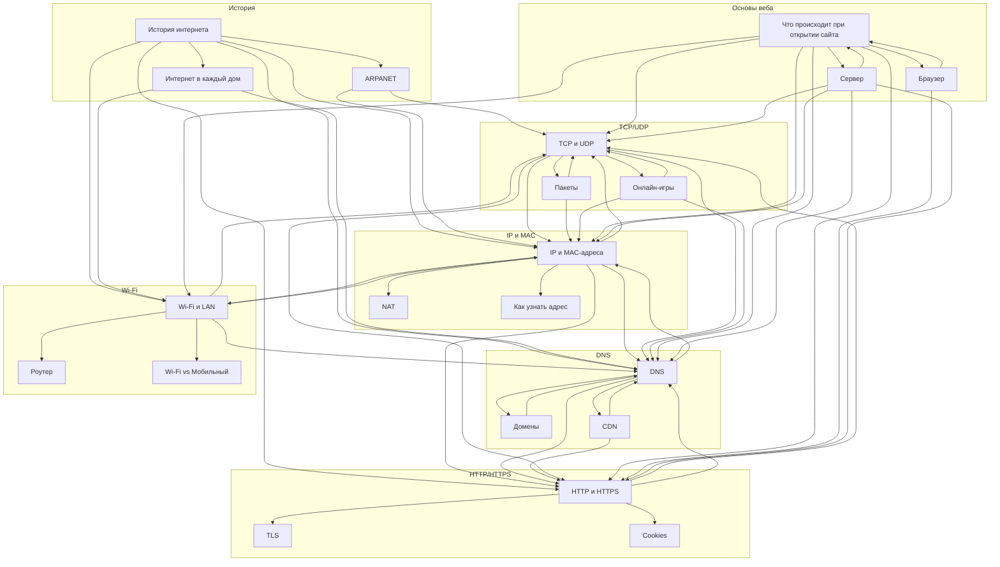

# Оглавление: как работает интернет

**Номер команды:** 9
**Дата создания:** 2026-03-19
**Родительская тема:** Технологии и цифровая грамотность

## Описание

Этот документ — центральная навигационная страница по разделу «Как работает интернет».
Здесь собраны все статьи в удобном порядке, чтобы быстро переходить к нужной теме и выстраивать последовательное изучение материала.

Раздел охватывает ключевые направления:
- историю возникновения и развития интернета — от военных лабораторий до каждого кармана;
- физический и адресный уровни: как устройства находят друг друга через IP, MAC и DNS;
- транспортный уровень: как данные делятся на пакеты и доставляются по TCP или UDP;
- прикладной уровень: как браузер разговаривает с сервером через HTTP/HTTPS;
- беспроводные сети: Wi-Fi, роутеры и отличие от мобильного интернета;
- основы веба: что происходит при открытии сайта, как устроены браузер и сервер.

Статьи можно читать по порядку — от истории к техническим деталям — или выборочно по конкретной теме (например, «DNS», «TCP vs UDP», «HTTPS», «Wi-Fi»).

---

## Содержание

### История интернета

1. [История интернета](./articles/history/internet_history.md) — путь от четырёх компьютеров до миллиардов устройств
2. [ARPANET: первая сеть](./articles/history/arpanet.md) — как военный проект дал жизнь глобальной сети
3. [Как интернет пришёл в каждый дом](./articles/history/internet_at_home.md) — модемы, провайдеры, браузеры и Wi-Fi

### IP и MAC-адреса

4. [IP и MAC-адреса](./articles/ip_mac/ip_and_mac.md) — два вида адресов: серийный номер устройства и его место в сети
5. [Что такое NAT и почему у всех дома один внешний IP](./articles/ip_mac/nat.md) — как роутер делит один адрес между всеми устройствами
6. [Как узнать свой IP и MAC-адрес](./articles/ip_mac/how_to_find_address.md) — пошаговая инструкция для Windows, macOS и Linux

### DNS и домены

7. [DNS: телефонная книга интернета](./articles/dns/dns.md) — как имена сайтов превращаются в числовые адреса
8. [Домены: как занять своё место в интернете](./articles/dns/domains.md) — что такое домен, как его купить и как он устроен
9. [CDN: как интернет становится молниеносным](./articles/dns/cdn.md) — сеть доставки контента и зачем она нужна

### TCP, UDP и пакеты

10. [TCP и UDP: два способа доставить данные](./articles/tcp_udp/tcp_udp.md) — надёжная доставка vs быстрая, и когда что использовать
11. [Что такое пакет и как данные делятся на части](./articles/tcp_udp/packet.md) — инкапсуляция, MTU, фрагментация и путь пакета
12. [Как работает онлайн-игра изнутри](./articles/tcp_udp/online_games.md) — tick rate, пинг, UDP и TCP в играх

### HTTP, HTTPS и безопасность

13. [HTTP и HTTPS: как браузер разговаривает с сервером](./articles/http_https/http_https.md) — запросы, ответы, методы, коды статусов и шифрование
14. [TLS: как работает шифрование в HTTPS](./articles/http_https/tls.md) — сертификаты, рукопожатие и виды ключей
15. [Cookies: как сайты тебя запоминают](./articles/http_https/cookies.md) — что хранят файлы cookie и как ими управлять

### Wi-Fi и беспроводные сети

16. [Wi-Fi и локальная сеть](./articles/wifi/wifi.md) — радиоволны, роутер, LAN и история изобретения
17. [Устройство роутера](./articles/wifi/router.md) — как работает главный узел домашней сети
18. [Wi-Fi vs мобильный интернет](./articles/wifi/wifi_vs_mobile_net.md) — сравнение технологий, плюсы и минусы

### Основы веба

19. [Что происходит, когда я открываю сайт?](./articles/web_basics/what_happens.md) — полный путь от нажатия Enter до страницы на экране: DNS, TCP, HTTP, рендеринг
20. [Что такое браузер и как он устроен](./articles/web_basics/browser.md) — движки рендеринга, JavaScript, DevTools и популярные браузеры
21. [Что такое сервер и где он находится](./articles/web_basics/server.md) — железо, дата-центры, веб-серверы, CDN и облака

---

## Карта связей между статьями



---

## Mindmap структуры раздела

```markmap
# Как работает интернет

## История
- [История интернета](./articles/history/internet_history.md)
- [ARPANET: первая сеть](./articles/history/arpanet.md)
- [Как интернет пришёл в каждый дом](./articles/history/internet_at_home.md)

## IP и MAC-адреса
- [IP и MAC-адреса](./articles/ip_mac/ip_and_mac.md)
  - IPv4 и IPv6
  - ARP и MAC-адреса
  - Шестнадцатеричная система
- [NAT](./articles/ip_mac/nat.md)
  - Один внешний IP на всю сеть
- [Как узнать свой адрес](./articles/ip_mac/how_to_find_address.md)
  - Windows, macOS, Linux

## DNS и домены
- [DNS](./articles/dns/dns.md)
  - DNS-запрос пошагово
  - Типы записей
  - Кеширование и TTL
- [Домены](./articles/dns/domains.md)
  - TLD, субдомены
  - Как купить домен
  - WHOIS
- [CDN](./articles/dns/cdn.md)
  - Edge-серверы
  - Cloudflare, Akamai

## TCP, UDP и пакеты
- [TCP и UDP](./articles/tcp_udp/tcp_udp.md)
  - 3-way handshake
  - Порты и сокеты
- [Пакеты](./articles/tcp_udp/packet.md)
  - Заголовок и payload
  - Инкапсуляция OSI
  - MTU и фрагментация
- [Онлайн-игры](./articles/tcp_udp/online_games.md)
  - Tick rate и пинг
  - UDP для игр, TCP для данных
  - QUIC

## HTTP, HTTPS и безопасность
- [HTTP и HTTPS](./articles/http_https/http_https.md)
  - Методы GET, POST...
  - Коды статусов
  - HTTP/1.1, HTTP/2, HTTP/3
- [TLS](./articles/http_https/tls.md)
  - Рукопожатие
  - Сертификаты и CA
- [Cookies](./articles/http_https/cookies.md)
  - Зачем сайты тебя запоминают
  - Управление куки

## Wi-Fi и беспроводные сети
- [Wi-Fi и LAN](./articles/wifi/wifi.md)
  - История: Хеди Ламарр
  - 2.4 ГГц vs 5 ГГц
  - WPA2/WPA3
- [Роутер](./articles/wifi/router.md)
  - LAN и WAN порты
  - DHCP, NAT
- [Wi-Fi vs Мобильный](./articles/wifi/wifi_vs_mobile_net.md)
  - 4G, 5G
  - Плюсы и минусы

## Основы веба
- [Что происходит при открытии сайта](./articles/web_basics/what_happens.md)
  - URL и его части
  - DNS → TCP → HTTP → рендеринг
  - Хронология за 300 мс
- [Браузер](./articles/web_basics/browser.md)
  - DOM и CSSOM
  - Движки: Blink, WebKit, Gecko
  - JavaScript-движок V8
  - DevTools
- [Сервер](./articles/web_basics/server.md)
  - Статические и динамические сайты
  - Nginx, Apache
  - Дата-центры
  - Облако и CDN
```

---

**Сервис генерации:** Claude Sonnet 4.6
**Дата генерации:** 2026-03-19
