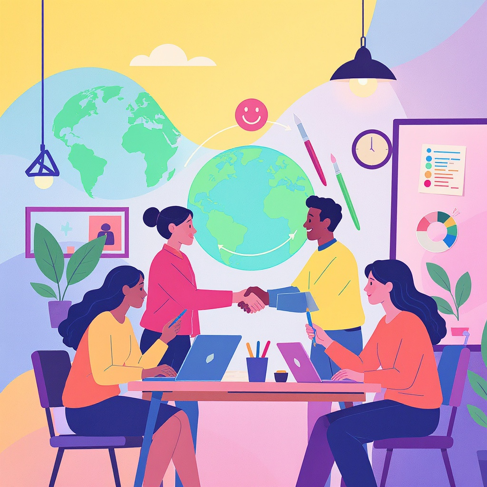

# Авторское [право](../авторское_право_и_честное_использование.md) и честное использование

**Wiki** [Wikidata](https://www.wikidata.org/wiki/Q1297822)  
**Parent topic** Информационная и [медиаграмотность](../что_такое_информационная_и_медиаграмотность.md)  

## Что такое [авторское право](../../../4.2_thinking_and_working_information/how_to_search_information/articles/copyright.md)?

**Авторское право** — это законная [защита](../пароли_и_двухфакторная_защита.md) творческих работ, таких как [книги](../../../7.2_leisure/useful_and_interesting_leisure/articles/reading_and_self_education.md), [музыка](../../../8.1_entertainment/articles/music.md), [фильмы](../../../7.2 Media, leisure and hobbies /what_you_can_read_and_watch_to_develop_your_taste/articles/z1.md), картины, [видеоигры](../../../7.1_art/modern_technological_art/articles/3.1_uncensored_library.md), программное обеспечение и даже школьные проекты. Когда кто-то создаёт что-то оригинальное — например, рисунок, стихотворение или [видео](../оценка_качества_изображений_и_видео.md) — он автоматически становится его **автором** и получает исключительные права на его использование.

> 📌 **Важно:** Авторское право возникает автоматически — не нужно регистрировать [работу](../../../8.2_future/choosing_a_career_path/articles/interview.md) в офисе. Даже если ты опубликовал свой рассказ в Telegram или на YouTube, ты уже его владелец!

Авторское право даёт автору [право](../авторское_право_и_честное_использование.md):
- решать, кто может использовать его работу;
- требовать вознаграждение за использование;
- запрещать копирование без разрешения.

Но есть исключения — например, **честное использование**.

---

## Что такое честное использование?

**Честное использование** (*fair use* на английском) — это законное исключение из [авторского права](../../../4.2_thinking_and_working_information/how_to_search_information/articles/copyright.md), которое позволяет использовать защищённые [материалы](../../../1.2_natural_sciences/physics_in_everyday_life/Q487005.md) **без разрешения автора**, если это делается для определённых целей: образование, [критика](../../../8.1_self-understanding/HowToFindYourStrengths/articles/impostor_syndrome.md), [комментарии](../../../4.2_thinking_and_working_information/how_to_search_information/articles/cooperative_work.md), исследования или пародия.

### 🔍 Примеры честного использования:
- Ты пишешь рецензию на [фильм](../../../8.1_entertainment/articles/movie.md) и показываешь 10-секундный клип, чтобы проиллюстрировать свою точку зрения.
- Учитель показывает фрагмент мультфильма на уроке литературы для анализа стиля.
- Ты создаёшь [мем](../../../7.2 Media, leisure and hobbies/Computer games/articles/game_culture/game_memes.md) из кадра фильма с подписью, которая меняет смысл — это может считаться пародией.

### ❌ А вот что **НЕ** считается честным использованием:
- Скачать весь [фильм](../../../../8.1_entertainment/articles/movie.md) и загрузить его на YouTube, чтобы заработать на рекламе.
- Использовать песню из Spotify в школьном [видео](../оценка_качества_изображений_и_видео.md) без указания автора и без [цели](../../../3.1_healthy_lifestyle/pervaya_pomoshch/ushibi_porezy_ozhogi/02_celi_pervoy_pomoshchi.md) анализа.
- Копировать целую главу из учебника и выкладывать в Telegram-канал.

> 💡 **Запомни:** Честное использование — это не "я просто не стал спрашивать". Это **законный принцип**, основанный на балансе между правами автора и правом общества на доступ к информации.

---

## Четыре критерия честного использования

Чтобы понять, можно ли использовать чужую работу — спроси себя по этим четырём пунктам:

| Критерий | Вопрос | Пример |
|---------|--------|--------|
| **1. [Цель](../../../1.2_natural_sciences/why_science_help_understand_world/research_work.md) использования** | Используется ли [работа](../../../1.2_natural_sciences/physics_in_everyday_life/Q11382.md) для образования, критики или анализа? | ✅ Ученик анализирует [текст](../../../4.1_rules_of_study/how_to_learn_effectively/articles/reading_skills.md) песни на уроке литературы. |
| **2. [Природа](../../../1.2_natural_sciences/why_science_help_understand_world/nature.md) защищённого произведения** | Это [факт](../../../1.2_natural_sciences/why_science_help_understand_world/science.md) (например, [новость](../информационная_диета.md)) или творческая работа (например, фильм)? | ✅ Использование фактов — легче. Использование художественного фильма — сложнее. |
| **3. [Объём](../../../1.2_natural_sciences/physics_in_everyday_life/Q39297.md) используемого фрагмента** | Ты взял мало или почти всё? | ✅ 15 секунд из 2-часового фильма — OK. Весь фильм — нет. |
| **4. [Влияние](../манипуляции_и_пропаганда.md) на [рынок](../../../2.1_society/cause_and_effect_relationships/articles/economic_chains.md)** | Твоё использование заменяет покупку оригинала? | ❌ Если все школьники смотрят твой скопированный учебник — [автор](../авторское_право_и_честное_использование.md) теряет [доход](../../../6.1_Independent_living_and_daily_living_skills/reasonable_spending/articles/income.md). |

Эти критерии не являются жёсткими правилами — их оценивают вместе. Но если ты ответил «да» на первый и третий, и «нет» на четвёртый — скорее всего, твоё использование **честное**.

---

## Частые [ошибки](../../../3.1_healthy_lifestyle/pervaya_pomoshch/ushibi_porezy_ozhogi/07_ushib_chego_nelzya.md) школьников и родителей

Вот что **часто ошибочно считают** разрешённым:

- ❌ *«Я указал автора — значит, можно использовать»*  
  → Нет! Указание автора — это этично, но не делает использование законным без разрешения.

- ❌ *«Это же в интернете — значит, бесплатно»*  
  → Нет! Даже если видео на YouTube «бесплатное», оно защищено авторским правом.

- ❌ *«Я не зарабатываю — значит, не нарушение»*  
  → Не всегда. Даже без прибыли можно нарушить права, если ты заменяешь оригинальный продукт.

- ❌ *«Это для школы — значит, всё можно»*  
  → Не совсем. Учитель может использовать материалы в классе, но выкладывать их в открытый [интернет](../../../1.2_natural_sciences/physics_in_everyday_life/Q26540.md) — уже рискованно.

> 🚨 **Предупреждение:** Платформы вроде YouTube и Instagram могут удалить твой [контент](../информационная_диета.md), даже если ты не знал, что нарушал [закон](../../../2.1_society/cause_and_effect_relationships/articles/law_and_inevitability.md). Иногда — и заблокировать [аккаунт](../информационная_безопасность_для_детей.md).

---

## Мини-чек-лист: Можно ли использовать?

Перед тем как использовать чужую работу — пройди этот простой чек-лист:

- [ ] Я использую только **небольшую часть** оригинала (не более 10–15%)
- [ ] Я **не копирую полностью** — добавляю своё [объяснение](../../../4.1_rules_of_study/how_to_learn_effectively/articles/teaching_others.md), [анализ](../../../1.2_natural_sciences/why_science_help_understand_world/research.md) или критику
- [ ] Я **указываю автора и [источник](../дезинформация_и_фейки.md)** (даже если не обязан)
- [ ] Я **не заменяю** оригинальный продукт (например, не выкладываю весь учебник)
- [ ] Я **не использую это для коммерции** (продажа, реклама, [монетизация](../../../8.1_self-understanding/HowToFindYourStrengths/articles/talent_monetization.md))
- [ ] Я **проверяю лицензию** — если [материал](../../../1.2_natural_sciences/physics_in_everyday_life/Q25358.md) под [Creative Commons](../../../4.2_thinking_and_working_information/how_to_search_information/articles/copyright.md), читай условия

> ✅ Если на все [вопросы](../../../4.1_rules_of_study/how_to_learn_effectively/articles/curiosity.md) ответил «да» — ты в безопасности.  
> ❌ Если хотя бы один «нет» — ищи альтернативу.

---

## Где брать безопасные материалы?

Не все [ресурсы](../../../2.1_society/cause_and_effect_relationships/articles/ecological_footprint.md) требуют разрешения! Вот надёжные [источники](../../../4.2_thinking_and_working_information/how_to_search_information/articles/three_whales.md), где можно брать материалы **без риска**:

| Ресурс | Что даёт | Примечание |
|--------|----------|------------|
| [Unsplash](https://unsplash.com/license) | Бесплатные фотографии | Можно использовать даже в коммерческих проектах |
| [Pixabay](https://pixabay.com/service/license-summary/) | [Фото](../проверка_фото_на_манипуляции.md), видео, [музыка](../../../1.2_natural_sciences/neurobiology_for_teens/articles/18_music_chills.md) | Указание автора не обязательно, но приветствуется |
| [YouTube Audio Library](https://www.youtube.com/audiolibrary) | Музыка и звуки | Можно использовать в видео — с указанием |
| [Creative Commons Search](https://search.creativecommons.org) | [Поиск](../../../3.2 healthy lifestyle/how to act in a dangerous situation/articles/lost-in-city.md) по лицензиям | Выбирай «разрешено для коммерческого использования» |
| [Library of Congress](https://www.loc.gov/collections/) | Исторические материалы | Многие [работы](../../../8.2_future/choosing_a_career_path/articles/interview.md) уже в общественном достоянии |

> 💬 Совет: Если ты не уверен — **спроси учителя или родителя**. Лучше перестраховаться, чем получить жалобу.

---

## Что делать, если тебя обвиняют в нарушении?

1. **Не паникуй.** Иногда это [ошибка](../логические_ошибки_в_медиа.md).
2. **Проверь, действительно ли ты нарушил** — используй чек-лист выше.
3. **Удали [контент](../информационная_диета.md)**, если он действительно нарушает [правила](../../../2.1_society/cause_and_effect_relationships/articles/why_rules_work.md).
4. **Напиши извинения**, если ты использовал материал без разрешения — это часто решает вопрос.
5. **Учись на ошибке.** Запомни: лучше сделать свою работу — чем копировать чужую.

---

## Почему это важно?

Авторское право — это не про «запреты», а про **[уважение](../этика_общения_в_сети.md) к труду других**. Ты сам можешь создать что-то уникальное — например, стихи, рисунок, видео. Ты хочешь, чтобы другие уважали твою работу? Тогда уважай и их.

> 🌱 **Полезная мысль:** Честное использование — это не про «как можно больше взять», а про **как можно лучше использовать**.

---

## Ссылки для дальнейшего изучения

1. [U.S. Copyright Office — Fair Use](https://copyright.gov/fair-use/) — официальный сайт с примерами  
2. [Creative Commons — Что такое лицензии](https://creativecommons.org/licenses/) — как работают «свободные» материалы  
3. [Common Sense Media — Copyright for Kids](https://www.commonsense.org/education/articles/copyright-creative-commons-and-fair-use-in-the-classroom) — понятно для подростков  
4. [YouTube Copyright School](https://www.youtube.com/copyright) — короткое видео от YouTube (обязательно посмотри!)  
5. [Stanford University — Copyright and Fair Use](https://fairuse.stanford.edu/overview/fair-use/) — для тех, кто хочет глубже

---

## Практическое задание (для учителей и родителей)

👉 **Попроси учеников:**  
Создать короткий видеоролик (30–60 сек) о своей любимой книге.  
**Условия:**  
- Можно использовать **только** материалы из Creative Commons или Unsplash.  
- [Нельзя](../../../3.1_healthy_lifestyle/pervaya_pomoshch/ushibi_porezy_ozhogi/07_ushib_chego_nelzya.md) брать музыку из Spotify или клипы из YouTube.  
- Обязательно указать источники в описании.  

Это упражнение научит их не просто «копировать», а **создавать** — и уважать труд других.

## См. также

- [Как правильно оформлять ссылки и источники](./как_правильно_оформлять_ссылки_и_источники.md)
- [Проверка цитат и статистики](./проверка_цитат_и_статистики.md)
- [Шаблон урока по медиаграмотности](./шаблон_урока_по_медиаграмотности.md.md)

---
**Авторы:** Власко Михаил  
**Слов:** 1061  
**Дата генерации:** 2026-03-12  
**Сервис генерации:** qwen
