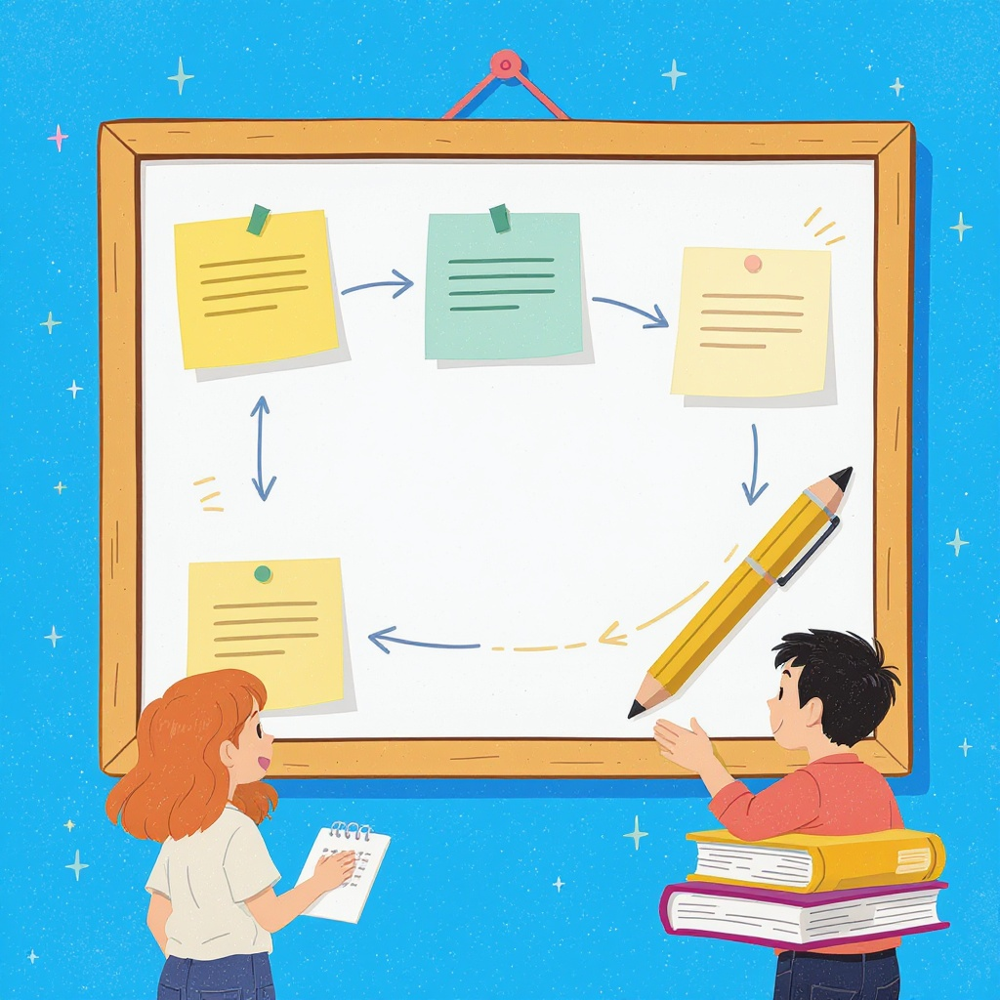

# Как правильно оформлять ссылки и [источники](../../../4.2_thinking_and_working_information/how_to_search_information/articles/three_whales.md)

**Wiki** [Wikidata](https://www.wikidata.org/wiki/Q1713)  
**Parent topic** Информационная и [медиаграмотность](../что_такое_информационная_и_медиаграмотность.md)  

В школе ты часто пишешь сочинения, проекты и доклады. И вот ты нашёл отличную информацию в интернете — статью, [видео](../оценка_качества_изображений_и_видео.md) или книгу. Но что делать дальше? Можно ли просто скопировать [текст](../../../4.1_rules_of_study/how_to_learn_effectively/articles/reading_skills.md) и вставить в [работу](../../../8.2_future/choosing_a_career_path/articles/interview.md)? Нет! **Все источники нужно оформлять правильно**. Это не просто формальность — это [уважение](../этика_общения_в_сети.md) к авторам, честность и важный [навык](../карта_компетенций_по_возрастам.md) для учёбы и будущей [работы](../../../8.2_future/choosing_a_career_path/articles/interview.md).

---

## Что такое ссылки и источники?

### 🔹 [Ссылка](../как_правильно_оформлять_ссылки_и_источники.md) — это указание, откуда взята [информация](../как_устроена_современная_информационная_среда.md)  
Это как [след](../приватность_и_цифровой_след.md) на снегу: ты показываешь, где взял идею, цитату или картинку. Без ссылки это выглядит как [плагиат](../../../4.2_thinking_and_working_information/how_to_search_information/articles/copypaste.md) — то есть кража чужих идей.

### 🔹 [Источник](../дезинформация_и_фейки.md) — это полное описание того, откуда ты взял [материал](../../../1.2_natural_sciences/physics_in_everyday_life/Q25358.md)  
Он должен содержать:  
- Автора  
- Название работы  
- Где и когда опубликовано  
- Ссылку (если это [интернет](../../../1.2_natural_sciences/physics_in_everyday_life/Q26540.md))

> 💡 **Пример**:  
> Если ты взял информацию с сайта *Канал [Аниме](../../../8.1_entertainment/articles/animation.md)*, то [источник](../дезинформация_и_фейки.md) должен выглядеть так:  
> *Канал [Аниме](../../../2.1_society/how_and_where_find_friends/articles/fandom.md)*. «Как устроена [Вселенная](../../../1.2_natural_sciences/why_science_help_understand_world/space_sciences.md) Марвел» // [https://kanal-anime.ru/marvel](https://kanal-anime.ru/marvel) — Дата обращения: 15.04.2025.

---

## Почему это важно?

| [Причина](../../../2.1_society/cause_and_effect_relationships/articles/causality_base.md) | [Объяснение](../../../4.1_rules_of_study/how_to_learn_effectively/articles/teaching_others.md) |
|--------|------------|
| **Честность** | Ты признаёшь, что не придумал всё сам — и это уважительно. |
| **[Проверяемость](../../../1.2_natural_sciences/physics_in_everyday_life/Q17737.md)** | Учитель или родитель может перейти по ссылке и убедиться, что ты не солгал. |
| **[Безопасность](../../../2.1_society/cause_and_effect_relationships/articles/trust_predictability.md)** | Не все сайты надёжны. Правильный источник помогает избежать лжи и мемов. |
| **[Будущее](../../../2.1_society/cause_and_effect_relationships/articles/future_planning.md)** | В университете и на [работе](../../../8.2_future/choosing_a_career_path/articles/interview.md) без ссылок тебя не примут — это базовое [правило](../../../1.2_natural_sciences/why_science_help_understand_world/patterns.md) науки. |

---

## Основные [правила](../../../2.1_society/cause_and_effect_relationships/articles/why_rules_work.md) оформления

### ✅ 1. Используй один [стиль](../../../7.1_art/modern_technological_art/articles/5.5_yandex_neural.md)
В школе чаще всего применяют **ГОСТ Р 7.0.5–2008** (российский стандарт) или **APA** (международный). Уточни у учителя, какой нужен. Но есть универсальные [правила](../../../2.1_society/cause_and_effect_relationships/articles/why_rules_work.md):

| [Элемент](../../../1.2_natural_sciences/why_science_help_understand_world/chemistry.md) | Что писать |
|--------|------------|
| **[Автор](../авторское_право_и_честное_использование.md)** | Фамилия и инициалы (например, Иванов А.В.) |
| **Название** | Курсивом или в кавычках — зависит от типа источника |
| **Год** | Когда опубликовано |
| **Источник** | Сайт, книга, журнал — с полным адресом |
| **Дата обращения** | Когда ты зашёл на сайт (обязательно для интернета!) |

### ✅ 2. Для интернет-источников — всегда пиши дату обращения
Сайты меняются. То, что было правдой в январе, может исчезнуть в марте. Поэтому пиши:

> _Сайт: [https](../../how_internet_works/articles/http_https/http_https.md)://[www](../../how_internet_works/articles/history/internet_history.md).nationalgeographic.com/animals/ | Дата обращения: 10.04.2025_

### ✅ 3. Не копируй текст без кавычек
Если ты **прямой цитатой** вставляешь фразу — используй **[кавычки](../../../../4.2/how_to_search_information/articles/search_operations.md)** и укажи источник:

> Как пишет *National Geographic*: «Пантеры могут прыгать на [расстояние](../../../1.2_natural_sciences/physics_in_everyday_life/Q11412.md) до 12 метров» 1.

А если ты **пересказал своими словами** — всё равно укажи источник!

> Пантеры обладают невероятной прыгучестью и способны преодолевать расстояния до 12 метров за один прыжок 1.

1 National Geographic. *Big Cats: Power and Grace*. https://www.nationalgeographic.com/animals/

---

## Частые [ошибки](../../../3.1_healthy_lifestyle/pervaya_pomoshch/ushibi_porezy_ozhogi/07_ushib_chego_nelzya.md) (и как их избежать)

❌ **[Ошибка](../логические_ошибки_в_медиа.md) 1**: «Я просто вставил ссылку в конце — всё, хватит!»  
→ **Исправь**: [Ссылка](../../../4.2_thinking_and_working_information/how_to_search_information/articles/copypaste.md) должна быть **в тексте**, рядом с информацией, которую ты взял. Не в конце работы, а там, где ты её использовал.

❌ **[Ошибка](../../how_internet_works/articles/http_https/http_https.md) 2**: «Я взял с Википедии — это же всё равно бесплатно»  
→ **Исправь**: [Википедия](../../../4.2_thinking_and_working_information/how_to_search_information/articles/wikipedia.md) — **не авторитетный источник**. Используй её только для общего понимания. Потом иди к [первоисточникам](../../../../4.2/how_to_search_information/articles/original_source.md): научные статьи, [книги](../../../7.2_leisure/useful_and_interesting_leisure/articles/reading_and_self_education.md), официальные сайты.

❌ **Ошибка 3**: «Я написал только [URL](../../how_internet_works/articles/web_basics/what_happens.md) — и всё»  
→ **Исправь**: URL — это только часть. Нужно: [автор](../../../4.2_thinking_and_working_information/how_to_search_information/articles/copypaste.md), название, дата, дата обращения.

❌ **Ошибка 4**: «Я скопировал из YouTube — там же нет автора»  
→ **Исправь**: Указывай канал, название [видео](../оценка_качества_изображений_и_видео.md), дату публикации и ссылку:

> *Канал Science Insider*. «Как работает ИИ?» // YouTube, 12.03.2024. https://youtu.be/abc123xyz | Дата обращения: 15.04.2025

---

## Примеры правильного оформления

### 📚 Книга (печатная)
> Петров, И.Н. *[История](../../../2.1_society/cause_and_effect_relationships/articles/lessons_of_history.md) компьютеров*. — М.: Просвещение, 2022. — 240 с.

### 🌐 Веб-сайт
> Государственная публичная научно-техническая библиотека России. *Цифровые [ресурсы](../../../2.1_society/cause_and_effect_relationships/articles/ecological_footprint.md) для школьников* // https://www.gpntb.ru/edu/school/ | Дата обращения: 15.04.2025

### ▶️ Видео на YouTube
> Khan Academy. *Что такое дроби?* // YouTube, 05.11.2023. https://youtu.be/drobki123 | Дата обращения: 15.04.2025

### 📰 Статья в онлайн-журнале
> Смирнова, Е.А. Как учиться эффективно // *[Наука](../../../1.2_natural_sciences/why_science_help_understand_world/science.md) и [жизнь](../../../1.2_natural_sciences/why_science_help_understand_world/biology.md)*, 2024, №3. https://www.nauka-i-zhizn.ru/2024/3/efficiency | Дата обращения: 15.04.2025

---

## Мини-чек-лист: 5 шагов перед сдачей работы

- [ ] Я **не копировал** текст без кавычек?  
- [ ] Каждая идея, взятая из интернета/[книги](../../../7.2 Media, leisure and hobbies /useful_and_interesting_leisure/articles/reading_and_self_education.md), имеет **ссылку в тексте**?  
- [ ] Все интернет-источники включают **дату обращения**?  
- [ ] Я **не использую Википедию** как главный источник?  
- [ ] В списке литературы **всё оформлено одинаково** (один стиль, нет опечаток)?

> 💡 Совет: Перед сдачей работы прочитай её вслух. Если где-то неясно, откуда взята [информация](../как_устроена_современная_информационная_среда.md) — значит, не хватает ссылки!

---

## Надёжные источники для школьников

Не все сайты безопасны. Вот 5 проверенных ресурсов, которые можно использовать без страха:

| Название | Что даёт | Ссылка |
|----------|----------|--------|
| **Российская государственная библиотека** | Научные статьи, книги, архивы | [https://www.rsl.ru](https://www.rsl.ru) |
| **National Geographic** | [Наука](../../../1.2_natural_sciences/physics_in_everyday_life/Q238323.md), [природа](../../../1.2_natural_sciences/why_science_help_understand_world/nature.md), [технологии](../../../2.2_history/world_economy_on_fingers/articles/globalizatsiya.md) | [https://www.nationalgeographic.com](https://www.nationalgeographic.com) |
| **Khan Academy (на русском)** | Объяснения по математике, физике, истории | [https://ru.khanacademy.org](https://ru.khanacademy.org) |
| **Министерство просвещения РФ** | Официальные учебные [материалы](../../../1.2_natural_sciences/physics_in_everyday_life/Q487005.md) | [https://edu.gov.ru](https://edu.gov.ru) |
| **Википедия (только для ознакомления!)** | Обзорные статьи — потом ищи [первоисточники](../../../../4.2/how_to_search_information/articles/original_source.md) | [https://ru.wikipedia.org](https://ru.wikipedia.org) |

> ⚠️ **Не используй**: TikTok, Reddit, непонятные блоги, сайты с рекламой «Скачай бесплатно!» — там часто ложная информация.

---

## Что делать, если не знаешь, как оформить?

1. **Спроси учителя** — он скажет, какой стиль нужен.
2. **Используй [генераторы](../../../1.2_natural_sciences/physics_in_everyday_life/Q988780.md)** — например, [Cite This For Me](https://www.citethisforme.com/) или [ZoteroBib](https://www.zotero.org/bib) — вбей ссылку, и он сам сделает [оформление](../../../8.2_future/choosing_a_career_path/articles/designer.md).
3. **Смотри шаблоны** — в твоём учебнике или на сайте школы часто есть примеры.

---

## Запомни: твой источник — твоя [репутация](../../../2.1_society/cause_and_effect_relationships/articles/trust_predictability.md)

Когда ты правильно оформляешь ссылки, ты показываешь:  
- Я **умею работать с информацией**  
- Я **не лгу**  
- Я **готов к взрослой учёбе**

Это не просто «плюс за [аккуратность](../../../1.2_natural_sciences/physics_in_everyday_life/Q36253.md)» — это **[навык](../карта_компетенций_по_возрастам.md) жизни**. В университете, на работе, в научных статьях — всё строится на честном указании источников.

> 🎯 **Итог**:  
> Не копируй — пересказывай.  
> Не забывай — указывай.  
> Не доверяй — проверяй.

## См. также

- [Первоисточник и пересказ](./первоисточник_и_пересказ.md)
- [Авторское право и честное использование](./авторское_право_и_честное_использование.md)
- [Проверка цитат и статистики](./проверка_цитат_и_статистики.md)

---
**Авторы:** Фролов Вячеслав  
**Слов:** 993  
**Дата генерации:** 2026-03-12  
**Сервис генерации:** qwen
