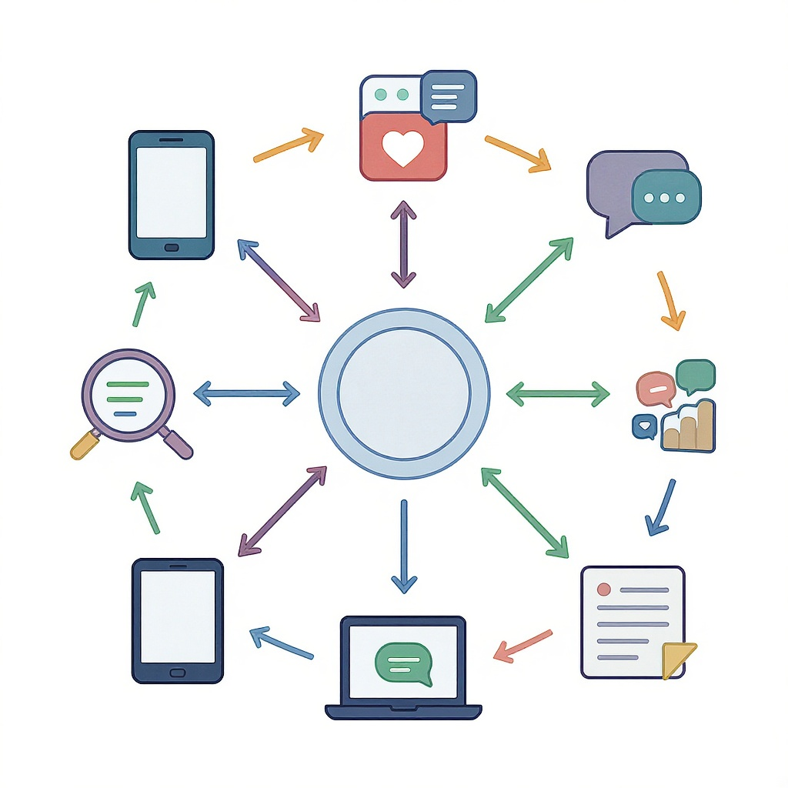

# Как устроена современная информационная [среда](../как_устроена_современная_информационная_среда.md)

**Wiki** [Wikidata](https://www.wikidata.org/wiki/Q184708)  
**Parent topic** Информационная и [медиаграмотность](../что_такое_информационная_и_медиаграмотность.md)  

Современная информационная [среда](../../../1.2_natural_sciences/physics_in_everyday_life/Q124003.md) — это всё, что нас окружает в цифровом мире: [соцсети](../../../2.1_society/how_and_where_find_friends/articles/tcifrovaya_druzhba.md), [приложения](../../../4.1_rules_of_study/how_to_learn_effectively/articles/digital_tools.md), новости, [видео](../оценка_качества_изображений_и_видео.md), реклама, чаты, поисковики и даже умные [часы](../../../1.2_natural_sciences/physics_in_everyday_life/Q20702.md). Это как огромный [город](../../../3.2 healthy lifestyle/how to act in a dangerous situation/articles/lost-in-city.md), где [информация](../как_устроена_современная_информационная_среда.md) летает быстрее ветра, а каждый может стать её создателем. Но как понять, что правда, а что [ложь](../../../2.1_society/cause_and_effect_relationships/articles/false_connections.md)? Как не потеряться в этом потоке? Давайте разберёмся — просто, понятно и с примерами.

## Что такое информационная среда?

**Информационная среда** — это совокупность всех источников информации, которые мы используем ежедневно: [интернет](../../../1.2_natural_sciences/physics_in_everyday_life/Q26540.md), [телевидение](../../../7.1_art/modern_technological_art/articles/1.2_nam_june_paik.md), [радио](../../../7.2 Media, leisure and hobbies/Computer games/articles/how_it_all_started/tennis_on_tv.md), газеты, мобильные приложения, соцсети и даже умные [помощники](../../../4.1_rules_of_study/how_to_learn_effectively/articles/digital_tools.md) вроде Siri или [Яндекс](../../../7.1_art/modern_technological_art/articles/5.5_yandex_neural.md).Алисы.

> 💡 *Пример:* Когда ты ищешь [ответ](../../how_internet_works/articles/http_https/http_https.md) на вопрос в Google, смотришь TikTok, читаешь пост в Telegram или слушаешь подкаст — ты взаимодействуешь с информационной средой.

Эта среда работает как гигантский [фильтр](../алгоритмы_и_пузырь_фильтров.md): она показывает тебе то, что, по мнению алгоритмов, тебе «нравится». Но это не всегда то, что полезно или правдиво.

### 🔑 Ключевые термины

| Термин | [Определение](../../../3.1_healthy_lifestyle/pervaya_pomoshch/ushibi_porezy_ozhogi/01_chto_takoe_pervaya_pomoshch.md) | Пример |
|-------|-------------|--------|
| **[Алгоритм](../../../2.1_society/cause_and_effect_relationships/articles/ai_causality.md)** | [Программа](../../operating system/articles/process.md), которая решает, какую информацию показывать | YouTube показывает тебе больше [видео](../оценка_качества_изображений_и_видео.md) про [киберспорт](../../../7.2_leisure/useful_and_interesting_leisure/articles/computer_games_with_benefit.md), потому что ты смотришь их часто |
| **[Фейк](../../../2.1_society/cause_and_effect_relationships/articles/false_connections.md)** | Ложная или искажённая [информация](../как_устроена_современная_информационная_среда.md), поданная как правда | Видео, где «учёные» говорят, что [Земля](../../../1.2_natural_sciences/why_science_help_understand_world/earth_sciences.md) плоская |
| **[Фильтр-пузырь](../../../4.2/critical_thinking/articles/information_bubbles.md)** | Когда [алгоритм](../../../2.1_society/cause_and_effect_relationships/articles/ai_causality.md) показывает только то, что подтверждает твои взгляды | Ты любишь [спорт](../../../3.1. healthy lifestyle/Sleep, nutrition, and adolescent energy/articles/sport_and_energy.md) — и видишь только спортивные новости, даже если другие темы важнее |
| **[Дезинформация](../дезинформация_и_фейки.md)** | Сознательно распространяемая [ложь](../../../2.1_society/cause_and_effect_relationships/articles/false_connections.md) | Статья с поддельными цитатами политика |
| **Информационная [перегрузка](../информационная_диета.md)** | Когда слишком много информации, и ты не можешь её обработать | Ты за день прочитал 50 новостей — и ничего не [запомнил](../../../how_to_memorize/articles/zapominanie.md) |

## Как работает информационная среда?

Представь, что ты зашёл в магазин. Ты хочешь купить шоколадку. Но продавец не просто даёт тебе любую — он знает, что ты любишь молочный шоколад, и показывает тебе только его. А ещё предлагает шоколадку с новой упаковкой, потому что она лучше продается.

Так же работает интернет:

1. **Ты действуешь** — лайкаешь, смотришь, комментируешь.
2. **[Алгоритмы](../../../4.2_thinking_and_working_information/how_to_search_information/articles/buble_filter.md) запоминают** — что тебе нравится.
3. **Тебе показывают больше похожего** — и всё меньше другого.
4. **Ты начинаешь думать**, что это «всё», что есть в мире.

Это называется **[фильтр-пузырь](../../../4.2_thinking_and_working_information/critical_thinking/articles/information_bubbles.md)**. И он опасен: ты перестаёшь видеть другие точки зрения.

> 🚨 *Пример:* Ты веришь, что «все учатся в школе без домашки» — потому что в TikTok все видео про «как я сдал экзамен без подготовки». Но в реальности 90% школьников делают домашку. Алгоритм показал тебе исключение — и ты принял его за [правило](../../../1.2_natural_sciences/why_science_help_understand_world/patterns.md).

## Частые [ошибки](../../../3.1_healthy_lifestyle/pervaya_pomoshch/ushibi_porezy_ozhogi/07_ushib_chego_nelzya.md) и как их избежать

Вот 5 самых распространённых ошибок, которые делают даже взрослые:

- ❌ **Верю, потому что мне понравилось** — [Эмоции](../../../3.1. healthy lifestyle/Sleep, nutrition, and adolescent energy/articles/stress_and_food.md) ≠ правда. Видео с котиком и «шокирующей» подписью может быть фейком.
- ❌ **Пересылаю, не проверяя** — Ты не виноват, если передал ложь? Но ты виноват, если не проверил.
- ❌ **Ищу только подтверждение своим взглядам** — Если ты ищешь «почему [школа](../../../3.1. healthy lifestyle/Sleep, nutrition, and adolescent energy/articles/healthy_school_snacks.md) — это зло», ты найдёшь тысячу таких статей. А где аргументы против?
- ❌ **Доверяю только одному источнику** — Например, только Telegram-каналу «Секреты мира». А если он один из сотен фейковых?
- ❌ **Не понимаю, кто [автор](../авторское_право_и_честное_использование.md)** — «Какой-то пользователь @Alex2024» — это не [эксперт](../../../../8.1_self_understanding/articles/types_of_impostor_syndrome.md). А если он не указал [источник](../дезинформация_и_фейки.md)?

### ✅ Как бороться: мини-чек-лист

Перед тем как поверишь, поделишься или сделаешь [вывод](../../../1.2_natural_sciences/why_science_help_understand_world/scientific_method.md) — пройди этот чек-лист:

1. **Кто написал?** — Есть ли имя, фамилия, [профессия](../../../7.2_leisure/useful_and_interesting_leisure/articles/leisure_influence_on_future.md), [ссылка](../как_правильно_оформлять_ссылки_и_источники.md) на сайт?
2. **Где взято?** — Есть ли [источник](../дезинформация_и_фейки.md)? (например: «по данным ВОЗ» или «[исследование](../../../1.2_natural_sciences/why_science_help_understand_world/experimental_science.md) МГУ»)
3. **Когда опубликовано?** — Старая [новость](../информационная_диета.md) может быть подана как свежая.
4. **Есть ли другие [источники](../../../4.2_thinking_and_working_information/how_to_search_information/articles/three_whales.md)?** — Проверь в Google, [Wikipedia](../../../4.2_thinking_and_working_information/how_to_search_information/articles/wikipedia.md), или на сайтах вроде [Snopes](https://www.snopes.com) или [FactCheck.org](https://www.factcheck.org).
5. **Вызывает ли это [эмоции](../../../3.1. healthy lifestyle/Sleep, nutrition, and adolescent energy/articles/stress_and_food.md)?** — Если ты в ярости или в восторге — будь осторожен. Фейки работают на эмоциях.

> 💬 *Совет для родителей и учителей:* Обсуждайте с детьми, как они находят информацию. Не говорите: «Это ложь». Спрашивайте: «А где ты это увидел? Кто это написал? Почему ты решил, что это правда?»

## Где искать надёжную информацию?

Вот 5 проверенных источников, которые можно использовать без страха:

| Источник | Для чего подходит | Почему надёжен |
|----------|-------------------|----------------|
| [Wikipedia](https://ru.wikipedia.org) | Общие знания, термины, краткие объяснения | Редактируется тысячами людей, есть ссылки на источники |
| [Snopes](https://www.snopes.com) | [Проверка](../../../1.2_natural_sciences/why_science_help_understand_world/scientific_method.md) фейков и мемов | Специалисты по дезинформации, подробные расследования |
| [BBC News](https://www.bbc.com/russian) | Новости | Независимая [журналистика](../../../7.1_art/modern_technological_art/articles/3.1_uncensored_library.md), международный стандарт |
| [Википедия: Надёжные источники](https://ru.wikipedia.org/wiki/Википедия:Надёжные_источники) | Как отличить надёжное от ненадёжного | Официальное руководство Википедии |
| [Google Scholar](https://scholar.google.com) | Научные статьи и исследования | Только рецензируемые [работы](../../../8.2_future/choosing_a_career_path/articles/interview.md) учёных |

> 📌 *Совет:* Если что-то кажется «слишком удивительным» — ищи в Google фразу в кавычках:  
> `"название статьи" site:snopes.com` — и ты быстро узнаешь, это правда или нет.

## Как родителям и учителям помогать детям?

Вы не обязаны запрещать соцсети. Вы должны научить ребёнка **думать самому**.

### ✅ Что делать:

- **Обсуждайте новости вместе.** Вместо «не смотри» — «давай разберём, что тут правда».
- **Играйте в «Правда или [Фейк](../../../2.1_society/cause_and_effect_relationships/articles/false_connections.md)»** — приходите в класс или домой с 5 новостями, и вместе проверяйте их.
- **Показывайте, как искать источники.** Учите пользоваться [Google Scholar](../../../4.2_thinking_and_working_information/how_to_search_information/articles/science.md), Wikipedia и инструментами проверки.
- **Не бойтесь признавать: «Я тоже не знал»** — это учит честности и любознательности.

> 🎯 *Пример для урока:*  
> Учитель показывает видео: «Учёные доказали: кофе убивает [память](../../../3.1. healthy lifestyle/Sleep, nutrition, and adolescent energy/articles/sleep_and_memory_grades.md)».  
> Дети:  
> 1. Кто [автор](../../../4.2_thinking_and_working_information/how_to_search_information/articles/copypaste.md)? — Неизвестный блогер.  
> 2. Где источник? — Нет ссылок.  
> 3. Проверили в Google Scholar? — Нет таких исследований.  
> → Это фейк.

## Что будет, если не учиться разбираться?

Если ты не умеешь отличать правду от лжи — ты становишься лёгкой мишенью:

- Тебя будут **обманывать** ради [денег](../../../8.2_future/choosing_a_career_path/articles/salary.md) (реклама, [мошенники](../../../3.2 healthy lifestyle/how to act in a dangerous situation/articles/phishing-links.md)).
- Тебя будут **маневрировать** ради политики ([пропаганда](../../../2.1_society/cause_and_effect_relationships/articles/false_connections.md), ненависть).
- Ты будешь **верить в [мифы](../../../3.1_healthy_lifestyle/pervaya_pomoshch/ushibi_porezy_ozhogi/07_ushib_chego_nelzya.md)**, которые мешают учиться, дружить, жить.

> 💬 *[Цитата](../как_правильно_оформлять_ссылки_и_источники.md):*  
> *«В мире, где каждый может быть журналистом, самое важное — уметь быть читателем»*  
> — Ричард Докинз, биолог и писатель

## [Заключение](../../../1.2_natural_sciences/physics_in_everyday_life/Q2225.md): ты — [фильтр](../../../3.1_healthy lifestyle/vrednye_privychki/articles/Social_media.md)

Современная информационная среда — как [океан](../../../1.2_natural_sciences/why_science_help_understand_world/earth_sciences.md). Ты не можешь его остановить. Но ты можешь **научиться плавать**.  

Ты — не просто потребитель информации. Ты — её **фильтр**.  
Ты — не просто [зритель](../../../7.1_art/modern_technological_art/articles/1.3_participatory_art.md). Ты — **критик**.  
Ты — не просто ученик. Ты — **[исследователь](../../../1.2_natural_sciences/why_science_help_understand_world/experiment.md)**.

Каждый раз, когда ты задаёшь вопрос: *«А откуда это?»* — ты становишься сильнее. И мир — чище.

## См. также

- [Алгоритмы и пузырь фильтров](./алгоритмы_и_пузырь_фильтров.md)
- [Как работают новостные ленты](./как_работают_новостные_ленты.md)
- [Роль поисковых систем](./роль_поисковых_систем.md)

---
**Авторы:** Ефимов Сергей  
**Слов:** 1051  
**Дата генерации:** 2026-03-12  
**Сервис генерации:** qwen
