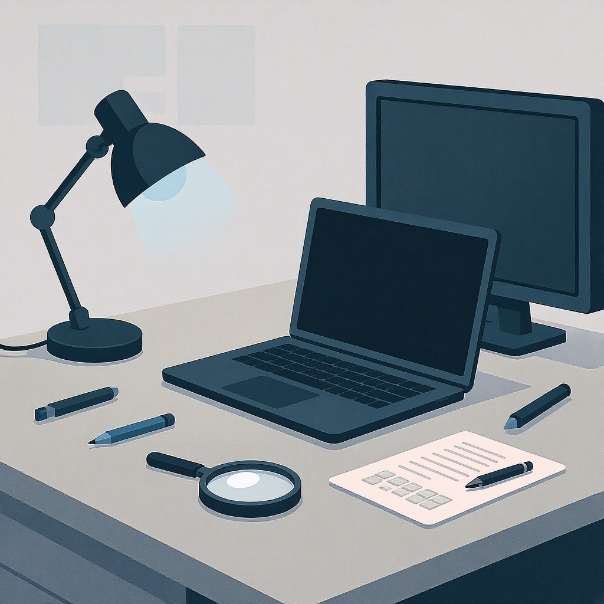

# [Оценка](../../../4.1_rules_of_study/how_to_learn_effectively/articles/self_reflection.md) качества изображений и [видео](../оценка_качества_изображений_и_видео.md)

**Wiki** [Wikidata](https://www.wikidata.org/wiki/Q3813865)  
**Parent topic** Информационная и [медиаграмотность](../что_такое_информационная_и_медиаграмотность.md)  

В мире цифровых технологий мы каждый день смотрим [фото](../проверка_фото_на_манипуляции.md), [видео](../оценка_качества_изображений_и_видео.md) и онлайн-уроки — от школьных презентаций до любимых сериалов. Но не все изображения и видео одинаково качественные. Иногда картинка размытая, [звук](../../../1.2_natural_sciences/why_science_help_understand_world/physics.md) скрипит, а [цвета](../../../1.2_natural_sciences/physics_in_everyday_life/Q11652.md) выглядят как будто их нарисовали мелками. В этой статье ты узнаешь, **как оценивать [качество](../../../6.1_Independent_living_and_daily_living_skills/reasonable_spending/articles/quality.md) изображений и видео**, почему это важно и как самому сделать их лучше — даже если ты не профессионал.

---

## Что такое качество изображения и видео?

**Качество изображения** — это то, насколько чётко, ярко и правильно переданы детали на [фото](../проверка_фото_на_манипуляции.md) или экране.  
**Качество видео** — это сочетание чёткости картинки, плавности движения, чистоты звука и правильной цветопередачи.

### 🔍 Основные термины, которые нужно знать:

- **[Разрешение](../../../7.2 Media, leisure and hobbies/Computer games/articles/technologies_inside/screen_magic.md)** — количество пикселей (точек) в изображении. Чем выше — тем детальнее картинка. Например: 1920×1080 (Full HD), 3840×2160 (4K).
- **Битрейт** — [объём](../../../1.2_natural_sciences/physics_in_everyday_life/Q39297.md) данных, передаваемых за секунду. Чем выше битрейт — тем лучше качество, но и больше размер файла.
- **[Сжатие](../../../1.2_natural_sciences/physics_in_everyday_life/Q170282.md)** — уменьшение размера файла за счёт удаления «ненужных» данных. Слишком сильное сжатие → артефакты (искажения).
- **Артефакты** — нежелательные искажения: блочные пятна, размытые края, мерцание, «шум» (мельтешение точек).
- **[Частота](../../../1.2_natural_sciences/physics_in_everyday_life/Q11388.md) кадров (FPS)** — сколько кадров в секунду. 24–30 FPS — норма, 60 FPS — плавно, как в играх.

> 💡 *Представь, что [изображение](../оценка_качества_изображений_и_видео.md) — это мозаика. Чем больше кусочков (пикселей), тем точнее рисунок. Если кусочки слишком большие или размыты — картинка выглядит плохо.*

---

## Какие [ошибки](../../../3.1_healthy_lifestyle/pervaya_pomoshch/ushibi_porezy_ozhogi/07_ushib_chego_nelzya.md) чаще всего делают?

Вот 5 самых частых проблем, которые видят и учителя, и ученики:

| [Ошибка](../логические_ошибки_в_медиа.md) | [Что происходит](../../how_internet_works/articles/web_basics/what_happens.md) | Почему это плохо |
|-------|----------------|------------------|
| Слишком маленькое разрешение | Фото или видео выглядят «пиксельными» | Невидны детали: [текст](../../../4.1_rules_of_study/how_to_learn_effectively/articles/reading_skills.md) на слайдах, лица, надписи |
| Сильное сжатие | Появляются [блоки](../../../1.2_natural_sciences/physics_in_everyday_life/Q169019.md), как будто картинка «распалась» | Затрудняет [чтение](../../../7.2_leisure/useful_and_interesting_leisure/articles/reading_and_self_education.md), выглядит небрежно |
| Плохое [освещение](../../../1.2_natural_sciences/physics_in_everyday_life/Q628858.md) | Тёмные участки — чёрные, светлые — белые без деталей | Невидно лицо говорящего, сложно понять содержание |
| Низкая частота кадров | Видео «дрожит» или «рвётся» при движении | Неудобно смотреть, особенно при демонстрации экспериментов |
| [Музыка](../../../8.1_entertainment/articles/music.md) или [звук](../../../1.2_natural_sciences/physics_in_everyday_life/Q124003.md) на фоне | Говорящий не слышен, потому что играет [музыка](../../../1.2_natural_sciences/neurobiology_for_teens/articles/18_music_chills.md) | Ученики не понимают [материал](../../../1.2_natural_sciences/physics_in_everyday_life/Q25358.md) |

<!--- Эти ошибки часто возникают, когда кто-то записывает видео на телефон без настроек или загружает его в WhatsApp, Instagram или школьную платформу, где всё автоматически сжимается. --->

---

## Как оценить качество — мини-чек-лист

Вот простой способ проверить качество видео или изображения перед отправкой — например, для школьного проекта или презентации.

✅ **Чек-лист качества:**

- [ ] Разрешение: не ниже **1280×720** (HD) для видео, **1000×800** для фото
- [ ] Яркость: лицо или [объект](../../../1.2_natural_sciences/physics_in_everyday_life/Q634.md) хорошо видны, без тёмных пятен
- [ ] Звук: речь чистая, без шумов, эха или музыки на фоне
- [ ] Нет артефактов: нет «блочных» квадратов, не размыты края
- [ ] Частота кадров: **30 FPS** и выше (если есть [движение](../../../1.2_natural_sciences/why_science_help_understand_world/physical_science.md))
- [ ] [Файл](../../operating system/articles/file_system.md) не пересжат: если загрузил в WhatsApp — перепроверь в другом приложении
- [ ] Текст читаем: если на экране есть буквы — они не расплываются

> 📌 **Совет для учеников:** Если ты записываешь видео с телефона — включи [режим](../семейные_правила_потребления_контента.md) «4K» или «Full HD», а не «SD» или «Low». И держи телефон ровно, не трясись!

---

## Как улучшить качество — практические [советы](../../../7.2_leisure/useful_and_interesting_leisure/articles/mistakes_in_choosing_hobby.md)

### 📸 Для фото:
- Снимай при естественном свете (у [окна](../../operating system/articles/window_manager.md) — идеально!).
- Не используй [цифровой](../../../7.1_art/musical_instruments/articles/synthesizer.md) зум — лучше подойди ближе.
- Сохраняй в формате **PNG** (если нужна максимальная чёткость) или **JPEG с качеством 90%+**.

### 📹 Для видео:
- Используй стабилизатор (даже простую подставку).
- Записывай в **1080p (Full HD)** или выше.
- Отключай фоновую музыку — лучше добавить её потом в редакторе.
- Используй бесплатные программы для улучшения:  
  - [**DaVinci Resolve**](https://www.blackmagicdesign.com/products/davinciresolve) — мощный, но простой  
  - [**Shotcut**](https://shotcut.org/) — бесплатный и понятный

> 💬 *Учитель: если ты загружаешь видео на школьную платформу (Google Classroom, [Яндекс](../../../7.1_art/modern_technological_art/articles/5.5_yandex_neural.md).Учебник, Moodle), всегда проверяй его после загрузки — иногда системы сжимают файлы до ужасного качества!*

---

## Почему это важно?

Ты, возможно, думаешь: «Ну, это же просто видео для урока». Но на самом деле:

- 🎓 **Учителя** оценивают не только содержание, но и **подачу**. Качественное видео = серьёзное отношение к делу.
- 👨‍👩‍👧‍👦 **[Родители](../../../../8.1_self_understanding/articles/family_influence.md)** ценят, когда дети умеют работать с технологиями правильно — это [навык](../карта_компетенций_по_возрастам.md) на [будущее](../../../2.1_society/cause_and_effect_relationships/articles/future_planning.md).
- 🌐 **Мир цифровых профессий** требует [умения](../../../8.2_future/choosing_a_career_path/articles/skills.md) создавать и оценивать [контент](../информационная_диета.md): от блогеров до инженеров, дизайнеров и программистов.

> 🔮 *В будущем ты можешь стать видеомонтажёром, учителем, разработчиком игр или даже исследователем в области искусственного интеллекта — и всё это начинается с умения видеть разницу между хорошим и плохим качеством.*

---

## Где учиться дальше? (Надёжные [источники](../../../4.2_thinking_and_working_information/how_to_search_information/articles/three_whales.md))

Если хочешь глубже разобраться — вот 5 проверенных ресурсов:

1. [**Digital Photography School — Как снимать идеальные фото**](https://digital-photography-school.com/digital-photography-tips-for-beginners/) — для тех, кто любит фотографировать.
2. [**Khan Academy — Введение в цифровые медиа**](https://www.khanacademy.org/computing/computer-programming/pixel-art) — бесплатные уроки для школьников.
3. [**Canva — Как выбрать правильное разрешение**](https://www.canva.com/learn/resolution/) — с наглядными примерами.
4. [**BBC Learning — Звук и видео в образовании**](https://www.bbc.co.uk/bitesize/topics/zs9d7ty) — [советы](../../../7.2 Media, leisure and hobbies /useful_and_interesting_leisure/articles/mistakes_in_choosing_hobby.md) от профессионалов.

---

## 🧠 Запомни: качество — это не про дорогую технику, а про [внимание](../эмоциональные_триггеры_в_контенте.md)

Ты не обязан иметь камеру за 100 000 рублей. Даже телефон 2020 года может снимать великолепно — если ты:

- Держишь его ровно,
- Снимаешь при хорошем свете,
- Не сжимаешь файлы без [нужды](../../../6.2_money_and_literacy/how_to_save_for_goal/articles/needs_vs_wants.md),
- Проверяешь [результат](../../../1.2_natural_sciences/why_science_help_understand_world/experimental_science.md) перед отправкой.

> 🌟 *Качественное видео — это как аккуратно написанное сочинение: даже если тема простая, [стиль](../../../7.1_art/modern_technological_art/articles/5.5_yandex_neural.md) и [внимание](../../../1.2_natural_sciences/neurobiology_for_teens/articles/16_love_chemistry.md) к деталям делают её запоминающейся.*

## См. также

- [Геолокация и проверка контекста](./геолокация_и_проверка_контекста.md)
- [Проверка фото на манипуляции](./проверка_фото_на_манипуляции.md)
- [Дезинформация и фейки](./дезинформация_и_фейки.md)

---
**Авторы:** Жуховицкий Александр  
**Слов:** 1000  
**Дата генерации:** 2026-03-12  
**Сервис генерации:** qwen
