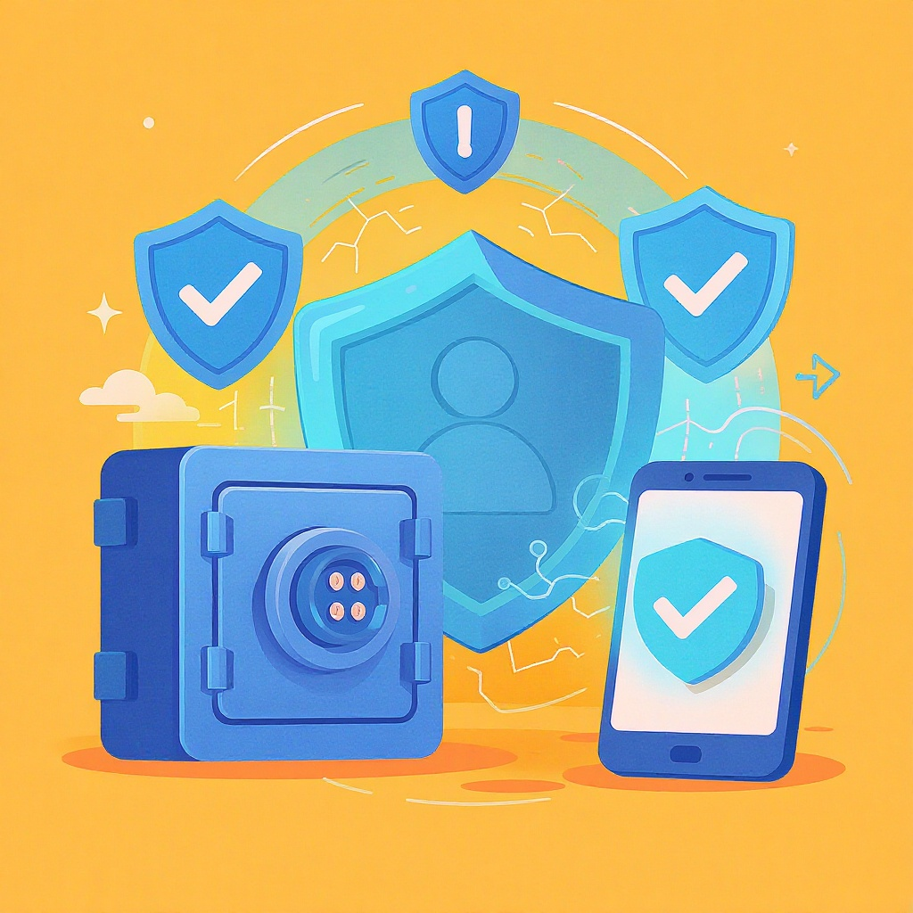

# Пароли и двухфакторная [защита](../пароли_и_двухфакторная_защита.md)

**Wiki** [Wikidata](https://www.wikidata.org/wiki/Q17086335)  
**Parent topic** Информационная и [медиаграмотность](../что_такое_информационная_и_медиаграмотность.md)  

## Что такое [пароль](../пароли_и_двухфакторная_защита.md) и зачем он нужен?

[Пароль](../../../3.2 healthy lifestyle/how to act in a dangerous situation/articles/internet-safety.md) — это секретная комбинация символов (буквы, цифры, знаки), которая позволяет тебе войти в [аккаунт](../информационная_безопасность_для_детей.md): в школьный [портал](../../../7.2 Media, leisure and hobbies/Computer games/articles/useful_tips/educational_games.md), Instagram, Gmail, YouTube или игру. Это как [ключ](../../how_internet_works/articles/http_https/tls.md) от двери — только [цифровой](../../../7.1_art/musical_instruments/articles/synthesizer.md). Если кто-то узнает твой пароль, он может:

- читать твои личные [сообщения](../../operating system/articles/IPC.md),
- писать от твоего имени,
- украсть твои [данные](../../../2.1_society/cause_and_effect_relationships/articles/ai_causality.md),
- даже поставить тебя в неловкое положение.

> 💡 **Важно:** Ты не должен делиться паролем ни с кем — даже с лучшим другом, родителями или учителем. Если учитель просит пароль — это **неправильно**. [Школа](../../../3.1. healthy lifestyle/Sleep, nutrition, and adolescent energy/articles/healthy_school_snacks.md) должна использовать безопасные системы входа, а не просить твои [личные данные](../../../3.2 healthy lifestyle/how to act in a dangerous situation/articles/internet-safety.md).

## Что такое двухфакторная [аутентификация](../пароли_и_двухфакторная_защита.md) ([2FA](../../../5.2_cybersecurity/passwords_cyber_safety/articles/2fa.md))?

**[Двухфакторная аутентификация](../../../5.2_cybersecurity/passwords_cyber_safety/articles/2fa.md) (2FA)** — это дополнительный [уровень](../../../8.1_entertainment/articles/gamification.md) защиты. Даже если кто-то знает твой пароль, он не сможет войти, пока не подтвердит [личность](../../../1.2_natural_sciences/neurobiology_for_teens/articles/06_phineas_gage.md) вторым способом.

### Как это работает?
После ввода пароля тебе приходит:

- SMS-код на телефон,
- уведомление в приложении (например, Google Authenticator или Authy),
- или ты нажимаешь кнопку на физическом ключе (типа YubiKey).

Только после этого ты попадаешь в [аккаунт](../информационная_безопасность_для_детей.md).

### Пример:
Ты хочешь зайти в свой Gmail.  
1. Вводишь пароль — ✅  
2. Твой телефон пишет: *«Попытка входа. Разрешить?»* — ты нажимаешь «Да» — ✅  
3. Вход разрешён!

Если злоумышленник знает твой пароль, но не имеет твоего телефона — он **не попадёт** в аккаунт.

## Частые [ошибки](../../../3.1_healthy_lifestyle/pervaya_pomoshch/ushibi_porezy_ozhogi/07_ushib_chego_nelzya.md) с паролями (и как их избежать)

Вот что **[нельзя](../../../3.1_healthy_lifestyle/pervaya_pomoshch/ushibi_porezy_ozhogi/07_ushib_chego_nelzya.md)** делать — даже если кажется, что это "удобно":

| [Ошибка](../логические_ошибки_в_медиа.md) | Почему плохо | Правильно |
|-------|--------------|-----------|
| `123456` или `password` | Это самые популярные пароли — их знают все хакеры | Используй длинные, случайные комбинации |
| Пароль из имени, даты рождения, школы | Это легко найти в соцсетях | Не используй личные данные |
| Один пароль на все аккаунты | Если один взломают — все аккаунты под угрозой | Уникальный пароль для каждого сервиса |
| Пишешь пароль на бумажке под клавиатурой | Кто угодно может его увидеть | Используй [менеджер паролей](../../../5.2_cybersecurity/passwords_cyber_safety/articles/password_manager.md) |
| Используешь только буквы | Слишком легко угадать | Добавляй цифры, символы (`!@#$%`) |

### ✅ Как создать надёжный пароль?
Вот простой способ — **фраза-пароль**:

> **Пример**: `КошкаСпала_На_Клавиатуре2024!`  
> [Длина](../../../1.2_natural_sciences/physics_in_everyday_life/Q25358.md): 27 символов  
> Содержит: заглавные, строчные, цифры, символы, пробелы (в некоторых системах можно)

Это легко [запомнить](../../../how_to_memorize/articles/zapominanie.md), но почти невозможно взломать.

> 🛡️ **Совет от экспертов**: Используй **4–5 случайных слов**, разделённых символами. Например: `Правильный-Кот-Съел-Пиццу!`

## Что такое менеджер паролей?

Менеджер паролей — это приложение, которое **запоминает все твои пароли** и вводит их автоматически. Тебе нужно [запомнить](../../../4.1_rules_of_study/how_to_memorize/articles/zapominanie.md) **только один** надёжный пароль — главный.

### Плюсы:
- Генерирует сложные пароли за тебя
- Автоматически заполняет формы
- Синхронизируется между телефоном и компьютером
- Защищает от фишинга (когда тебе поддельное письмо вроде "Ваш аккаунт заблокирован!")

### Популярные бесплатные менеджеры:
- **Bitwarden** — открытый [код](../../../5.2_cybersecurity/cpp_fundamentals/1_introduction.md), бесплатный, безопасный
- **KeePass** — работает локально, без облака
- **1Password** — платный, но очень удобный

> ❗ **Не используй браузерные менеджеры** ([Chrome](../../how_internet_works/articles/history/internet_at_home.md), [Safari](../../how_internet_works/articles/web_basics/browser.md)) — они менее защищены, чем специализированные [приложения](../../../4.1_rules_of_study/how_to_learn_effectively/articles/digital_tools.md).

## Как включить двухфакторную защиту? [Шаги](../../../7.2 Media, leisure and hobbies/Computer games/articles/dream_team/composer.md) для школьников

Вот простой чек-лист, который подойдёт и тебе, и родителям:

### ✅ Мини-чеклист: включи 2FA прямо сейчас!

1. **Выбери самый важный аккаунт** — например, Gmail, Apple ID или Instagram.
2. Зайди в **Настройки → [Безопасность](../../../2.1_society/cause_and_effect_relationships/articles/trust_predictability.md)**.
3. Найди **«Двухфакторная аутентификация»** или **«2FA»**.
4. Включи её — тебе предложат привязать телефон.
5. **Скачай приложение Google Authenticator или Authy** — это надёжнее, чем SMS.
6. **Сохраняй резервные коды** — их выдают при включении 2FA. Распечатай или сохрани в защищённом месте (например, в зашифрованном файле).
7. Повтори для других аккаунтов: YouTube, Discord, Roblox, TikTok.

> 💬 **Для родителей**: Помогите ребёнку настроить 2FA на его аккаунтах — это лучше, чем просто запрещать [соцсети](../../../2.1_society/how_and_where_find_friends/articles/tcifrovaya_druzhba.md).

## Почему SMS не самый надёжный способ для 2FA?

Хотя SMS-коды лучше, чем ничего, они **не идеальны**. Злоумышленники могут:

- Перехватить SMS через [фишинг](../../../3.2 healthy lifestyle/how to act in a dangerous situation/articles/phishing-links.md) или SIM-карту (так называемая *SIM-swapping*),
- Получить доступ к твоему номеру, если ты потерял телефон.

> 🔒 **Лучшая альтернатива**: **Приложения-генераторы кодов** (Google Authenticator, Authy, Microsoft Authenticator). Они работают **без интернета** и не зависят от SMS.

## Таблица: какие [сервисы](../../../4.1_rules_of_study/how_to_learn_effectively/articles/digital_tools.md) поддерживают 2FA?

| Сервис | Поддерживает 2FA? | Рекомендуемый способ |
|--------|------------------|----------------------|
| Google (Gmail) | ✅ Да | Google Authenticator |
| Apple ID | ✅ Да | Apple Authenticator / SMS |
| Instagram | ✅ Да | Authy или SMS |
| Discord | ✅ Да | Google Authenticator |
| Roblox | ✅ Да | Приложение или SMS |
| TikTok | ✅ Да | Google Authenticator |
| Fortnite | ✅ Да | Authy |
| Ваш школьный портал | ⚠️ Уточните у учителя | Обычно — SMS или почта |

> 📌 **Совет**: Если сервис не поддерживает 2FA — не используй его для важных данных. Скажи об этом родителям или учителю.

## Что делать, если пароль утёк?

Если ты подозреваешь, что твой пароль стал известен кому-то ещё:

1. **Сразу смени пароль** — на всех аккаунтах, где он использовался.
2. **Включи 2FA**, если ещё не включена.
3. **Проверь активность** — в Google: [myaccount.google.com/security](https://myaccount.google.com/security), в Apple: [appleid.apple.com](https://appleid.apple.com).
4. **Предупреди родителей** — они помогут разобраться.
5. **Не паникуй** — главное — действовать быстро.

## Полезные [ресурсы](../../../2.1_society/cause_and_effect_relationships/articles/ecological_footprint.md) для изучения

- [**Google: Как включить 2FA**](https://support.google.com/accounts/answer/185839) — [пошаговая](../../../7.2 Media, leisure and hobbies/Computer games/articles/genres_and_worlds/strategy.md) инструкция на русском
- [**Bitwarden — бесплатный менеджер паролей**](https://bitwarden.com/) — безопасный и простой

---

## 💬 Запомни: [безопасность](../../../1.2_natural_sciences/neurobiology_for_teens/articles/17_hugs_oxytocin.md) — это [привычка](../../../7.2_leisure/useful_and_interesting_leisure/articles/how_not_to_quit_hobby.md)

Ты не обязан быть хакером, чтобы быть в безопасности. Достаточно:

- ✅ Использовать уникальные пароли,
- ✅ Включить 2FA на всех важных аккаунтах,
- ✅ Не делиться паролями,
- ✅ Использовать менеджер паролей.

Это как носить шлем на велосипеде — не всегда хочется, но спасает [жизнь](../../../1.2_natural_sciences/why_science_help_understand_world/biology.md).

> 🚀 **Совет на [будущее](../../../2.1_society/cause_and_effect_relationships/articles/future_planning.md)**: Когда ты начнёшь писать код, создавать сайты или работать с данными — безопасность станет твоим вторым навыком. Начни сейчас — и будешь впереди всех.

## См. также

- [Информационная безопасность для детей](./информационная_безопасность_для_детей.md)
- [Приватность и цифровой след](./приватность_и_цифровой_след.md)
- [Цифровая репутация](./цифровая_репутация.md)

---
**Авторы:** Михайлов Александр  
**Слов:** 1012  
**Дата генерации:** 2026-03-12  
**Сервис генерации:** qwen
