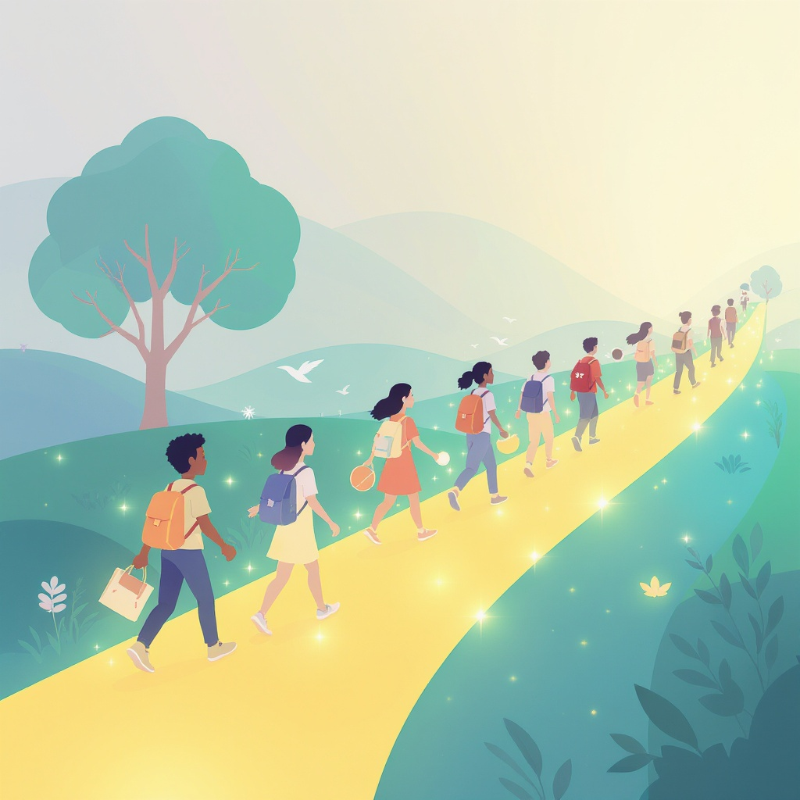

# Цифровая [репутация](../../../2.1_society/cause_and_effect_relationships/articles/trust_predictability.md): как твои посты влияют на твоё [будущее](../../../2.1_society/cause_and_effect_relationships/articles/future_planning.md)

**Wiki** [Wikidata](https://www.wikidata.org/wiki/Q478594)  
**Parent topic** Информационная и [медиаграмотность](../что_такое_информационная_и_медиаграмотность.md)  

## Что такое цифровая [репутация](../../../2.1_society/cause_and_effect_relationships/articles/trust_predictability.md)?

**Цифровая репутация** — это то, как другие люди воспринимают тебя в интернете на основе всего, что ты оставил [онлайн](../../../3.2 healthy lifestyle/how to act in a dangerous situation/articles/internet-safety.md): постов, комментариев, [фото](../проверка_фото_на_манипуляции.md), [видео](../оценка_качества_изображений_и_видео.md), отзывов и даже того, что другие публикуют о тебе. Это как твоя «виртуальная [карта](../карта_компетенций_по_возрастам.md)» — её проверяют школьные приёмные комиссии, работодатели, будущие [друзья](../../../4.1_rules_of_study/how_to_learn_effectively/articles/peer_learning.md) и даже [коллеги](../../../../8.1_self_understanding/articles/social_comparison.md).

Ты можешь думать: *«Я ничего плохого не писал!»* — но даже смешные мемы, споры в чате или [фото](../проверка_фото_на_манипуляции.md) с вечеринки могут быть использованы против тебя, если попадут в руки не тем людям.

> 💡 **Пример**: 16-летний подросток получил [отказ](../../../2.1_society/how_and_where_find_friends/articles/otkaz_ne_konets.md) в стипендии, потому что в Google нашли его пост с матом и фотографию с пьяной вечеринки — хотя это было 3 года назад. Он не знал, что это останется в интернете навсегда.

## Почему это важно? (Для тебя, родителей и учителей)

### Для учеников:
- Ты можешь потерять шанс поступить в хороший [вуз](../../../8.2_future/choosing_a_career_path/articles/university.md).
- Тебя могут не взять на стажировку или [работу](../../../8.2_future/choosing_a_career_path/articles/interview.md).
- Люди могут начать думать, что ты несерьёзный, агрессивный или ненадёжный — даже если это не так.

### Для родителей:
- Твои дети часто не понимают, как долго живут их посты.
- Платформы вроде TikTok, Instagram и YouTube не предупреждают: *«Это навсегда»*.
- Ты можешь помочь им избежать ошибок, которые исправить будет невозможно.

### Для учителей:
- Ты видишь, как ученики ведут себя в классе — но их онлайн-поведение может быть совсем другим.
- Ты можешь стать наставником в [цифровой](../../../7.1_art/musical_instruments/articles/synthesizer.md) грамотности — и это важнее, чем многие уроки информатики.

## 🔍 Ключевые термины

| Термин | [Определение](../../../3.1_healthy_lifestyle/pervaya_pomoshch/ushibi_porezy_ozhogi/01_chto_takoe_pervaya_pomoshch.md) |
|--------|-------------|
| **[Цифровой](../../../7.1_art/musical_instruments/articles/synthesizer.md) [след](../приватность_и_цифровой_след.md)** | Всё, что ты оставляешь в интернете: посты, лайки, просмотры, [история](../../../2.1_society/cause_and_effect_relationships/articles/lessons_of_history.md) поиска. |
| **Цифровая идентичность** | Твоя «онлайн-личность» — как ты хочешь, чтобы тебя видели. |
| **[Кибербуллинг](../кибербуллинг_как_распознать_и_действовать.md)** | Злоупотребление цифровыми платформами для запугивания, [оскорбления](../../../7.2 Media, leisure and hobbies/Computer games/articles/useful_tips/toxic_players.md) или унижения. |
| **[Приватность](../приватность_и_цифровой_след.md)** | Способность контролировать, кто видит твою информацию. |
| **[Цифровой след](../../../4.2_thinking_and_working_information/how_to_search_information/articles/digital_footprint.md) от других** | То, что про тебя пишут или выкладывают другие — даже без твоего согласия. |

## 🚫 Частые [ошибки](../../../3.1_healthy_lifestyle/pervaya_pomoshch/ushibi_porezy_ozhogi/07_ushib_chego_nelzya.md) (и как их избежать)

Вот 5 самых распространённых ошибок, которые делают [подростки](../../../3.1. healthy lifestyle/Sleep, nutrition, and adolescent energy/articles/biology_of_night_owls_teens.md) — и как их не допустить:

- **❌ Публикую всё, [что происходит](../../how_internet_works/articles/web_basics/what_happens.md)** — даже если это «только для друзей».  
  ✅ *Совет:* Представь, что твой пост увидит директор школы, потенциальный работодатель или твой дедушка. Будет ли тебе стыдно?

- **❌ Использую никнейм, который звучит агрессивно или оскорбительно** — например, «Горячий_Крот_228».  
  ✅ *Совет:* Выбери ник, который не вызывает вопросов. Лучше «Алекс_Музыка» или «Катя_Рисует».

- **❌ Загружаю фото с алкоголем, сигаретами или драками** — даже если «всё в порядке, мы просто веселились».  
  ✅ *Совет:* Фото с пивом или курением — это красный флаг для любого, кто проверяет репутацию. Удали такие фото. Навсегда.

- **❌ Отвечаю на троллей и оскорбления в комментариях** — особенно в анонимных чатах.  
  ✅ *Совет:* Не вступай в споры. Просто заблокируй, отпишись и не отвечай. Твоя репутация дороже, чем «последнее слово».

- **❌ Думаю, что «удалил — и всё пропало»**.  
  ✅ *Совет:* Даже если ты удалил пост — его могли сохранить, сделать скриншот или закешировать. **Никогда не полагайся на удаление.**

## ✅ Мини-чек-лист: твоя цифровая репутация в порядке?

Проверь себя раз в месяц:

- [ ] Я не публикую фото с алкоголем, сигаретами, оружием или агрессией.
- [ ] Мои профили в Instagram, TikTok, VK и других платформах настроены на «только друзья».
- [ ] Я не использую оскорбительные или провокационные ники.
- [ ] Я не отвечаю на троллей и не вступаю в конфликты в комментариях.
- [ ] Я регулярно ищу себя в Google: ввожу своё имя + фамилию и смотрю, что выдаёт [поисковик](../роль_поисковых_систем.md).
- [ ] Я спрашиваю у родителей или учителей: «А ты бы посмотрел на мои посты?»
- [ ] Я не разрешаю другим публиковать фото или информацию обо мне без согласия.

> 📌 **Совет от психологов**: Если ты чувствуешь, что что-то в интернете тебя беспокоит — не молчи. Расскажи взрослому. Это не «[жалоба](../../../3.2 healthy lifestyle/how to act in a dangerous situation/articles/cyberbullying.md)» — это [забота](../../../8.2_future_and_path_choice/articles/support_and_help.md) о себе.

## 🔎 Как проверить свою цифровую репутацию?

Всё просто:

1. Открой [браузер](../../how_internet_works/articles/http_https/http_https.md) в режиме инкогнито (чтобы не было персонализации).
2. Введи в Google:  
   `твоё имя` + `твоя фамилия`  
   `твой никнейм`  
   `твоя школа` + `твоё имя`
3. Посмотри, что выдаётся: фото, посты, [видео](../оценка_качества_изображений_и_видео.md), форумы.
4. Если что-то неприятное — попробуй:
   - Удалить пост (если он твой).
   - Попросить человека удалить фото (если это не твой [контент](../информационная_диета.md)).
   - Написать в поддержку платформы (например, Instagram или VK) с просьбой удалить [контент](../информационная_диета.md), нарушающий [правила](../../../2.1_society/cause_and_effect_relationships/articles/why_rules_work.md).

> 💬 *«Я не писал это — но меня там отметили!»* — это тоже твой цифровой след. И его тоже нужно обрабатывать.

## 🌐 Надёжные [ресурсы](../../../2.1_society/cause_and_effect_relationships/articles/ecological_footprint.md) для изучения

Если хочешь глубже разобраться — вот проверенные [источники](../../../4.2_thinking_and_working_information/how_to_search_information/articles/three_whales.md) (на русском и английском):
  
1. **[Common Sense Media — Digital Citizenship](https://www.commonsensemedia.org/digital-citizenship)** — международный ресурс с видео, планами уроков и чек-листами.  
2. **[Google’s Be Internet Awesome](https://safety.google/families/be-internet-awesome/)** — интерактивная [программа](../../operating system/articles/process.md) от Google, где ты учишься быть безопасным в сети. 
3. **[Cyberbullying Research Center](https://cyberbullying.org/cyberbullying-facts)** — научные [данные](../../../2.1_society/cause_and_effect_relationships/articles/ai_causality.md) о кибербуллинге и как с ним бороться (на английском, но с понятными графиками).

## 💬 Пример из жизни: как один пост изменил всё

**Артём, 14 лет**, в 2022 году опубликовал в Telegram [мем](../../../7.2 Media, leisure and hobbies/Computer games/articles/game_culture/game_memes.md): *«[Математика](../../../1.2_natural_sciences/physics_in_everyday_life/Q140028.md) — это говно, я её не сдам»* — с фото, где он держит двойку.  

Через год он подал документы в профильный физмат-класс. При приёме — проверили его онлайн-присутствие.  

> *«Мы видели, что он не уважает учёбу. Это не тот ученик, которого мы хотим»*, — сказали в приёмной комиссии.

Артём был в шоке. Он не думал, что это важно. Но он забыл: **в интернете всё сохраняется**.  

Сегодня он учится в обычной школе и сожалеет.  

> 📌 *Помни: то, что кажется «шуткой», может стать причиной отказа в будущем.*

## Как учителя и [родители](../../../../8.1_self_understanding/articles/family_influence.md) могут помочь?

### Для учителей:
- Устраивайте мини-уроки: «Найди себя в Google».
- Проводите дискуссии: *«Что бы ты сделал, если бы твой пост увидел ректор вуза?»*
- Объясняйте: цифровая грамотность — это не про «не сидеть в интернете», а про **умение им управлять**.

### Для родителей:
- Не запрещайте, а **обсуждайте**. Спроси: *«А ты бы опубликовал это, если бы твоя мама увидела?»*
- Проверяйте настройки приватности в профилях детей (особенно в TikTok и Instagram).
- Используйте семейные «[правила](../../../2.1_society/cause_and_effect_relationships/articles/why_rules_work.md) интернета» — например: *«Фото с вечеринки — только после 24 часов»*.

## 🛡️ Главный принцип: «Если не хочешь, чтобы это увидел директор — не публикуй»

Цифровая репутация — это не про «быть идеальным». Это про **осознанность**.  

Ты имеешь [право](../авторское_право_и_честное_использование.md) на [ошибки](../../../3.1_healthy_lifestyle/pervaya_pomoshch/ushibi_porezy_ozhogi/07_ushib_chego_nelzya.md). Но ты **не имеешь права** оставлять их в интернете навсегда.

Помни:  
🔹 Ты не обязан делиться всем.  
🔹 Ты не обязан отвечать за всех.  
🔹 Ты не обязан быть «самым крутым» в сети.  
🔹 Ты **обязан** быть умным и осторожным.

## См. также

- [Приватность и цифровой след](./приватность_и_цифровой_след.md)
- [Пароли и двухфакторная защита](./пароли_и_двухфакторная_защита.md)
- [Этика общения в сети](./этика_общения_в_сети.md)

---
**Авторы:** Никитцев Антон  
**Слов:** 1136  
**Дата генерации:** 2026-03-12  
**Сервис генерации:** qwen
