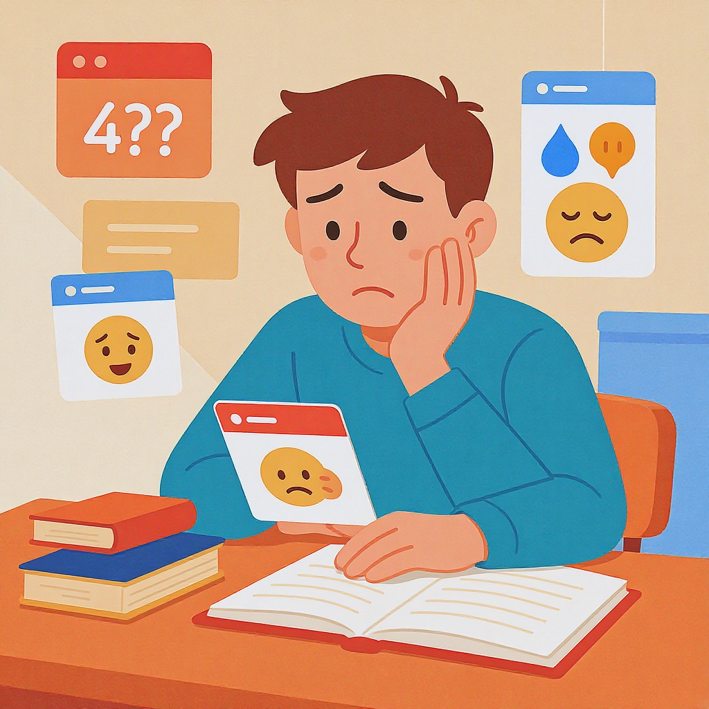

# Эмоциональные [триггеры](../../../7.2 Media, leisure and hobbies/Computer games/articles/technologies_inside/management_history.md) в контенте

**Wiki** [Wikidata](https://www.wikidata.org/wiki/Q2914471)  
**Parent topic** Информационная и [медиаграмотность](../что_такое_информационная_и_медиаграмотность.md)  

Эмоциональные триггеры — это элементы в контенте (тексте, [видео](../оценка_качества_изображений_и_видео.md), постах, рекламе), которые **запускают сильные [чувства](../../../2.1_society/cause_and_effect_relationships/articles/empathy_causality.md)** у зрителя: [страх](../../../4.2/critical_thinking/articles/influence_of_emotions.md), радость, [гнев](../../../4.2/critical_thinking/articles/influence_of_emotions.md), [удивление](../../../4.1_rules_of_study/how_to_learn_effectively/articles/curiosity.md), сострадание. Они работают как кнопка «включить эмоцию» — и часто заставляют нас кликать, делиться, комментировать или даже покупать что-то.

Понимать, как они работают, — это как получить [ключ](../../how_internet_works/articles/http_https/tls.md) от секретного режима в видеоигре. Ты не просто потребляешь [контент](../информационная_диета.md) — ты начинаешь понимать, **почему** он тебя трогает.

---

## Что такое эмоциональный [триггер](../эмоциональные_триггеры_в_контенте.md)? Простыми словами

Представь, что твой [мозг](../../../3.1. healthy lifestyle/Sleep, nutrition, and adolescent energy/articles/breakfast_for_the_brain.md) — это компьютер. Эмоциональный [триггер](../эмоциональные_триггеры_в_контенте.md) — это специальная [программа](../../operating system/articles/process.md), которая **обходит логику** и сразу включает «эмоциональный [режим](../семейные_правила_потребления_контента.md)». Вместо того чтобы думать: «Это правда?», ты сразу чувствуешь: «Ого! Это ужасно!» или «Как же это красиво!»

### Примеры эмоциональных триггеров:

- **[Страх](../../../1.2_natural_sciences/neurobiology_for_teens/articles/14_amygdala_fear.md)**: *«Если не купишь этот браслет, ты заболеешь!»*  
- **Радость**: *«Ты можешь стать самым крутым в классе — просто попробуй!»*  
- **[Гнев](../../../4.2_thinking_and_working_information/critical_thinking/articles/influence_of_emotions.md)**: *«Почему [школа](../../../3.1. healthy lifestyle/Sleep, nutrition, and adolescent energy/articles/healthy_school_snacks.md) игнорирует твои проблемы?»*  
- **Сострадание**: *«Этот мальчик не имеет обуви — помоги ему!»*  
- **Удивление**: *«Ты не поверишь, что произошло с этим котом!»*

> 💡 **Запомни**: триггеры не всегда плохие. Они могут вдохновлять, помогать, объединять. Но если их используют, чтобы манипулировать — это опасно.

---

## Как триггеры работают в реальном мире

### ✅ Пример 1: [Соцсети](../../../2.1_society/how_and_where_find_friends/articles/tcifrovaya_druzhba.md)
Ты видишь пост: *«Ты не знаешь, [что происходит](../../how_internet_works/articles/web_basics/what_happens.md) с твоими друзьями...»* — и сразу хочешь нажать. Почему?  
→ Это **триггер страха упущенной возможности** ([FOMO](../../../3.1_healthy lifestyle/vrednye_privychki/articles/Social_media.md) — Fear Of Missing Out). Ты боишься, что тебя исключат из «важного».

### ✅ Пример 2: Реклама
*«Только сегодня! [Скидка](../../../3.1_healthy lifestyle/vrednye_privychki/articles/shopogolizm.md) 90% — завтра исчезнет!»*  
→ Это **триггер срочности**. Ты не думаешь, считаешь ли ты это выгодным — ты просто действуешь, чтобы не «потерять».

### ✅ Пример 3: Школьные проекты
Учитель говорит: *«Если не сдашь [работу](../../../8.2_future/choosing_a_career_path/articles/interview.md), ты не пройдёшь в следующий класс»* — вместо: *«Давай вместе разберёмся, как сделать работу лучше»*.  
→ Это **триггер страха перед наказанием**. Он может [мотивировать](../../../how_to_memorize/articles/motivaciya.md), но часто вызывает [стресс](../../../3.1. healthy lifestyle/Sleep, nutrition, and adolescent energy/articles/chronic_sleep_deprivation.md), а не [желание учиться](../../../how_to_memorize/articles/motivaciya.md).

---

## Частые [ошибки](../../../3.1_healthy_lifestyle/pervaya_pomoshch/ushibi_porezy_ozhogi/07_ushib_chego_nelzya.md): когда триггеры вредят

| [Ошибка](../логические_ошибки_в_медиа.md) | Почему плохо                                                                                                   | Как исправить |
|-------|----------------------------------------------------------------------------------------------------------------|----------------|
| **Использование страха для манипуляции** | Например: *«Если не будешь учиться — будешь безработным всю [жизнь](../../../1.2_natural_sciences/why_science_help_understand_world/biology.md)!»*                                           | Заменить на **реальные примеры успеха** и поддержку: *«Вот как люди, которые учились упорно, добились результата»* |
| **Переусердствование с эмоциями** | Всё [время](../../../1.2_natural_sciences/physics_in_everyday_life/Q20702.md) «ЭТО УЖАСНО!», «ЭТО ЛУЧШЕЕ В МИРЕ!» — и ты перестаёшь верить                                         | Использовать **честные, сбалансированные** формулировки: *«Это работает для многих, но не для всех — давай попробуем»* |
| **Игнорирование контекста** | Пост про жертвы природных катастроф с яркими [фото](../проверка_фото_на_манипуляции.md) и просьбой пожертвовать — без информации, куда пойдут [деньги](../../../2.1_society/cause_and_effect_relationships/articles/economic_chains.md) | Добавить **[прозрачность](../../../1.2_natural_sciences/physics_in_everyday_life/Q11469.md)**: *«Наши пожертвования идут в фонд «[Спасение](../../../7.2 Media, leisure and hobbies/Computer games/articles/how_it_all_started/crisis_and_resurrection.md) детей» — вот [ссылка](../как_правильно_оформлять_ссылки_и_источники.md) на их отчёт»* |
| **[Эмоции](../../../3.1. healthy lifestyle/Sleep, nutrition, and adolescent energy/articles/stress_and_food.md) вместо фактов** | *«Все ненавидят эту школу!»* — без доказательств                                                               | Заменить на: *«Многие ученики жалуются на перегрузку — вот [статистика](../проверка_цитат_и_статистики.md) и предложения по улучшению»* |

<!--- Это важно: эмоции — не враги. Но без разума они превращаются в оружие. --->

---

## Мини-чек-лист: как распознать эмоциональный триггер

Прежде чем кликнуть, поделиться или поверить — пройди этот простой тест:

- [ ] **Есть ли срочность?** — «Только сегодня!», «Уже 3 человека купили!» → Это триггер.
- [ ] **Есть ли обвинение?** — «Ты не заботишься о своём будущем!» → Это триггер.
- [ ] **Есть ли крайности?** — «Все это делают», «Никто не знает правду» → Это триггер.
- [ ] **Есть ли [эмоция](../кликбейт_и_заголовки_ловушки.md) без фактов?** — «Это ужасно!» — но нет данных → Это триггер.
- [ ] **Хочешь поделиться, чтобы «показать, что ты в курсе»?** → Это FOMO-триггер.

> ✅ **[Правило](../../../1.2_natural_sciences/why_science_help_understand_world/patterns.md) 3 секунд**: Остановись. Сделай глубокий вдох. Спроси себя: *«Что я чувствую? И почему?»*

---

## Как использовать триггеры правильно — для учеников, родителей и учителей

### 👨‍🏫 Для учителей:
- **Используйте вдохновение, а не страх**:  
  ❌ *«Если не сдадите, останетесь на второй год!»*  
  ✅ *«Вот примеры работ прошлых лет — они начали с нуля, как и вы. У вас тоже всё получится!»*

- **Добавляйте [эмоции](../../../3.1. healthy lifestyle/Sleep, nutrition, and adolescent energy/articles/stress_and_food.md) в [обучение](../../../3.1. healthy lifestyle/Sleep, nutrition, and adolescent energy/articles/sleep_and_memory_grades.md)**:  
  Используй истории, личные примеры, [видео](../оценка_качества_изображений_и_видео.md) с реальными людьми. Это делает информацию **запоминающейся**.

### 👪 Для родителей:
- **Обсуждайте [контент](../информационная_диета.md) вместе**:  
  Когда ребёнок показывает пост: *«Посмотри, как жестоко обращаются с животными!»* — не просто скажи «Это грустно». Спроси:  
  → *«Что тебя в этом тронуло?»*  
  → *«Как ты думаешь, это правда? Где можно проверить?»*

- **Покажите, как не поддаваться манипуляциям**:  
  *«Этот пост хочет, чтобы ты переживал — но не обязательно действовал. Подумай, прежде чем делиться».*

### 👦‍🎓 Для учеников:
- **Ты не обязан верить всему, что вызывает сильные эмоции**.  
  Даже если тебе «жаль», «страшно» или «обидно» — **проверь [источник](../дезинформация_и_фейки.md)**.
- **Пиши сам с умом**:  
  Если делаешь пост, [проект](../../../1.2_natural_sciences/why_science_help_understand_world/research_work.md) или презентацию — используй эмоции, чтобы **вдохновить**, а не запугать.  
  Например:  
  > ❌ *«Никто не хочет учиться в этой школе!»*  
  > ✅ *«Многие хотят, чтобы в школе было больше времени на [творчество](../../../7.2_leisure/useful_and_interesting_leisure/articles/creativity_and_handicrafts.md). Вот как мы можем это изменить».*

---

## Таблица: Эмоциональные триггеры и их [влияние](../манипуляции_и_пропаганда.md)

| Триггер | Пример | Кто чаще использует | Эффект |
|--------|--------|---------------------|--------|
| **Страх** | *«Ты забудешь всё, если не выучишь сейчас!»* | Реклама, строгие учителя | [Стресс](../../../3.1. healthy lifestyle/Sleep, nutrition, and adolescent energy/articles/chronic_sleep_deprivation.md), [тревога](../../../how_to_memorize/articles/stress.md), снижение мотивации |
| **Радость** | *«Ты можешь стать чемпионом!»* | Тренеры, блогеры, школьные конкурсы | Вдохновение, [уверенность](../../../2.1_society/how_and_where_find_friends/articles/otkaz_ne_konets.md) |
| **Сострадание** | *«Этот ребёнок не ест уже три дня»* | Благотворительные фонды | [Желание](../../../6.1_Independent_living_and_daily_living_skills/reasonable_spending/articles/want.md) помочь, но иногда — [манипуляция](../../../2.1_society/cause_and_effect_relationships/articles/false_connections.md) |
| **Удивление** | *«Ты не поверил, что это сделал 12-летний мальчик!»* | YouTube, TikTok | [Вовлечённость](../../../4.2/critical_thinking/articles/information_bubbles.md), клики |
| **Гнев** | *«Почему администрация игнорирует нас?»* | Активисты, политики | [Мобилизация](../../../1.2_natural_sciences/neurobiology_for_teens/articles/07_stress.md), но и разобщённость |

> ⚠️ **Важно**: один и тот же триггер может быть и полезным, и вредным — **всё зависит от намерений и честности**.

---

## Практические [советы](../../../7.2_leisure/useful_and_interesting_leisure/articles/mistakes_in_choosing_hobby.md): как не попасться

1. **Пиши «вслух»** — проговаривай вслух, что ты читаешь. Часто слышимое звучит абсурднее, чем написанное.
2. **Ищи цифры и [источники](../../../4.2_thinking_and_working_information/how_to_search_information/articles/three_whales.md)** — если нет ссылок, данных, имён — это красный флаг.
3. **Задавай вопрос «Кому это выгодно?»** — кто выигрывает от твоей эмоции?
4. **Поделись только после проверки** — особенно если пост вызывает сильную эмоцию.
5. **Создавай контент с добротой** — если ты пишешь, рисуешь, снимаешь — пусть это вдохновляет, а не разделяет.

---

## Где учиться дальше? (Надёжные источники)

1. **[MediaWise by Poynter](https://www.poynter.org/mediawise/)** — бесплатные уроки по распознаванию лжи в интернете.  
2. **[Common Sense Media](https://www.commonsensemedia.org/)** — [советы](../../../7.2 Media, leisure and hobbies /useful_and_interesting_leisure/articles/mistakes_in_choosing_hobby.md) для родителей и учителей по [цифровой](../../../7.1_art/musical_instruments/articles/synthesizer.md) грамотности.  
3. **[CrashCourse Media Literacy](https://www.youtube.com/playlist?list=PL8dPuuaLjXtNlUrzyH5r6jN9ulIgZBpdo)** — серия видео на английском, но с понятными примерами.  

---

## [Заключение](../../../1.2_natural_sciences/physics_in_everyday_life/Q2225.md): эмоции — это не плохо, но они требуют ума

Эмоциональные триггеры — как [огонь](../../../3.2 healthy lifestyle/how to act in a dangerous situation/articles/fire-at-home.md): они могут согреть, а могут сжечь.  
Ты не обязан быть «холодным» или «безэмоциональным».  
Но ты **обязан научиться** отличать, когда тебя **вдохновляют**, а когда — **используют**.

Ты — не просто потребитель контента.  
Ты — его **критик**, **создатель** и **защитник**.

Сделай [выбор](../../../2.1_society/cause_and_effect_relationships/articles/personal_choice.md) с умом.

## См. также

- [Логические ошибки в медиа](./логические_ошибки_в_медиа.md)
- [Кликбейт и заголовки-ловушки](./кликбейт_и_заголовки_ловушки.md)
- [Информационная диета](./информационная_диета.md)

---
**Авторы:** Власко Михаил  
**Слов:** 1154  
**Дата генерации:** 2026-03-12  
**Сервис генерации:** qwen
