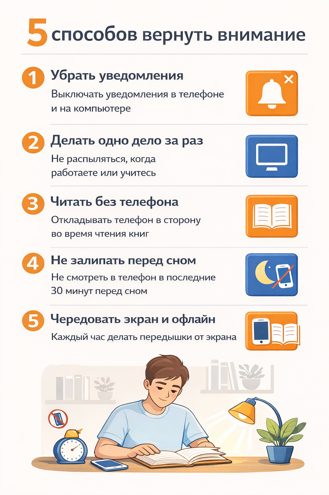

# Как прокачать [внимание](../../../1.2_natural_sciences/neurobiology_for_teens/articles/16_love_chemistry.md) и приручить клипы: практики для школьника

Хорошая [новость](../../information and media literacy/информационная_диета.md) в [том](../../../7.1_art/musical_instruments/articles/drums.md), что внимание — не хрустальная ваза, которую можно разбить один раз и навсегда. Это [навык](../../information and media literacy/карта_компетенций_по_возрастам.md). Плохая — это не волшебная таблетка. Это как [спорт](../../../3.1. healthy lifestyle/Sleep, nutrition, and adolescent energy/articles/sport_and_energy.md): чуть-чуть, но регулярно. И ещё важнее: не «выкинуть телефон», а **настроить среду**, чтобы мозгу было легче.

---

## Принцип №1: не воюй с собой — меняй условия

Если телефон рядом, мозгу тяжело. Это нормально. Поэтому [стратегия](../../../2.1_society/cause_and_effect_relationships/articles/future_planning.md) такая:

- во [время](../../../1.2_natural_sciences/physics_in_everyday_life/Q20702.md) учёбы телефон **вне поля зрения** (в рюкзак, в другую комнату),
- [уведомления](../../../4.2_thinking_and_working_information/how_to_search_information/articles/information_hygiene.md) — в **беззвучный** или «не беспокоить» на 30–60 минут,
- вкладки на компьютере — [минимум](../../../1.2_natural_sciences/physics_in_everyday_life/Q136980.md) (одна задача = один [экран](../../../3.1. healthy lifestyle/Sleep, nutrition, and adolescent energy/articles/gadgets_blue_light_sleep.md)).

Это не слабость. Это [инженерия](../../../1.2_natural_sciences/physics_in_everyday_life/Q161635.md): как сделать так, чтобы система работала.

---

## Принцип №2: «длинное» тренируется маленькими шагами

Внимание не появляется сразу на час. Начни с 10–15 минут «чистого фокуса».

**[Метод](../../how_internet_works/articles/http_https/http_https.md) «[лестница](../../../3.2 healthy lifestyle/how to act in a dangerous situation/articles/building-evacuation.md)»:**

- День 1–2: 10 минут фокуса → 2 минуты [перерыв](../../../7.2 Media, leisure and hobbies/Computer games/articles/useful_tips/eyes_and_back.md)
- День 3–4: 12 минут → 3 минуты
- Потом 15, 20, 25…

Перерыв важен: [мозг](../../../3.1. healthy lifestyle/Sleep, nutrition, and adolescent energy/articles/breakfast_for_the_brain.md) должен «переваривать».

Если хочешь классический вариант — [техника](../../../1.2_natural_sciences/physics_in_everyday_life/Q133673.md) Помодоро, можно делать [блоки](../../../1.2_natural_sciences/physics_in_everyday_life/Q169019.md) **25 минут [работа](../../../1.2_natural_sciences/physics_in_everyday_life/Q11382.md) / 5 минут [отдых](../../../3.1. healthy lifestyle/Sleep, nutrition, and adolescent energy/articles/evening_rituals_sleep_fast.md)**. Но смысл один: работаешь отрезками и не разрываешь их соцсетями.

---

## Принцип №3: клиповое [мышление](../../../1.2_natural_sciences/neurobiology_for_teens/articles/01_brain_complexity.md) можно использовать как инструмент

Клипы могут помочь учиться, если ими **входить в тему**, а не заменять тему.

Пример «умного использования клипа»:

1. Сначала короткое [объяснение](../../../4.1_rules_of_study/how_to_learn_effectively/articles/teaching_others.md) ([видео](../../information and media literacy/оценка_качества_изображений_и_видео.md)/инфографика) — чтобы поймать общий смысл.
2. Потом учебник/[конспект](../../../4.1_rules_of_study/how_to_memorize/articles/konspektirovanie.md) — чтобы выстроить связи.
3. В конце — [самопроверка](../../../4.1_rules_of_study/how_to_memorize/articles/samoproverka.md): **объясни вслух за минуту**.

Клип — это затравка, а не вся [еда](../../../3.1. healthy lifestyle/Sleep, nutrition, and adolescent energy/articles/stress_and_food.md).

---

## Три практики, которые реально работают

### 1) «Один экран»

Выбираешь задачу и убираешь всё, что к ней не относится.  
Если пишешь сочинение — не открываешь ленту «на минутку». Минутка почти всегда превращается в десять.

### 2) «Скука — это тренажёр»

Внимание растёт, когда мозг учится выдерживать скучное начало.  
[Правило](../../../1.2_natural_sciences/why_science_help_understand_world/patterns.md): прежде чем переключиться, **посиди 30 секунд** и продолжи ещё чуть-чуть. Это как подтягивание: сначала тяжело, потом легче.

### 3) «[Ритуал](../../../2.1_society/how_and_where_find_friends/articles/druzhba_posle_shkoly.md) входа»

Мозг любит [привычки](../../../1.2_natural_sciences/neurobiology_for_teens/articles/11_reward_system.md). Один и тот же маленький ритуал помогает включить [фокус](../../../1.2_natural_sciences/physics_in_everyday_life/Q35197.md):

- налить воду,
- открыть тетрадь,
- поставить таймер,
- написать на листе: «Сейчас я делаю ___».

Ритуал = кнопка «начать».

---

## Если ты уже привык постоянно отвлекаться — что делать

Не ругай себя. Важно не «[сила](../../../1.2_natural_sciences/physics_in_everyday_life/Q11023.md) воли 100%», а система:

- [учёба](../../../8.1_colf-underctandina/HouToFindVourStrenaths/articles/use_strengths_in_life.md) блоками 20–30 минут,
- заранее [план](../../../7.2 Media, leisure and hobbies/Computer games/articles/genres_and_worlds/strategy.md): **что именно делаю**,
- [заметки](../../../4.1_rules_of_study/how_to_memorize/articles/konspektirovanie.md) на бумаге (бумага не присылает уведомления),
- [сон](../../../3.1. healthy lifestyle/Sleep, nutrition, and adolescent energy/articles/evening_rituals_sleep_fast.md) и отдых (без них внимание не чинится).

Можно начать с мягкого режима:

- [музыка](../../../1.2_natural_sciences/neurobiology_for_teens/articles/18_music_chills.md) **без слов** (если помогает),
- черновик для «вылетающих мыслей» (записал — вернулся).

---

## Не технология должна командовать человеком, а [человек](../../../1.2_natural_sciences/physics_in_everyday_life/Q45003.md) — технологией

ВОЗ подчеркивает, что подросткам важно учиться принимать осознанные решения о своей онлайн-жизни и удерживать [баланс](../../../1.2_natural_sciences/physics_in_everyday_life/Q634.md) между цифровым и офлайн-миром. Значит, [цель](../../../1.2_natural_sciences/why_science_help_understand_world/research_work.md) не в том, чтобы выбросить телефон, а в том, чтобы перестать быть его пленником. Настоящая цифровая грамотность начинается именно здесь: с [умения](../../../8.2_future/choosing_a_career_path/articles/skills.md) заметить, куда уходит твоё внимание, и вернуть его туда, где оно действительно нужно.

---

## Челлендж на неделю: «Внимание как навык»

Каждый день — всего 15–20 минут:

1. 10–15 минут чтения или задач без переключений.
2. 2 минуты пересказа: «Что я понял?»
3. Галочка в трекере.

Через неделю обычно заметно: входить в фокус стало легче. Не идеально, но заметно — как в спорте.

---

## Смотри также

- [Сокращение внимания: почему мозг устаёт и «просит новое»](1-Сокращение_внимания_почему_мозг_устает.md) — почему внимание «сокращается» и какие механизмы за этим стоят
- [Клиповое мышление: когда мир выглядит как лента](1-Клиповое_мышление_когда_мир_выглядит_как_лента.md) — что такое клиповое мышление, его плюсы и минусы
- [Дофаминовая петля: как алгоритмы управляют твоим вниманием](2-Дофаминовая петля.md) — как уведомления и [лента](../../information and media literacy/алгоритмы_и_пузырь_фильтров.md) создают дофаминовый цикл, из которого сложно выйти
- [Трансформация мышления: как интернет меняет наши когнитивные способности](4-internet_thinking_transformation.md) — [советы](../../../7.2 Media, leisure and hobbies /useful_and_interesting_leisure/articles/mistakes_in_choosing_hobby.md) по информационной гигиене и тренировке длительного [внимания](../../../4.1_rules_of_study/how_to_memorize/articles/vnimanie.md)

---
**Авторы:** Ветошкина София  
**[Ресурсы](../../../2.1_society/cause_and_effect_relationships/articles/ecological_footprint.md):** [LLM](../../../7.1_art/modern_technological_art/README.md) — [ChatGPT](../../../7.1_art/modern_technological_art/articles/6.1_prompt_art.md), ВОЗ
