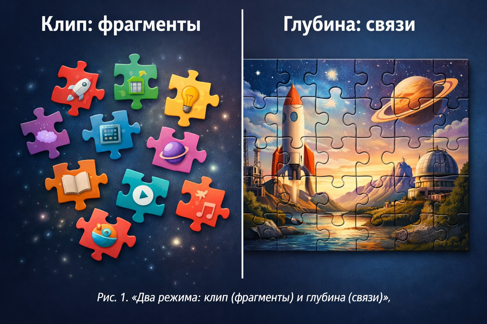

# Клиповое [мышление](../../../1.2_natural_sciences/neurobiology_for_teens/articles/01_brain_complexity.md): когда мир выглядит как [лента](../../information and media literacy/алгоритмы_и_пузырь_фильтров.md)

Представь, что тебе нужно понять [фильм](../../../../8.1_entertainment/articles/movie.md), но тебе показывают не целиком, а пятнадцать секунд отсюда, десять секунд оттуда, [мем](../../../7.2 Media, leisure and hobbies/Computer games/articles/game_culture/game_memes.md), кусок диалога, титры, снова мем. Ты вроде бы всё видел, но… [сюжет](../../../7.2 Media, leisure and hobbies/Computer games/articles/dream_team/screenwriter.md) ускользает. Это хороший [образ](../../../7.2 Media, leisure and hobbies/Computer games/articles/game_culture/cosplay.md) того, что обычно называют **клиповым мышлением**.

---

## Что это вообще такое

**Клиповое мышление** — это [привычка](../../../7.2 Media, leisure and hobbies /useful_and_interesting_leisure/articles/how_not_to_quit_hobby.md) воспринимать информацию короткими фрагментами (клипами): [заголовок](../../how_internet_works/articles/http_https/http_https.md), сторис, короткое [видео](../../information and media literacy/оценка_качества_изображений_и_видео.md), комментарий, картинка, ещё картинка. Нашему мозгу удобно: быстро, ярко, без долгих объяснений.

Но есть важный нюанс: **клип — это кусочек карты, а не вся [карта](../../information and media literacy/карта_компетенций_по_возрастам.md)**. Он показывает деталь, но не всегда помогает понять систему: причины, последствия, связи между событиями.

Ещё один важный момент: «клиповое мышление» — это **скорее разговорное слово**, а не официальный медицинский диагноз. В науке чаще говорят по-другому: про **[внимание](../../../1.2_natural_sciences/neurobiology_for_teens/articles/16_love_chemistry.md)**, **переключение задач**, **перегрузку информацией**, **медиамногозадачность**. Но смысл бытового термина понятен: когда [мозг](../../../3.1. healthy lifestyle/Sleep, nutrition, and adolescent energy/articles/breakfast_for_the_brain.md) привыкает к фрагментам и всё чаще живёт в режиме «быстро пролистать».

---

## Клиповое мышление — не «тупость» и не «[лень](../../../1.2_natural_sciences/neurobiology_for_teens/articles/12_lazy_brain.md)»

Клиповое мышление часто путают с «тупостью» или «ленью». Это неправда и обидно. Это скорее **[адаптация](../../../2.1_society/how_and_where_find_friends/articles/druzhba_posle_shkoly.md)** к миру, где информации слишком много. Когда вокруг сотни сигналов в день, мозг учится быстро решать: это важно или нет? И выбирает [режим](../../../4.1_rules_of_study/how_to_learn_effectively/articles/breaks_and_rest.md) **быстрой сортировки**.

Если коротко: мозг не «сломался», он **подстроился**.

---

## Почему оно возникло именно сейчас

Раньше главный [поток информации](../../../4.2_thinking_and_working_information/critical_thinking/articles/fact_and_opinion_differences.md) был медленным: книга, газета, [урок](../../information and media literacy/шаблон_урока_по_медиаграмотности.md), телепередача по расписанию. Сейчас всё иначе:

- **Ленты бесконечные:** можно листать, пока не надоест (а часто — пока не закончится батарейка).
- **[Алгоритмы](../../../4.2_thinking_and_working_information/how_to_search_information/articles/buble_filter.md) подкидывают** то, что цепляет сильнее всего.
- **[Уведомления](../../../4.2_thinking_and_working_information/how_to_search_information/articles/information_hygiene.md) зовут:** «эй, тут что-то новое!»
- **Короткий [формат](../../../7.2 Media, leisure and hobbies/Computer games/articles/how_it_all_started/cartridge_versus_disc.md) победил:** клипы, шортсы, сторис удобно потреблять, когда [устал](../../../4.1_rules_of_study/how_to_memorize/articles/ustalost.md).
- Мозг привыкает к ритму: **быстро → ярко → сразу понятно → следующий**.

Это как жить в городе, где на каждом углу мигают вывески и звучит [музыка](../../../1.2_natural_sciences/neurobiology_for_teens/articles/18_music_chills.md). Ты быстро учишься [замечать](../../../4.1_rules_of_study/how_to_memorize/articles/vnimanie.md) самое громкое и самое яркое.

---

## Чем клиповое мышление полезно

Да, у него есть плюсы. И они реальные:

- **Быстрая ориентация:** за минуту понять о чём [новость](../../information and media literacy/информационная_диета.md) или тема.
- **Сканирование информации:** быстро находить главное.
- **Гибкость:** легче переключаться между задачами и источниками.
- **Визуальность:** схемы, картинки и инфографика считываются быстрее текста.

Клиповое мышление выручает там, где нужно быстро оценить ситуацию: новости, [поиск](../../../3.2 healthy lifestyle/how to act in a dangerous situation/articles/lost-in-city.md) решения, ориентирование в новом приложении, понять «что вообще происходит».

---

## А где оно мешает

Проблемы начинаются, когда клиповый режим становится **единственным**:

- **Сложные темы требуют времени.** [История](../../../1.2_natural_sciences/physics_in_everyday_life/Q11469.md), [физика](../../../1.2_natural_sciences/physics_in_everyday_life/Q11023.md), сочинение, подготовка к экзамену — это не сторис.
- **Смысл живёт в связях.** Если знать только кусочки, можно не понять причин и следствий.
- **Снижается терпение к «длинному».** Страница текста кажется вечностью, хотя раньше читали главы.
- **Поверхностная [уверенность](../../../2.1_society/how_and_where_find_friends/articles/otkaz_ne_konets.md).** Ощущение «я понял», потому что видел пару роликов — а на деле это только верхушка.

Есть ещё эффект, похожий на игру: клип даёт маленькое «понял!» — и мозг хочет ещё один «понял!». Так появляется привычка к постоянной смене стимулов: как только стало чуть скучно — срочно нужен новый кусочек.

---

## Важно: клиповое мышление — не приговор

Это не болезнь. Скорее, это **режим восприятия**, который можно включать и выключать. Проблема не в [том](../../../7.1_art/musical_instruments/articles/drums.md), что клипы существуют, а в том, что мы иногда забываем про второй режим — **глубокое мышление**, где есть внимание, [логика](../../../2.1_society/cause_and_effect_relationships/articles/causality_base.md), [выводы](../../../1.2_natural_sciences/why_science_help_understand_world/research_work.md) и терпение.

Идея простая: **в жизни нужны оба режима**.

- «Клип» — чтобы быстро сориентироваться.
- «Глубина» — чтобы реально понять.

---

## Мини-эксперимент на 3 минуты

1. Открой любой [текст](../../../4.1_rules_of_study/how_to_learn_effectively/articles/reading_skills.md) (параграф в учебнике).
2. Поставь таймер на 3 минуты и читай **без переключений**.
3. Если рука тянется к телефону — просто отметь это и продолжай.

Если было трудно — это не «ты слабый». Это значит, мозг привык к клиповому ритму. А [привычки](../../../1.2_natural_sciences/neurobiology_for_teens/articles/11_reward_system.md) можно перенастраивать.

[Разговор](../../../2.1_society/how_and_where_find_friends/articles/izi_temy_dlya_razgovora.md) о клиповом мышлении — это не повод ругать телефоны и не повод ругать подростков. Это повод честно признать: [цифровой](../../../7.1_art/musical_instruments/articles/synthesizer.md) мир очень силён, он умеет захватывать внимание, и с ним нужно не воевать, а учиться жить разумно. Не запрещать себе [технологии](../../../2.2_history/world_economy_on_fingers/articles/globalizatsiya.md), а понимать, как они меняют привычки восприятия. Именно цифровая грамотность и умение управлять вниманием сегодня становятся почти такими же важными навыками, как [чтение](../../../4.1_rules_of_study/how_to_learn_effectively/articles/reading_skills.md) и письмо.

---

## Смотри также

- [Сокращение внимания: почему мозг устаёт и «просит новое»](1-Сокращение_внимания_почему_мозг_устает.md) — подробнее о видах [внимания](../../../4.1_rules_of_study/how_to_memorize/articles/vnimanie.md) и о том, почему оно «скользит»
- [Как прокачать внимание и приручить клипы](1-Как_прокачать_внимание_и_приручить_клипы.md) — конкретные практики, чтобы использовать клипы с пользой и тренировать глубокое мышление
- [Как работают рекомендации: от клика до «умной» ленты](2-Как%работают%рекомендации.md) — как алгоритмы формируют ту самую «бесконечную ленту», о которой говорится в статье
- [Трансформация мышления: как интернет меняет наши когнитивные способности](4-internet_thinking_transformation.md) — научные [данные](../../../2.1_society/cause_and_effect_relationships/articles/ai_causality.md) о клиповом мышлении, F-образном чтении и изменении когнитивных навыков

---
**Авторы:** Ветошкина София, tg @sofiavetoshkina  
**[Ресурсы](../../../2.1_society/cause_and_effect_relationships/articles/ecological_footprint.md):** [LLM](../../../7.1_art/modern_technological_art/README.md) — [ChatGPT](../../../7.1_art/modern_technological_art/articles/6.1_prompt_art.md), ВОЗ
