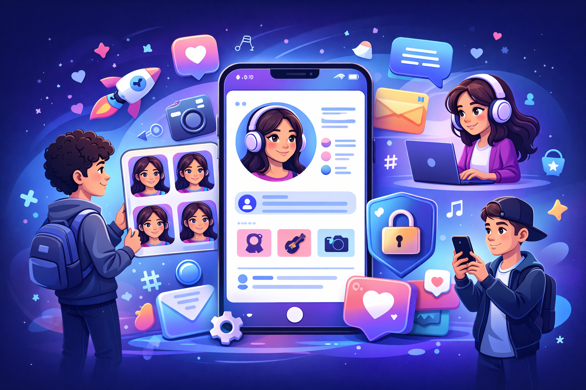

# Создание и управление онлайн-профилем: твоя цифровая визитная карточка

*Онлайн-профиль* — это твоя **цифровая визитная карточка**, которая представляет тебя в интернете. Как в реальной жизни ты выбираешь одежду и причёску, так и в цифровом мире ты создаёшь свой [образ](../../../7.2 Media, leisure and hobbies/Computer games/articles/game_culture/cosplay.md) через профили на различных платформах. Умение правильно создавать и поддерживать онлайн-профиль — это важный [навык](../../information and media literacy/карта_компетенций_по_возрастам.md) современного человека, который поможет тебе произвести хорошее впечатление, найти друзей и даже повлиять на будущие возможности.



---

## [Основы](../../../3.1_healthy_lifestyle/pervaya_pomoshch/ushibi_porezy_ozhogi/01_chto_takoe_pervaya_pomoshch.md) создания профиля

Создание качественного онлайн-профиля начинается с понимания его [цели](../../../3.1_healthy_lifestyle/pervaya_pomoshch/ushibi_porezy_ozhogi/02_celi_pervoy_pomoshchi.md). **Зачем ты создаёшь этот [профиль](../../information and media literacy/цифровая_репутация.md)?** Для общения с друзьями, демонстрации творчества, поиска единомышленников или профессионального развития? От цели зависит [стиль](../../../7.1_art/modern_technological_art/articles/5.5_yandex_neural.md) и содержание твоего профиля.

**Основные элементы профиля** включают никнейм или [имя пользователя](../../../5.2_cybersecurity/passwords_cyber_safety/articles/login.md), фотографию профиля ([аватар](../../../7.2 Media, leisure and hobbies/Computer games/articles/heroes_and_villains/create_your_hero.md)), описание или биографию, контактную информацию и настройки приватности. Каждый [элемент](../../../1.2_natural_sciences/why_science_help_understand_world/chemistry.md) должен работать на создание целостного образа, который отражает твою [личность](../../../1.2_natural_sciences/neurobiology_for_teens/articles/06_phineas_gage.md) и цели.

Важно [помнить](../../../4.1_rules_of_study/how_to_memorize/articles/pamyat.md) о **последовательности** — все элементы профиля должны дополнять друг друга и создавать единое впечатление. Если ты позиционируешь себя как серьёзного художника, то и никнейм, и [фото](../../information and media literacy/проверка_фото_на_манипуляции.md), и описание должны это поддерживать.

---

## [Выбор](../../../2.1_society/cause_and_effect_relationships/articles/personal_choice.md) никнейма и аватара

**Никнейм** — это твоё имя в цифровом мире, поэтому выбирай его тщательно. Хороший никнейм легко [запоминается](../../../4.1_rules_of_study/how_to_memorize/articles/zapominanie.md), отражает твои [интересы](../../../2.1_society/cause_and_effect_relationships/articles/conflict_roots.md) или личность, и не содержит личной информации. Избегай использования настоящего имени и фамилии, особенно в сочетании с другими личными данными.

**Аватар** — это первое, что видят люди, поэтому он должен быть качественным и подходящим. Это может быть твоя фотография, рисунок, символ или [изображение](../../information and media literacy/оценка_качества_изображений_и_видео.md), связанное с твоими интересами. Главное — чтобы аватар был уместным для платформы и аудитории.

> Помни: никнейм и аватар — это твоя цифровая подпись. Они должны представлять тебя в лучшем свете.

```
Примеры хороших никнеймов:
- CreativeAlex (имя + характеристика)
- MusicLover2024 (интерес + год)
- DigitalArtist (профессия/хобби)
- BookwormMia (хобби + имя)

Примеры плохих никнеймов:
- IvanPetrov_School15 (полное имя + школа)
- 89261234567 (номер телефона)
- Moscow_Lenina_25 (адрес)
```

---

## Заполнение информации о себе

**Биография или описание** — это место, где ты можешь рассказать о себе своими словами. Здесь важно найти [баланс](../../../1.2_natural_sciences/physics_in_everyday_life/Q634.md) между информативностью и безопасностью. Расскажи о своих интересах, [хобби](../../../2.1_society/how_and_where_find_friends/articles/neochevidnye_mesta_dlya_znakomstva.md), достижениях, но не указывай точное [местоположение](../../information and media literacy/геолокация_и_проверка_контекста.md), школу или другую личную информацию.

**[Структура](../../../4.1_rules_of_study/how_to_learn_effectively/articles/note_taking.md) хорошего описания:**
- Краткое представление (кто ты)
- Основные интересы или [увлечения](../../../2.1_society/how_and_where_find_friends/articles/druzhba_i_hobby.md)
- [Достижения](../../../4.1_rules_of_study/how_to_learn_effectively/articles/gamification.md) или особенности
- Призыв к действию (подписаться, написать и т.д.)

Используй **ключевые слова**, связанные с твоими интересами — это поможет единомышленникам найти тебя. Но не переусердствуй с хештегами и ключевыми словами, описание должно читаться естественно.

---

## Настройки приватности и безопасности

Правильная настройка приватности — это основа безопасного использования социальных сетей. В таблице ниже показаны основные настройки и рекомендации:

| Настройка | Рекомендация | Почему важно | Как настроить |
|-----------|--------------|--------------|---------------|
| **Видимость профиля** | Только [друзья](../../../4.1_rules_of_study/how_to_learn_effectively/articles/peer_learning.md) или ограниченная | [Защита](../../how_internet_works/articles/dns/cdn.md) от незнакомцев | Настройки → [Приватность](../../../4.2_thinking_and_working_information/how_to_search_information/articles/digital_footprint.md) |
| **[Поиск](../../../3.2 healthy lifestyle/how to act in a dangerous situation/articles/lost-in-city.md) по имени** | Ограничить | Сложнее найти профиль | Настройки → Поиск |
| **[Сообщения](../../operating system/articles/IPC.md)** | Только от друзей | Защита от спама | Настройки → Сообщения |
| **[Геолокация](../../information and media literacy/геолокация_и_проверка_контекста.md)** | Отключить | Защита местоположения | Настройки → Местоположение |
| **Теги на фото** | Требовать подтверждение | Контроль над контентом | Настройки → Теги |

*Регулярно проверяй и обновляй настройки приватности.*

---

## Управление контентом

**Контент-стратегия** — это [план](../../../7.2 Media, leisure and hobbies/Computer games/articles/genres_and_worlds/strategy.md) того, что и как ты публикуешь. Даже если ты не блогер, полезно подумать о [том](../../../7.1_art/musical_instruments/articles/drums.md), какое впечатление производят твои посты. Старайся поддерживать баланс между личными моментами и интересным для других контентом.

**[Правила](../../../2.1_society/cause_and_effect_relationships/articles/why_rules_work.md) качественного контента:**
- Публикуй регулярно, но не слишком часто
- Следи за качеством фотографий и текстов
- Будь позитивным и конструктивным
- Делись не только своими успехами, но и процессом
- Взаимодействуй с аудиторией — отвечай на [комментарии](../../../4.2_thinking_and_working_information/how_to_search_information/articles/cooperative_work.md)

💡💡💡
Перед публикацией задай себе вопрос: "Буду ли я гордиться этим постом через год?"

---

## [Цифровая гигиена](../../../3.1. healthy lifestyle/Sleep, nutrition, and adolescent energy/articles/gadgets_blue_light_sleep.md) профиля

**Цифровая гигиена** — это регулярное поддержание порядка в твоих онлайн-профилях. Как ты убираешь в своей комнате, так нужно "убираться" и в цифровом пространстве.

**Регулярные [действия](../../../3.1_healthy_lifestyle/pervaya_pomoshch/ushibi_porezy_ozhogi/03_obschie_pravila_algorithm.md) для поддержания профиля:**
- Удаляй устаревшие или неподходящие посты
- Обновляй информацию о себе
- Проверяй настройки приватности
- Очищай [список](../../../5.2_cybersecurity/cpp_fundamentals/10_arrays.md) друзей от неактивных аккаунтов
- Обновляй фотографии профиля

**[Признаки](../../../3.1_healthy_lifestyle/pervaya_pomoshch/ushibi_porezy_ozhogi/04_ushib_chto_eto_priznaki.md) того, что профиль нуждается в обновлении:**
- Последний пост был несколько месяцев назад
- [Информация](../../information and media literacy/как_устроена_современная_информационная_среда.md) в биографии устарела
- Фотография профиля не соответствует текущему возрасту
- Много неактивных друзей или подписчиков

---

## Интересные [факты](../../../1.2_natural_sciences/physics_in_everyday_life/Q17737.md)

1. Исследования показывают, что люди формируют [мнение](../../../4.2_thinking_and_working_information/critical_thinking/articles/fact_and_opinion_differences.md) о профиле в социальной сети за первые 3 секунды просмотра :stopwatch:
2. Профили с заполненной биографией получают на 40% больше подписчиков, чем пустые профили.
3. 67% подростков регулярно "чистят" свои профили, удаляя старые посты и фотографии.
4. Самые популярные элементы в биографиях — эмодзи (используют 89% пользователей) и упоминание хобби (76%).

<!--- Статистика о важности первого впечатления в цифровом мире --->

---

Создание и управление онлайн-профилем — это навык, который становится всё более важным в цифровую эпоху. Хорошо оформленный профиль может открыть новые возможности для общения, творчества и даже карьеры. Помни: твой профиль — это [отражение](../../../1.2_natural_sciences/physics_in_everyday_life/Q11388.md) твоей личности, поэтому создавай его осознанно, поддерживай в актуальном состоянии и всегда думай о безопасности! :sparkles:

---

## Смотри также

- [Цифровая идентичность: кто ты в интернете](3-Цифровая%идентичность.md) — что такое цифровая идентичность и как профили на разных платформах формируют твой онлайн-образ
- [Цифровое самовыражение и творчество: найди свой голос в интернете](3-Цифровое%самовыражение%и%творчество.md) — как использовать профиль для творческого самовыражения и построения сообщества

---
**Авторы:** Никита, @n0wee;  
*[Ресурсы](../../../2.1_society/cause_and_effect_relationships/articles/ecological_footprint.md): [LLM](../../../7.1_art/modern_technological_art/README.md) - DeepSeek, Claude, GPT*