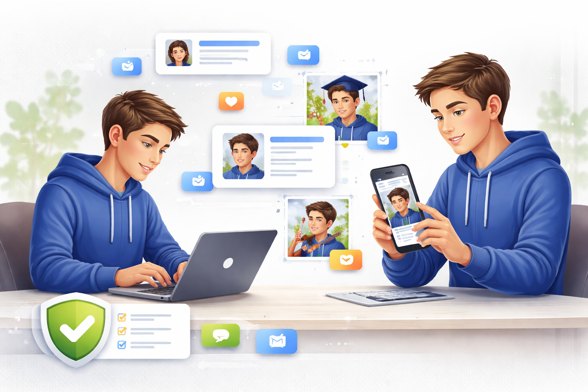

# Цифровое самовыражение и [творчество](../../../2.1_society/how_and_where_find_friends/articles/sam_sebe_interesnyi.md): найди свой голос в интернете

*Цифровое самовыражение* — это способность показать свою уникальную [личность](../../../1.2_natural_sciences/neurobiology_for_teens/articles/06_phineas_gage.md), [таланты](../../../8.1_self-understanding/HowToFindYourStrengths/articles/zone-of-genius-how-to-know.md) и [идеи](../../../7.2 Media, leisure and hobbies /useful_and_interesting_leisure/articles/free_leisure_activities.md) через различные онлайн-платформы. В отличие от реального мира, где твои возможности для творчества могут быть ограничены, [интернет](../../../1.2_natural_sciences/physics_in_everyday_life/Q26540.md) предоставляет **безграничные возможности** для самовыражения. Здесь ты можешь быть художником, музыкантом, писателем, видеоблогером или изобретателем — всё зависит только от твоего воображения и [желания](../../../6.2_money_and_literacy/how_to_save_for_goal/articles/needs_vs_wants.md) творить.



---

## Формы цифрового творчества

Цифровое творчество принимает множество форм, каждая из которых предлагает уникальные возможности для самовыражения. **Визуальное творчество** включает цифровое [рисование](../../../7.2 Media, leisure and hobbies /useful_and_interesting_leisure/articles/creativity_and_handicrafts.md), фотографию, [дизайн](../../../7.2 Media, leisure and hobbies/Computer games/articles/dream_team/artist.md) и создание мемов. **Аудиальное творчество** — это создание музыки, подкастов, аудиокниг и звуковых эффектов.

**Текстовое творчество** охватывает блоги, стихи, рассказы, сценарии и даже твиты. **Видеотворчество** включает создание роликов, анимации, стримов и видеоблогов. **Интерактивное творчество** — это [разработка](../../../8.2_future/choosing_a_career_path/articles/programmer.md) игр, приложений, интерактивных историй и виртуальных миров.

Каждая [форма](../../../7.1_art/modern_technological_art/articles/4.5_algorithmic_craft.md) имеет свои особенности и требует разных навыков, но все они объединены одним — возможностью выразить себя и поделиться своим видением мира с другими людьми.

---

## Платформы для творчества

Современный интернет предлагает множество платформ для творческого самовыражения. [Выбор](../../../2.1_society/cause_and_effect_relationships/articles/personal_choice.md) платформы зависит от типа контента, который ты создаёшь, и аудитории, которую хочешь достичь. Важно понимать особенности каждой платформы и адаптировать свой [контент](../../information and media literacy/информационная_диета.md) под её [формат](../../../7.2 Media, leisure and hobbies/Computer games/articles/how_it_all_started/cartridge_versus_disc.md).

**RuTube** идеально подходит для длинных [видео](../../information and media literacy/оценка_качества_изображений_и_видео.md) и образовательного контента. 
**ВК Клипы** — для коротких креативных роликов и трендов.
**[Яндекс](../../../7.1_art/modern_technological_art/articles/5.5_yandex_neural.md) [музыка](../../../1.2_natural_sciences/neurobiology_for_teens/articles/18_music_chills.md)** — для музыки и аудиоконтента.

> Не ограничивайся одной платформой — экспериментируй и находи те, которые лучше всего подходят твоему стилю творчества.

---

## [Развитие](../../../3.1. healthy lifestyle/Sleep, nutrition, and adolescent energy/articles/micronutrients_and_teenagers.md) творческих навыков

Цифровое творчество требует постоянного развития и изучения новых инструментов. В таблице ниже показаны основные направления и способы их развития:

| [Направление](../../../1.2_natural_sciences/physics_in_everyday_life/Q11402.md) | Основные [навыки](../../../7.2 Media, leisure and hobbies /useful_and_interesting_leisure/articles/computer_games_with_benefit.md) | [Инструменты](../../../1.2_natural_sciences/physics_in_everyday_life/Q36253.md) для изучения | Способы практики |
|-------------|-----------------|-------------------------|------------------|
| **Цифровое [искусство](../../../7.2 Media, leisure and hobbies /what_you_can_read_and_watch_to_develop_your_taste/articles/aesthetics_and_taste.md)** | Рисование, композиция, [цвет](../../../1.2_natural_sciences/physics_in_everyday_life/Q1075.md) | Photoshop, Procreate, Krita | Ежедневные скетчи, челленджи |
| **Видеопроизводство** | [Монтаж](../../information and media literacy/оценка_качества_изображений_и_видео.md), [сценарий](../../../../8.1_entertainment/articles/script.md), операторская [работа](../../../1.2_natural_sciences/physics_in_everyday_life/Q11382.md) | DaVinci Resolve, Adobe Premiere | Короткие проекты, эксперименты |
| **Музыкальное творчество** | Композиция, аранжировка, сведение | GarageBand, FL Studio, Audacity | Создание битов, кавер-версии |
| **Писательство** | [Стиль](../../../7.1_art/modern_technological_art/articles/5.5_yandex_neural.md), [структура](../../../4.1_rules_of_study/how_to_learn_effectively/articles/note_taking.md), редактирование | Google Docs, [Notion](../../../4.2_thinking_and_working_information/how_to_search_information/articles/second_mind.md), Grammarly | Ежедневное письмо, блоги |
| **[Программирование](../../../5.2_cybersecurity/cpp_fundamentals/1_introduction.md)** | [Логика](../../../2.1_society/cause_and_effect_relationships/articles/causality_base.md), [алгоритмы](../../../4.2_thinking_and_working_information/how_to_search_information/articles/buble_filter.md), дизайн | Scratch, Python, [HTML](../../../7.1_art/modern_technological_art/articles/2.1_jodi.md)/CSS | Мини-проекты, игры |

*Начинай с простых проектов и постепенно усложняй [задачи](../../../1.2_natural_sciences/why_science_help_understand_world/research_work.md).*

---

## [Поиск](../../../3.2 healthy lifestyle/how to act in a dangerous situation/articles/lost-in-city.md) своего стиля

**Творческий стиль** — это уникальная манера выражения, которая отличает твои [работы](../../../8.2_future/choosing_a_career_path/articles/interview.md) от других. Поиск собственного стиля — это [процесс](../../operating system/articles/process.md) экспериментов, ошибок и открытий. Не бойся копировать понравившиеся работы на начальном этапе — это часть обучения.

**Этапы развития стиля:**
- **Подражание** — изучаешь работы других авторов
- **Комбинирование** — смешиваешь разные [техники](../../../8.2_future_and_path_choice/articles/03_stress_management.md) и подходы
- **[Адаптация](../../../2.1_society/how_and_where_find_friends/articles/druzhba_posle_shkoly.md)** — приспосабливаешь чужие идеи под себя
- **Инновация** — создаёшь что-то принципиально новое

Помни, что стиль развивается постепенно и может изменяться со временем. Главное — оставаться верным себе и не бояться экспериментировать.

```
Советы для поиска стиля:
- Изучай работы разных авторов
- Экспериментируй с различными техниками
- Веди творческий дневник или портфолио
- Просите обратную связь у друзей и сообщества
- Не бойся делать ошибки — они часть процесса
```

---

## Построение творческого сообщества

**Творческое [сообщество](../../../2.1_society/how_and_where_find_friends/articles/druzhba_s_sosedyami.md)** — это группа людей, которые разделяют твои [интересы](../../../2.1_society/cause_and_effect_relationships/articles/conflict_roots.md) и поддерживают твоё творчество. Участие в сообществе помогает получать обратную [связь](../../../1.2_natural_sciences/physics_in_everyday_life/Q12969754.md), находить вдохновение и развивать навыки через [общение](../../../2.1_society/how_and_where_find_friends/articles/guide_dlya_introvertov.md) с единомышленниками.

**Способы участия в сообществе:**
- Комментируй работы других авторов конструктивно
- Участвуй в творческих челленджах и конкурсах
- Делись своими знаниями и опытом
- Сотрудничай с другими авторами в совместных проектах
- Поддерживай начинающих творцов

Помни, что творческое сообщество строится на взаимной поддержке и уважении. Будь открытым к критике, но также умей отстаивать свою творческую позицию.

💡💡💡
Конструктивная [критика](../../../8.1_self-understanding/HowToFindYourStrengths/articles/impostor_syndrome.md) помогает расти, а токсичные [комментарии](../../../4.2_thinking_and_working_information/how_to_search_information/articles/cooperative_work.md) лучше игнорировать.

---

## [Баланс](../../../1.2_natural_sciences/physics_in_everyday_life/Q634.md) между творчеством и безопасностью

Творческое самовыражение в интернете требует разумного подхода к безопасности. **Не публикуй личную информацию** в своих [работах](../../../8.2_future/choosing_a_career_path/articles/interview.md) — избегай фотографий дома, школы, документов с личными данными. **Используй псевдонимы** для творческой деятельности, особенно если планируешь активно публиковаться.

**[Защита](../../how_internet_works/articles/dns/cdn.md) авторских прав:**
- Ставь водяные знаки на свои работы
- Сохраняй исходные файлы как [доказательство](../../../1.2_natural_sciences/why_science_help_understand_world/scientific_method.md) авторства
- Изучи [основы](../../../3.1_healthy_lifestyle/pervaya_pomoshch/ushibi_porezy_ozhogi/01_chto_takoe_pervaya_pomoshch.md) [авторского права](../../../4.2_thinking_and_working_information/how_to_search_information/articles/copyright.md)
- Уважай чужую интеллектуальную собственность

**Работа с критикой:**
- Различай конструктивную критику и [троллинг](../../../7.2 Media, leisure and hobbies/Computer games/articles/useful_tips/toxic_players.md)
- Не принимай негативные комментарии близко к сердцу
- Используй критику для улучшения своих работ
- Блокируй пользователей, которые ведут себя неподобающе

---

## Интересные [факты](../../../1.2_natural_sciences/physics_in_everyday_life/Q17737.md)

1. 73% подростков считают, что цифровые платформы помогли им раскрыть свои творческие [способности](../../../4.1_rules_of_study/how_to_learn_effectively/articles/growth_mindset.md) :art:
2. Самый популярный [тип](../../../5.2_cybersecurity/cpp_fundamentals/13_struct.md) контента среди молодых авторов — короткие видео (45%), за ними следуют фотографии (32%) и тексты (23%).
3. Исследования показывают, что регулярное творчество в [цифровой](../../../7.1_art/musical_instruments/articles/synthesizer.md) среде улучшает навыки решения проблем и критического мышления.
4. Первое цифровое произведение искусства было создано в 1967 году, но массовое цифровое творчество началось только с появлением доступных графических редакторов в 1990-х.

<!--- Интересная статистика о влиянии цифрового творчества на развитие молодёжи --->

---

Цифровое самовыражение и творчество — это мощные инструменты для развития личности и самопознания. Интернет предоставляет уникальные возможности для того, чтобы поделиться своими талантами с миром и найти единомышленников. Главное — начать творить, не бояться экспериментировать и [помнить](../../../4.1_rules_of_study/how_to_memorize/articles/pamyat.md), что каждый имеет [право](../../information and media literacy/авторское_право_и_честное_использование.md) на самовыражение. Твой голос уникален, и мир ждёт, чтобы его услышать! :microphone:

---

## Смотри также

- [Цифровая идентичность: кто ты в интернете](3-Цифровая%идентичность.md) — как творчество формирует твою цифровую идентичность на разных платформах
- [Создание и управление онлайн-профилем: твоя цифровая визитная карточка](3-Создание%и%управление%онлайн-профилем.md) — как оформить [профиль](../../information and media literacy/цифровая_репутация.md), чтобы он отражал твои творческие интересы
- [Обман в интернете в эпоху нейросетей](5-ai_internet_deception_article.md) — как [нейросети](../../../2.1_society/cause_and_effect_relationships/articles/ai_causality.md) используются и для творчества, и для создания поддельного контента

---
**Авторы:** Никита, @n0wee;  
*[Ресурсы](../../../2.1_society/cause_and_effect_relationships/articles/ecological_footprint.md): [LLM](../../../7.1_art/modern_technological_art/README.md) - DeepSeek, Claude, GPT*