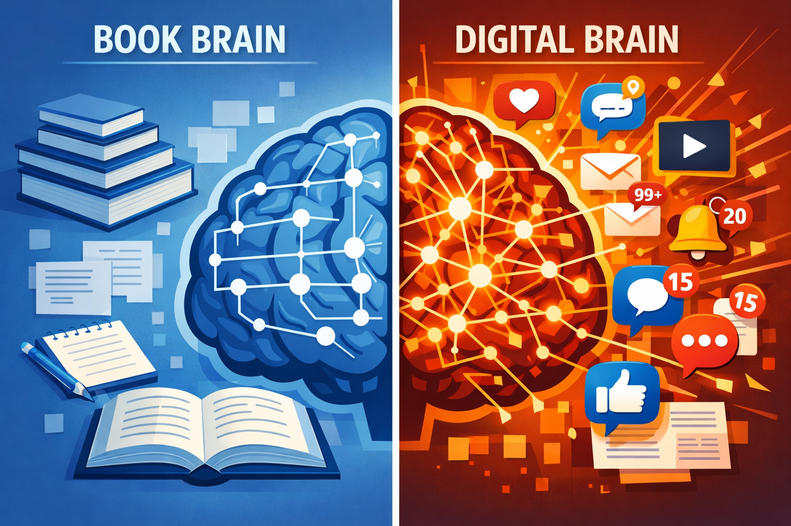

# Трансформация мышления: как [интернет](../../../1.2_natural_sciences/physics_in_everyday_life/Q26540.md) меняет наши когнитивные [способности](../../../4.1_rules_of_study/how_to_learn_effectively/articles/growth_mindset.md)

## [Влияние](../../information and media literacy/манипуляции_и_пропаганда.md) цифровых технологий на [восприятие](../../../1.2_natural_sciences/neurobiology_for_teens/articles/26_optical_illusions.md), [внимание](../../../1.2_natural_sciences/neurobiology_for_teens/articles/16_love_chemistry.md) и обработку информации

Интернет изменил не только внешние хранилища информации, но и сам способ нашего мышления. Мы по-другому читаем, по-другому запоминаем, по-другому принимаем решения. Психологи и нейробиологи спорят: это [эволюция](../../../1.2_natural_sciences/neurobiology_for_teens/articles/10_sweet_tooth.md) или деградация?

## Клиповое [мышление](../../../1.2_natural_sciences/neurobiology_for_teens/articles/01_brain_complexity.md): проклятие или дар?

Термин "клиповое мышление" появился в [1990-е](../../../7.1_art/modern_technological_art/articles/2.2_heath_bunting.md) годы. Он описывает способность воспринимать мир через короткие, яркие образы (клипы), но неспособность долго удерживать внимание на одном объекте.

**Историческая справка:**
До появления письменности люди обладали феноменальной [памятью](../../../4.1_rules_of_study/how_to_memorize/articles/pamyat.md) — они запоминали тысячестрочные поэмы наизусть. После изобретения книг [память](../../../3.1. healthy lifestyle/Sleep, nutrition, and adolescent energy/articles/sleep_and_memory_grades.md) ослабла, зато появилась возможность анализировать и сравнивать тексты. Сейчас происходит новый [сдвиг](../../../1.2_natural_sciences/physics_in_everyday_life/Q193514.md).

**[Сравнение](../../../5.2_cybersecurity/cpp_fundamentals/5_operators.md) типов мышления:**

| Параметр | Книжное мышление (традиционное) | Клиповое мышление (современное) |
|:----------|:----------------------------------|:---------------------------------|
| [Формат](../../../7.2 Media, leisure and hobbies/Computer games/articles/how_it_all_started/cartridge_versus_disc.md) информации | Длинные связные тексты | Короткие посты, [видео](../../information and media literacy/оценка_качества_изображений_и_видео.md), картинки |
| [Глубина погружения](../../../1.2_natural_sciences/physics_in_everyday_life/Q181404.md) | Высокая, [вдумчивое чтение](../../../4.2_thinking_and_working_information/how_to_search_information/articles/skimming_and_in_depth_reading.md) | Поверхностное, сканирование |
| [Время](../../../1.2_natural_sciences/physics_in_everyday_life/Q20702.md) концентрации | [Часы](../../../1.2_natural_sciences/physics_in_everyday_life/Q20702.md) ([чтение](../../../4.1_rules_of_study/how_to_learn_effectively/articles/reading_skills.md) [книги](../../../7.2 Media, leisure and hobbies /useful_and_interesting_leisure/articles/reading_and_self_education.md)) | Секунды-минуты ([лента](../../information and media literacy/алгоритмы_и_пузырь_фильтров.md) соцсетей) |
| Способ обработки | Линейный, последовательный | Параллельный, хаотичный |
| Что ценится | [Логика](../../../2.1_society/cause_and_effect_relationships/articles/causality_base.md), [аргументация](../../../4.2_thinking_and_working_information/critical_thinking/articles/logical_errors_and_sophisms.md) | Яркость, эмоциональность |
| [Источник](../../information and media literacy/дезинформация_и_фейки.md) знаний | Книги, учителя | Поисковики, рекомендательные системы |

## Исследования [внимания](../../../4.1_rules_of_study/how_to_memorize/articles/vnimanie.md)

Ученые из Университета Калифорнии провели [исследование](../../../1.2_natural_sciences/neurobiology_for_teens/articles/19_curiosity.md): они наблюдали за студентами во время [работы](../../../8.2_future/choosing_a_career_path/articles/interview.md) за компьютером. [Результат](../../../1.2_natural_sciences/why_science_help_understand_world/experimental_science.md) шокировал:

* Среднее время на одном окне/вкладке — **47 секунд**.
* Максимальное время — редко больше 2 минут.
* Постоянное переключение между задачами: [проверка](../../../1.2_natural_sciences/why_science_help_understand_world/scientific_method.md) почты, [соцсети](../../../2.1_society/how_and_where_find_friends/articles/tcifrovaya_druzhba.md), [работа](../../../1.2_natural_sciences/physics_in_everyday_life/Q11382.md), снова почта.

[Мозг](../../../3.1. healthy lifestyle/Sleep, nutrition, and adolescent energy/articles/breakfast_for_the_brain.md) привыкает к быстрой смене стимулов. Длинные тексты начинают казаться скучными, потому что не дают постоянных "дофаминовых поглаживаний".

## [Многозадачность](../../operating system/articles/scheduling.md): миф и [реальность](../../../1.2_natural_sciences/physics_in_everyday_life/Q140028.md)

Многие [подростки](../../../3.1. healthy lifestyle/Sleep, nutrition, and adolescent energy/articles/biology_of_night_owls_teens.md) гордятся своей многозадачностью: одновременно делают уроки, слушают музыку, переписываются в трех чатах и смотрят TikTok. Нейробиологи говорят: настоящей многозадачности не существует.

**Как работает мозг при "многозадачности":**

1. Мозг не может обрабатывать два сложных потока информации одновременно.
2. Он быстро переключается между задачами.
3. Каждое переключение требует времени (доли секунды) и энергии.
4. При частых переключениях накапливается "остаточное внимание" — мысли о предыдущей задаче мешают [сосредоточиться](../../../4.1_rules_of_study/how_to_memorize/articles/koncentraciya.md) на текущей.
5. В итоге все [задачи](../../../1.2_natural_sciences/why_science_help_understand_world/research_work.md) делаются медленнее и хуже.

**[Эксперимент](../../../1.2_natural_sciences/physics_in_everyday_life/Q1293220.md):**
Студентов разделили на две группы. Первая учила [материал](../../../1.2_natural_sciences/physics_in_everyday_life/Q25358.md), не отвлекаясь. Вторая учила, периодически отвечая на [сообщения](../../operating system/articles/IPC.md). Результат: вторая группа потратила на 40% больше времени и запомнила на 30% меньше информации.

## Изменение навыков чтения

Мы читаем иначе, чем наши [родители](../../../../8.1_self_understanding/articles/family_influence.md). При сканировании текста в интернете мы не читаем слова целиком — мы выхватываем ключевые фрагменты. [Глаз](../../../1.2_natural_sciences/physics_in_everyday_life/Q467980.md) движется не плавно, а прыжками. Это называется **F-образное чтение**:

1. Сначала читаем первые несколько строк полностью.
2. Потом пробегаем по левому краю текста, выхватывая начало абзацев.
3. До конца дочитываем редко.

**Что мы теряем:**
* Способность следить за сложной аргументацией.
* [Понимание](../../../2.1_society/cause_and_effect_relationships/articles/empathy_causality.md) контекста и подтекста.
* Эстетическое [удовольствие](../../../1.2_natural_sciences/neurobiology_for_teens/articles/11_reward_system.md) от языка.
* Терпение к длинным описаниям.

**Что мы приобретаем:**
* [Скорость](../../../1.2_natural_sciences/physics_in_everyday_life/Q11402.md) поиска нужной информации.
* Способность быстро оценивать релевантность текста.
* [Навык](../../information and media literacy/карта_компетенций_по_возрастам.md) фильтрации шума.

<!--- Важно понимать: глубокое чтение никуда не исчезло. Оно превратилось в специальный навык, который нужно развивать отдельно. --->

## [Критическое мышление](../../../1.2_natural_sciences/neurobiology_for_teens/articles/25_cognitive_biases.md) как навык выживания

В мире, где любой может опубликовать любую информацию, критическое мышление становится таким же базовым навыком, как чтение и письмо. Это [защита](../../how_internet_works/articles/dns/cdn.md) от манипуляций, фейков и глупых решений.

**[Структура](../../../4.1_rules_of_study/how_to_learn_effectively/articles/note_taking.md) критического мышления:**

1. **[Анализ](../../../1.2_natural_sciences/why_science_help_understand_world/research.md) информации:**
   * Кто [автор](../../../4.2_thinking_and_working_information/how_to_search_information/articles/copypaste.md)? ([эксперт](../../../../8.1_self_understanding/articles/types_of_impostor_syndrome.md), журналист, блогер, тролль?)
   * Какова [цель](../../../1.2_natural_sciences/why_science_help_understand_world/research_work.md)? (информировать, продать, развлечь, убедить?)
   * Какие [факты](../../../1.2_natural_sciences/physics_in_everyday_life/Q17737.md) приводятся? (есть ли ссылки на [источники](../../../4.2_thinking_and_working_information/how_to_search_information/articles/three_whales.md)?)
   * Какая логика? (есть ли противоречия?)

2. **Анализ себя:**
   * Почему я верю этому? (потому что это правда или потому что мне это приятно?)
   * Какие у меня предубеждения? (политические, религиозные, культурные)
   * [Хочу](../../../6.1_Independent_living_and_daily_living_skills/reasonable_spending/articles/want.md) ли я узнать правду или подтвердить свое [мнение](../../../4.2_thinking_and_working_information/critical_thinking/articles/fact_and_opinion_differences.md)?

3. **Анализ контекста:**
   * Когда это опубликовано? (не устарело ли?)
   * Где опубликовано? (какой у сайта [авторитет](../../../4.2_thinking_and_working_information/how_to_search_information/articles/authority.md)?)
   * Кто это распространяет? (почему этот пост у меня в ленте?)

## Практические приемы проверки информации

**Прием 1: Обратный [поиск](../../../3.2 healthy lifestyle/how to act in a dangerous situation/articles/lost-in-city.md) изображений.**
Если вам прислали "сенсационное [фото](../../information and media literacy/проверка_фото_на_манипуляции.md)", сохраните его и загрузите в поиск по картинкам (Google Images или Yandex.Картинки). Вы увидите, где это фото публиковалось раньше и в каком контексте.

**Прием 2: Проверка даты.**
Старые новости часто выдают за свежие. Обращайте внимание на дату публикации, особенно в соцсетях.

**Прием 3: Поиск опровержений.**
Если вы увидели громкую [новость](../../information and media literacy/информационная_диета.md), добавьте в поиск слова "[фейк](../../../2.1_society/cause_and_effect_relationships/articles/false_connections.md)", "[ложь](../../../2.1_society/cause_and_effect_relationships/articles/false_connections.md)", "опровержение". Возможно, это уже разоблачили.

**Прием 4: Анализ домена.**
Сайты-однодневки часто регистрируют на странные домены (например, [.ru](../../how_internet_works/articles/dns/domains.md).com или .info). Проверьте, когда зарегистрирован сайт (через сервис [whois](../../how_internet_works/articles/dns/domains.md)).

**Прием 5: Синтаксический анализ.**
Обилие восклицательных знаков, капслок, призывы "срочно репостни" — [признаки](../../../3.1_healthy_lifestyle/pervaya_pomoshch/ushibi_porezy_ozhogi/04_ushib_chto_eto_priznaki.md) эмоциональной манипуляции.

## [Информационная гигиена](../../../4.2_thinking_and_working_information/how_to_search_information/articles/social_networks.md): [правила](../../../2.1_society/cause_and_effect_relationships/articles/why_rules_work.md) выживания в [цифровой](../../../7.1_art/musical_instruments/articles/synthesizer.md) среде

Как и за чистотой зубов, за чистотой потребляемой информации нужно следить.

**[Правило](../../../1.2_natural_sciences/why_science_help_understand_world/patterns.md) 1: Ограничьте входящий [поток](../../operating system/articles/thread.md).**
Вы не обязаны читать всё. Отпишитесь от пабликов, которые не приносят пользы или радости. Отключите [уведомления](../../../4.2_thinking_and_working_information/how_to_search_information/articles/information_hygiene.md) из большинства приложений.

**Правило 2: Диверсифицируйте источники.**
Читайте людей с разными взглядами. Это защитит от пузыря фильтров. Если вы смотрите только оппозиционные каналы или только провластные — вы видите лишь часть реальности.

**Правило 3: Делайте [цифровой детокс](../../../3.1_healthy lifestyle/vrednye_privychki/articles/Social_media.md).**
Раз в неделю устраивайте день без экрана. Мозгу нужно время, чтобы переварить информацию и отдохнуть от постоянного стимулирования.

**Правило 4: Читайте длинные тексты.**
Специально тренируйте внимание. Читайте книги, длинные статьи, серьезные исследования. Это как спортзал для мозга.

**Правило 5: Используйте [поисковые операторы](../../../../4.2/how_to_search_information/articles/search_operations.md).**
Google и [Яндекс](../../../7.1_art/modern_technological_art/articles/5.5_yandex_neural.md) умеют гораздо больше, чем кажется. Выучите основные команды:

| [Оператор](../../../3.2 healthy lifestyle/how to act in a dangerous situation/articles/emergency-112.md) | Что делает | Пример |
|:----------|:-----------|:-------|
| "..." | Ищет точную фразу | "быть или не быть" |
| [site:](../../../../4.2/how_to_search_information/articles/search_operations.md) | Ищет только на указанном сайте | site:gov.ru налоги |
| - | Исключает слово | [рецепт](../../../6.1_Independent_living_and_daily_living_skills/Simple_and_safe_cooking/articles/how_to_read_recipe.md) торта -яблоко |
| filetype: | Ищет файлы нужного типа | filetype:pdf война и мир |
| related: | Ищет похожие сайты | related:[wikipedia](../../../4.2_thinking_and_working_information/how_to_search_information/articles/wikipedia.md).org |

## Что мы теряем и что приобретаем

**Потери:**

* Глубину концентрации.
* Способность к длительному умственному усилию.
* Механическую память (факты, даты, стихи).
* [Навыки](../../../7.2 Media, leisure and hobbies /useful_and_interesting_leisure/articles/computer_games_with_benefit.md) устного счета и ориентации без навигатора.

**Приобретения:**

* Скорость обработки информации.
* Способность к быстрому переключению.
* Навыки поиска и фильтрации.
* Доступ к коллективному знанию.
* Возможность учиться у лучших (лекции нобелевских лауреатов доступны всем).

## Интересные факты

Исследование Microsoft 2015 года показало, что средняя продолжительность концентрации внимания человека сократилась с 12 секунд (2000 год) до 8 секунд (2015 год). Для сравнения: у золотой рыбки — 9 секунд.

Нейробиолог Сьюзан Гринфилд обнаружила, что у детей, проводящих много времени в интернете, изменяется структура префронтальной коры — области мозга, отвечающей за [планирование](../../../3.1. healthy lifestyle/Sleep, nutrition, and adolescent energy/articles/ideal_schedule_energy_management.md) и [самоконтроль](../../../1.2_natural_sciences/neurobiology_for_teens/articles/05_teen_brain.md).

Эксперимент 2009 года показал: люди, которые читали [текст](../../../4.1_rules_of_study/how_to_learn_effectively/articles/reading_skills.md) с гиперссылками, запоминали его хуже, чем те, кто читал обычный текст. Мозг тратил [ресурсы](../../../2.1_society/cause_and_effect_relationships/articles/ecological_footprint.md) на [решение](../../../2.1_society/cause_and_effect_relationships/articles/personal_choice.md) "кликать или не кликать".

В среднем офисный работник переключается между задачами каждые 3 минуты. После переключения требуется до 23 минут, чтобы полностью вернуться к прежней задаче.

Исследование Калифорнийского университета 2011 года: студенты, которым разрешили пользоваться ноутбуками на лекции, получили на экзамене [оценки](../../../3.1. healthy lifestyle/Sleep, nutrition, and adolescent energy/articles/sleep_and_memory_grades.md) на 11% ниже, чем те, кто писал от руки.

Николас Карр в книге "Пустышка" (2010) описал, как после многих лет работы в интернете он потерял способность читать длинные книги — мозг требовал постоянной смены стимулов.

---

## Смотри также

- [Клиповое мышление: когда мир выглядит как лента](1-Клиповое_мышление_когда_мир_выглядит_как_лента.md) — подробнее о [том](../../../7.1_art/musical_instruments/articles/drums.md), что такое клиповое мышление, его плюсы, минусы и как с ним жить
- [Сокращение внимания: почему мозг устаёт и «просит новое»](1-Сокращение_внимания_почему_мозг_устает.md) — [виды](../../../3.1_healthy_lifestyle/pervaya_pomoshch/ushibi_porezy_ozhogi/08_porezy_sadiny_vidy.md) внимания и почему переключения его истощают
- [Как прокачать внимание и приручить клипы](1-Как_прокачать_внимание_и_приручить_клипы.md) — практические упражнения для [тренировки](../../../3.1. healthy lifestyle/Sleep, nutrition, and adolescent energy/articles/sport_and_energy.md) фокуса
- [Ловушка «Эхо-камеры»: почему интернет нам поддакивает](2-Ловушка.md) — пузыри фильтров и [предвзятость](../../../1.2_natural_sciences/neurobiology_for_teens/articles/25_cognitive_biases.md) подтверждения, о которых важно [помнить](../../../4.1_rules_of_study/how_to_memorize/articles/pamyat.md) при проверке фактов
- [Внешняя память: интернет как жёсткий диск нашего мозга](4-internet_memory.md) — как изменилась наша память и способ хранения знаний в цифровую эпоху
- [Обман в интернете в эпоху нейросетей](5-ai_internet_deception_article.md) — новые угрозы для критического мышления: [deepfake](../../../4.2_thinking_and_working_information/how_to_search_information/articles/deepfake.md) и генеративный [контент](../../information and media literacy/информационная_диета.md)

---

Авторы: Дэниз Махмутов, @modestaq;
Ресурсы: [LLM](../../../7.1_art/modern_technological_art/README.md) - DeepSeek, [ChatGPT](../../../7.1_art/modern_technological_art/articles/6.1_prompt_art.md), Claude, Gemini