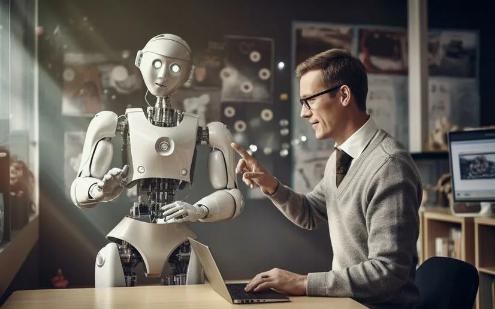

# Нейросети в повседневной жизни: как искусственный интеллект помогает людям

Современные нейросети постепенно становятся частью повседневной жизни.
Они помогают людям решать задачи быстрее, находить информацию, писать
тексты, программировать и даже решать сложные математические задачи.
Благодаря развитию искусственного интеллекта многие процессы стали проще
и доступнее.

Нейросети выступают своеобразным «цифровым помощником», который способен
анализировать большие объёмы информации и предлагать решения за
считанные секунды. В этой статье рассмотрим основные области, где
нейросети помогают людям в ежедневной работе и обучении.

------------------------------------------------------------------------

## Помощь в программировании

Одной из самых заметных сфер применения нейросетей является
программирование. Современные модели искусственного интеллекта способны
помогать разработчикам писать код, находить ошибки и объяснять сложные
алгоритмы.

Нейросети могут:

-   генерировать фрагменты кода по описанию задачи;
-   находить ошибки и предлагать исправления;
-   объяснять сложные участки программы;
-   переводить код с одного языка программирования на другой.

Это значительно ускоряет процесс разработки и помогает начинающим
программистам быстрее освоить новые технологии.

------------------------------------------------------------------------

## Решение математических задач

Нейросети также активно используются для решения математических задач.
Они могут помогать с алгеброй, геометрией, статистикой и другими
разделами математики.

Основные возможности:

-   пошаговое решение задач;
-   объяснение математических формул;
-   построение графиков функций;
-   помощь в изучении теории.

Для студентов и школьников это становится удобным инструментом обучения
и проверки своих решений.

------------------------------------------------------------------------

## Написание текстов и работа с информацией

Искусственный интеллект помогает людям создавать тексты различного типа:
статьи, письма, отчёты, презентации и даже художественные произведения.

Нейросети могут:

-   помогать формулировать идеи;
-   редактировать и улучшать текст;
-   переводить материалы на разные языки;
-   делать краткие пересказы длинных текстов.

Это экономит время и помогает быстрее работать с большим количеством
информации.

------------------------------------------------------------------------

## Помощь в обучении и самообразовании

Нейросети становятся персональными цифровыми наставниками. Они могут
объяснять сложные темы, отвечать на вопросы и помогать готовиться к
экзаменам.

Например, пользователи могут:

-   задавать вопросы по любой теме;
-   получать подробные объяснения;
-   тренироваться на примерах задач;
-   получать рекомендации по обучению.

Таким образом, искусственный интеллект делает образование более
доступным.

------------------------------------------------------------------------

## Повседневная продуктивность

Кроме работы и учёбы, нейросети помогают в повседневных задачах. Они
могут помогать планировать дела, искать информацию и автоматизировать
рутинные процессы.

Примеры использования:

-   составление списков задач;
-   планирование поездок;
-   поиск информации;
-   генерация идей.

Это делает жизнь людей более удобной и организованной.

------------------------------------------------------------------------

## Заключение

Нейросети уже стали важной частью современной цифровой среды. Они
помогают людям работать быстрее, учиться эффективнее и решать сложные
задачи. Несмотря на некоторые риски и ограничения, искусственный
интеллект открывает новые возможности для развития технологий и
общества.

В будущем роль нейросетей в повседневной жизни будет только расти,
превращая их в универсальных помощников человека.

------------------------------------------------------------------------

Авторы: Павел Рожков, @PavlentiyVitalich
Ресурсы: LLM - DeepSeek, ChatGPT, Claude, Gemini