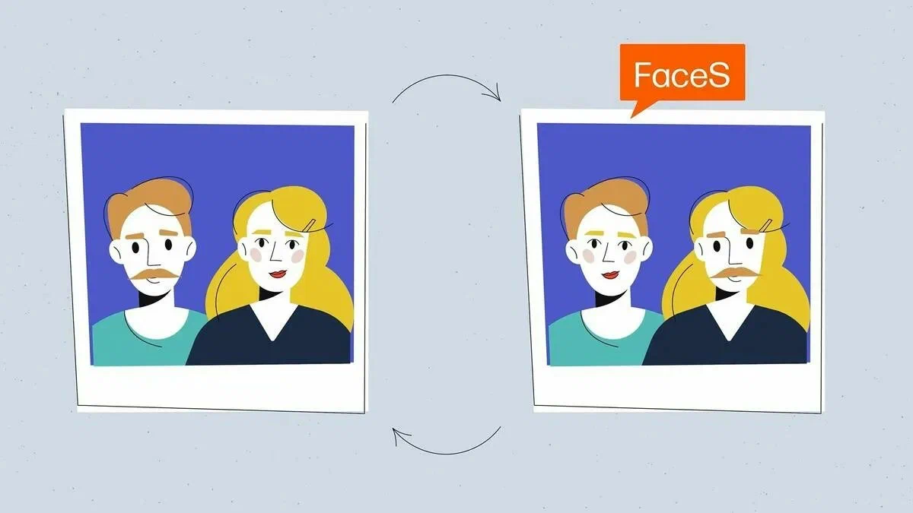

# Обман в интернете в эпоху нейросетей: как генерация контента меняет информационную среду

[Развитие](../../../3.1. healthy lifestyle/Sleep, nutrition, and adolescent energy/articles/micronutrients_and_teenagers.md) нейросетей и генеративных моделей значительно изменило
[интернет](../../../1.2_natural_sciences/physics_in_everyday_life/Q26540.md). Сегодня любой [человек](../../../1.2_natural_sciences/physics_in_everyday_life/Q45003.md) может создать [текст](../../../4.1_rules_of_study/how_to_learn_effectively/articles/reading_skills.md), [изображение](../../information and media literacy/оценка_качества_изображений_и_видео.md), аудио
или [видео](../../information and media literacy/оценка_качества_изображений_и_видео.md), которые выглядят реалистично и убедительно. Такие [технологии](../../../2.2_history/world_economy_on_fingers/articles/globalizatsiya.md)
открывают огромные возможности для творчества, образования и науки, но
одновременно создают новые [риски](../../../7.2 Media, leisure and hobbies /useful_and_interesting_leisure/articles/safety_during_recreation.md). В сети становится всё легче
распространять ложную информацию, а пользователям всё сложнее отличать
настоящий [контент](../../information and media literacy/информационная_диета.md) от искусственно созданного.

------------------------------------------------------------------------

## Генерация правдоподобного контента

Современные [нейросети](../../../2.1_society/cause_and_effect_relationships/articles/ai_causality.md) способны создавать тексты практически на любую
тему. С их помощью можно генерировать статьи, [комментарии](../../../4.2_thinking_and_working_information/how_to_search_information/articles/cooperative_work.md), отзывы и даже
целые новостные публикации. Такие тексты часто выглядят грамотно и
структурированно, что делает их убедительными для читателя.

Проблема заключается в [том](../../../7.1_art/musical_instruments/articles/drums.md), что подобный контент может использоваться
для распространения дезинформации. Например, можно создать большое
количество сообщений или публикаций, которые создают иллюзию
общественного мнения или поддержки определённой [идеи](../../../7.2 Media, leisure and hobbies /useful_and_interesting_leisure/articles/free_leisure_activities.md).

Кроме текстов, нейросети умеют генерировать изображения и иллюстрации.
Иногда такие изображения сложно отличить от настоящих фотографий,
особенно если пользователь не проверяет [источник](../../information and media literacy/дезинформация_и_фейки.md) информации.

------------------------------------------------------------------------

## [Deepfake](../../../4.2_thinking_and_working_information/how_to_search_information/articles/deepfake.md)‑технологии

Одной из наиболее обсуждаемых технологий стали так называемые
**deepfake**. Это [методы](../../../4.1_rules_of_study/how_to_learn_effectively/articles/note_taking.md) создания видео и аудио, в которых лицо или
голос человека искусственно изменяются с помощью нейросетей.

Такие технологии позволяют создавать ролики, где человек якобы говорит
или делает то, чего он никогда не делал. Подобные [материалы](../../../1.2_natural_sciences/physics_in_everyday_life/Q487005.md) могут
использоваться для:

-   распространения фальшивых новостей;
-   мошенничества и шантажа;
-   манипуляции общественным мнением;
-   подрыва репутации людей или организаций.

[Качество](../../../6.1_Independent_living_and_daily_living_skills/reasonable_spending/articles/quality.md) deepfake‑видео постоянно улучшается, поэтому отличить подделку
становится всё труднее.

------------------------------------------------------------------------

## Масштаб проблемы

Ещё несколько лет назад создание убедительного поддельного контента
требовало серьёзных навыков и времени. Сейчас ситуация изменилась. С
помощью генеративных моделей один человек может за короткое [время](../../../1.2_natural_sciences/physics_in_everyday_life/Q20702.md)
создать сотни сообщений, комментариев или изображений.

Это приводит к тому, что интернет наполняется огромным количеством
информации, часть которой может быть ложной. Пользователи сталкиваются с
так называемым **информационным шумом**, когда становится трудно
определить, какие [данные](../../../2.1_society/cause_and_effect_relationships/articles/ai_causality.md) являются достоверными.

------------------------------------------------------------------------

## Как защититься от обмана

В условиях распространения искусственно созданного контента особое
[значение](../../../7.2 Media, leisure and hobbies /useful_and_interesting_leisure/articles/leisure_and_why_need.md) приобретает [критическое мышление](../../../1.2_natural_sciences/neurobiology_for_teens/articles/25_cognitive_biases.md). Пользователям важно проверять
[источники](../../../4.2_thinking_and_working_information/how_to_search_information/articles/three_whales.md) информации и обращать [внимание](../../../1.2_natural_sciences/neurobiology_for_teens/articles/16_love_chemistry.md) на детали.

Полезные рекомендации:

-   проверять информацию в нескольких источниках;
-   обращать внимание на автора и источник публикации;
-   осторожно относиться к сенсационным новостям;
-   проверять изображения и видео через специальные [сервисы](../../../4.1_rules_of_study/how_to_learn_effectively/articles/digital_tools.md).

Такие простые меры помогают снизить [вероятность](../../../1.2_natural_sciences/physics_in_everyday_life/Q45003.md) [столкновения](../../../1.2_natural_sciences/physics_in_everyday_life/Q25358.md) с фальшивым
контентом.

------------------------------------------------------------------------

## [Заключение](../../../1.2_natural_sciences/physics_in_everyday_life/Q2225.md)

Нейросети и генеративные технологии становятся важной частью современной
[цифровой](../../../7.1_art/musical_instruments/articles/synthesizer.md) среды. Они открывают новые возможности для творчества, обучения
и коммуникации. Однако вместе с этим появляются и новые угрозы,
связанные с распространением дезинформации и поддельного контента.

В эпоху алгоритмов и искусственного интеллекта способность анализировать
информацию и критически оценивать источники становится одним из ключевых
навыков для пользователей интернета.

------------------------------------------------------------------------

## Смотри также

- [Ловушка «Эхо-камеры»: почему интернет нам поддакивает](2-Ловушка.md) — как пузыри фильтров и [предвзятость](../../../1.2_natural_sciences/neurobiology_for_teens/articles/25_cognitive_biases.md) подтверждения делают дезинформацию ещё опаснее
- [Трансформация мышления: как интернет меняет наши когнитивные способности](4-internet_thinking_transformation.md) — критическое мышление и практические приёмы проверки фактов
- [Коллективный интеллект: как миллионы умов создают общее знание](4-internet_collective_intelligence.md) — как отличить правду от лжи в коллективном знании и методы проверки информации
- [Цифровое самовыражение и творчество: найди свой голос в интернете](3-Цифровое%самовыражение%и%творчество.md) — генеративные технологии как инструмент творчества и вопрос авторских прав

------------------------------------------------------------------------

Авторы: Павел Рожков, @PavlentiyVitalich
[Ресурсы](../../../2.1_society/cause_and_effect_relationships/articles/ecological_footprint.md): [LLM](../../../7.1_art/modern_technological_art/README.md) - DeepSeek, [ChatGPT](../../../7.1_art/modern_technological_art/articles/6.1_prompt_art.md), Claude, Gemini
