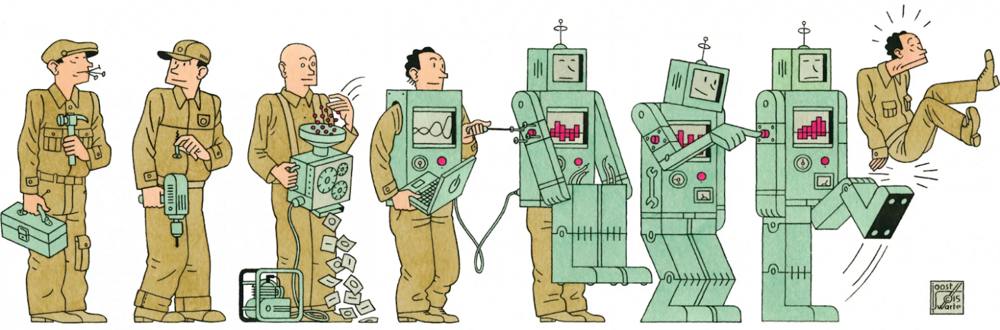

# Сможет ли искусственный интеллект заменить человека на рабочем месте

Развитие искусственного интеллекта и нейросетей вызывает активные
обсуждения о будущем труда. Многие профессии уже частично
автоматизируются, а некоторые задачи выполняются быстрее и точнее с
помощью алгоритмов. Это приводит к вопросу: сможет ли искусственный
интеллект полностью заменить человека на рабочем месте.

С одной стороны, технологии позволяют автоматизировать рутинные процессы
и повысить эффективность работы. С другой стороны, многие виды
деятельности требуют творчества, эмпатии и сложного принятия решений,
которые пока остаются преимущественно человеческими навыками.

В этой статье рассмотрим основные аспекты влияния искусственного
интеллекта на рынок труда.

------------------------------------------------------------------------

## Автоматизация рутинных задач

Одной из главных причин внедрения искусственного интеллекта в рабочие
процессы является автоматизация повторяющихся задач. Нейросети и
алгоритмы могут анализировать данные, выполнять расчёты и обрабатывать
информацию значительно быстрее человека.

Примеры таких задач:

-   обработка документов и данных;
-   автоматическая сортировка информации;
-   анализ больших массивов данных;
-   обслуживание клиентов через чат‑боты.

В результате сотрудники могут уделять больше времени более сложным и
творческим задачам.

------------------------------------------------------------------------

## Профессии, которые изменяются из‑за ИИ

Некоторые профессии уже активно трансформируются под влиянием
технологий. Искусственный интеллект становится инструментом, который
помогает специалистам выполнять работу быстрее и эффективнее.

К таким профессиям относятся:

-   программисты и разработчики;
-   аналитики данных;
-   дизайнеры и создатели контента;
-   маркетологи;
-   специалисты по поддержке клиентов.

Во многих случаях ИИ не заменяет человека, а становится помощником,
который расширяет его возможности.

------------------------------------------------------------------------

## Ограничения искусственного интеллекта

Несмотря на быстрый прогресс технологий, искусственный интеллект имеет
ограничения. Нейросети работают на основе данных и алгоритмов, поэтому
они могут ошибаться или неправильно интерпретировать сложные ситуации.

Кроме того, существуют навыки, которые пока сложно автоматизировать:

-   креативное мышление;
-   эмоциональный интеллект;
-   социальное взаимодействие;
-   стратегическое мышление.

Эти способности играют важную роль во многих профессиях.

------------------------------------------------------------------------

## Новые профессии в эпоху искусственного интеллекта

История технологического развития показывает, что новые технологии не
только заменяют старые профессии, но и создают новые. Появляются
специалисты, которые работают непосредственно с искусственным
интеллектом.

Например:

-   инженеры машинного обучения;
-   специалисты по данным;
-   разработчики ИИ‑систем;
-   специалисты по этике искусственного интеллекта.

Таким образом, рынок труда постепенно адаптируется к новым технологиям.

------------------------------------------------------------------------

## Сотрудничество человека и ИИ

Наиболее вероятным сценарием будущего является сотрудничество человека и
искусственного интеллекта. Алгоритмы могут выполнять вычисления,
анализировать данные и помогать в принятии решений, а люди будут
отвечать за стратегию, творчество и взаимодействие с другими людьми.

Такой подход позволяет объединить сильные стороны технологий и
человеческого мышления.

------------------------------------------------------------------------

## Заключение

Искусственный интеллект уже влияет на рынок труда и меняет многие
профессии. Однако в ближайшем будущем он скорее станет инструментом,
который дополняет человеческие навыки, а не полностью заменяет людей.

Способность адаптироваться, учиться новым технологиям и использовать
возможности ИИ станет важным фактором успешной карьеры в будущем.

------------------------------------------------------------------------

Авторы: Павел Рожков, @PavlentiyVitalich
Ресурсы: LLM - DeepSeek, ChatGPT, Claude, Gemini