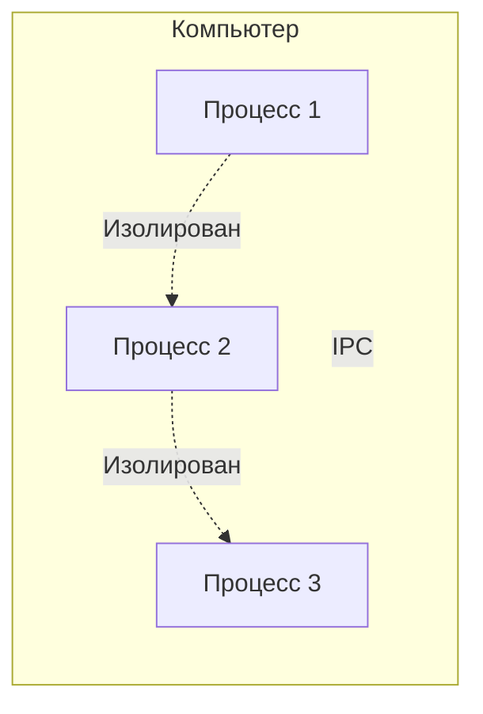
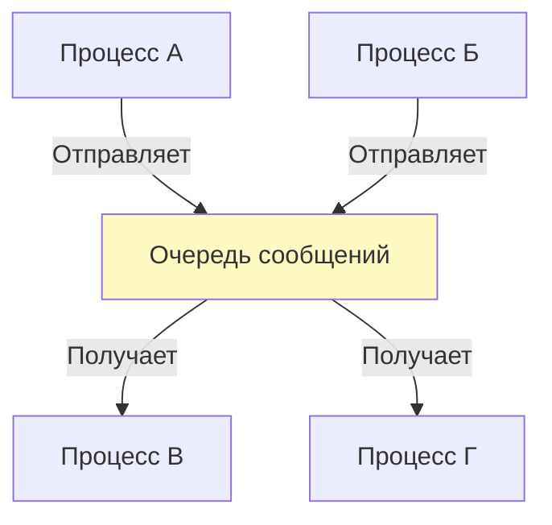
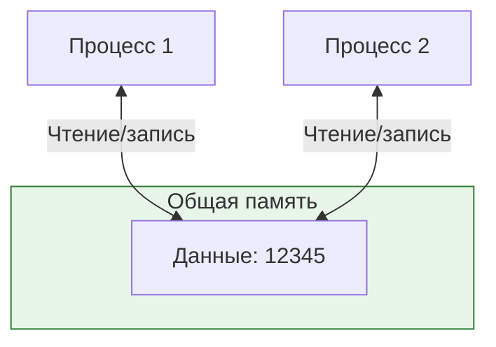
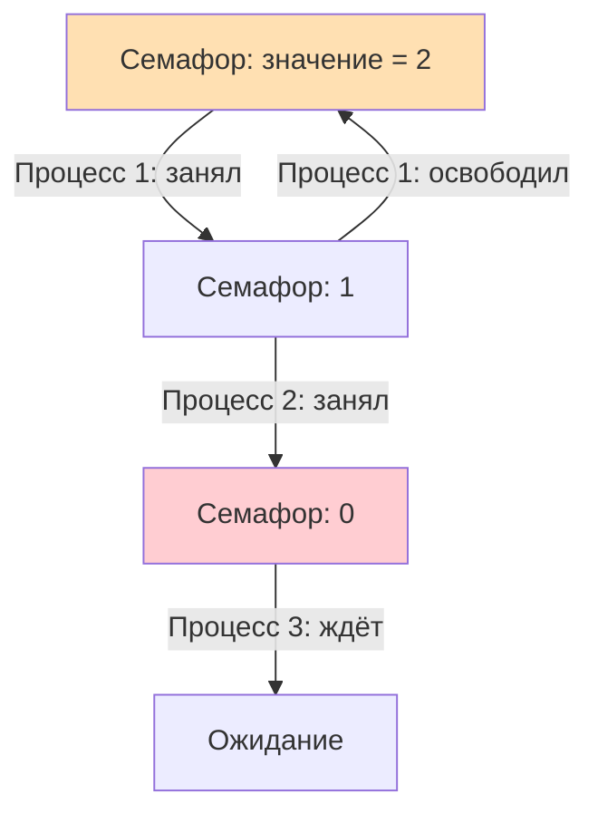
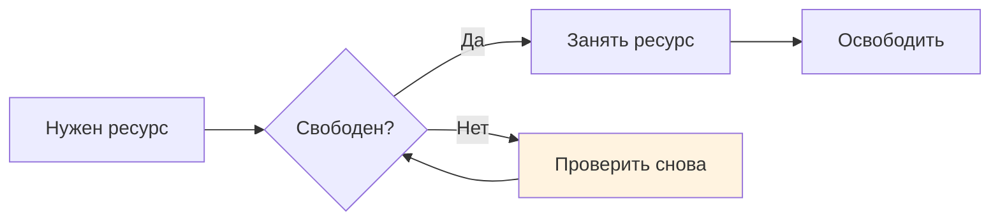
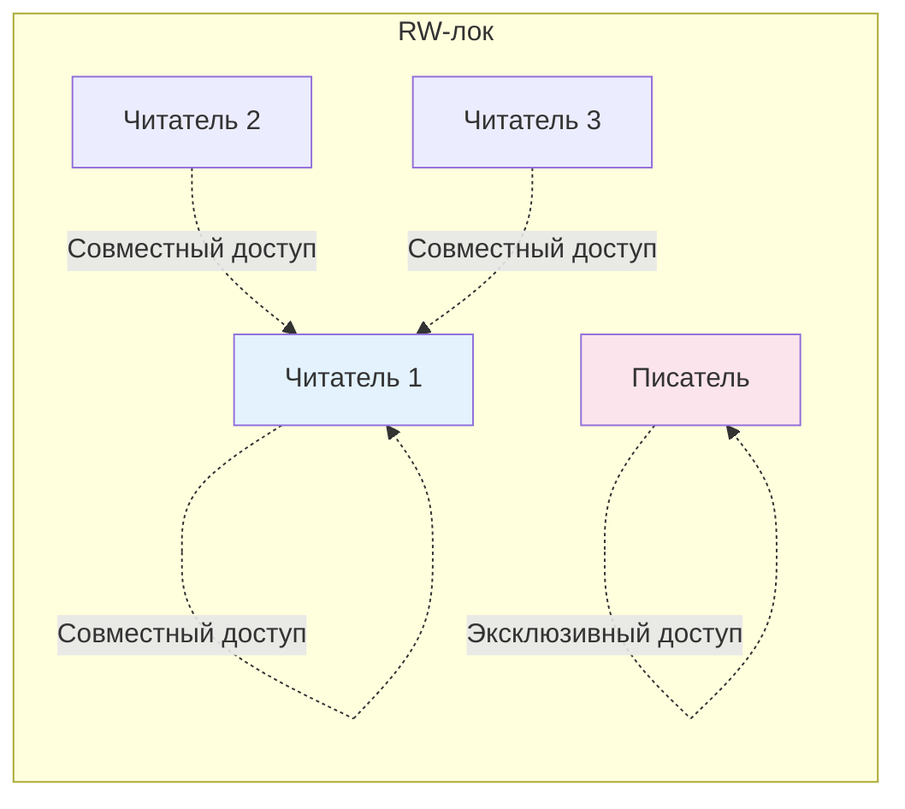

# Межпроцессное [взаимодействие](../../../1.2_natural_sciences/physics_in_everyday_life/Q128030.md) (IPC)

## [Определение](../../../1.2_natural_sciences/physics_in_everyday_life/Q29996.md)

**Межпроцессное взаимодействие** (IPC, от английского Inter-Process Communication) — это механизмы, которые позволяют [процессам](process.md) обмениваться данными и согласовывать свои [действия](../../../3.1_healthy_lifestyle/pervaya_pomoshch/ushibi_porezy_ozhogi/03_obschie_pravila_algorithm.md). 

**[Процесс](process.md)** — это запущенная [программа](process.md) со своей [памятью](../../../4.1_rules_of_study/how_to_memorize/articles/pamyat.md) и ресурсами. Процессы изолированы друг от друга: один процесс не может напрямую прочитать [память](../../../3.1. healthy lifestyle/Sleep, nutrition, and adolescent energy/articles/sleep_and_memory_grades.md) другого. Это нужно для стабильности, но создаёт проблему: как процессам работать вместе?

IPC решает эту проблему, предоставляя безопасные каналы для обмена информацией между процессами.

## Подробное описание

### Почему процессы не видят друг друга

Каждый процесс работает в своей собственной области [памяти](../../../4.1_rules_of_study/how_to_memorize/articles/pamyat.md). Это как если бы каждый ребёнок играл в своей комнате с закрытой дверью. Так компьютер защищает процессы: если один процесс перестанет работать, другие не пострадают.

Но иногда процессам нужно сотрудничать. Например, один процесс загружает картинку из интернета, а другой показывает её на [экране](window_manager.md). Для такого сотрудничества нужны специальные механизмы — IPC.

### Трубы (Pipes)

**[Труба](../../../7.1_art/musical_instruments/articles/trumpet.md)** — это канал для передачи данных в одном направлении. Один процесс записывает [данные](../../../2.1_society/cause_and_effect_relationships/articles/ai_causality.md) в трубу, другой процесс читает их. Данные в трубе можно прочитать только один раз.

Труба похожа на настоящий водопровод: [вода](../../../3.1. healthy lifestyle/Sleep, nutrition, and adolescent energy/articles/drinking_regime.md) течёт в одну сторону, и если её не забрать сразу, она уйдёт дальше.

**Особенности труб:**
- Данные текут только в одну сторону
- Данные читаются по порядку, как в очереди
- После прочтения данные исчезают из трубы

### Сообщения (Messages)

**Сообщения** — это способ обмена отдельными порциями данных. В отличие от труб, сообщения имеют границы: каждое [сообщение](../../../3.2 healthy lifestyle/how to act in a dangerous situation/articles/phishing-links.md) — это законченная единица информации.

Процесс отправляет сообщение в очередь, другой процесс забирает его. Сообщения могут иметь разный размер и [тип](../../../5.2_cybersecurity/cpp_fundamentals/13_struct.md).

**Особенности сообщений:**
- Каждое сообщение отдельно адресуется
- Получатель выбирает, какое сообщение читать
- Подходит для команд и структурированных данных

### [Общая память](thread.md) (Shared Memory)

**Общая память** — это область памяти, которую несколько процессов могут читать и [записывать](../../../4.1_rules_of_study/how_to_memorize/articles/konspektirovanie.md) одновременно. Это самый быстрый способ обмена данными, потому что процессы обращаются к данным напрямую, без копирования.

**Проблема общей памяти:** если два процесса одновременно изменят одни и те же данные, [результат](../../../1.2_natural_sciences/why_science_help_understand_world/experimental_science.md) будет непредсказуем. Поэтому общую память используют вместе с механизмами синхронизации.

### Семафоры (Semaphores)

**Семафор** — это счётчик, который помогает процессам договариваться о доступе к общему ресурсу. Семафор показывает, сколько процессов могут одновременно использовать ресурс.

Пример: семафор со значением 3 разрешает трём процессам одновременно войти в критическую секцию. Четвёртый процесс будет ждать.

**Семафоры решают задачу координации:** они не дают превысить лимит одновременного доступа к ресурсу.

### Спинлоки (Spinlocks)

**Спинлок** — это простая [блокировка](../../../3.2 healthy lifestyle/how to act in a dangerous situation/articles/cyberbullying.md), при которой процесс постоянно проверяет, свободен ли ресурс, вместо того чтобы перейти в [режим](../../../4.1_rules_of_study/how_to_learn_effectively/articles/breaks_and_rest.md) [ожидания](../../../1.2_natural_sciences/neurobiology_for_teens/articles/27_brain_predicts.md).

Спинлок похож на человека, который стоит у двери и каждые две секунды дёргает ручку, проверяя, не открылась ли она.

**Когда использовать спинлоки:** только для очень коротких ожиданий. Если ресурс занят надолго, процесс тратит [время](../../../1.2_natural_sciences/physics_in_everyday_life/Q20702.md) на бесполезные проверки.

### RW-локи (Read-Write Locks)

**RW-лок** (блокировка чтения-записи) различает два типа доступа:
- **[Чтение](../../../4.1_rules_of_study/how_to_learn_effectively/articles/reading_skills.md)** — много процессов могут читать данные одновременно
- **Запись** — только один процесс может изменять данные, и в этот момент никто не читает

Это эффективно, когда данные часто читают, но редко меняют.

### Прерывания в режиме пользователя (Usermode Interrupts)

**Прерывания в режиме пользователя** — это [сигнал](../../how_internet_works/articles/wifi/router.md), который один процесс может отправить другому, чтобы привлечь [внимание](../../../1.2_natural_sciences/neurobiology_for_teens/articles/16_love_chemistry.md). Получив сигнал, процесс может временно прервать свою [работу](../../../8.2_future/choosing_a_career_path/articles/interview.md) и обработать [событие](../../../2.1_society/cause_and_effect_relationships/articles/causality_base.md).

Пример: процесс-таймер отправляет сигнал процессу-будильнику, когда наступает нужное время.

**Зачем нужны прерывания:** позволяют реагировать на срочные события без постоянного опроса.

### [Сравнение](../../../5.2_cybersecurity/cpp_fundamentals/5_operators.md) механизмов IPC

| Механизм | [Скорость](../../../1.2_natural_sciences/physics_in_everyday_life/Q11402.md) | [Направление](../../../1.2_natural_sciences/physics_in_everyday_life/Q11402.md) данных | Основная [цель](../../../1.2_natural_sciences/why_science_help_understand_world/research_work.md) |
|----------|----------|-------------------|---------------|
| **Трубы** | Средняя | Одно направление | Передача [потока](thread.md) байтов |
| **Сообщения** | Средняя | Любое | Обмен законченными порциями данных |
| **Общая память** | Очень высокая | Любое | Быстрый доступ к общим данным |
| **Семафоры** | Высокая | — | Координация доступа к ресурсу |
| **Спинлоки** | Очень высокая | — | Кратковременная [защита данных](../../../6.1_Independent_living_and_daily_living_skills/reasonable_spending/articles/bank_card.md) |
| **RW-локи** | Высокая | — | Разделение доступа на чтение и запись |
| **Прерывания** | Мгновенная | Сигнал | Срочное уведомление процесса |

### Краткое [резюме](../../../8.2_future/choosing_a_career_path/articles/resume.md)

Межпроцессное взаимодействие существует, потому что процессы изолированы, но должны сотрудничать.

**Для передачи данных:**
- Трубы — простой [поток](thread.md) в одну сторону
- Сообщения — отдельные порции с границами
- Общая память — прямой и быстрый доступ

**Для координации:**
- Семафоры — счётчик доступных мест
- Спинлоки — активное [ожидание](../../../1.2_natural_sciences/neurobiology_for_teens/articles/16_love_chemistry.md) блокировки
- RW-локи — разделение читателей и писателей

**Для уведомлений:**
- Прерывания — мгновенный сигнал процессу

[Выбор](../../../2.1_society/cause_and_effect_relationships/articles/personal_choice.md) механизма зависит от [задачи](../../../1.2_natural_sciences/why_science_help_understand_world/research_work.md): что передаётся, как часто, и нужна ли синхронизация.

## См. также

*   [Процесс как единица выполнения](process.md)
*   [Сетевой стек](network_stack.md)

---

**[Автор](../../../4.2_thinking_and_working_information/how_to_search_information/articles/copypaste.md)**: [Воронухин Никита](https://github.com/DeZtrOiD)
**[LLM](../../../7.1_art/modern_technological_art/README.md) - Deepseek**
