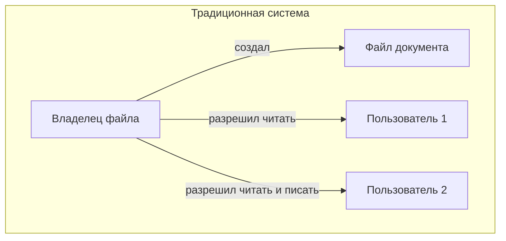
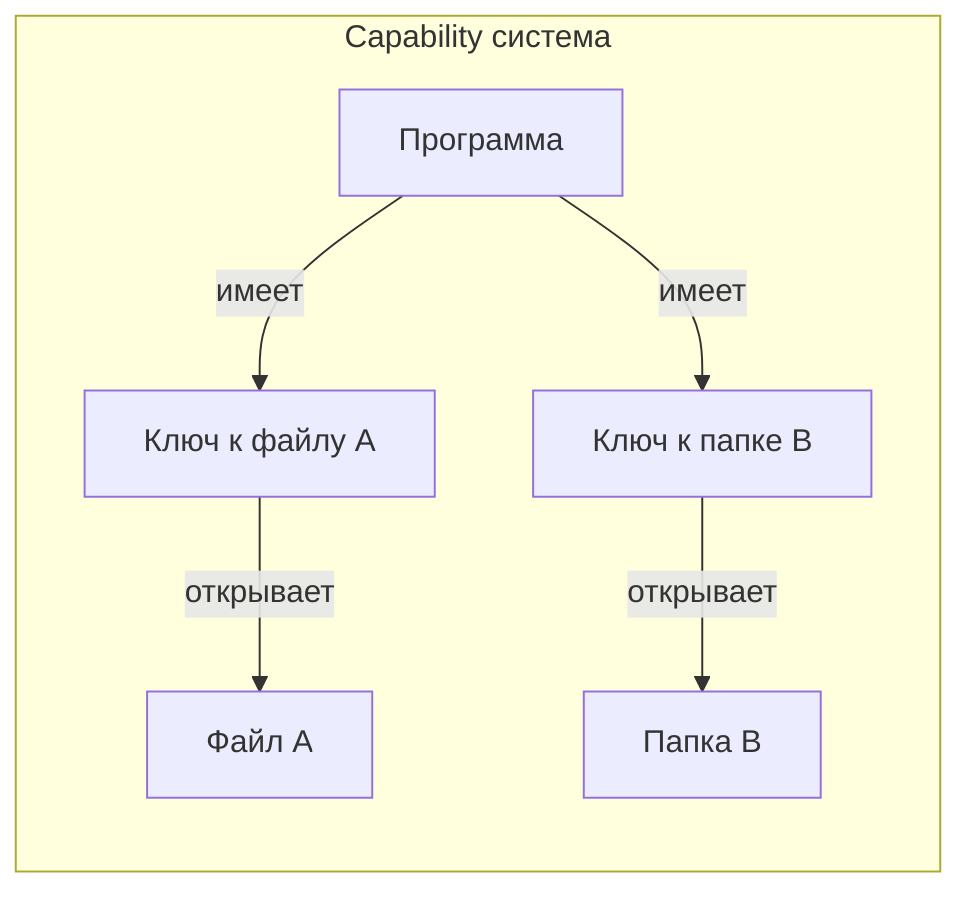

# Контроль доступа в операционной системе

## [Определение](../../../1.2_natural_sciences/physics_in_everyday_life/Q29996.md)

**Контроль доступа** — это [правила](../../../2.1_society/cause_and_effect_relationships/articles/why_rules_work.md) операционной системы, которые определяют, кто и что может делать на компьютере. 

Представьте большую школу с множеством кабинетов. Не всем ученикам можно заходить в любой [кабинет](../../../8.2_future/choosing_a_career_path/articles/office.md). Учитель может войти в учительскую, директор — в свой кабинет, а ученики — только в свои классы. Контроль доступа в компьютере работает похожим образом: он решает, каким [программам](process.md) и пользователям разрешено открывать [файлы](file_system.md), запускать другие программы или изменять настройки системы.

## Подробное описание

### Зачем нужен контроль доступа

Компьютер одновременно работает со многими программами и пользователями. Без правил доступа любая [программа](process.md) могла бы:
- Читать личные файлы других программ
- Изменять важные настройки системы
- Удалять чужие [данные](../../../2.1_society/cause_and_effect_relationships/articles/ai_causality.md)
- Занимать все [ресурсы](../../../2.1_society/cause_and_effect_relationships/articles/ecological_footprint.md) компьютера

Контроль доступа существует для того, чтобы каждая программа работала только со своими данными и имела только те возможности, которые ей действительно нужны.

### Основные понятия

Прежде чем говорить о типах контроля доступа, нужно понять несколько важных терминов:

**Субъект доступа** — это тот, кто хочет что-то сделать. В компьютере это может быть программа или пользователь.

**[Объект](../../../1.2_natural_sciences/physics_in_everyday_life/Q634.md) доступа** — это то, к чему хотят получить доступ. Например: [файл](file_system.md), [папка](file_system.md), принтер, участок [памяти](../../../4.1_rules_of_study/how_to_memorize/articles/pamyat.md).

**[Право](../../information and media literacy/авторское_право_и_честное_использование.md) доступа** — это [разрешение](../../../7.2 Media, leisure and hobbies/Computer games/articles/technologies_inside/screen_magic.md) на определённое [действие](../../../2.1_society/cause_and_effect_relationships/articles/personal_choice.md). Например: читать файл, [записывать](../../../4.1_rules_of_study/how_to_memorize/articles/konspektirovanie.md) в файл, запускать программу.

### Традиционная система контроля доступа

В традиционной системе (её ещё называют дискреционной) у каждого объекта есть владелец. Владелец решает, кто и что может делать с этим объектом.

**Как это работает:**

Когда программа создаёт файл, она становится владельцем этого файла. Владелец может:
- Разрешить другим читать файл
- Разрешить другим изменять файл
- Запретить доступ всем остальным

**Пример из жизни:**

Представьте, что у ребёнка есть дневник. Ребёнок (владелец) может:
- Разрешить маме читать дневник
- Разрешить учителю писать замечания
- Запретить брату трогать дневник

**Полномочия** — это особые права, которые есть только у некоторых программ. Например, только системные программы могут:
- Создавать новых пользователей
- Изменять [время](../../../1.2_natural_sciences/physics_in_everyday_life/Q20702.md) системы
- Устанавливать новые программы

Обычные программы таких прав не имеют.

### Основанная на полномочиях [безопасность](../../../1.2_natural_sciences/neurobiology_for_teens/articles/17_hugs_oxytocin.md) (Capability-Based)

В этой системе подход другой. Вместо того чтобы проверять, кто ты и что тебе разрешено, программа получает специальные ключи — **полномочия** (capabilities).

**Как это работает:**

Когда программа запускается, она получает набор ключей. Каждый [ключ](../../how_internet_works/articles/http_https/tls.md) открывает доступ к определённому объекту. Если у программы нет ключа к объекту, она даже не узнает о существовании этого объекта.

**Пример из жизни:**

Представьте отель с множеством комнат. Гость получает ключ-карту только от своей комнаты и спортзала. Гость не может:
- Войти в другие комнаты (нет ключа)
- Даже не знает, какие ещё комнаты существуют
- Пользуется только тем, к чему есть ключ

### Почему существуют разные подходы

**Традиционная система** похожа на школу с правилами:
- Есть директор (владелец системы)
- Есть учителя (владельцы файлов)
- Каждый учитель решает, кто может войти в его кабинет

**Основанная на полномочиях безопасность** похожа на музей с билетами:
- Каждый посетитель получает билет с перечнем залов
- Можно войти только в те залы, которые указаны в билете
- [Нельзя](../../../3.1_healthy_lifestyle/pervaya_pomoshch/ushibi_porezy_ozhogi/07_ushib_chego_nelzya.md) попасть в зал, даже если очень хочется

### Краткая справка о различиях

Традиционная система проверяет: "Кто ты? Что тебе разрешено с этим объектом?"

Основанная на полномочиях безопасность проверяет: "Есть ли у тебя ключ к этому объекту?"

Первая система смотрит на [личность](../../../1.2_natural_sciences/neurobiology_for_teens/articles/06_phineas_gage.md) и правила. Вторая система смотрит на наличие ключа.

### Таблица сравнения

| Характеристика | Традиционная система | Основанная на полномочиях безопасность |
|----------------|---------------------|-------------------------------|
| **Главный вопрос** | Кто ты? | Что у тебя есть? |
| **Кто решает** | Владелец объекта | Тот, кто выдаёт ключи |
| **[Проверка](../../../1.2_natural_sciences/why_science_help_understand_world/scientific_method.md)** | По списку прав | По наличию ключа |
| **Пример** | Права на файл в папке | Ключ-карта от комнаты |
| **Гибкость** | Владелец меняет права | Нужно выдать новый ключ |
| **Простота** | Легко понять правила | Легко проверить доступ |

### [Резюме](../../../8.2_future/choosing_a_career_path/articles/resume.md) для закрепления

Контроль доступа — это правила, которые определяют, что можно делать программам и пользователям на компьютере.

Существует два основных подхода:

1. **Традиционная система** — владелец объекта решает, кто и что может делать с этим объектом. Похоже на то, как хозяин квартиры решает, кому дать ключи.

2. **Основанная на полномочиях безопасность** — программа получает специальные ключи к объектам. Без ключа доступа нет. Похоже на билет в музей с перечнем доступных залов.

**Полномочия** — это особые права, которые есть только у важных системных программ.

Оба подхода существуют для одной [цели](../../../3.1_healthy_lifestyle/pervaya_pomoshch/ushibi_porezy_ozhogi/02_celi_pervoy_pomoshchi.md): чтобы каждая программа работала только со своими данными и не мешала другим программам.

## См. также

* [Процессы в операционной системе](process.md)
* [Ядро операционной системы](kernel.md)
* [Файловые системы](file_system.md)
* [Операционные системы](operating_system.md)
* [Управление памятью](memory_management.md)

---

**[Автор](../../../4.2_thinking_and_working_information/how_to_search_information/articles/copypaste.md)**: [Воронухин Никита](https://github.com/DeZtrOiD)
**[LLM](../../../7.1_art/modern_technological_art/README.md) - ChatGPT-5.2**
