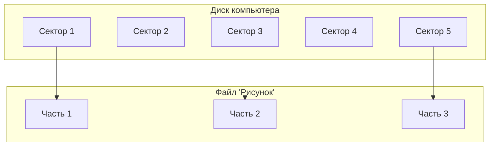
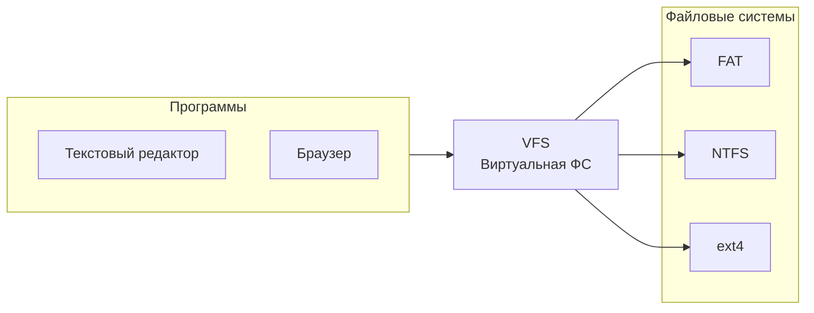
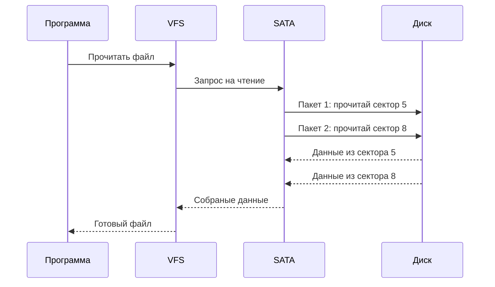

# Файловая система

## [Определение](../../../1.2_natural_sciences/physics_in_everyday_life/Q29996.md)

**Файловая система** — это способ организации и хранения информации на диске компьютера. Если представить диск как большую библиотеку, то файловая система — это [правила](../../../2.1_society/cause_and_effect_relationships/articles/why_rules_work.md), по которым [книги](../../../7.2 Media, leisure and hobbies /useful_and_interesting_leisure/articles/reading_and_self_education.md) (файлы) расставляются на полках, ведутся каталоги и происходит [поиск](../../../3.2 healthy lifestyle/how to act in a dangerous situation/articles/lost-in-city.md) нужной информации. Без файловой системы компьютер не смог бы понять, где начинается один файл и заканчивается другой.

## Подробное описание

### Зачем нужны файловые системы

Компьютер хранит [данные](../../../2.1_society/cause_and_effect_relationships/articles/ai_causality.md) на специальных устройствах — дисках. Диск состоит из множества маленьких ячеек, в каждой из которых можно хранить часть информации. Если [записывать](../../../4.1_rules_of_study/how_to_memorize/articles/konspektirovanie.md) данные просто подряд, без порядка, то потом невозможно будет найти нужный файл или изменить его часть.

Файловая система создаёт [порядок](../../../1.2_natural_sciences/physics_in_everyday_life/Q45003.md):
- Разбивает диск на части
- Ведёт учёт, какие части свободны, а какие заняты
- Запоминает имена файлов и их расположение
- Позволяет группировать файлы в папки

### Основные понятия

**Файл** — это отдельная [информация](../../information and media literacy/как_устроена_современная_информационная_среда.md) с именем. Например, рисунок, [текст](../../../4.1_rules_of_study/how_to_learn_effectively/articles/reading_skills.md) или [музыка](../../../1.2_natural_sciences/neurobiology_for_teens/articles/18_music_chills.md).

**Папка (каталог)** — это [контейнер](../../../5.2_cybersecurity/cpp_fundamentals/15_stl.md) для файлов и других папок. Помогает группировать информацию по темам.

**Диск** — [устройство](../../../1.2_natural_sciences/physics_in_everyday_life/Q178032.md) для долговременного хранения данных.

**Сектор** — самая маленькая часть диска, куда можно записать данные.

### FAT — таблица размещения файлов

**FAT (File Allocation Table)** — это один из способов организации файловой системы. Представьте, что у вас есть тетрадь, где на одной странице записан текст письма, а в начале тетради есть оглавление. В этом оглавлении указано: «Письмо начинается на странице 5, продолжается на странице 12, заканчивается на странице 8».

Так работает FAT:
- В начале диска находится **таблица** — специальный [список](../../../5.2_cybersecurity/cpp_fundamentals/10_arrays.md)
- В таблице записано, какие сектора принадлежат какому файлу
- Если файл большой и записан в разных частях диска, таблица показывает цепочку секторов

**Почему FAT существует:** Этот способ простой и понятный. Компьютеру легко найти файл — достаточно заглянуть в таблицу. Но если таблица повредится, можно потерять все файлы.

### VFS — виртуальная файловая система

**VFS (Virtual File System)** — это специальный слой-посредник между [программами](process.md) и разными типами файловых систем.

Представьте, что в доме есть разные замки: на входной двери один [ключ](../../how_internet_works/articles/http_https/tls.md), на комнате другой, на ящике третий. Чтобы не носить кучу ключей, вы нанимаете дворецкого. Вы говорите дворецкому: «Открой комнату», а он уже сам знает, какой ключ взять.

Так работает VFS:
- Программы обращаются к VFS, а не напрямую к диску
- VFS понимает разные файловые системы (FAT, NTFS, ext и другие)
- VFS переводит общие команды («открой файл») на [язык](../../../5.2_cybersecurity/cpp_fundamentals/1_introduction.md) конкретной файловой системы

**Почему VFS существует:** Без VFS программам пришлось бы уметь работать с каждой файловой системой отдельно. Это сложно и неудобно. VFS упрощает создание программ.

### [Работа](../../../1.2_natural_sciences/physics_in_everyday_life/Q11382.md) с SATA через пакеты

**SATA** — это способ подключения дисков к компьютеру. Когда [программа](process.md) хочет прочитать или записать файл, информация передаётся не целиком, а частями — **пакетами**.

Представьте, что вам нужно перевезти большой шкаф через узкую дверь. Целиком он не пролезет, поэтому вы разбираете его на части, пронумеровываете детали, перевозите по одной, а потом собираете обратно.

Так работают пакеты:
- Большие файлы разбиваются на маленькие части
- Каждая часть упаковывается в [пакет](../../how_internet_works/articles/tcp_udp/tcp_udp.md) с номером и адресом
- Пакеты отправляются по кабелю SATA к диску
- Диск собирает пакеты обратно в файл

**Почему пакеты существуют:** 
- Кабель может передать только ограниченное количество данных за раз
- Если произойдёт [ошибка](../../how_internet_works/articles/http_https/http_https.md), достаточно отправить один пакет заново, а не весь файл
- Можно отправлять пакеты от разных файлов по очереди

### [Сравнение](../../../5.2_cybersecurity/cpp_fundamentals/5_operators.md) файловых систем

| Характеристика | FAT | VFS |
|----------------|-----|-----|
| **Что это** | Конкретный способ хранения файлов | Слой-посредник между программами и ФС |
| **Где находится** | На самом диске | В оперативной [памяти](../../../4.1_rules_of_study/how_to_memorize/articles/pamyat.md) компьютера |
| **Для чего нужна** | Организовать файлы на диске | Позволить программам работать с разными ФС |
| **Можно ли увидеть** | Да, это [структура](../../../4.1_rules_of_study/how_to_learn_effectively/articles/note_taking.md) на диске | Нет, это часть операционной системы |
| **Пример использования** | Флешки, карты памяти | Любая современная [операционная система](kernel.md) |

### Краткое [резюме](../../../8.2_future/choosing_a_career_path/articles/resume.md)

Файловая система — это порядок хранения данных на диске. Она нужна, чтобы компьютер мог находить, изменять и организовывать файлы.

**FAT** — простая система, которая ведёт таблицу расположения всех частей файлов. Она похожа на оглавление в книге.

**VFS** — это переводчик между программами и разными типами файловых систем. Благодаря VFS программы могут работать с любыми дисками, не зная подробностей их [устройства](HAL.md).

**Пакеты SATA** — это способ передачи данных маленькими частями. Как перевозка большого шкафа по частям через узкую дверь.

Все эти механизмы существуют, чтобы сделать [работу](../../../8.2_future/choosing_a_career_path/articles/interview.md) с данными удобной, надёжной и быстрой.

## См. также

* [Операционная система](operating_system.md)
* [Управление памятью](memory_management.md)
* [Слой аппаратных абстракций](HAL.md)

---

**[Автор](../../../4.2_thinking_and_working_information/how_to_search_information/articles/copypaste.md)**: [Воронухин Никита](https://github.com/DeZtrOiD)
**[LLM](../../../7.1_art/modern_technological_art/README.md) - Qwen3.5-Plus**
