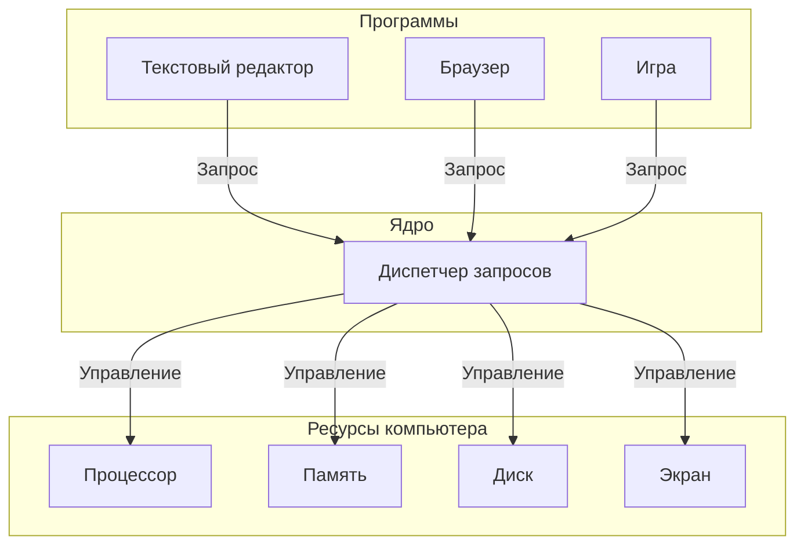

# [Ядро](../../../1.1_structure_of_the_world/matter/articles/03_atom_structure.md) операционной системы

## [Определение](../../../1.2_natural_sciences/physics_in_everyday_life/Q29996.md)

**Ядро** — это главная часть операционной системы. Это специальная [программа](process.md), которая всегда работает в компьютере и управляет всеми его частями. Если представить операционную систему как большую фирму, то ядро — это директор этой фирмы. Все программы обращаются к ядру, когда им нужно что-то сделать с компьютером: сохранить [файл](file_system.md), показать картинку на [экране](window_manager.md) или отправить [данные](../../../2.1_society/cause_and_effect_relationships/articles/ai_causality.md) в [интернет](../../../1.2_natural_sciences/physics_in_everyday_life/Q26540.md).

Ядро существует потому, что программы не могут напрямую работать с частями компьютера. Нужен посредник, который будет раздавать задания и следить, чтобы программы не мешали друг другу. Этим посредником и является ядро.

## Подробное описание

### Зачем нужно ядро

Компьютер состоит из разных частей: [процессор](../../../7.2 Media, leisure and hobbies/Computer games/articles/technologies_inside/smart_processor.md) ([мозг](../../../3.1. healthy lifestyle/Sleep, nutrition, and adolescent energy/articles/breakfast_for_the_brain.md) компьютера), [память](../../../3.1. healthy lifestyle/Sleep, nutrition, and adolescent energy/articles/sleep_and_memory_grades.md) (место для хранения данных), [экран](../../../3.1. healthy lifestyle/Sleep, nutrition, and adolescent energy/articles/gadgets_blue_light_sleep.md), [клавиатура](../../../7.1_art/musical_instruments/articles/piano.md) и другие [устройства](HAL.md). Программы, которыми пользуются люди ([браузер](../../how_internet_works/articles/http_https/http_https.md), текстовый редактор, игры), не умеют напрямую разговаривать с этими частями. 

Представьте, что в школе много учеников (программы) и один учитель (ядро). Ученики не могут сами решать, когда им выходить к доске или брать учебники. Они поднимают руку и ждут, когда учитель разрешит. Так и программы ждут разрешения от ядра.

Ядро нужно по нескольким причинам:

- **Разделение ресурсов** — чтобы две программы не пытались использовать одну и ту же часть [памяти](../../../4.1_rules_of_study/how_to_memorize/articles/pamyat.md) одновременно
- **[Защита](../../how_internet_works/articles/dns/cdn.md)** — чтобы одна [программа](process.md) не могла сломать другую
- **[Удобство](../../../6.1_Independent_living_and_daily_living_skills/reasonable_spending/articles/quality.md)** — программисты пишут программы для ядра, а не для каждой [модели](../../../1.2_natural_sciences/physics_in_everyday_life/Q172280.md) компьютера отдельно

### Как работает ядро

Когда программа хочет что-то сделать (например, сохранить [файл](file_system.md) на [диск](file_system.md)), она отправляет **[запрос](../../how_internet_works/articles/http_https/http_https.md)** ядру. Этот запрос называется **системным вызовом**. Ядро получает запрос, проверяет его и выполняет нужные [действия](../../../3.1_healthy_lifestyle/pervaya_pomoshch/ushibi_porezy_ozhogi/03_obschie_pravila_algorithm.md).

### Типы ядер

Существует три основных типа ядер. Они различаются тем, сколько задач выполняет само ядро, а сколько перекладывает на другие программы.

#### Монолитное ядро

В монолитном ядре почти все [задачи](../../../1.2_natural_sciences/why_science_help_understand_world/research_work.md) выполняет само ядро. Это как большой универсальный магазин, где в одном здании есть всё: [продукты](../../../3.1. healthy lifestyle/Sleep, nutrition, and adolescent energy/articles/healthy_school_snacks.md), [одежда](../../../1.2_natural_sciences/physics_in_everyday_life/Q487005.md), [книги](../../../7.2 Media, leisure and hobbies /useful_and_interesting_leisure/articles/reading_and_self_education.md) и игрушки.

**Преимущества:**
- Работает быстро, потому что все части ядра находятся вместе
- Проще в создании

**Недостатки:**
- Если ломается одна часть, может перестать работать всё ядро
- Трудно добавлять новые функции

#### Микроядро

Микроядро выполняет только самые важные задачи: управление [памятью](../../../4.1_rules_of_study/how_to_memorize/articles/pamyat.md) и передачу сообщений между программами. Все остальные задачи ([работа](../../../1.2_natural_sciences/physics_in_everyday_life/Q11382.md) с файлами, управление экраном) выполняют отдельные программы. Это как небольшой центральный склад, который только распределяет товары, а магазины находятся в разных местах.

**Преимущества:**
- Если ломается одна часть, остальные продолжают работать
- Легко добавлять новые функции

**Недостатки:**
- Работает медленнее, потому что программам нужно чаще общаться друг с другом

#### Гибридное ядро

Гибридное ядро — это [компромисс](../../../2.1_society/how_and_where_find_friends/articles/konflikty_s_druzyami.md) между монолитным и микроядром. Самые важные части работают внутри ядра для скорости, а менее важные — снаружи для надёжности. Это как магазин с основным залом и отдельными секциями.

### [Сравнение](../../../5.2_cybersecurity/cpp_fundamentals/5_operators.md) типов ядер

| Характеристика | Монолитное ядро | Микроядро | Гибридное ядро |
|----------------|-----------------|-----------|----------------|
| **[Скорость работы](../../../1.2_natural_sciences/physics_in_everyday_life/Q25342.md)** | Высокая | Низкая | Средняя |
| **Надёжность** | Низкая | Высокая | Средняя |
| **Сложность создания** | Простое | Сложное | Средней сложности |
| **Примеры систем** | [Linux](operating_system.md), старые версии [Windows](operating_system.md) | Minix, QNX | Windows, [macOS](operating_system.md) |

### Пример [работы](../../../8.2_future/choosing_a_career_path/articles/interview.md) ядра

Представьте, что нужно сохранить [текст](../../../4.1_rules_of_study/how_to_learn_effectively/articles/reading_skills.md) в файл. Вот [что происходит](../../how_internet_works/articles/web_basics/what_happens.md):

1. Программа (текстовый редактор) отправляет ядру запрос: «Сохрани этот текст в файл»
2. Ядро проверяет, есть ли место на диске
3. Ядро проверяет, имеет ли программа [право](../../information and media literacy/авторское_право_и_честное_использование.md) [записывать](../../../4.1_rules_of_study/how_to_memorize/articles/konspektirovanie.md) файлы
4. Ядро отправляет данные на диск
5. Ядро сообщает программе: «Файл сохранён»

Без ядра программе пришлось бы самой знать, как работает диск, сколько на нём места и как записывать данные. Это очень сложно, поэтому и существует ядро.

### Почему ядро всегда работает

Ядро загружается в память сразу после включения компьютера и работает до выключения. Это нужно потому, что программы постоянно обращаются к ядру за помощью. Если ядро перестанет работать, все программы потеряют управление и компьютер перестанет отвечать.

## [Резюме](../../../8.2_future/choosing_a_career_path/articles/resume.md)

Ядро — это главная часть операционной системы, которая управляет всеми ресурсами компьютера. Программы не работают с компьютером напрямую, а отправляют запросы ядру. Существует три типа ядер: монолитное (всё в одном), микроядро (только самое важное) и гибридное (смешанное). Каждый [тип](../../../5.2_cybersecurity/cpp_fundamentals/13_struct.md) имеет свои преимущества и недостатки. Ядро нужно для того, чтобы программы не мешали друг другу и могли удобно работать с компьютером.

## См. также

* [Операционная система](operating_system.md)
* [Процессы в операционной системе](process.md)
* [Управление памятью](memory_management.md)
* [Файловая система](file_system.md)
* [Слой аппаратных абстракций](HAL.md)
* [Планирование задач](scheduling.md)

---

**[Автор](../../../4.2_thinking_and_working_information/how_to_search_information/articles/copypaste.md)**: [Жаворонков Никита](https://github.com/Supertos)
**[LLM](../../../7.1_art/modern_technological_art/README.md) - Qwen3.5-Plus**
