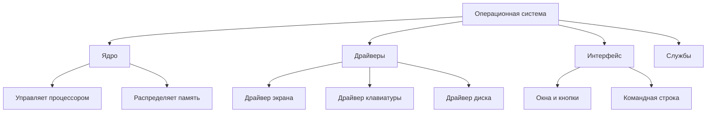
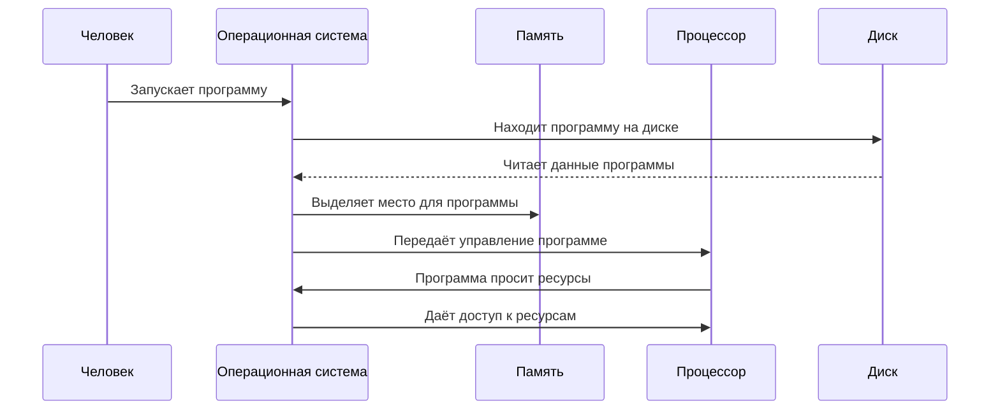
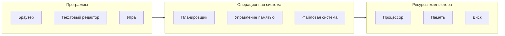

# [Операционная система](kernel.md)

## [Определение](../../../1.2_natural_sciences/physics_in_everyday_life/Q29996.md)

**Операционная система** — это главная [программа](process.md) на компьютере, которая помогает всем остальным программам работать и управляет всеми частями компьютера. Если представить компьютер как большой дом, то операционная система — это хозяин дома, который открывает двери гостям (программам), раздаёт им комнаты ([память](../../../3.1. healthy lifestyle/Sleep, nutrition, and adolescent energy/articles/sleep_and_memory_grades.md), доступ к оборудованию) и следит, чтобы все работали дружно.

Без операционной системы компьютер был бы как машина без водителя — много деталей, но никто не знает, куда ехать и что делать.

## Подробное описание

### Зачем нужна операционная система

Компьютер состоит из множества частей: [процессор](../../../7.2 Media, leisure and hobbies/Computer games/articles/technologies_inside/smart_processor.md) думает, память хранит информацию, [диск](file_system.md) записывает [данные](../../../2.1_society/cause_and_effect_relationships/articles/ai_causality.md), [экран](window_manager.md) показывает картинки. Каждая часть работает по-своему и говорит на своём языке.

Операционная система нужна, чтобы:

- **Переводить** команды программ на [язык](../../../5.2_cybersecurity/cpp_fundamentals/1_introduction.md), понятный частям компьютера
- **Раздавать [ресурсы](../../../2.1_society/cause_and_effect_relationships/articles/ecological_footprint.md)** — чтобы каждая [программа](process.md) получила нужное количество [памяти](../../../4.1_rules_of_study/how_to_memorize/articles/pamyat.md) и времени процессора
- **Защищать** программы друг от друга — чтобы одна программа не сломала другую
- **Упрощать [работу](../../../8.2_future/choosing_a_career_path/articles/interview.md)** — программисты пишут команды для операционной системы, а не для каждой части компьютера отдельно

### Основные части операционной системы

**[Ядро](../../../1.1_structure_of_the_world/matter/articles/03_atom_structure.md)** — это [сердце](../../../3.1. healthy lifestyle/Sleep, nutrition, and adolescent energy/articles/the_energy_trap.md) операционной системы. Оно работает постоянно и управляет самыми важными делами: решает, какой программе дать процессор, сколько выделить памяти, когда записать данные на [диск](file_system.md).

**[Драйверы](HAL.md)** — это переводчики. Каждая часть компьютера ([экран](../../../3.1. healthy lifestyle/Sleep, nutrition, and adolescent energy/articles/gadgets_blue_light_sleep.md), [клавиатура](../../../7.1_art/musical_instruments/articles/piano.md), принтер) понимает только свои команды. Драйвер переводит команды операционной системы на язык конкретного [устройства](HAL.md).

**Интерфейс** — это то, что видит [человек](../../../1.2_natural_sciences/physics_in_everyday_life/Q45003.md). Бывает двух видов:
- Графический интерфейс — [окна](window_manager.md), [кнопки](../../../7.1_art/musical_instruments/articles/accordion.md), значки, которые можно нажимать мышкой
- Командная строка — текстовые команды, которые нужно печатать на клавиатуре

**Службы** — это [помощники](../../../4.1_rules_of_study/how_to_learn_effectively/articles/digital_tools.md), которые работают в фоне: проверяют [время](../../../1.2_natural_sciences/physics_in_everyday_life/Q20702.md), следят за сетью, запускают программы по расписанию.

### Как операционная система работает с программами

Когда человек запускает программу, происходит следующее:

1. Операционная система находит программу на диске
2. Выделяет место в памяти для программы
3. Загружает программу в память
4. Даёт программе время процессора
5. Следит, чтобы программа не мешала другим

Программа не работает напрямую с частями компьютера. Она просит операционную систему: «покажи [текст](../../../4.1_rules_of_study/how_to_learn_effectively/articles/reading_skills.md) на экране» или «сохрани [файл](file_system.md) на диске». Операционная система сама разбирается, как это сделать.

### Как операционная система управляет частями компьютера

Компьютер имеет ограниченные ресурсы:

- **Процессор** может думать только об одном деле в каждый момент времени
- **Память** имеет ограниченный размер
- **Диск** может читать или [записывать](../../../4.1_rules_of_study/how_to_memorize/articles/konspektirovanie.md), но не всё сразу

Операционная система решает, кому что дать:

**[Планировщик](process.md)** решает, какой программе дать процессор и на сколько времени. Он быстро переключается между программами, создавая ощущение, что все работают одновременно.

**Управление [памятью](../../../4.1_rules_of_study/how_to_memorize/articles/pamyat.md)** выделяет каждой программе своё место в памяти и следит, чтобы программы не залезали на чужую территорию.

**[Файловая система](file_system.md)** организует [хранение данных](file_system.md) на диске — создаёт папки, файлы, следит за свободным местом.

### Разные [виды](../../../3.1_healthy_lifestyle/pervaya_pomoshch/ushibi_porezy_ozhogi/08_porezy_sadiny_vidy.md) операционных систем

Операционные системы бывают разные, потому что компьютеры тоже разные:

**Для персональных компьютеров:**
- Windows — самая распространённая, много программ, простой интерфейс
- macOS — работает только на компьютерах Apple, красивый [дизайн](../../../7.2 Media, leisure and hobbies/Computer games/articles/dream_team/artist.md)
- Linux — бесплатная, много разных версий, любят программисты

**Для телефонов и планшетов:**
- Android — работает на большинстве телефонов
- iOS — работает только на iPhone и iPad

**Специальные системы:**
- Для серверов (мощных компьютеров, которые хранят сайты и данные)
- Для встраиваемых систем (в стиральных машинах, автомобилях, часах)

### Почему существуют разные части операционной системы

Разделение на части нужно по нескольким причинам:

**Ядро отдельно**, потому что это самая важная часть. Если ядро сломается, весь компьютер перестанет работать. Поэтому оно защищено от ошибок в программах.

**Драйверы отдельно**, потому что устройств очень много. Можно добавить новый драйвер для нового принтера, не переделывая всю операционную систему.

**Интерфейс отдельно**, потому что люди любят разное. Кому-то нравятся окна и кнопки, кому-то — текстовые команды. Можно поменять интерфейс, не трогая ядро.

## [Сравнение](../../../5.2_cybersecurity/cpp_fundamentals/5_operators.md) операционных систем

| Характеристика | Windows | macOS | Linux | Android |
|----------------|---------|-------|-------|---------|
| **Для каких устройств** | Компьютеры | Компьютеры Apple | Компьютеры, серверы | Телефоны, планшеты |
| **[Стоимость](../../../6.1_Independent_living_and_daily_living_skills/reasonable_spending/articles/price.md)** | Платная | Бесплатно с компьютером | Бесплатная | Бесплатная |
| **Интерфейс** | Окна, меню | Окна, Dock | Разный, чаще окна | Сенсорный экран |
| **Программы** | Очень много | Много | Много, часто бесплатные | [Приложения](../../../4.1_rules_of_study/how_to_learn_effectively/articles/digital_tools.md) из магазина |
| **Кто использует** | Дома, в офисах | Дизайнеры, программисты | Программисты, серверы | Все владельцы телефонов |

## Краткое [резюме](../../../8.2_future/choosing_a_career_path/articles/resume.md)

Операционная система — это главная программа, без которой компьютер не может работать. Она выступает посредником между человеком, программами и частями компьютера.

Основные [задачи](../../../1.2_natural_sciences/why_science_help_understand_world/research_work.md) операционной системы:
- Управлять ресурсами компьютера (процессором, памятью, дисками)
- Запускать программы и давать им необходимые ресурсы
- Предоставлять удобный интерфейс для человека
- Защищать программы друг от друга

Операционная система состоит из ядра (главной части), драйверов (переводчиков для устройств), интерфейса (того, что видит человек) и служб (помощников).

Разные операционные системы созданы для разных устройств и задач, но все они выполняют одну главную функцию — делают компьютер понятным и удобным для человека и программ.

## См. также

* [Процессы, программы в работе](process.md)
* [Управление памятью компьютера](memory_management.md)
* [Файловая система, хранение данных](file_system.md)
* [Ядро операционной системы](kernel.md)
* [Планирование работы программ](scheduling.md)
* [Виртуальная память](virtual_memory.md)
* [Прерывания, сигналы от устройств](interrupt.md)
* [Слой аппаратных абстракций](HAL.md)
* [Общение между программами](IPC.md)
* [Потоки, части программ](thread.md)

---

**[Автор](../../../4.2_thinking_and_working_information/how_to_search_information/articles/copypaste.md)**: [Воронухин Никита](https://github.com/DeZtrOiD)
**[LLM](../../../7.1_art/modern_technological_art/README.md) - Deepseek**
