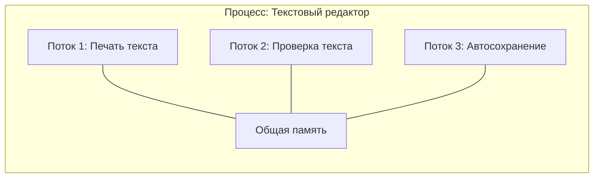
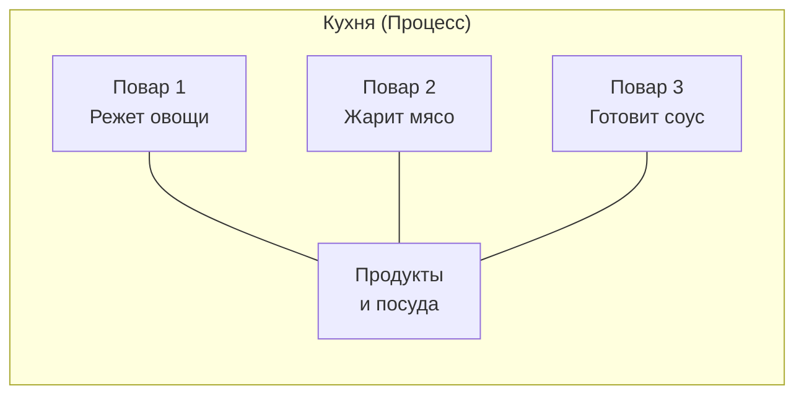
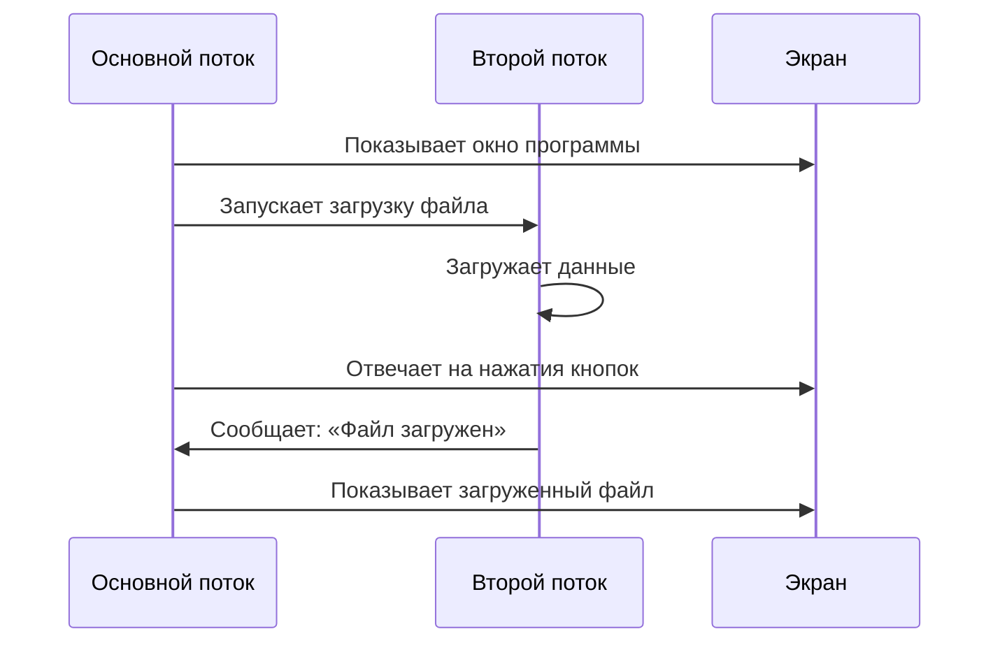

# Потоки выполнения

## [Определение](../../../1.2_natural_sciences/physics_in_everyday_life/Q29996.md)

**Поток выполнения** (или просто **поток**) — это отдельный [путь](../../../1.2_natural_sciences/physics_in_everyday_life/Q11476.md) выполнения задач внутри [программы](process.md). 

Если [программа](process.md) — это книга с инструкциями, то поток — это палец, который указывает на текущую строчку, которую нужно прочитать и выполнить. Одна программа может иметь несколько таких «пальцев», которые читают книгу одновременно.

## Подробное описание

### Зачем нужны потоки

Представьте, что вы смотрите [мультфильм](../../../../8.1_entertainment/articles/animation.md) на компьютере. Одновременно происходит много событий:

- На [экране](window_manager.md) двигаются [персонажи](../../../7.2 Media, leisure and hobbies/Computer games/articles/dream_team/screenwriter.md)
- Играет [музыка](../../../1.2_natural_sciences/neurobiology_for_teens/articles/18_music_chills.md)
- Можно нажать на паузу в любой момент
- Компьютер проверяет, не пришло ли новое письмо

Все эти дела происходят одновременно. Без потоков компьютеру пришлось бы делать их по очереди: сначала показать один [кадр](../../../../8.1_entertainment/articles/director.md) мультфильма, потом проверить почту, потом показать следующий кадр. Мультфильм бы постоянно «замирал».

Потоки позволяют компьютеру заниматься несколькими делами внутри одной программы одновременно.

### [Процесс](process.md) и поток: в чём разница

Важно понять разницу между **процессом** и **потоком**:

**Процесс** — это запущенная программа со всеми своими ресурсами: [памятью](../../../4.1_rules_of_study/how_to_memorize/articles/pamyat.md), [файлами](file_system.md), настройками. Каждый процесс живёт отдельно от других.

**Поток** — это часть процесса. Один процесс может содержать много потоков. Все потоки одного процесса делят между собой [память](../../../3.1. healthy lifestyle/Sleep, nutrition, and adolescent energy/articles/sleep_and_memory_grades.md) и [ресурсы](../../../2.1_society/cause_and_effect_relationships/articles/ecological_footprint.md).

### Пример из жизни

Представьте кухню ресторана:

- **Процесс** — это вся [кухня](../../../6.1_Independent_living_and_daily_living_skills/Simple_and_safe_cooking/articles/organizing_workspace_in_kitchen.md) со всеми поварами, продуктами и посудой
- **Потоки** — это отдельные повара на этой кухне

Все повара (потоки) работают на одной кухне (процессе), используют одни и те же [продукты](../../../3.1. healthy lifestyle/Sleep, nutrition, and adolescent energy/articles/healthy_school_snacks.md) (память), но каждый готовит своё блюдо (выполняет свою задачу).

### Почему потоки существуют

Потоки появились не просто так. Есть важные причины:

1. **[Экономия](../../../6.2_money_and_literacy/how_to_save_for_goal/articles/expenses.md) ресурсов** — создать новый поток легче и быстрее, чем создать целый новый процесс. Потоку не нужно выделять новую память — он использует память процесса.

2. **Быстрый обмен данными** — поскольку все потоки одного процесса используют общую память, они могут легко обмениваться данными. Им не нужно копировать информацию из одного места в другое.

3. **Отзывчивость программ** — когда вы работаете с программой, один поток занимается вашими действиями (нажатия кнопок, ввод текста), а другие фоновые потоки делают свою [работу](../../../8.2_future/choosing_a_career_path/articles/interview.md) (сохранение файлов, [загрузка](../../../7.2 Media, leisure and hobbies/Computer games/articles/how_it_all_started/cartridge_versus_disc.md) данных). Программа не «зависает».

### Как потоки работают вместе

Представьте, что вы читаете книгу и одновременно делаете [заметки](../../../4.1_rules_of_study/how_to_memorize/articles/konspektirovanie.md). Ваши [глаза](../../../7.2 Media, leisure and hobbies/Computer games/articles/useful_tips/eyes_and_back.md) читают [текст](../../../4.1_rules_of_study/how_to_learn_effectively/articles/reading_skills.md), а рука пишет. Это два разных [действия](../../../3.1_healthy_lifestyle/pervaya_pomoshch/ushibi_porezy_ozhogi/03_obschie_pravila_algorithm.md), но они работают вместе для одной [цели](../../../3.1_healthy_lifestyle/pervaya_pomoshch/ushibi_porezy_ozhogi/02_celi_pervoy_pomoshchi.md) — изучения материала.

Так и потоки: каждый делает своё дело, но все работают для одной программы.

### Важная особенность

Все потоки внутри одного процесса делят одну и ту же память. Это значит, что если один поток изменил какие-то [данные](../../../2.1_society/cause_and_effect_relationships/articles/ai_causality.md), другие потоки сразу видят эти изменения.

Это как доска объявлений в школе: если один ученик написал заметку на доске, все остальные ученики сразу могут её прочитать.

## [Сравнение](../../../5.2_cybersecurity/cpp_fundamentals/5_operators.md) процессов и потоков

| Характеристика | Процесс | Поток |
|----------------|---------|-------|
| Что это | Запущенная программа | Часть процесса |
| Память | У каждого процесса своя память | Все потоки делят память процесса |
| Создание | Требует много ресурсов | Создаётся быстро и легко |
| Обмен данными | Сложный, через специальные механизмы | Простой, через общую память |
| [Изоляция](../../../1.2_natural_sciences/physics_in_everyday_life/Q124291.md) | Процессы не мешают друг другу | Потоки могут влиять друг на друга |
| Пример | [Браузер](../../how_internet_works/articles/http_https/http_https.md) — это процесс | Каждая вкладка может быть потоком |

## Краткое [резюме](../../../8.2_future/choosing_a_career_path/articles/resume.md)

- **Поток** — это отдельный путь выполнения задач внутри программы
- Один **процесс** может содержать много **потоков**
- Все потоки одного процесса делят общую память и ресурсы
- Потоки нужны для того, чтобы программы могли делать несколько дел одновременно
- Потоки делают программы более быстрыми и отзывчивыми
- Создать поток легче, чем создать целый процесс
- Основной поток управляет программой, рабочие потоки выполняют дополнительные [задачи](../../../1.2_natural_sciences/why_science_help_understand_world/research_work.md)

Потоки — это как [команда](../../../4.1_rules_of_study/how_to_learn_effectively/articles/peer_learning.md) помощников внутри программы. Каждый помощник занимается своим делом, но все они работают вместе для [достижения](../../../4.1_rules_of_study/how_to_learn_effectively/articles/gamification.md) общей цели.

## См. также

*   [Процессы](process.md) — владельцы потоков
*   [Планирование задач](scheduling.md) — [алгоритмы](../../../4.2_thinking_and_working_information/how_to_search_information/articles/buble_filter.md) выбора следующей задачи для выполнения
*   [Управление памятью](memory_management.md) — способы распределения физической и виртуальной [памяти](../../../4.1_rules_of_study/how_to_memorize/articles/pamyat.md).

---

**[Автор](../../../4.2_thinking_and_working_information/how_to_search_information/articles/copypaste.md)**: [Воронухин Никита](https://github.com/DeZtrOiD)
**[LLM](../../../7.1_art/modern_technological_art/README.md) - Deepseek**
