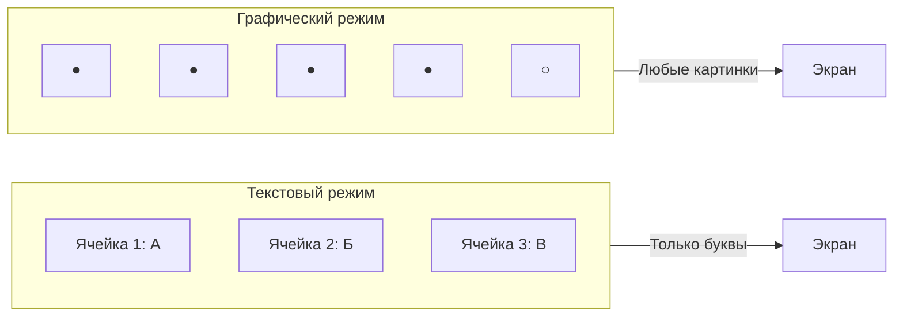
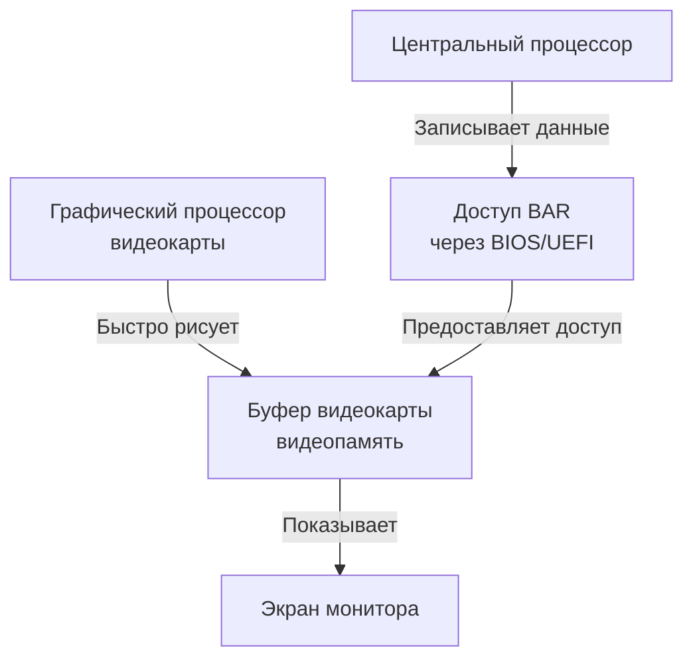
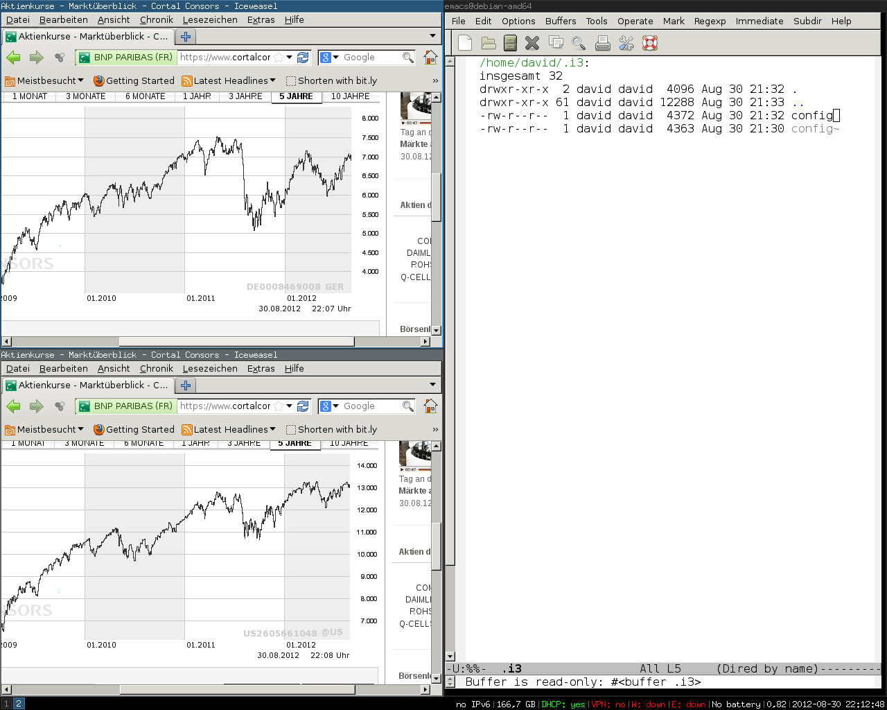
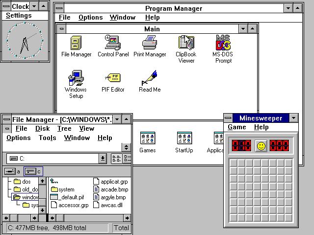

# Менеджер окон (Window Manager)

## [Определение](../../../1.2_natural_sciences/physics_in_everyday_life/Q29996.md)

**Менеджер окон** — это специальная [программа](process.md) в составе операционной системы, которая управляет тем, как программы показывают свои окна на экране. Она решает, где будет расположено каждое окно, какого оно будет размера, какое окно находится сверху, и как окна выглядят.

Представьте, что [экран](../../../3.1. healthy lifestyle/Sleep, nutrition, and adolescent energy/articles/gadgets_blue_light_sleep.md) — это большой стол для рисования. Менеджер окон — это помощник, который раскладывает листы бумаги (окна программ) на этом столе так, чтобы было удобно работать.

## Подробное описание

### [Режимы работы](../../../1.2_natural_sciences/physics_in_everyday_life/Q5339.md) экрана

Экран компьютера может работать в двух основных режимах.

**Текстовый [режим](../../../4.1_rules_of_study/how_to_learn_effectively/articles/breaks_and_rest.md)** — это простой способ показа информации, когда экран разделён на ячейки. В каждой ячейке может быть только одна буква или цифра. В этом режиме [нельзя](../../../3.1_healthy_lifestyle/pervaya_pomoshch/ushibi_porezy_ozhogi/07_ushib_chego_nelzya.md) нарисовать картинку или изменить форму букв. Ранние компьютеры работали только в текстовом режиме.

**Графический режим** — это более сложный способ, когда экран состоит из множества маленьких точек (пикселей). Каждая точка может иметь свой [цвет](../../../1.2_natural_sciences/physics_in_everyday_life/Q1075.md). Из таких точек можно сложить буквы любого shapes, картинки, линии и любые другие изображения. Современные компьютеры работают в графическом режиме.

### Как [изображение](../../information and media literacy/оценка_качества_изображений_и_видео.md) попадает на экран

Чтобы что-то появилось на экране, [информация](../../information and media literacy/как_устроена_современная_информационная_среда.md) должна быть записана в специальную [память](../../../3.1. healthy lifestyle/Sleep, nutrition, and adolescent energy/articles/sleep_and_memory_grades.md) — **видеопамять**. Это хранилище находится внутри видеокарты (специального [устройства](HAL.md) для [работы](../../../8.2_future/choosing_a_career_path/articles/interview.md) с графикой).

**Центральный [процессор](../../../7.2 Media, leisure and hobbies/Computer games/articles/technologies_inside/smart_processor.md)** (главный [мозг](../../../3.1. healthy lifestyle/Sleep, nutrition, and adolescent energy/articles/breakfast_for_the_brain.md) компьютера) может рисовать изображения сам, используя свою силу. Но это медленный способ, потому что центральный процессор занят многими другими задачами.

**Видеокарта** имеет свой собственный **графический процессор** — это специальный мозг для рисования. Он может быстро создавать изображения, не отвлекая главный процессор.

Для [записи](../../../4.1_rules_of_study/how_to_learn_effectively/articles/note_taking.md) данных в видеопамять используется специальное окно доступа, которое называется **[BAR](HAL.md)** (Base Address Register). Это как дверь в комнату с видеопамятью. Компьютер узнаёт [адрес](../../how_internet_works/articles/ip_mac/ip_and_mac.md) этой двери от **BIOS** или **UEFI** — специальных программ, которые запускаются при включении компьютера и подготавливают все устройства к [работе](../../../8.2_future/choosing_a_career_path/articles/interview.md).

**Буфер видеокарты** — это область видеопамяти, где хранится готовое изображение перед тем, как оно появится на экране. Можно представить буфер как холст, на котором [художник](../../../7.2 Media, leisure and hobbies/Computer games/articles/dream_team/artist.md) (видеокарта) рисует картину, а [зритель](../../../7.1_art/modern_technological_art/articles/1.3_participatory_art.md) (монитор) постоянно смотрит на этот холст.

### Что делает менеджер окон

Когда на компьютере запущено несколько программ, каждая хочет показать своё окно. Менеджер окон выполняет следующие [задачи](../../../1.2_natural_sciences/why_science_help_understand_world/research_work.md):

- Создаёт рамки вокруг окон программ
- Решает, какое окно будет видно полностью, а какое частично
- Позволяет перемещать окна по экрану
- Меняет размер окон
- Показывает, какое окно активно (с которым работает пользователь)
- Добавляет [кнопки](../../../7.1_art/musical_instruments/articles/accordion.md) для закрытия и сворачивания окон

### Типы Менеджеров окон

Существует два основных класса менеджеров окон, которые по-разному организуют окна на экране.

**Компоновщик (Stacking Window Manager)** — это самый распространённый [тип](../../../5.2_cybersecurity/cpp_fundamentals/13_struct.md). Окна могут находиться друг на друге, как листы бумаги на столе. Верхнее окно закрывает часть нижних окон. Можно кликнуть на окно, чтобы поднять его наверх. Так работают [Windows](operating_system.md), [macOS](operating_system.md) и большинство графических сред [Linux](operating_system.md).

**Тайловый менеджер (Tiling Window Manager)** — это особый тип, где окна никогда не накладываются друг на друга. Они располагаются рядом, как плитки на полу, заполняя весь экран без пустых мест. Когда открывается новое окно, другие окна автоматически уменьшаются и сдвигаются, чтобы освободить место. Такой подход позволяет эффективно использовать всё [пространство](../../../1.2_natural_sciences/physics_in_everyday_life/Q36253.md) экрана.

| Тайловый | Компоновщик |
|----------|-------------|
|  |  |

### Почему существуют разные подходы

Компоновщик появился первым, потому что он имитирует реальный рабочий стол с бумагами. Это понятно и удобно для большинства людей. Можно быстро переключиться на любое окно, просто кликнув по видимой части.

Тайловый менеджер был создан для тех, кто работает с множеством окон одновременно и хочет видеть содержимое всех окон сразу. Такой подход исключает [необходимость](../../../6.1_Independent_living_and_daily_living_skills/reasonable_spending/articles/need.md) постоянно перемещать и менять размер окон вручную. Это экономит [время](../../../1.2_natural_sciences/physics_in_everyday_life/Q20702.md) и позволяет [сосредоточиться](../../../4.1_rules_of_study/how_to_memorize/articles/koncentraciya.md) на работе.

## [Сравнение](../../../5.2_cybersecurity/cpp_fundamentals/5_operators.md) типов менеджеров окон

| Характеристика | Компоновщик (Stacking) | Тайловый (Tiling) |
|----------------|------------------------|---------------------|
| Расположение окон | Окна могут перекрываться | Окна расположены рядом |
| Использование экрана | Могут быть пустые места | Весь экран заполнен |
| Управление | Мышью (перетаскивание) | Чаще клавиатурой |
| Видимость | Верхнее окно видно полностью | Все окна видны частично |
| Изменение размера | Вручную пользователем | Автоматически системой |
| Подходит для | Обычных пользователей | Опытных пользователей |

## Краткое [резюме](../../../8.2_future/choosing_a_career_path/articles/resume.md)

Менеджер окон — это [программа](process.md), управляющая расположением окон на экране. Для работы с графикой экран должен быть в графическом режиме, где каждая точка может иметь свой цвет. Изображение хранится в видеопамяти видеокарты в специальном буфере. Доступ к видеопамяти осуществляется через BAR, адрес которого предоставляет BIOS или UEFI при запуске компьютера.

[Рисование](../../../7.2 Media, leisure and hobbies /useful_and_interesting_leisure/articles/creativity_and_handicrafts.md) может выполнять центральный процессор (медленнее) или графический процессор видеокарты (быстрее). Менеджер окон создаёт рамки окон, управляет их положением и размером. Компоновщик позволяет окнам перекрываться, как листы бумаги. Тайловый менеджер располагает окна рядом без перекрытий, автоматически подстраивая их размеры. Каждый подход имеет свои преимущества для разных задач.

## См. также

* [Операционная система](operating_system.md)
* [Процессы в операционной системе](process.md)
* [Ядро операционной системы](kernel.md)
* [Виртуальная память](virtual_memory.md)
* [Физическая память](physical_memory.md) 
* [Прерывания](interrupt.md)
* [Слой аппаратных абстракций](HAL.md)
* [Файловая система](file_system.md)

---

**[Автор](../../../4.2_thinking_and_working_information/how_to_search_information/articles/copypaste.md)**: [Жаворонков Никита](https://github.com/Supertos)
**[LLM](../../../7.1_art/modern_technological_art/README.md) - Qwen3.5-Plus**
