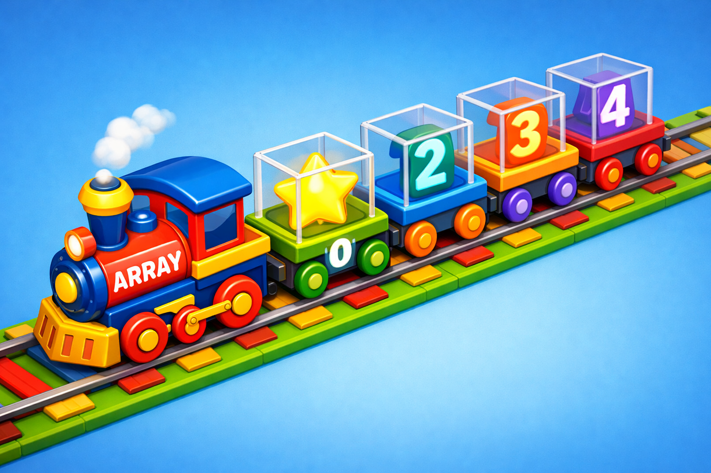

# Массивы: как хранить целую коллекцию данных в одной переменной



Представь, что ты коллекционируешь карточки с покемонами или машинками. Если у тебя всего 3 карточки, ты можешь просто [запомнить](../../4.1_rules_of_study/how_to_memorize/articles/zapominanie.md) их названия. Но что, если их 100? Или 1000? Создавать отдельное имя для каждой карточки в программе (`card1`, `card2`, `card3`...) — это настоящая мука! 😫

Для таких случаев в [C](../../2.1_society/how_and_where_find_friends/articles/sora_drug.md)++ придумали **массивы**. Массив — это как длинный поезд, где в каждом вагоне лежит один предмет, и у каждого вагона есть свой номер.

Давай разберемся, как собрать свой программный поезд!

---

## Что такое массив?

Массив — это [контейнер](15_stl.md), который хранит несколько элементов **одного типа** под одним общим именем. 

Важные [правила](../../2.1_society/cause_and_effect_relationships/articles/why_rules_work.md) «клуба массивов»:
1. **Только один [тип](13_struct.md):** Если массив для целых чисел (`int`), то в нем не может лежать буква или дробное число.
2. **Фиксированный размер:** В обычном массиве нужно сразу сказать компьютеру, сколько в нем будет «вагонов».
3. **[Порядок](../../1.2_natural_sciences/physics_in_everyday_life/Q45003.md):** Все элементы стоят в строгом ряду друг за другом.

---

## Как создать массив?

Чтобы создать массив, нужно указать тип данных, имя и в квадратных скобках `[ ]` написать его размер.

```c++
#include <iostream>

int main() {
    // Создаем массив из 5 целых чисел (наших оценок)
    int grades[5]; 

    // А можно сразу наполнить его значениями:
    int luckyNumbers[3] = {7, 13, 42};

    return 0;
}
```

---

## Самое главное [правило](../../1.2_natural_sciences/why_science_help_understand_world/patterns.md): Отсчет с НУЛЯ! 0️⃣

Это то, на чем спотыкаются даже взрослые программисты. В C++ (и во многих других языках) нумерация в массиве начинается не с единицы, а с **нуля**.

- Первый [элемент](../../1.2_natural_sciences/why_science_help_understand_world/chemistry.md) — это `номер 0`.
- Второй элемент — это `номер 1`.
- Третий элемент — это `номер 2`.

**[Аналогия](../../1.2_natural_sciences/physics_in_everyday_life/Q46344.md):** Представь многоэтажный дом с подземным этажом. Самый нижний (первый) этаж — это этаж №0.

> [!IMPORTANT]
> Если в твоем массиве 10 элементов, то у последнего элемента будет номер **9**, а не 10! 

---

## Работаем с элементами: [Чтение](../../4.1_rules_of_study/how_to_learn_effectively/articles/reading_skills.md) и Запись

Чтобы достать [значение](../../7.2 Media, leisure and hobbies /useful_and_interesting_leisure/articles/leisure_and_why_need.md) из «вагона» или положить туда новое, мы используем имя массива и индекс (номер) в квадратных скобках.

```c++
#include <iostream>

int main() {
    int scores[3] = {10, 20, 30};

    // Читаем значение
    std::cout << "Первый игрок набрал: " << scores[0] << " очков." << std::endl;

    // Меняем значение
    scores[1] = 50; // Теперь у второго игрока 50 очков
    
    std::cout << "Второй игрок теперь имеет: " << scores[1] << std::endl;

    return 0;
}
```

---

## Массивы и [Циклы](../../1.2_natural_sciences/why_science_help_understand_world/patterns.md): Идеальная пара 🤝

Массивы и циклы `for` просто созданы друг для друга. Если тебе нужно вывести все 100 элементов массива, ты не будешь писать `cout` 100 раз. Ты используешь цикл!

```c++
#include <iostream>

int main() {
    int inventory[5] = {1, 10, 5, 0, 2}; // Сколько предметов в сумке

    std::cout << "Твой инвентарь:" << std::endl;

    // Цикл пробегает от 0 до 4 (всего 5 шагов)
    for (int i = 0; i < 5; i++) {
        std::cout << "Слот " << i << ": " << inventory[i] << " шт." << std::endl;
    }

    return 0;
}
```

Здесь [переменная](3_variables.md) цикла `i` сама становится номером вагона. Сначала она 0, потом 1, потом 2... и так до 4!

---

## Опасная [зона](../../5.1_technology_and_digital_literacy/how_internet_works/articles/dns/domains.md): [Выход](../../3.2 healthy lifestyle/how to act in a dangerous situation/articles/building-evacuation.md) за границы! ⚠️

Представь, что у тебя поезд из 5 вагонов, а ты пытаешься зайти в 10-й вагон. Его не существует!

В C++ это называется **Out of Bounds** (Выход за границы). Если ты напишешь `inventory[10]`, когда в массиве всего 5 мест, [программа](../../5.1_technology_and_digital_literacy/operating system/articles/process.md) может:
- Показать странное «мусорное» число.
- Сломаться и закрыться с ошибкой.
- Испортить [данные](../../2.1_society/cause_and_effect_relationships/articles/ai_causality.md) в других частях [памяти](../../4.1_rules_of_study/how_to_memorize/articles/pamyat.md).

> [!CAUTION]
> Всегда проверяй, чтобы индекс (номер элемента) был меньше, чем размер массива!

---

## Таблица: [Сравнение](5_operators.md) обычной переменной и массива

| Характеристика | Обычная переменная | Массив |
| :--- | :---: | :---: |
| Сколько значений хранит | Только одно | Много (сколько укажешь) |
| Как обращаться | По имени | По имени и индексу `[i]` |
| [Удобство](../../6.1_Independent_living_and_daily_living_skills/reasonable_spending/articles/quality.md) для списков | Плохое | Отличное |
| Порядок | Нет | Строгий порядок |

---

## Двумерные массивы: как [игра](../../4.1_rules_of_study/how_to_learn_effectively/articles/gamification.md) «Морской бой»

Иногда одного ряда данных мало. Например, для шахматной доски или карты в [Minecraft](../../5.1_technology_and_digital_literacy/how_internet_works/articles/tcp_udp/online_games.md) нужны ряды и столбцы. Это называется **двумерный массив**.

```c++
// Поле для игры 3 на 3
int map[3][3] = {
    {1, 0, 1},
    {0, 1, 0},
    {1, 1, 1}
};

// Чтобы достать значение, нужно два номера:
std::cout << map[0][2]; // Строка 0, столбец 2
```

---

## Полезные [советы](../../7.2 Media, leisure and hobbies /useful_and_interesting_leisure/articles/mistakes_in_choosing_hobby.md) для начинающих

> [!TIP]
> В современном C++ вместо обычных массивов часто используют **Векторы** (std::[vector](15_stl.md)). Они похожи на «резиновые» массивы, которые могут сами увеличиваться, если тебе не хватило места. Но [основы](../../3.1_healthy_lifestyle/pervaya_pomoshch/ushibi_porezy_ozhogi/01_chto_takoe_pervaya_pomoshch.md) [работы](../../8.2_future/choosing_a_career_path/articles/interview.md) (индексы с 0) у них точно такие же!

1. **Не забывай инициализировать.** Если ты просто создашь `int arr[5];` и не положишь туда числа, там будет «мусор» (случайные цифры, которые остались в памяти компьютера).
2. **Размер — это константа.** В обычном массиве [нельзя](../../3.1_healthy_lifestyle/pervaya_pomoshch/ushibi_porezy_ozhogi/07_ushib_chego_nelzya.md) написать `int n; cin >> n; int arr[n];`. Размер должен быть известен заранее, до того как программа запустится. (Хотя некоторые компиляторы это разрешают, это плохая [привычка](../../7.2 Media, leisure and hobbies /useful_and_interesting_leisure/articles/how_not_to_quit_hobby.md)!).
3. **Массивы символов.** Строки ([текст](../../4.1_rules_of_study/how_to_learn_effectively/articles/reading_skills.md)) — это на самом деле тоже массивы, только из букв (`char`). Но об этом подробнее в теме про строки!

---

## Задание на прокачку 🏆

Попробуй написать программу, которая:
1. Создает массив из 5 целых чисел (твои [карманные деньги](../../6.1_Independent_living_and_daily_living_skills/reasonable_spending/articles/income.md) за неделю).
2. Считает сумму всех чисел в массиве с помощью цикла `for`.
3. Выводит общую сумму на [экран](../../3.1. healthy lifestyle/Sleep, nutrition, and adolescent energy/articles/gadgets_blue_light_sleep.md).

---

## Подведём итоги

Массивы — это фундамент для работы с данными. Теперь ты умеешь строить «поезда» из чисел и управлять ими. Помни про **индекс 0** и не вылетай за границы массива, и тогда твой [код](1_introduction.md) будет работать как [часы](../../1.2_natural_sciences/physics_in_everyday_life/Q20702.md)!

В следующих уроках мы узнаем, как работать с динамической [памятью](../../4.1_rules_of_study/how_to_memorize/articles/pamyat.md) и векторами, которые делают [работу](../../8.2_future/choosing_a_career_path/articles/interview.md) с коллекциями еще проще.

---
[Вернуться к списку статей](./article_index_information_media_literacy.md)

---
[Автор](../../4.2_thinking_and_working_information/how_to_search_information/articles/copypaste.md): Велиев Рауф;  
*[Ресурсы](../../2.1_society/cause_and_effect_relationships/articles/ecological_footprint.md): [LLM](../../7.1_art/modern_technological_art/README.md) - Gemini*