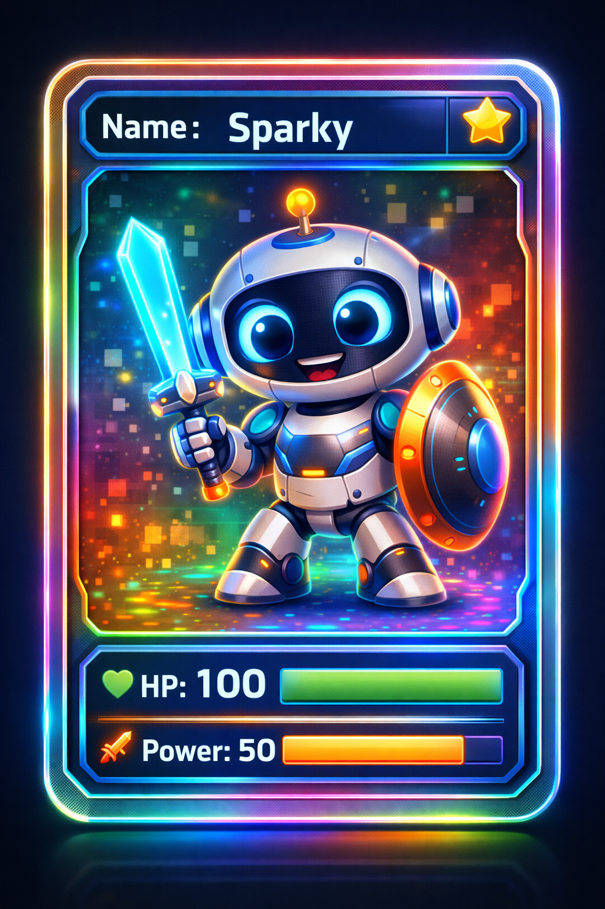

# 13. Структуры (struct): Создаем свои собственные типы данных



Привет, юный изобретатель! Ты уже знаешь, что в [C](../../2.1_society/how_and_where_find_friends/articles/sora_drug.md)++ есть готовые «кирпичики» для данных: `int` для целых чисел, `string` для слов, `bool` для правды и лжи. 

Но что, если ты хочешь создать что-то посложнее? Например, описать в коде **Героя игры**, **Робота** или даже **Кота**? У кота есть имя, [возраст](../../5.1_technology_and_digital_literacy/information and media literacy/карта_компетенций_по_возрастам.md), пушистость и количество жизней. Хранить всё это в разных переменных неудобно — они разлетаются по коду, как детали конструктора.

Для этого в C++ придумали **структуры** (`struct`). Давай научимся собирать свои собственные «папки» для данных!

---

## 1. Что такое [структура](../../4.1_rules_of_study/how_to_learn_effectively/articles/note_taking.md)?

Представь себе **карточку из настольной игры**. На ней написано сразу много всего: имя персонажа, его [сила](../../1.2_natural_sciences/physics_in_everyday_life/Q11023.md), количество здоровья и магия. 

Хотя это разные [данные](../../2.1_society/cause_and_effect_relationships/articles/ai_causality.md) ([текст](../../4.1_rules_of_study/how_to_learn_effectively/articles/reading_skills.md) и числа), все они относятся к **одному** персонажу. 

**Структура** — это способ объединить разные переменные под одним общим именем. Это как сделать свой собственный тип данных, которого раньше не было в языке!

---

## 2. Как построить чертеж (Объявление)

Прежде чем создать [объект](../../1.2_natural_sciences/physics_in_everyday_life/Q634.md) (например, конкретного кота), нам нужно нарисовать его «чертеж». Это делается с помощью ключевого слова `struct`.

Давай опишем нашего робота:

```cpp
struct Robot {
    string name;    // Имя робота
    int model;      // Номер модели
    int battery;    // Заряд батареи (от 0 до 100)
    double height;  // Рост робота
}; // <- ВАЖНО: Не забудь точку с запятой в конце!
```

**Что мы только что сделали?**
Мы сказали компьютеру: «Теперь у нас есть новый тип данных — `Robot`. Каждый раз, когда мы будем создавать Робота, у него внутри всегда будут эти четыре переменные».

---

## 3. Создаем живой объект

Чертеж готов! Теперь давай по нему соберем настоящего робота в функции `main`.

```cpp
int main() {
    // Создаем переменную типа Robot с именем "r2d2"
    Robot r2d2; 
    
    // Но пока наш робот пустой. Давай заполним его данными!
}
```

---

## 4. Точка — наш главный инструмент

Как нам залезть внутрь робота и дать ему имя или изменить [заряд](../../1.2_natural_sciences/physics_in_everyday_life/Q2225.md) батареи? Для этого используется **[оператор](../../3.2 healthy lifestyle/how to act in a dangerous situation/articles/emergency-112.md) точка** `.`. 

Представь, что точка — это кнопка «Открыть папку».

```cpp
r2d2.name = "R2-D2";
r2d2.model = 500;
r2d2.battery = 100;
r2d2.height = 1.09;

cout << "Робот " << r2d2.name << " готов к работе!" << endl;
cout << "Заряд: " << r2d2.battery << "%" << endl;
```

---

## 5. Быстрое заполнение (Инициализация)

Если ты не хочешь заполнять каждую строчку отдельно, можно сделать это быстрее, как при заполнении [анкеты](../../8.2_future/choosing_a_career_path/articles/resume.md):

```cpp
// Порядок должен быть таким же, как в чертеже!
Robot c3po = {"C-3PO", 3, 80, 1.75};

cout << "Второй робот: " << c3po.name;
```

---

## 6. Зачем это нужно? (Главный секрет)

Представь, что тебе нужно передать данные о роботе в функцию, которая его «чинит». 

**Без структуры** тебе пришлось бы передавать кучу переменных:
`void fixRobot(string name, int battery, int model, double height)` — Фух, как много текста!

**Со структурой** всё гораздо проще:
`void fixRobot(Robot target)` — Мы передаем всего одну «папку», в которой уже лежит всё [необходимое](../../6.2_money_and_literacy/how_to_save_for_goal/articles/needs_vs_wants.md).

---

## 7. Структуры внутри структур

Это звучит как фантастика, но одна структура может жить внутри другой! 

Например, у робота может быть **[Координата](../../5.1_technology_and_digital_literacy/information and media literacy/геолокация_и_проверка_контекста.md)** (где он находится на карте):

```cpp
struct Point {
    int x;
    int y;
};

struct Robot {
    string name;
    Point position; // Робот хранит в себе целую структуру Point!
};

// Чтобы узнать координату X, мы нажимаем две "кнопки":
// myRobot.position.x = 10;
```

---

## 8. Массивы структур

А что, если у нас целая армия роботов? Мы можем создать массив из наших структур!

```cpp
Robot army[100]; // Массив из 100 роботов!

army[0].name = "Лидер";
army[1].name = "Помощник";

for (int i = 0; i < 2; i++) {
    cout << "Робот номер " << i << " зовут " << army[i].name << endl;
}
```

---

## 9. Важные [правила](../../2.1_society/cause_and_effect_relationships/articles/why_rules_work.md) для начинающих

1.  **Точка с запятой после `}`.** Это самая частая [ошибка](../../5.1_technology_and_digital_literacy/how_internet_works/articles/http_https/http_https.md)! Компьютер обидится, если ты забудешь `;` после описания структуры.
2.  **Имена с большой буквы.** Обычно названия структур (типов данных) пишут с Большой Буквы (`Robot`), а имена переменных — с маленькой (`r2d2`). Так легче не запутаться.
3.  **[Логика](../../2.1_society/cause_and_effect_relationships/articles/causality_base.md).** Группируй только те данные, которые действительно связаны. Не стоит класть `favoriteFood` (любимая [еда](../../3.1. healthy lifestyle/Sleep, nutrition, and adolescent energy/articles/stress_and_food.md)) в структуру `Car` (Машина).

---

## 10. Задание для супер-программиста

Попробуй создать структуру `Pet` (Питомец). 
Пусть в ней будут:
*   Кличка (`string`)
*   Вид животного (кошка, [собака](../../3.2 healthy lifestyle/how to act in a dangerous situation/articles/dog-bite-first-aid.md) и т.д.)
*   Возраст (`int`)
*   Умеет ли он выполнять команды (`bool`)

Затем создай в программе одного питомца, заполни его данные и выведи их на [экран](../../3.1. healthy lifestyle/Sleep, nutrition, and adolescent energy/articles/gadgets_blue_light_sleep.md) красивым списком.

---

## Итог урока

1.  **Структура** — это твоя собственная «[папка](../../5.1_technology_and_digital_literacy/operating system/articles/file_system.md)» для разных переменных.
2.  **`struct`** создает чертеж, а [переменная](3_variables.md) этого типа — настоящий объект.
3.  **Точка `.`** позволяет заглянуть внутрь объекта и изменить его части.
4.  Структуры делают [код](1_introduction.md) чистым, понятным и очень удобным.

Поздравляю! Теперь ты умеешь создавать в C++ целые миры с персонажами, у которых есть свои свойства и [характеристики](../../6.1_Independent_living_and_daily_living_skills/reasonable_spending/articles/comparison.md). Впереди нас ждет [знакомство](../../2.1_society/how_and_where_find_friends/articles/mozno_li_naiti_druzei_sluchaino.md) с [STL](15_stl.md), где эти знания нам очень пригодятся!

---
[Вернуться к списку статей](./article_index_information_media_literacy.md)

---
**Авторы:** Егор Тарасов 
*[Ресурсы](../../2.1_society/cause_and_effect_relationships/articles/ecological_footprint.md): [LLM](../../7.1_art/modern_technological_art/README.md) - Gemini*