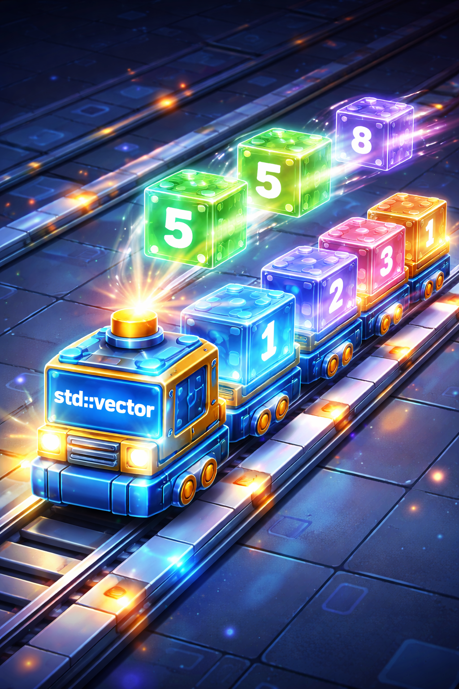

# 15. Введение в STL и векторы: Твой супер-рюкзак будущего



Привет, герой кода! Мы прошли долгий [путь](../../1.2_natural_sciences/physics_in_everyday_life/Q11476.md) от первой программы «Hello World» до сложного управления [памятью](../../4.1_rules_of_study/how_to_memorize/articles/pamyat.md). Сегодня мы познакомимся с тем, что делает [C](../../2.1_society/how_and_where_find_friends/articles/sora_drug.md)++ по-настоящему мощным и современным инструментом.

Добро пожаловать в мир **STL**!

---

## 1. Что такое STL?

Представь, что ты хочешь построить огромный замок из LEGO. 
*   Ты можешь сам выпиливать каждую деталь из пластика, шлифовать её и красить (это то, что мы делали раньше, когда возились с массивами и указателями).
*   А можешь купить готовый огромный набор, где уже есть стены, башни, [окна](../../5.1_technology_and_digital_literacy/operating system/articles/window_manager.md) и даже работающие моторы.

**STL** (Standard Template Library) — это и есть такой «набор LEGO» для программиста. Это библиотека, в которой умные люди уже написали за тебя самые нужные и сложные вещи:
*   Умные списки.
*   [Алгоритмы](../../4.2_thinking_and_working_information/how_to_search_information/articles/buble_filter.md) для быстрой сортировки.
*   [Инструменты](../../1.2_natural_sciences/physics_in_everyday_life/Q36253.md) для поиска.

Сегодня мы изучим самую главную и любимую деталь всех программистов — **[Вектор](../../1.2_natural_sciences/physics_in_everyday_life/Q161635.md)**.

---

## 2. Вектор — это Магический Массив

Помнишь обычные массивы из 10-го урока? Они были полезными, но очень капризными:
1.  Им нужно было сразу сказать точный размер.
2.  Размер [нельзя](../../3.1_healthy_lifestyle/pervaya_pomoshch/ushibi_porezy_ozhogi/07_ushib_chego_nelzya.md) было изменить (если создал массив на 5 элементов, шестой туда уже не влезет).
3.  Нужно было самому следить за тем, чтобы не выйти за границы.

**Вектор (`std::vector`)** — это «прокачанный» массив. 
*   Если в нем закончится место, он **сам** станет больше.
*   Он сам помнит, сколько в нем лежит элементов.
*   Он сам «убирает за собой» (тебе не нужно писать `delete`, как в 14-м уроке).

Это как бездонный мешок или [инвентарь](../../6.1_Independent_living_and_daily_living_skills/Simple_and_safe_cooking/articles/how_to_read_recipe.md) в крутой видеоигре, который расширяется, когда ты подбираешь новый предмет!

---

## 3. Как призвать Вектор?

Чтобы начать пользоваться векторами, нужно подключить специальную «инструкцию» в самом верху кода:

```cpp
#include <iostream>
#include <vector> // Подключаем магию векторов!
#include <string>

using namespace std;
```

Создается вектор необычно. Мы должны в «угловых скобках» `< >` указать, какой [тип](13_struct.md) данных мы будем в нем хранить. Это как наклейка на коробке: «Только для яблок» или «Только для игрушек».

```cpp
vector<int> scores;       // Список для целых чисел (очков)
vector<string> inventory; // Список для названий предметов
vector<double> prices;    // Список для цен
```

---

## 4. Добавляем элементы: [Команда](../../4.1_rules_of_study/how_to_learn_effectively/articles/peer_learning.md) `push_back`

Представь, что вектор — это поезд. В начале в нем нет вагонов. Команда `push_back` (дословно: «толкай в спину») прицепляет новый вагон в самый конец поезда.

```cpp
vector<string> backpack;

backpack.push_back("Меч");     // Теперь в списке: ["Меч"]
backpack.push_back("Щит");     // Теперь в списке: ["Меч", "Щит"]
backpack.push_back("Зелье");   // Теперь в списке: ["Меч", "Щит", "Зелье"]
```

Тебе не нужно заранее знать, сколько вещей найдет твой герой. Просто добавляй их по мере нахождения!

---

## 5. Как узнать размер? [Метод](../../5.1_technology_and_digital_literacy/how_internet_works/articles/http_https/http_https.md) `.size()`

Вектор очень самостоятельный. Тебе больше не нужно заводить отдельную переменную, чтобы [помнить](../../4.1_rules_of_study/how_to_memorize/articles/pamyat.md), сколько элементов ты туда положил. Вектор сам умеет считать:

```cpp
cout << "В твоем рюкзаке сейчас " << backpack.size() << " предмета.";
```

---

## 6. Как достать [данные](../../2.1_society/cause_and_effect_relationships/articles/ai_causality.md) (Индексы)

Тут всё как в обычном массиве. Мы используем квадратные скобки `[ ]` и помним золотое [правило](../../1.2_natural_sciences/why_science_help_understand_world/patterns.md) программиста: **счет начинается с НУЛЯ**.

```cpp
cout << "Первый предмет: " << backpack[0] << endl;
cout << "Второй предмет: " << backpack[1] << endl;
```

**Важное предупреждение:** Если в векторе всего 3 предмета (индексы 0, 1, 2), а ты попросишь `backpack[10]`, [программа](../../5.1_technology_and_digital_literacy/operating system/articles/process.md) расстроится и «вылетит». Всегда спрашивай у вектора его `.size()`, прежде чем лезть далеко!

---

## 7. Удаление элементов: `pop_back` и `clear`

Если последний предмет в списке тебе больше не нужен (например, ты выпил зелье), его можно удалить:

```cpp
backpack.pop_back(); // Удалили самый последний элемент ("Зелье")
```

А если ты хочешь полностью очистить рюкзак и начать всё заново:

```cpp
backpack.clear(); // Вектор снова пуст, как новый
```

---

## 8. Пример: Твой [список](10_arrays.md) дел на день

Давай напишем программу, которая помогает составить [план](../../7.2 Media, leisure and hobbies/Computer games/articles/genres_and_worlds/strategy.md) дел:

```cpp
#include <iostream>
#include <vector>
#include <string>

using namespace std;

int main() {
    vector<string> todoList;
    string task;
    char choice;

    cout << "--- Твой помощник по делам ---" << endl;

    do {
        cout << "Что нужно сделать? ";
        getline(cin, task); // Читаем всё дело целиком
        
        todoList.push_back(task); // Кладем в список

        cout << "Добавить еще одно дело? (y/n): ";
        cin >> choice;
        cin.ignore(); // Очищаем ввод для следующего getline
        
    } while (choice == 'y');

    cout << "\nТвой список на сегодня (всего " << todoList.size() << " дел):" << endl;
    
    // Выводим все дела с помощью цикла
    for (int i = 0; i < todoList.size(); i++) {
        cout << i + 1 << ". " << todoList[i] << endl;
    }

    return 0;
}
```

---

## 9. Секретные фишки Векторов

1.  **[Проверка](../../1.2_natural_sciences/why_science_help_understand_world/scientific_method.md) на пустоту:** Вместо того чтобы писать `if (v.size() == 0)`, можно использовать `if (v.empty())`. Это звучит профессиональнее!
2.  **Доступ с проверкой:** Если ты боишься ошибиться с номером индекса, используй `v.at(i)` вместо `v[i]`. Она работает чуть медленнее, но зато предупредит тебя об ошибке вежливо.
3.  **Первый и последний:** Чтобы быстро узнать первый [элемент](../../1.2_natural_sciences/why_science_help_understand_world/chemistry.md), пиши `v.front()`, а последний — `v.back()`.

---

## 10. Почему Векторы лучше динамических массивов?

Помнишь, как в прошлом уроке мы мучились с `new` и `delete`?
*   Вектор сам выделяет [память](../../3.1. healthy lifestyle/Sleep, nutrition, and adolescent energy/articles/sleep_and_memory_grades.md) в «Куче».
*   Вектор сам расширяет эту память, если место закончилось.
*   Вектор сам удаляет за собой всё, когда программа закрывается.

Это делает твой [код](1_introduction.md) **безопасным**. Меньше ошибок — меньше потраченных нервов!

---

## 11. Что еще есть в STL? (Коротко)

Вектор — это только верхушка айсберга. Когда ты подрастешь как [программист](../../8.2_future/choosing_a_career_path/articles/programmer.md), ты узнаешь про:
*   **`std::sort`** — команда, которая за мгновение расставит миллион чисел по порядку.
*   **`std::map`** — «умный словарь», где можно хранить пары данных (например, имя игрока и его рекорд).
*   **`std::stack`** — стопка блинов, где можно брать только самый верхний.

---

## 12. Твое финальное испытание

Напиши программу «Топ-5 героев»:
1. Создай вектор для хранения имен героев (`string`).
2. Попроси пользователя ввести 5 имен.
3. После ввода каждого имени выводи: «Теперь в команде [столько-то] героев!».
4. В конце выведи весь список задом наперед (начни цикл с `size() - 1`).

---

## Итог всей дорожной карты

Поздравляю, юный мастер! Ты прошел через все 15 этапов нашей базы C++. 
*   Ты узнал, как компьютер хранит числа и буквы.
*   Ты научился управлять логикой с помощью условий и циклов.
*   Ты понял, что такое функции и структуры.
*   И теперь ты умеешь пользоваться мощными инструментами из STL.

Теперь ты готов создавать свои маленькие (а со временем и большие) игры и программы. Путь программиста — это бесконечное [обучение](../../3.1. healthy lifestyle/Sleep, nutrition, and adolescent energy/articles/sleep_and_memory_grades.md), но фундамент у тебя уже есть. 

Вперед, к новым вершинам и чистому коду!

---
[Вернуться к списку статей](./article_index_information_media_literacy.md)

---
**Авторы:** Рауф Велиев  
*[Ресурсы](../../2.1_society/cause_and_effect_relationships/articles/ecological_footprint.md): [LLM](../../7.1_art/modern_technological_art/README.md) - Gemini*