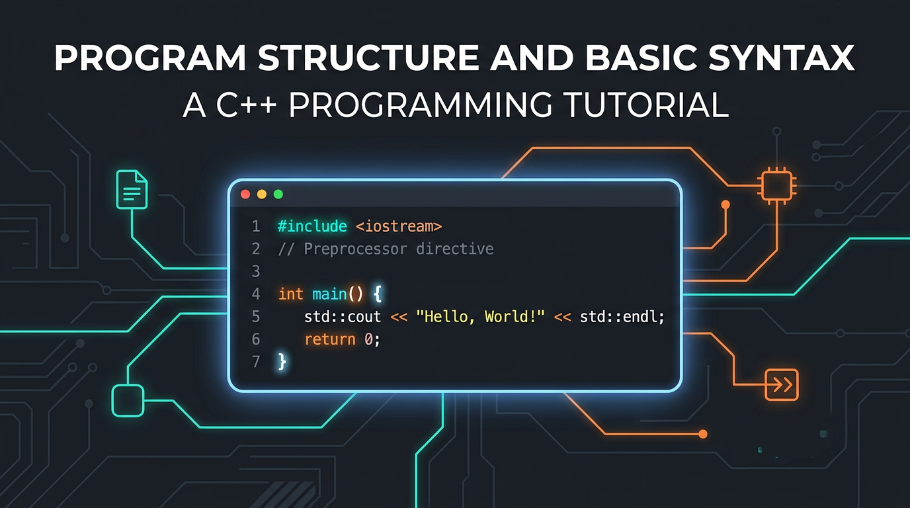

# Структура программы и базовый синтаксис



## Что это и зачем

Когда вы смотрите на программу на C++ в первый раз, она может казаться набором малопонятных символов. Знак `#`, угловые скобки, двойное двоеточие `::`, точки с запятой в конце каждой строки — всё это не случайные украшения, а строгие правила языка. Понимание структуры программы — это фундамент, без которого невозможно двигаться дальше.

Каждая программа на C++, какой бы сложной она ни была, строится из одних и тех же блоков: директив препроцессора, заголовочных файлов, функций и операторов. Даже программа из миллиона строк следует тем же правилам, что и «Hello, World!». Разобравшись со структурой один раз, вы будете читать чужой код и писать свой осознанно, а не методом копирования примеров.

---

## Синтаксис / Как работает

Рассмотрим расширенную программу, которая демонстрирует все ключевые структурные элементы:

```cpp
#include <iostream>
#include <string>

int main() {
    std::string name = "C++";
    int year = 1983;

    std::cout << "Язык " << name << " появился в " << year << " году." << std::endl;

    return 0;
}
```

### Директивы препроцессора (`#include`)

Строки, начинающиеся с символа `#`, обрабатываются **препроцессором** — специальной программой, которая запускается до компилятора. Директива `#include` буквально вставляет содержимое указанного файла в текущий код.

```cpp
#include <iostream>   // заголовочный файл из стандартной библиотеки
#include <string>     // ещё один заголовочный файл
#include "myfile.h"   // заголовочный файл из текущего проекта
```

Разница между угловыми скобками `< >` и кавычками `" "` принципиальная:
- `< >` — компилятор ищет файл в системных директориях стандартной библиотеки.
- `" "` — компилятор сначала ищет файл рядом с текущим исходным файлом, потом в системных директориях.

Директивы препроцессора **не заканчиваются точкой с запятой** — это одно из немногих исключений в синтаксисе C++.

### Функция `main`

Каждая исполняемая программа на C++ обязана содержать функцию `main`. Именно с неё операционная система начинает выполнение программы.

```cpp
int main() {
    // тело функции
    return 0;
}
```

- `int` перед `main` — тип возвращаемого значения. Функция `main` возвращает целое число операционной системе.
- `return 0;` — сигнал ОС о том, что программа завершилась успешно. Любое ненулевое значение означает ошибку.
- Фигурные скобки `{ }` обозначают **блок кода** — начало и конец тела функции.

### Пространство имён `std::`

Стандартная библиотека C++ помещает все свои компоненты в пространство имён `std` (от *standard*). Именно поэтому перед `cout`, `cin`, `string` и другими стандартными объектами стоит `std::`.

Можно сократить запись с помощью директивы `using namespace std;`, тогда `std::` писать не нужно:

```cpp
#include <iostream>
using namespace std;

int main() {
    cout << "Привет!" << endl;
    return 0;
}
```

Однако в больших проектах `using namespace std;` считается плохой практикой — имена из разных библиотек могут совпадать и конфликтовать. Для учебных программ это допустимо, но лучше привыкать к явному `std::`.

### Точки с запятой и фигурные скобки

В C++ **каждый оператор заканчивается точкой с запятой** `;`. Оператор — это одна инструкция: объявление переменной, вызов функции, возврат значения. Компилятор не обращает внимания на переносы строк и отступы — он ориентируется только на `;` как на разделитель.

**Фигурные скобки** `{ }` группируют несколько операторов в один блок. Блоки используются для тела функций, условий, циклов.

---

## Примеры использования

### Программа с несколькими переменными и выводом

```cpp
#include <iostream>
#include <string>

int main() {
    std::string language = "C++";
    int version = 17;
    bool isPopular = true;

    std::cout << "Язык: " << language << std::endl;
    std::cout << "Стандарт: C++" << version << std::endl;
    std::cout << "Популярен: " << isPopular << std::endl;

    return 0;
}
```

Вывод программы:
```
Язык: C++
Стандарт: C++17
Популярен: 1
```

Обратите внимание: `bool` при выводе через `std::cout` отображается как `1` (true) или `0` (false), а не как слова.

### Несколько функций в одном файле

Программа может содержать несколько функций. Функция `main` вызывает другие:

```cpp
#include <iostream>

void greet() {
    std::cout << "Добро пожаловать в C++!" << std::endl;
}

int main() {
    greet();
    return 0;
}
```

- `void` означает, что функция ничего не возвращает.
- Функция `greet` объявлена **до** `main`, поэтому компилятор знает о ней в момент вызова. Если расположить `greet` после `main`, потребуется предварительное объявление (прототип) — подробнее в статье о функциях.

---

## Типичные ошибки

**Точка с запятой после фигурной скобки функции.** Тело функции заканчивается на `}` без `;`. Точка с запятой после закрывающей скобки — признак структуры или класса, но не функции:

```cpp
// Неправильно
int main() {
    return 0;
};   // лишняя точка с запятой — компилятор может принять, но это ошибка стиля

// Правильно
int main() {
    return 0;
}
```

**Пропущен `#include` для используемого типа.** Если вы используете `std::string`, но не подключили `<string>`, компилятор выдаст ошибку:

```cpp
// Неправильно — нет #include <string>
int main() {
    std::string s = "привет";  // ошибка: 'string' is not a member of 'std'
    return 0;
}
```

```cpp
// Правильно
#include <string>

int main() {
    std::string s = "привет";
    return 0;
}
```

**Несбалансированные фигурные скобки.** Каждой открывающей `{` должна соответствовать закрывающая `}`. Пропущенная скобка приводит к каскаду ошибок компиляции, которые на первый взгляд непонятны:

```cpp
// Неправильно — нет закрывающей скобки функции main
int main() {
    std::cout << "Hello" << std::endl;
    return 0;
// компилятор: ошибка в конце файла
```

Хороший редактор (VS Code, CLion) подсвечивает скобки попарно — пользуйтесь этим.

---

## Итог

- Директивы `#include` подключают заголовочные файлы и обрабатываются до компиляции; они не заканчиваются `;`.
- Угловые скобки `< >` используются для системных файлов, кавычки `" "` — для файлов проекта.
- Функция `main` — обязательная точка входа; возвращает `0` при успешном завершении.
- Все стандартные объекты (cout, cin, string) находятся в пространстве имён `std::`.
- Каждый оператор заканчивается `;`, блоки кода обозначаются фигурными скобками `{ }`.

---
[Вернуться к списку статей](./article_index_information_media_literacy.md)

---
Автор: Руслан Юнусов  
*Ресурсы: LLM - Clause Sonnet 4.6*
