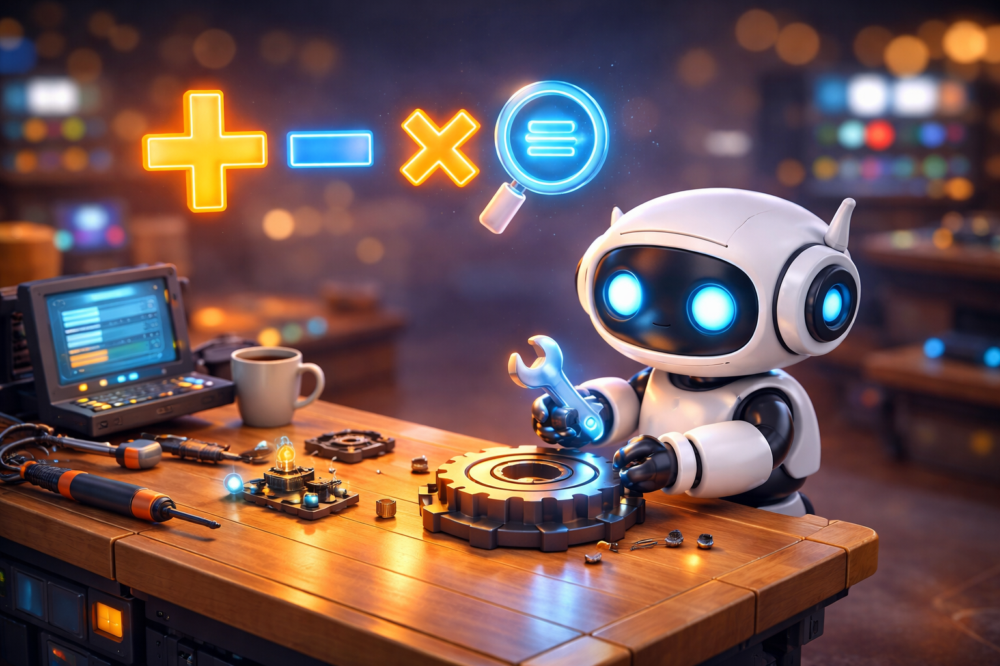

# 5. Операторы в C++: Магические инструменты для управления данными



### 1. Что такое операторы?
<!--- Операторы — это как кнопки на джойстике: нажал — и герой прыгнул, сложил числа или проверил условие! --->
Представь, что ты — великий алхимик или главный инженер в огромной лаборатории. У тебя есть «коробки» с данными (это наши переменные), но сами по себе они просто стоят на полках. Чтобы заставить их двигаться, сталкиваться, меняться или превращаться в нечто новое, тебе нужны специальные инструменты.

В языке C++ эти инструменты называются **Операторами**. Это магические символы (как `+` или `*`), которые говорят компьютеру: «Эй, возьми эти два числа и сделай с ними что-нибудь крутое!». Без операторов программирование было бы скучным списком цифр, а с ними — это настоящий конструктор LEGO!

---

### 2. Арифметические операторы: Математическая лаборатория
Это самые первые инструменты, которые получает любой программист. Они работают точно так же, как в твоей школьной тетрадке по математике, но с парой сюрпризов.

| Символ | Как называется | Что делает (аналогия) | Пример |
|:-------|:---------------|:----------------------|:-------|
| `+`    | Плюс           | Склеивает два числа в одно большое. | `5 + 2 = 7` |
| `-`    | Минус          | Откусывает кусочек от числа. | `10 - 3 = 7` |
| `*`    | Звездочка      | Машина для быстрого клонирования чисел (умножение). | `4 * 2 = 8` |
| `/`    | Слэш           | Разрезает число на равные части (деление). | `10 / 5 = 2` |
| `%`    | Процент        | Оставляет только «хвостик» после деления. | `10 % 3 = 1` |

> [!WARNING]
> **Осторожно, жадный компьютер!**
> В C++ есть странность: если ты делишь целые числа (например, `int`), компьютер превращается в жадину. Он просто выбрасывает всё, что идет после запятой! 
> Например, `7 / 2` в обычном мире — это `3.5`, но для `int` в C++ это будет просто `3`. Куда делась половинка? Компьютер её просто съел!

> [!TIP]
> **Магия процента (`%`):** Представь, что у тебя 11 конфет и ты делишь их поровну на 2 друзей. Каждому достанется по 5, а **одна** останется лишней. Вот этот «остаток» и находит оператор `%`. Это супер-полезно, чтобы узнать, четное число или нет!

---

### 3. Операторы сравнения: Робот-Судья
Эти операторы не меняют числа, они на них просто смотрят и выносят вердикт. У них есть только два ответа: **Правда** (`true`) или **Ложь** (`false`). Это как строгий судья на футболе: было нарушение или нет?

*   **`==` (Двойное равно):** Самый важный символ! Он спрашивает: «Эти двое — близнецы?». 
    *   *Важно:* Одиночное `=` — это когда мы что-то кладем в коробку. Двойное `==` — это когда мы сравниваем. Не перепутай!
*   **`!=` (Восклицательный знак и равно):** Это оператор «Противоположность». Он кричит: «Они ведь разные, да?!». Если числа разные, он скажет «Да, правда!».
*   **`>` и `<`:** Кто из них сильнее и больше?
*   **`>=` и `<=`:** «Ты либо больше меня, либо такой же, как я!».

**Аналогия:** Представь ростомер в парке аттракционов. Если твой `рост >= 140`, робот-судья говорит `true` и тебя пускают на американские горки.

---

### 4. Логические операторы: Детектив и Правила
Иногда жизнь подкидывает сложные задачи. Например: «Я пойду гулять, если **на улице солнце** И **я сделал уроки**». Чтобы соединить два условия в одно, нам нужны логические операторы.

1.  **Логическое И (`&&`):** Это очень строгий учитель. Он поставит «Правду» только если **все** условия выполнены. Если хотя бы одно — ложь, то всё выражение превращается в ложь.
2.  **Логическое ИЛИ (`||`):** Это добрый дедушка. Он скажет «Правда», если **хотя бы одно** условие из списка верное. «Хочешь мороженое или шоколадку?» — «Да!».
3.  **Логическое НЕ (`!`):** Оператор-вреднюка. Он всё переворачивает вверх ногами. Если было `true`, он сделает `false`. 

---

### 5. Инкремент и Декремент: Кнопка «Level Up»
В играх ты часто получаешь +1 к уровню или теряешь -1 жизнь. Программисты делают это так часто, что придумали супер-короткие команды.

*   **`++` (Инкремент):** Это магическая кнопка «Плюс один». Написал `xp++;` — и твой опыт вырос на единичку.
*   **`--` (Декремент):** Кнопка «Минус один». Написал `lives--;` — и одна жизнь исчезла. 

Это гораздо быстрее, чем писать длинное `lives = lives - 1`.

---

### 6. Приоритет операций: Кто первый в очереди?
Представь, что в коде началась вечеринка и все операторы ломанулись к данным. Кто успеет первым?
В C++ есть строгие правила (как в математике):
1.  Сначала всё, что в **скобках `()`**. Скобки — это вип-пропуск!
2.  Потом **умножение, деление и остаток** (`*`, `/`, `%`).
3.  Затем **сложение и вычитание** (`+`, `-`).
4.  И только в самом конце — **сравнение и логика**.

**Пример-ловушка:** `2 + 2 * 2`. 
Если считать просто слева направо, будет 8. Но компьютер знает: умножение важнее! Сначала `2 * 2 = 4`, потом `2 + 4 = 6`. Результат: **6**.

---

### 7. Практический пример: Проверка супергероя
Давай соберем всё, что мы узнали, в одну маленькую программу-тест для входа в Лигу Справедливости:

```cpp
#include <iostream>

int main() {
    int power = 100;      // Мощь героя
    int speed = 50;       // Скорость
    bool hasMask = true;  // Есть ли маска?

    // Герой тренируется и становится сильнее (инкремент)
    power++; // Теперь мощь 101

    // Условие для вступления: 
    // Мощь больше 100 И (Скорость больше 40 ИЛИ есть маска)
    if (power > 100 && (speed > 40 || hasMask == true)) {
        std::cout << "Добро пожаловать в команду, герой!" << std::endl;
    } else {
        std::cout << "Нужно еще потренироваться..." << std::endl;
    }

    return 0;
}
```

---

### Подведем итоги
Операторы — это те самые шестеренки, которые заставляют твою программу работать. С их помощью ты можешь считать очки в игре, проверять пароли и управлять роботами. Главное — помнить про «жадное деление» и не путать `=` с `==`!

---
[Вернуться к списку статей](./article_index_information_media_literacy.md)

---
Авторы: Иван Леу;  
*Ресурсы: LLM - Gemini*