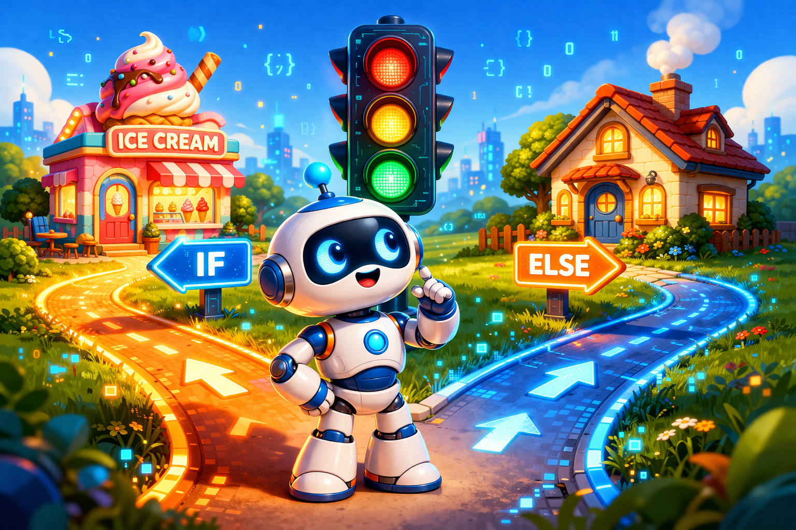

# Условные конструкции: как научить компьютер принимать решения



Представь, что ты стоишь перед перекрестком. Если горит зеленый свет — ты идешь. Если красный — стоишь. А если желтый — готовишься. Ты только что выполнил «алгоритм с условием»! 🚦

Компьютеры на самом деле не очень умные. Они просто очень быстро выполняют команды. Чтобы программа не просто шла по прямой, а умела выбирать путь (например, пускать игрока на уровень или нет), программисты используют **условные конструкции**. 

Давай узнаем, как заставить C++ «думать» и выбирать!

---

## Что такое «Если» в коде?

В языке C++ самая главная команда для принятия решений — это слово `if` (в переводе с английского — «если»). 

Работает это так:
1. Компьютер видит слово `if`.
2. Он проверяет условие в скобках.
3. Если условие — **Правда** (True), он выполняет код.
4. Если условие — **Ложь** (False), он просто перепрыгивает этот кусок кода.

### Пример с мороженым 🍦

```c++
#include <iostream>

int main() {
    int money = 100; // У нас есть 100 рублей
    int ice_cream_price = 80; // Мороженое стоит 80

    if (money >= ice_cream_price) {
        std::cout << "Ура! Покупаем мороженое!" << std::endl;
    }

    return 0;
}
```

> [!NOTE]
> Обрати внимание на фигурные скобки `{ }`. Всё, что находится внутри них, выполнится только тогда, когда условие сработает. Это «домик» для твоего кода.

---

## А что если... (Использование else)

Иногда нам мало просто сказать «если». Нам нужно решение на случай, если условие **не выполнилось**. Для этого есть команда `else` (в переводе — «иначе»).

**Аналогия:** Если на улице дождь — возьми зонт, иначе — надень кепку.

```c++
if (rain == true) {
    std::cout << "Берем зонт!" << std::endl;
} else {
    std::cout << "Надеваем кепку!" << std::endl;
}
```

---

## Много выборов: else if

А что, если вариантов больше двух? Например, в игре у тебя может быть золотая медаль, серебряная или вообще никакой. Тогда на помощь приходит `else if` («а если еще»).

```c++
int place = 2; // Твое место в гонке

if (place == 1) {
    std::cout << "Золотая медаль! 🥇" << std::endl;
} else if (place == 2) {
    std::cout << "Серебряная медаль! 🥈" << std::endl;
} else if (place == 3) {
    std::cout << "Бронзовая медаль! 🥉" << std::endl;
} else {
    std::cout << "Главное — участие! 🏃" << std::endl;
}
```

> [!IMPORTANT]
> Компьютер проверяет условия сверху вниз. Как только он найдет первое верное условие, он выполнит его код и проигнорирует всё остальное, что идет ниже.

---

## Знаки сравнения: как мы проверяем условия?

Чтобы сравнивать числа, нам нужны специальные знаки. В C++ они немного отличаются от тех, что ты учишь в школе:

| Знак | Что означает | Пример |
| :--- | :--- | :--- |
| `==` | Равно (проверка) | `5 == 5` (Правда) |
| `!=` | Не равно | `5 != 3` (Правда) |
| `>` | Больше | `10 > 5` (Правда) |
| `<` | Меньше | `2 < 8` (Правда) |
| `>=` | Больше или равно | `5 >= 5` (Правда) |
| `<=` | Меньше или равно | `4 <= 10` (Правда) |

> [!WARNING]
> Самая частая ошибка новичка — путать `=` и `==`.  
> Один знак `=` — это **присваивание** (мы кладем значение в коробку).  
> Два знака `==` — это **сравнение** (мы спрашиваем: «А они одинаковые?»).

---

## Сложные условия (Логические операторы)

Иногда нужно проверить сразу две вещи. Например: «Если у меня есть билет **И** мне исполнилось 12 лет, то я могу пойти на фильм».

1. **И (`&&`)** — условие верно, только если **оба** пункта правда.
2. **ИЛИ (`||`)** — условие верно, если **хотя бы один** пункт правда.
3. **НЕ (`!`)** — делает всё наоборот (правду превращает в ложь).

**Пример:**
```c++
bool has_ticket = true;
int age = 10;

if (has_ticket && age >= 12) {
    std::cout << "Добро пожаловать в кинозал!" << std::endl;
} else {
    std::cout << "Извини, ты не можешь пройти." << std::endl;
}
```
*В этом примере мы не пройдем, потому что возраст меньше 12, хотя билет есть.*

---

## Оператор Switch: Волшебный переключатель

Если у тебя очень много вариантов (например, выбор дня недели или цвета), писать много `if else` становится скучно. Для этого придумали `switch`. Это как пульт от телевизора: нажал кнопку — включился нужный канал.

```c++
int button = 2;

switch (button) {
    case 1:
        std::cout << "Включаем мультики!" << std::endl;
        break;
    case 2:
        std::cout << "Включаем передачу про животных!" << std::endl;
        break;
    case 3:
        std::cout << "Включаем новости." << std::endl;
        break;
    default:
        std::cout << "Такой кнопки нет!" << std::endl;
}
```

> [!TIP]
> Не забывай ставить `break` после каждого варианта! Если его не будет, компьютер «провалится» дальше и выполнит все команды из следующих кнопок подряд.

---

## Маленький секрет: Тернарный оператор

Если твой выбор совсем крошечный, его можно записать в одну строку. Это выглядит немного странно, но профессионалы это любят.

`условие ? значение_если_да : значение_если_нет;`

**Пример:**
```c++
int score = 50;
std::string result = (score >= 40) ? "Сдал!" : "Не сдал...";
std::cout << result;
```

---

## Типичные ошибки, которых стоит избегать 🚫

1. **Забытые скобки.** Условие всегда должно быть в круглых скобках: `if (x > 0)`.
2. **Лишняя точка с запятой.** Никогда не ставь `;` сразу после `if (...)`. Если ты напишешь `if (x > 0);`, то компьютер подумает, что условие закончилось прямо здесь, и выполнит следующий код в любом случае.
3. **Путаница с `else`.** Помни, что `else` не может существовать сам по себе, без `if` сверху.

---

## Задание для самопроверки 🎮

Попробуй представить код для такой задачи:
Ты создаешь игру-тест. Игрок вводит число от 1 до 10.
- Если число меньше 5 — напиши «Холодно!».
- Если число от 5 до 8 — напиши «Тепло!».
- Если число 9 или 10 — напиши «Горячо!».

Как бы ты это написал, используя `if` и `else if`?

---

## Подведём итоги

Условные конструкции — это «мозг» твоей программы. Без них программы были бы скучными и линейными. Теперь ты умеешь создавать развилки и заставлять код выбирать правильный путь!

На следующем этапе мы узнаем, как зацикливать эти действия, чтобы не повторять код по сто раз.

**Удачи в изучении C++!** 🐾

---
[Вернуться к списку статей](./article_index_information_media_literacy.md)

---
Автор: Кривошапкин Егор;  
*Ресурсы: LLM - Gemini*